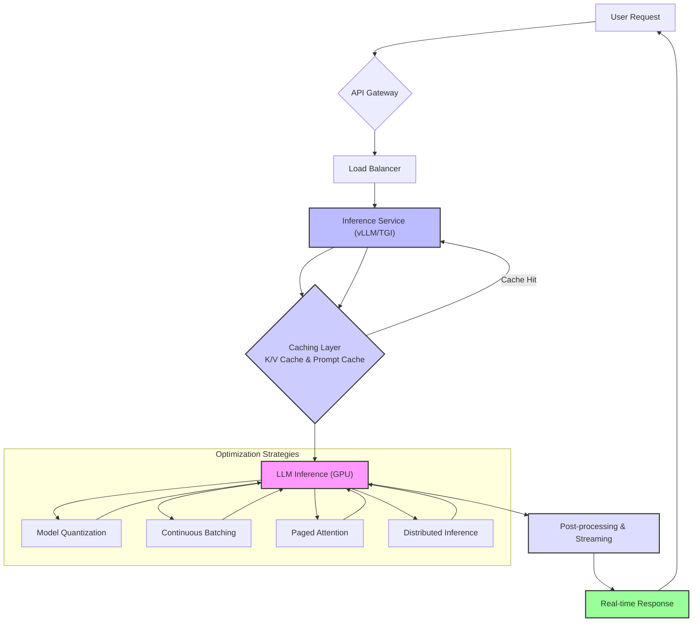

LLM (Large Language Model) 기반 애플리케이션의 성공은 사용자에게 얼마나 빠르게 응답하는가에 크게 좌우됩니다. 대화형 AI, 실시간 콘텐츠 생성 서비스에서 응답 지연 시간 (latency) 은 사용자 경험의 핵심입니다. 높은 지연 시간은 사용자 이탈을 초래하므로, 실시간 응답 지연 시간을 최적화하는 것은 필수적인 엔지니어링 과제입니다. 2026년, LLM 모델 발전과 함께 효율적인 서빙 기술이 등장하고 있으며, 본 엔트리에서는 LLM 애플리케이션의 실시간 응답 지연 시간을 최소화하기 위한 핵심 전략과 기법들을 다룹니다.

## LLM 추론 지연 시간 구성 요소

LLM 추론 과정의 지연 시간은 주로 다음 단계에서 발생합니다:

1.  **입력 처리**: 프롬프트 및 컨텍스트 변환.
2.  **모델 추론**: LLM 자체 토큰 생성. 모델 크기, 복잡성, 토큰 수에 비례.
3.  **출력 처리**: 생성된 토큰 후처리.
4.  **네트워크 지연**: 클라이언트-서버-LLM 간 통신.

## 핵심 최적화 전략

### 모델 경량화 (Model Quantization & Distillation)

모델 크기는 추론 지연 시간과 직결됩니다.

*   **양자화 (Quantization)**: 모델 가중치를 낮은 비트 정밀도 (예: FP32 -> INT8, INT4) 로 변환, 모델 크기 및 연산 속도 개선. 최신 프레임워크는 FP8, INT4 양자화를 지원하여 성능 저하를 최소화하며 지연 시간 개선.
*   **지식 증류 (Knowledge Distillation)**: 대규모 모델의 지식을 작고 빠른 모델로 전이시켜, 자원을 적게 사용하면서 빠르게 응답.

### 효율적인 추론 서빙 프레임워크 (Efficient Inference Serving Frameworks)

LLM 추론 전용 프레임워크는 GPU 활용을 극대화하고 배치 처리 및 캐싱을 최적화합니다.

*   **vLLM, TGI, TensorRT-LLM**: K/V 캐싱, 연속 배치 (Continuous Batching), 페이징 어텐션 (Paged Attention) 등 고급 기법 통합. GPU 활용률 극대화, 지연 시간 감소. 연속 배치는 GPU 유휴 시간을 최소화하여 낮은 지연 시간으로 많은 요청 처리.

다음은 `vLLM`을 사용한 추론 서버의 간단한 예시입니다.

```python
from vllm import LLM, SamplingParams
import uvicorn
from fastapi import FastAPI

app = FastAPI()
llm = LLM(model="meta-llama/Llama-2-7b-chat-hf", 
          quantization="awq", 
          gpu_memory_utilization=0.9)

@app.post("/generate")
async def generate_text(prompt: str, max_new_tokens: int = 512, temperature: float = 0.7):
    sampling_params = SamplingParams(temperature=temperature, max_new_tokens=max_new_tokens)
    outputs = llm.generate([prompt], sampling_params)
    return {"generated_text": outputs[0].outputs[0].text}

if __name__ == "__main__":
    uvicorn.run(app, host="0.0.0.0", port=8000)
```

### 캐싱 메커니즘 활용 (Leveraging Caching Mechanisms)

반복 요청 시 이전 계산 결과를 재사용하여 지연 시간을 줄입니다.

*   **프롬프트 캐싱 (Prompt Caching)**: 동일/유사 프롬프트 반복 시 캐시된 결과 반환. RAG 시스템에서 유용.
*   **K/V 캐싱 (Key-Value Caching)**: Transformer 디코더의 Key, Value 행렬 캐시. 다음 토큰 생성 시 재계산 방지, 긴 시퀀스 생성 지연 시간 감소.

### 프롬프트 엔지니어링 및 RAG 최적화 (Prompt Engineering & RAG Optimization)

프롬프트 효율성도 지연 시간에 영향을 미칩니다.

*   **프롬프트 간결화**: 불필요한 정보 제거로 입력 토큰 수 감소, 처리 시간 단축.
*   **RAG 최적화**: 외부 지식 검색의 추가 지연 최소화. 벡터 DB 성능, 임베딩 모델, 청킹 전략 개선 및 병렬/비동기 RAG 호출 활용.

### 스트리밍 응답 (Streaming Responses)

LLM이 토큰 생성 즉시 사용자에게 스트리밍하면, 첫 토큰 응답 시간 (Time-To-First-Token, TTFT) 단축으로 인지된 지연 시간 (perceived latency) 개선. 대화형 애플리케이션 사용자 경험 향상.

### 하드웨어 가속 및 분산 추론 (Hardware Acceleration & Distributed Inference)

최첨단 하드웨어와 분산 시스템은 대규모 LLM 지연 시간 최적화에 필수적입니다.

*   **최신 GPU 활용**: NVIDIA H100, Blackwell 등 LLM 추론에 최적화된 아키텍처 제공.
*   **커스텀 AI 칩**: Google TPU, AWS Inferentia 같은 전용 AI 가속기는 특정 워크로드에 뛰어난 성능 제공.
*   **분산 추론**: 큰 모델을 여러 GPU나 서버에 분할 배치하는 모델/파이프라인 병렬화 기법 사용. 부하 분산, 처리량 증가, 지연 시간 관리.

아래 Mermaid 다이어그램은 LLM 추론 파이프라인에서 지연 시간을 최적화하는 주요 구성 요소 간의 상호작용을 보여줍니다.



## 트레이드오프

LLM 지연 시간 최적화 시 고려할 트레이드오프는 다음과 같습니다.

*   **모델 경량화 vs. 정확도**: 속도 향상 vs. 품질 저하 가능성. (언제 좋은가: 빠른 응답 필수, 품질 저하 허용. 언제 나쁜가: 높은 정확도 필수.)
*   **배치 처리 vs. 개별 요청 지연 시간**: 처리량 증가 vs. 개별 요청 대기 시간 증가. (언제 좋은가: 처리량 중심 비동기 작업. 언제 나쁜가: 실시간 대화형 애플리케이션.)
*   **캐싱 전략 vs. 메모리/관리 복잡성**: 지연 시간 감소 vs. 메모리 및 로직 복잡성. (언제 좋은가: 반복 프롬프트, 자주 접근 컨텍스트. 언제 나쁜가: 요청 패턴 다양, 낮은 캐시 히트율.)
*   **RAG 복잡성 vs. 응답 시간**: 정보 풍부도 증가 vs. 추가 지연 유발. (언제 좋은가: 정확성 최우선, 지연 허용. 언제 나쁜가: 밀리초 단위 빠른 응답 필수.)
*   **클라우드 GPU vs. 엣지 디바이스**: 강력한 컴퓨팅 (클라우드) vs. 네트워크 지연 해소 (엣지). (언제 좋은가: 클라우드는 대규모 모델/확장성. 엣지는 개인정보 보호/네트워크 불안정 환경.)

## 실전 체크리스트

LLM 지연 시간 최적화 프로젝트 적용 시 다음을 검증하고 계획합니다.

- [ ] **모델 선택 및 양자화**: LLM 모델이 지연 시간 목표 충족하는지 벤치마킹, INT8/INT4 양자화 적용 시 성능 저하 허용 여부 확인.
- [ ] **추론 서빙 프레임워크**: vLLM, TGI, TensorRT-LLM 등 고성능 프레임워크 도입 및 연속 배치/K/V 캐싱 활용 여부 확인.
- [ ] **캐싱 전략 구현**: 프롬프트 캐싱 및 K/V 캐싱을 LLM 게이트웨이 또는 서비스 계층에 구현, 반복 요청 응답 시간 최소화. 캐시 히트율 주기적 모니터링 여부 확인.
- [ ] **RAG 파이프라인 최적화**: RAG 시스템 사용 시, 벡터 DB 검색 속도, 임베딩 모델 추론 지연 시간, 청킹 전략이 전체 지연 시간에 미치는 영향 분석 및 개선 여부 확인.
- [ ] **스트리밍 응답 적용**: 사용자 인터랙션 중요 영역 (챗봇) 에 Time-To-First-Token (TTFT) 개선을 위한 스트리밍 응답 구현 및 테스트 여부 확인.
- [ ] **GPU 활용률 모니터링**: GPU 활용률이 낮아 (< 70%) 대기 시간 지연 발생 여부 모니터링, 동적 배치나 작은 GPU 인스턴스로의 전환 고려 여부 확인.
- [ ] **종단 간 (End-to-End) 지연 시간 측정**: 클라이언트에서 LLM 응답까지 전체 경로 지연 시간 정기 측정, 주요 병목 구간 식별을 위한 상세 로깅 및 트레이싱 시스템 구축 여부 확인.
