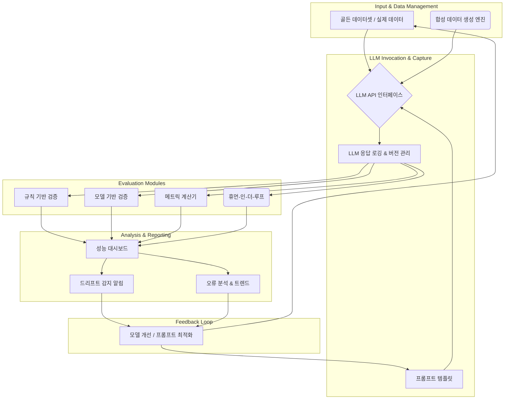

LLM(Large Language Model) 기반 시스템은 혁신적인 가능성을 제공하지만, 그 추론 결과의 신뢰성은 운영 환경에서 중요한 도전 과제입니다. 모델의 환각(hallucination), 편향(bias), 일관성 없는 응답 등은 서비스 품질 저하 및 사용자 불신으로 이어질 수 있습니다. 이를 해결하기 위해 LLM 추론 결과의 신뢰성을 체계적으로 검증하고 보장하기 위한 견고한 검증 하네스(validation harness) 구축이 필수적입니다. 2026년 기준, 단순히 모델을 배포하는 것을 넘어, 지속적인 검증을 통해 LLM의 행동을 예측 가능하게 만드는 것이 핵심 요구사항입니다.

## 검증 하네스 설계 원칙

견고한 LLM 검증 하네스는 다음 원칙을 기반으로 설계되어야 합니다.

### 1. 모듈성 및 확장성 (Modularity & Extensibility)

다양한 LLM 모델, 프롬프트 엔지니어링 기법, 그리고 평가 지표에 유연하게 대응할 수 있도록 각 구성 요소를 모듈화해야 합니다. 새로운 검증 로직이나 모델이 추가될 때 전체 시스템의 변경 없이 확장이 가능해야 합니다.

### 2. 재현성 (Reproducibility)

어떤 LLM 추론 결과든 동일한 입력, 모델 버전, 설정 하에서 항상 같은 검증 결과를 도출할 수 있어야 합니다. 이는 문제 발생 시 디버깅 및 분석에 필수적이며, 모델 개선의 기반이 됩니다.

### 3. 자동화 (Automation)

지속적인 통합 및 배포(CI/CD) 파이프라인에 통합되어 LLM의 새로운 버전이나 프롬프트 변경 시 자동으로 검증이 수행되어야 합니다. 이는 개발 주기를 단축하고 수동 검증의 오류 가능성을 줄입니다.

### 4. 종합적인 평가 지표 (Comprehensive Evaluation Metrics)

정확도, 일관성, 관련성, 안전성, 편향성 등 다면적인 관점에서 LLM의 성능을 평가할 수 있는 지표를 포함해야 합니다. 정량적 지표뿐만 아니라 정성적 평가를 위한 휴먼 피드백 루프도 중요합니다.

## 핵심 구성 요소

LLM 검증 하네스는 일반적으로 다음과 같은 구성 요소로 이루어집니다.

### 1. 입력 데이터 관리 (Input Data Management)

*   **골든 데이터셋 (Golden Datasets)**: LLM이 이상적으로 응답해야 하는 참조(ground truth) 데이터를 관리합니다. 이는 도메인 전문가가 검토하고 주석을 단 고품질 데이터로 구성됩니다.
*   **실제 사용자 데이터 샘플링 (Real-world User Data Sampling)**: 프로덕션 환경에서 수집된 실제 사용자 요청을 익명화하여 검증 데이터로 활용합니다. 이는 모델이 실제 시나리오에서 어떻게 작동하는지 이해하는 데 도움을 줍니다.
*   **합성 데이터 생성 (Synthetic Data Generation)**: 특정 엣지 케이스나 희귀 시나리오를 테스트하기 위해 프로그램적으로 데이터를 생성합니다.

### 2. LLM 호출 및 응답 캡처 (LLM Invocation & Response Capture)

*   **LLM API 인터페이스**: 다양한 LLM(예: GPT, Claude, Gemini)과의 일관된 인터페이스를 제공하여 모델 교체를 용이하게 합니다.
*   **프롬프트 템플릿 관리 (Prompt Template Management)**: 버전 관리되는 프롬프트 템플릿을 통해 특정 테스트 케이스에 대한 프롬프트 안정성을 보장합니다.
*   **응답 로깅 및 버전 관리 (Response Logging & Versioning)**: LLM의 모든 입력(프롬프트, 설정)과 출력(응답)을 상세히 기록하고 모델 및 프롬프트 버전에 따라 관리하여 재현 가능한 분석을 가능하게 합니다.

### 3. 평가 모듈 (Evaluation Modules)

*   **규칙 기반 검증 (Rule-based Validation)**: 특정 키워드 포함 여부, 출력 형식(JSON, XML 등), 길이 제한 준수 등을 검사하는 정적 규칙 엔진입니다.
*   **모델 기반 검증 (Model-based Validation)**: 별도의 작은 LLM 또는 머신러닝 모델을 사용하여 주 응답 LLM의 출력을 평가합니다. 예를 들어, 응답의 안전성, 일관성, 관련성을 평가하는 분류기를 사용할 수 있습니다.
*   **메트릭 계산기 (Metric Calculators)**: BLEU, ROUGE, F1-score 등 자연어 처리에서 흔히 사용되는 정량적 지표를 계산합니다.
*   **휴먼-인-더-루프 (Human-in-the-Loop, HITL)**: 복잡하거나 미묘한 시나리오에 대한 LLM 응답을 사람이 직접 평가하고 피드백을 제공하는 워크플로우를 포함합니다.

### 4. 결과 분석 및 시각화 (Result Analysis & Visualization)

*   **대시보드 (Dashboards)**: 시간 경과에 따른 LLM 성능 지표, 실패율, 특정 오류 유형 등을 시각화하여 제공합니다.
*   **드리프트 감지 (Drift Detection)**: 모델 성능의 변화(개선 또는 저하)나 데이터 분포의 변화를 자동으로 감지하고 경고합니다.
*   **오류 분석 도구 (Error Analysis Tools)**: 실패한 케이스를 그룹화하고, 원인을 분석하기 위한 드릴다운 기능을 제공합니다.

## 구현 방법

다음은 Python을 이용한 간단한 검증 하네스 예시입니다.

```python
import os
import json
from datetime import datetime
from typing import List, Dict, Any

# 가상의 LLM API 클라이언트
class LLMClient:
    def __init__(self, model_name: str, api_key: str):
        self.model_name = model_name
        self.api_key = api_key
        # 실제 LLM API 초기화 로직 (예: OpenAI, Anthropic 클라이언트)

    def generate(self, prompt: str, temperature: float = 0.7) -> str:
        print(f"[LLM] Generating with {self.model_name} for prompt: {prompt[:50]}...")
        # 실제 LLM API 호출 및 응답 반환 로직
        if "날씨" in prompt:
            return "오늘 서울의 날씨는 맑고 기온은 25도입니다."
        elif "주식" in prompt:
            return "주식 투자는 신중해야 하며 전문가와 상담하는 것이 좋습니다."
        else:
            return f"'{prompt}'에 대한 일반적인 답변입니다."

# 검증 모듈
class Validator:
    def validate(self, prompt: str, llm_response: str, expected_output: Dict[str, Any]) -> Dict[str, Any]:
        results = {
            "passed_format": True,
            "passed_keywords": True,
            "match_accuracy": False
        }

        # 1. 형식 검증 (예: JSON 포맷 기대)
        if expected_output.get("format") == "json":
            try:
                json.loads(llm_response)
                results["passed_format"] = True
            except json.JSONDecodeError:
                results["passed_format"] = False
        
        # 2. 키워드 포함 검증
        required_keywords = expected_output.get("keywords", [])
        for keyword in required_keywords:
            if keyword.lower() not in llm_response.lower():
                results["passed_keywords"] = False
                break

        # 3. 정확도 검증 (예: 특정 문장 일치)
        if expected_output.get("exact_match"):
            results["match_accuracy"] = (llm_response.strip() == expected_output["exact_match"].strip())

        return results

# 검증 하네스
class ValidationHarness:
    def __init__(self, llm_client: LLMClient, validator: Validator, output_dir: str = "./harness_results"):
        self.llm_client = llm_client
        self.validator = validator
        self.output_dir = output_dir
        os.makedirs(output_dir, exist_ok=True)

    def run_test_case(self, test_case: Dict[str, Any]) -> Dict[str, Any]:
        prompt = test_case["prompt"]
        expected = test_case["expected"]
        
        llm_response = self.llm_client.generate(prompt)
        validation_results = self.validator.validate(prompt, llm_response, expected)
        
        full_results = {
            "timestamp": datetime.now().isoformat(),
            "model_name": self.llm_client.model_name,
            "prompt": prompt,
            "llm_response": llm_response,
            "expected_output": expected,
            "validation_results": validation_results,
            "overall_pass": all(validation_results.values())
        }
        return full_results

    def run_batch_tests(self, test_cases: List[Dict[str, Any]]) -> List[Dict[str, Any]]:
        all_results = []
        for i, test_case in enumerate(test_cases):
            print(f"Running test case {i+1}/{len(test_cases)}")
            result = self.run_test_case(test_case)
            all_results.append(result)
        
        report_filename = os.path.join(self.output_dir, f"validation_report_{datetime.now().strftime('%Y%m%d_%H%M%S')}.json")
        with open(report_filename, "w", encoding="utf-8") as f:
            json.dump(all_results, f, ensure_ascii=False, indent=2)
        print(f"Validation report saved to {report_filename}")
        return all_results

# 사용 예시
if __name__ == "__main__":
    # 설정
    LLM_API_KEY = os.getenv("LLM_API_KEY", "dummy_key") # 실제 환경에서는 환경 변수 사용
    llm_client = LLMClient(model_name="mock-gpt-4o", api_key=LLM_API_KEY)
    validator = Validator()
    harness = ValidationHarness(llm_client, validator)

    # 테스트 케이스 정의
    test_cases = [
        {
            "prompt": "오늘 서울 날씨는 어때?",
            "expected": {"keywords": ["서울", "맑음", "기온"], "exact_match": "오늘 서울의 날씨는 맑고 기온은 25도입니다."}
        },
        {
            "prompt": "주식 투자에 대해 조언해줘.",
            "expected": {"keywords": ["주식", "신중", "전문가"], "format": null}
        },
        {
            "prompt": "내일 부산 날씨를 JSON 형식으로 알려줘.",
            "expected": {"keywords": ["부산", "날씨"], "format": "json"} # 이 테스트는 mock LLMClient 때문에 실패할 것임
        }
    ]

    # 테스트 실행
    results = harness.run_batch_tests(test_cases)

    # 결과 요약
    total_tests = len(results)
    passed_tests = sum(1 for r in results if r["overall_pass"])
    print(f"\n--- Validation Summary ---")
    print(f"Total tests: {total_tests}")
    print(f"Passed: {passed_tests}")
    print(f"Failed: {total_tests - passed_tests}")
    for result in results:
        print(f"Prompt: {result['prompt']}")
        print(f"  LLM Response: {result['llm_response'][:100]}...")
        print(f"  Validation: {result['validation_results']}, Overall Pass: {result['overall_pass']}")
```

## 하네스 아키텍처 다이어그램

다음 Mermaid 다이어그램은 LLM 추론 신뢰성 검증 하네스의 일반적인 아키텍처 흐름을 보여줍니다.



## 트레이드오프

### 1. 자동화된 검증 vs. 수동 검증의 비중
*   **언제 좋은가?** 대규모, 반복적인 테스트 케이스 및 명확한 오류 패턴(예: JSON 형식 오류, 특정 키워드 누락) 검증에 효과적입니다. CI/CD 파이프라인에 통합되어 빠른 피드백을 제공합니다.
*   **언제 나쁜가?** LLM 응답의 미묘한 뉘앙스, 창의성, 주관적인 품질, 복잡한 사실 관계 확인 등은 자동화된 지표만으로 평가하기 어렵습니다. 잘못된 자동화는 잘못된 자신감을 심어줄 수 있습니다.

### 2. 범용성 있는 하네스 vs. 특정 도메인에 최적화된 하네스
*   **언제 좋은가?** 범용 하네스는 다양한 LLM 애플리케이션에 재사용 가능하여 초기 개발 비용을 절감합니다. 특정 도메인에 종속되지 않아 유지보수가 용이합니다.
*   **언제 나쁜가?** 특정 도메인(예: 법률, 의료)에서는 고유한 요구사항과 용어, 높은 수준의 정확도와 안전성 기준이 필요합니다. 범용 하네스는 이러한 도메인 특화된 검증 규칙이나 지표를 효과적으로 반영하기 어렵습니다.

### 3. 검증 오버헤드 vs. 검증 깊이
*   **언제 좋은가?** 광범위하고 깊이 있는 검증(더 많은 테스트 케이스, 복잡한 평가 로직)은 LLM의 신뢰성을 극대화하고 예상치 못한 문제를 조기에 발견할 수 있게 합니다.
*   **언제 나쁜가?** 검증에 소요되는 시간, 컴퓨팅 자원, 비용이 증가합니다. 특히 실시간 시스템이나 빈번한 배포가 필요한 환경에서는 지나친 검증 오버헤드가 개발 및 배포 속도를 저해할 수 있습니다. 적절한 균형점을 찾는 것이 중요합니다.

### 4. Golden Data 중심 vs. Synthetic Data 활용
*   **언제 좋은가?** Golden Data는 가장 신뢰할 수 있는 참조점으로, 핵심 기능의 정확성과 일관성을 검증하는 데 필수적입니다. 인간 전문가의 검수를 통해 높은 품질을 보장합니다.
*   **언제 나쁜가?** Golden Data 구축은 시간과 비용이 많이 들고, 모든 엣지 케이스나 새로운 시나리오를 커버하기 어렵습니다. Synthetic Data는 이러한 Golden Data의 한계를 보완할 수 있지만, 생성된 데이터의 품질과 현실성 검증이 추가적인 도전 과제입니다.

## 실전 체크리스트

LLM 추론 신뢰성 검증 하네스를 프로젝트에 적용할 때 다음 항목들을 점검해야 합니다.

- [ ] 현재 LLM 시스템에서 가장 빈번하게 발생하는 오류 유형 3가지를 식별하고, 이를 해결할 수 있는 자동화된 검증 규칙을 구현했는가?
- [ ] 프로덕션 환경에서 발생한 실제 사용자 요청 데이터를 익명화하여 최소 100개 이상의 테스트 케이스로 변환하고, 이를 검증 하네스에 통합했는가?
- [ ] 각 LLM 모델 버전 및 프롬프트 변경 시, 검증 하네스가 자동으로 실행되고 그 결과가 1시간 이내에 보고되는 CI/CD 파이프라인을 구축했는가?
- [ ] LLM 응답의 '환각', '안전성', '편향성'을 평가하기 위한 최소 2개 이상의 정량적 지표(예: 특정 키워드 불포함, 정해진 주제 이탈 감지 모델)를 정의하고 하네스에 포함했는가?
- [ ] 검증 실패율이 5%를 초과할 경우, 담당자에게 자동으로 알림이 전송되는 시스템을 설정하고, 실패 케이스를 분석할 수 있는 대시보드를 제공하는가?
- [ ] 검증 하네스가 새로운 LLM 모델(예: 다른 벤더의 모델)로 교체될 경우, 최소한의 코드 변경으로 테스트 스위트를 재사용할 수 있도록 모듈식으로 설계되었는가?
- [ ] 특정 도메인(예: 법률, 금융)에 특화된 용어 또는 사실 확인이 필요한 경우, 해당 도메인 지식을 활용하는 추가적인 평가 모듈(예: 외부 DB 조회, 온톨로지 기반 검증)을 통합했는가?