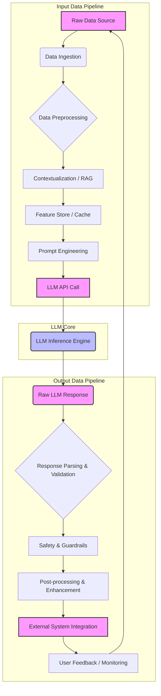

LLM 기반 시스템은 단순한 모델 호출을 넘어, 복잡한 데이터 흐름을 수반합니다. 입력 데이터의 신뢰성, 실시간 처리 능력, 그리고 출력 결과의 정확성과 안전성은 시스템의 성공적인 운영에 필수적입니다. 견고한 인풋 및 아웃풋 데이터 파이프라인 설계는 이러한 LLM 시스템의 안정성과 확장성을 보장하는 핵심 요소입니다.

## LLM 데이터 파이프라인의 중요성

LLM 시스템은 외부 데이터 소스에서 정보를 가져와 컨텍스트를 구성하고, LLM을 통해 추론하며, 그 결과를 사용자에게 전달하거나 다른 시스템과 연동합니다. 이 과정에서 데이터는 다양한 변환, 검증, 강화 단계를 거칩니다. 파이프라인이 부실하게 설계되면, 데이터 불일치, 성능 저하, 보안 취약점, 그리고 무엇보다 LLM 출력 품질 저하로 이어질 수 있습니다.

특히 2026년에는 실시간 데이터 처리와 복합적인 에이전트 시스템 통합이 강조되면서, 파이프라인의 유연성과 견고성이 더욱 중요해지고 있습니다.

## 인풋 데이터 파이프라인 설계 패턴

LLM 시스템의 인풋 파이프라인은 주로 데이터 수집, 전처리, 컨텍스트 구성 단계를 포함합니다.

### 1. 데이터 수집 및 정제 (Data Ingestion and Cleansing)

*   **스트리밍 vs. 배치 처리**: 사용자 상호작용과 같이 실시간 응답이 필요한 경우 Apache Kafka, Apache Pulsar와 같은 스트리밍 플랫폼을 사용하여 데이터를 실시간으로 수집하고, Apache Flink 또는 Spark Streaming으로 처리합니다. 반면, RAG(Retrieval Augmented Generation)를 위한 대규모 문서 임베딩 업데이트나 모델 미세 조정을 위한 데이터 준비는 배치 처리(예: Apache Spark, Databricks)가 효율적입니다.
*   **데이터 퀄리티 검증**: 초기 단계에서부터 데이터의 유효성, 일관성, 완전성을 검증하는 자동화된 메커니즘을 구축합니다. Pydantic, Great Expectations 같은 라이브러리를 활용하여 스키마 유효성 검사 및 데이터 프로파일링을 수행할 수 있습니다.

### 2. 컨텍스트 구성 (Context Building)

*   **RAG 패턴**: 가장 일반적인 인풋 패턴 중 하나로, 사용자 쿼리에 기반하여 관련 문서를 벡터 데이터베이스(예: Pinecone, Weaviate, Qdrant)에서 검색하고, 검색된 문서를 LLM의 프롬프트 컨텍스트에 추가합니다. 이 과정에서 임베딩 업데이트 파이프라인의 효율성과 실시간성이 중요합니다.
*   **피처 스토어 통합**: 사용자 프로필, 과거 상호작용 기록, 비즈니스 규칙 등 LLM 추론에 필요한 정형 데이터를 피처 스토어(예: Feast, Tecton)에 저장하고, 실시간으로 조회하여 프롬프트에 동적으로 주입합니다. 이는 LLM의 응답 개인화 및 정확도 향상에 기여합니다.
*   **동적 프롬프트 엔지니어링**: 특정 상황이나 사용자 입력에 따라 프롬프트 템플릿을 동적으로 변경하거나 확장하는 로직을 포함합니다. 이는 LLM의 유연성을 극대화합니다.

## 아웃풋 데이터 파이프라인 설계 패턴

LLM 시스템의 아웃풋 파이프라인은 LLM의 응답을 받아 후처리, 검증, 저장, 그리고 외부 시스템 연동 단계를 포함합니다.

### 1. 응답 파싱 및 유효성 검사 (Response Parsing and Validation)

*   **구조화된 응답 처리**: LLM이 JSON, XML과 같은 구조화된 형태로 응답하도록 가이드하고, 이를 파싱하여 필요한 정보를 추출합니다. JSON Schema, Pydantic 모델을 사용하여 응답의 스키마 유효성을 검사하고, LLM의 환각(hallucination)이나 잘못된 형식의 출력을 감지합니다.
*   **콘텐츠 안전성 및 가드레일**: 생성된 텍스트가 유해하거나 부적절한 내용을 포함하지 않도록 필터링합니다. 이는 사전에 정의된 규칙(rule-based guardrails), ML 기반 콘텐츠 모더레이션 API(예: Azure Content Safety, Perspective API), 또는 또 다른 LLM 기반의 검증 에이전트를 통해 이루어질 수 있습니다.

### 2. 후처리 및 통합 (Post-processing and Integration)

*   **응답 변환 및 강화**: LLM 응답을 사용자 친화적인 형태로 변환하거나, 추가적인 정보를 통합하여 최종 응답을 생성합니다. 예를 들어, LLM이 생성한 코드 스니펫을 실행 가능한 형태로 변환하거나, 데이터베이스에서 추가 정보를 조회하여 사용자에게 제공할 수 있습니다.
*   **피드백 루프**: 사용자 만족도, 명확성, 정확성 등 LLM 응답에 대한 피드백을 수집하여 파이프라인 개선에 활용합니다. 이는 명시적 사용자 평가, 암묵적 행동 데이터(클릭, 스크롤), 또는 A/B 테스트를 통해 이루어질 수 있으며, RLHF(Reinforcement Learning from Human Feedback)나 모델 재학습 파이프라인에 연결됩니다.
*   **외부 시스템 연동**: LLM의 응답을 외부 API 호출, 데이터베이스 업데이트, 메시지 큐 발행 등 다른 시스템과 연동하는 로직을 포함합니다.

## 예시: RAG 및 Output Validation 파이프라인 (Python)

다음은 간단한 RAG 기반 인풋 파이프라인과 구조화된 아웃풋 유효성 검사 파이프라인을 보여주는 Python 예제입니다. 이 예제에서는 가상의 벡터 DB와 LLM API를 사용합니다.

```python
from typing import List, Dict, Optional
from pydantic import BaseModel, ValidationError
import json

# 1. Input Pipeline: RAG (Retrieval Augmented Generation)
class Document(BaseModel:
    id: str
    text: str
    embedding: List[float]

class VectorDB:
    def __init__(self, documents: List[Document]):
        self.documents = {doc.id: doc for doc in documents}

    def search(self, query_embedding: List[float], k: int = 3) -> List[Document]:
        # In a real scenario, this would involve vector similarity search
        print(f"Searching vector DB for query with embedding {query_embedding[:5]}...")
        # Simulate search result
        return list(self.documents.values())[:k]

class LLMService:
    def generate(self, prompt: str) -> str:
        print("Calling LLM for generation...")
        # Simulate LLM response
        if "capital of France" in prompt:
            return '{"city": "Paris", "country": "France", "population": 2141000}'
        return '{"error": "Could not process request"}'

def run_input_pipeline(query: str, vector_db: VectorDB, llm_service: LLMService) -> str:
    # 1. Simulate query embedding generation
    query_embedding = [0.1, 0.2, 0.3, 0.4, 0.5]
    
    # 2. Retrieve relevant documents
    relevant_docs = vector_db.search(query_embedding)
    context = "\n".join([doc.text for doc in relevant_docs])
    
    # 3. Construct prompt with context
    prompt = f"Context: {context}\n\nBased on the context, answer the following question: {query}\nProvide the answer in JSON format with 'city', 'country', and 'population' fields."
    return llm_service.generate(prompt)

# 2. Output Pipeline: Response Parsing and Validation
class CityInfo(BaseModel:
    city: str
    country: str
    population: Optional[int]

def run_output_pipeline(llm_raw_response: str) -> Optional[CityInfo]:
    print(f"Raw LLM response: {llm_raw_response}")
    try:
        # 1. Parse JSON response
        response_data = json.loads(llm_raw_response)
        # 2. Validate against Pydantic model
        validated_response = CityInfo(**response_data)
        print("Successfully validated LLM response.")
        return validated_response
    except json.JSONDecodeError:
        print("Error: LLM response is not valid JSON.")
        return None
    except ValidationError as e:
        print(f"Error: LLM response schema validation failed: {e}")
        return None
    except Exception as e:
        print(f"An unexpected error occurred during output processing: {e}")
        return None

# Example Usage
dummy_docs = [
    Document(id="doc1", text="Paris is the capital and most populous city of France.", embedding=[0.1, 0.1, 0.1, 0.1, 0.1]),
    Document(id="doc2", text="France is a country located in Western Europe.", embedding=[0.2, 0.2, 0.2, 0.2, 0.2])
]
vector_db_instance = VectorDB(dummy_docs)
llm_service_instance = LLMService()

# Run the full pipeline
query = "What is the capital of France?"
llm_response_str = run_input_pipeline(query, vector_db_instance, llm_service_instance)
final_output = run_output_pipeline(llm_response_str)

if final_output:
    print(f"Processed Output: City: {final_output.city}, Country: {final_output.country}")
else:
    print("Failed to get a valid output.")
```

## LLM 데이터 파이프라인 아키텍처

LLM 데이터 파이프라인의 일반적인 흐름은 다음과 같은 다이어그램으로 표현할 수 있습니다.



이 다이어그램은 인풋 파이프라인이 Raw Data Source에서 시작하여 LLM API Call로 이어지고, LLM Inference Engine을 거쳐 Raw LLM Response를 생성한 후, 아웃풋 파이프라인을 통해 최종 결과를 전달하고 피드백 루프를 통해 다시 인풋으로 연결되는 과정을 보여줍니다. 각 단계는 데이터의 흐름과 변환을 나타냅니다.

## 2026년 최신 트렌드 반영

*   **실시간 지식 그래프 및 컨텍스트 관리**: 정적인 RAG를 넘어, 스트리밍 데이터를 통해 실시간으로 업데이트되는 지식 그래프(Knowledge Graph)를 구축하여 LLM에 최신 정보를 제공합니다. 이를 위해 그래프 데이터베이스와 스트리밍 처리 기술의 통합이 가속화됩니다.
*   **강화된 데이터 거버넌스 및 설명 가능성 (Explainability)**: LLM이 사용하는 모든 데이터의 출처, 변환 이력, 사용 목적을 추적하고 감사할 수 있는 자동화된 데이터 거버넌스 프레임워크가 필수화됩니다. 또한, LLM의 추론 과정에서 어떤 컨텍스트가 어떻게 활용되었는지 설명할 수 있는 메커니즘이 중요해집니다.
*   **멀티모달 및 복합 에이전트 파이프라인**: 텍스트 외에 이미지, 음성 등 멀티모달 데이터를 처리하고, 여러 LLM 에이전트가 협업하는 시스템을 위한 데이터 파이프라인 설계가 보편화됩니다. 이는 데이터 동기화, 에이전트 간 통신 프로토콜, 그리고 분산 처리의 복잡성을 증가시킵니다.
*   **옵저버빌리티 및 AIOps 통합**: 데이터 파이프라인의 모든 단계에서 메트릭, 로그, 트레이스를 수집하여 통합 대시보드에서 모니터링하고, 이상 징후를 AIOps 도구로 자동 감지하여 예측 및 대응하는 시스템이 일반화됩니다.

## 트레이드오프

LLM 데이터 파이프라인 설계 시 다음 트레이드오프를 고려해야 합니다.

*   **엔드투엔드 지연 시간(Latency) vs. 데이터 신선도(Freshness)**
    *   **언제 좋은가**: 사용자 상호작용처럼 실시간 응답이 필수적인 애플리케이션에서는 지연 시간을 최소화하는 스트리밍 파이프라인이 좋습니다.
    *   **언제 나쁜가**: 데이터 신선도가 약간 떨어져도 되는 배치 처리(예: 일별 리포트 생성)에는 복잡한 실시간 시스템 구축 비용이 과도할 수 있습니다.
*   **파이프라인 유연성(Flexibility) vs. 옵저버빌리티(Observability)**
    *   **언제 좋은가**: 빠르게 변화하는 비즈니스 요구사항이나 실험적 기능이 많은 프로토타이핑 단계에서는 높은 유연성을 가진 파이프라인이 좋습니다.
    *   **언제 나쁜가**: 프로덕션 환경에서 장애 진단 및 성능 모니터링이 중요한 경우, 지나치게 유연한 파이프라인은 복잡성을 높여 옵저버빌리티를 저해할 수 있습니다.
*   **구축 복잡도(Complexity) vs. 맞춤형(Customization) 정도**
    *   **언제 좋은가**: 특정 도메인에 특화된 정교한 전처리나 후처리 로직이 필요한 경우, 맞춤형 파이프라인 구축이 LLM의 성능을 극대화할 수 있습니다.
    *   **언제 나쁜가**: 표준화된 솔루션으로 충분하거나, 개발 리소스가 제한적인 경우, 과도한 맞춤형 설계는 불필요한 복잡성과 유지보수 비용을 초래합니다.
*   **운영 비용(Cost) vs. 성능(Performance)**
    *   **언제 좋은가**: 대규모 사용자 대상의 고성능 LLM 서비스는 고가의 클라우드 인프라와 최적화된 데이터 파이프라인에 투자할 가치가 있습니다.
    *   **언제 나쁜가**: 내부 도구나 소규모 서비스의 경우, 비용 효율적인 솔루션(예: 서버리스 기능, 관리형 서비스)을 사용하여 초기 투자와 운영 비용을 절감하는 것이 합리적입니다.

## 실전 체크리스트

LLM 데이터 파이프라인을 설계하고 구현할 때 다음 항목들을 점검하십시오.

- [ ] **데이터 유효성 검사**: 인풋 파이프라인의 각 단계에서 데이터 스키마 및 내용 유효성을 자동 검사하는 메커니즘이 구현되어 있는가?
- [ ] **데이터 드리프트 모니터링**: 인풋 데이터의 분포나 특성 변화(데이터 드리프트)를 감지하고 경고하는 시스템이 구축되어 있는가?
- [ ] **확장성 설계**: 예상되는 최대 트래픽 및 데이터 볼륨을 처리할 수 있도록 파이프라인 컴포넌트들이 수평 확장이 가능하도록 설계되었는가?
- [ ] **보안 및 개인 정보 보호**: 민감한 데이터 처리 시 암호화, 접근 제어, 데이터 마스킹 등 보안 및 개인 정보 보호 조치가 충분히 적용되어 있는가?
- [ ] **파이프라인 버전 관리**: 데이터 전처리 로직, RAG 설정, LLM 프롬프트 등 파이프라인 구성 요소에 대한 버전 관리가 체계적으로 이루어지고 롤백이 가능한가?
- [ ] **자동화된 테스트**: 파이프라인의 각 구성 요소와 엔드투엔드 흐름에 대한 단위 및 통합 테스트가 자동화되어 배포 전 품질을 보장하는가?
- [ ] **오류 처리 및 재시도**: 일시적인 네트워크 오류나 외부 시스템 장애에 대비하여 견고한 오류 처리 및 재시도 메커니즘이 구현되어 있는가?
- [ ] **옵저버빌리티 구축**: 파이프라인의 각 단계에서 로그, 메트릭, 트레이스를 수집하여 통합 모니터링 대시보드에서 가시성을 확보하고 있는가?