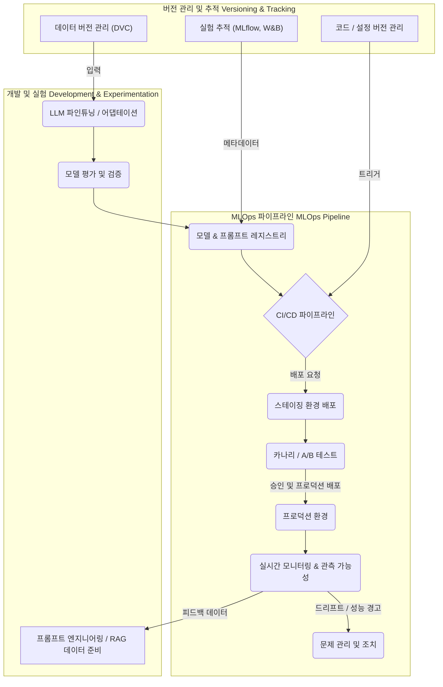

LLM 기반 애플리케이션의 프로덕션 환경 운영은 전통적인 소프트웨어 배포나 머신러닝 모델 배포와는 다른 복잡성을 가집니다. 모델 자체의 불확실성, 프롬프트 엔지니어링의 동적 특성, RAG(Retrieval-Augmented Generation) 데이터의 빈번한 업데이트, 그리고 높은 연산 비용 등의 요소가 결합되어 안정적인 서비스 제공을 어렵게 만듭니다. 이러한 도전과제를 극복하고 LLM 기반 애플리케이션의 서비스 안정성과 효율성을 확보하기 위해 MLOps(Machine Learning Operations)의 체계적인 통합은 필수적입니다.

## LLM MLOps의 핵심 과제

LLM 프로덕션 환경은 다음과 같은 특유의 과제들을 내포합니다:

*   **모델 드리프트 (Model Drift) 및 할루시네이션 (Hallucination)**: LLM의 응답 품질은 학습 데이터와 실제 운영 환경의 데이터 분포 변화, 또는 외부 지식 소스(RAG)의 업데이트에 따라 저하될 수 있습니다.
*   **프롬프트 및 RAG 버전 관리**: 프롬프트의 미세한 변화나 RAG 데이터의 업데이트가 모델의 성능에 큰 영향을 미치므로, 이들에 대한 엄격한 버전 관리와 배포 파이프라인이 요구됩니다.
*   **비용 및 성능 최적화**: LLM 추론은 GPU 자원을 많이 소모하며, API 기반 LLM 사용 시 비용 관리가 중요합니다. 효율적인 리소스 할당과 성능 모니터링이 필수적입니다.
*   **배포 복잡성**: LLM 자체의 크기, 파인튜닝 모델, 어댑터(LoRA 등), 그리고 이를 감싸는 애플리케이션 로직을 통합하여 배포하는 과정이 복잡합니다.
*   **관측 가능성 (Observability) 부족**: LLM의 내부 작동 방식은 블랙박스에 가까워, 문제가 발생했을 때 원인을 파악하고 디버깅하기 어렵습니다. 상세한 로깅과 추적 시스템이 필요합니다.

## LLM MLOps 통합 패턴

이러한 과제들을 해결하기 위한 MLOps 통합 패턴은 크게 세 가지 축으로 나눌 수 있습니다:

### 1. 자동화된 CI/CD 파이프라인

LLM 기반 애플리케이션의 CI/CD 파이프라인은 모델 코드, 프롬프트 템플릿, RAG 데이터 소스, 그리고 관련 인프라 설정을 포함해야 합니다. 변경 사항이 발생하면 자동으로 테스트, 빌드, 배포가 이루어지도록 합니다.

*   **모델 및 프롬프트 레지스트리 (Model & Prompt Registry)**: MLflow Model Registry 또는 Hugging Face Hub와 같은 도구를 사용하여 모델 아티팩트와 프롬프트 버전을 관리합니다. 각 버전에는 메타데이터(훈련 데이터셋, 하이퍼파라미터, 평가 지표 등)를 첨부하여 추적성을 확보합니다.
*   **파이프라인 트리거 (Pipeline Triggers)**: 코드 변경(Git), RAG 데이터 업데이트(DVC), 새로운 모델 버전 등록 등 특정 이벤트 발생 시 CI/CD 파이프라인이 자동으로 실행되도록 설정합니다.
*   **카나리 배포 (Canary Deployment) 및 A/B 테스트**: 새로운 버전의 LLM 애플리케이션을 전체 사용자에게 한 번에 배포하는 대신, 소수의 사용자에게만 먼저 배포하여 실제 환경에서의 성능과 안정성을 검증합니다. 문제가 없으면 점진적으로 트래픽을 늘려나갑니다.

### 2. 강력한 모니터링 및 관측 가능성

LLM 프로덕션의 안정적인 운영을 위해서는 상세하고 실시간에 가까운 모니터링이 필수입니다. 이는 시스템 지표뿐만 아니라 LLM 특유의 지표를 포함해야 합니다.

*   **성능 모니터링**: LLM 응답 지연 시간 (latency), 처리량 (throughput), 오류율 (error rate), 그리고 토큰 사용량 (token usage) 등 기본적인 API 지표를 추적합니다.
*   **품질 모니터링**: 사용자 피드백, 휴먼 평가 (Human-in-the-Loop), 그리고 자동화된 LLM 기반 평가 (LLM as a judge)를 통해 응답의 품질(정확성, 관련성, 유해성 등)을 지속적으로 측정합니다.
*   **드리프트 감지**: 입력 프롬프트의 분포 변화 (input drift)나 LLM 응답의 특성 변화 (output drift)를 감지하여 모델 성능 저하를 예측하고 대응합니다. 벡터 임베딩 간의 유사도 변화 등을 활용할 수 있습니다.
*   **비용 모니터링**: 외부 LLM API 사용 시 토큰 당 비용을 추적하고, 내부 GPU 자원 사용량을 모니터링하여 비용 효율성을 최적화합니다.
*   **프롬프트 및 응답 로깅**: 모든 입력 프롬프트와 LLM의 응답을 상세하게 로깅하여 문제 발생 시 디버깅 및 분석에 활용합니다. 민감 정보 (PII) 처리 방안을 고려해야 합니다.

### 3. 데이터 및 모델 버전 관리 전략

LLM 기반 애플리케이션은 코드 외에도 모델, 프롬프트, 그리고 RAG 데이터셋에 대한 엄격한 버전 관리가 요구됩니다.

*   **데이터 버전 관리 (Data Version Control, DVC)**: RAG 데이터셋이나 파인튜닝 데이터셋의 버전을 관리하여 특정 모델 버전이 어떤 데이터로 훈련/구성되었는지 추적하고, 문제가 발생했을 때 롤백할 수 있도록 합니다.
*   **실험 추적 (Experiment Tracking)**: MLflow Tracking, Weights & Biases와 같은 도구를 사용하여 다양한 프롬프트, 모델, 하이퍼파라미터 조합에 대한 실험 결과를 기록하고 비교합니다. 이는 최적의 성능을 내는 버전을 결정하는 데 중요합니다.
*   **재현성 (Reproducibility)**: 특정 시점의 애플리케이션 상태(코드, 모델, 프롬프트, 데이터)를 완벽하게 재현할 수 있도록 모든 구성 요소를 버전 관리하고 파이프라인으로 묶습니다.

## LLM MLOps 통합 파이프라인 예시

다음 Mermaid 다이어그램은 LLM 기반 애플리케이션을 위한 통합 MLOps 파이프라인의 핵심 단계를 보여줍니다.



## 코드 예시: MLflow를 활용한 LLM 로깅 및 배포 간소화

MLflow는 모델 레지스트리, 실험 추적, 배포 기능을 통합하여 MLOps를 간소화합니다. LLM에 특화된 로깅과 배포를 위해 `mlflow.pyfunc`를 활용할 수 있습니다.

```python
import mlflow
import pandas as pd
from mlflow.pyfunc import PythonModel
from openai import OpenAI # OpenAI API를 예시로 사용

class CustomLLM(PythonModel):
    def load_context(self, context):
        # LLM 모델 로드 또는 API 클라이언트 초기화
        self.client = OpenAI(api_key=context.artifacts["openai_api_key"])

    def predict(self, context, model_input):
        # model_input은 pandas DataFrame 형태가 예상됨
        prompts = model_input["prompt"].tolist()
        responses = []

        for i, prompt in enumerate(prompts):
            # 각 프롬프트와 응답을 MLOps 메트릭으로 로깅
            mlflow.log_metric(f"input_prompt_{i}", prompt)
            
            try:
                completion = self.client.chat.completions.create(
                    model="gpt-4o-mini",
                    messages=[{"role": "user", "content": prompt}]
                )
                response = completion.choices[0].message.content
                mlflow.log_metric(f"output_response_{i}", response)
                responses.append(response)
            except Exception as e:
                mlflow.log_metric(f"error_{i}", str(e))
                responses.append(f"Error: {e}") # 오류 발생 시 처리

        return pd.DataFrame({"response": responses})

# MLflow run 내에서 모델 로깅
# with mlflow.start_run(run_name="llm-inference-model-v1") as run:
#    # artifact에 API 키를 직접 저장하는 것은 보안상 권장되지 않으며, 예시를 위한 플레이스홀더입니다.
#    # 실제 환경에서는 환경 변수나 KMS(Key Management Service)를 사용해야 합니다.
#    mlflow.pyfunc.log_model(
#        artifact_path="llm_model_artifact",
#        python_model=CustomLLM(),
#        artifacts={"openai_api_key": "sk-YOUR_SECURE_KEY"},
#        conda_env={
#            "channels": ["conda-forge"],
#            "dependencies": [
#                "python=3.9",
#                "pip",
#                {"pip": ["mlflow", "openai", "pandas"]}
#            ]
#        }
#    )
#    run_id = run.info.run_id
#    print(f"Model logged with Run ID: {run_id}")

# 로깅된 모델 로드 및 테스트 예시
# loaded_model = mlflow.pyfunc.load_model(f"runs:/{run_id}/llm_model_artifact")
# test_input = pd.DataFrame({"prompt": ["MLOps for LLMs의 주요 장점은 무엇인가요?", "2026년 AI 트렌드 중 하나는?" ]})
# predictions = loaded_model.predict(test_input)
# print(predictions)
```

이 코드는 `mlflow.pyfunc.PythonModel`을 상속받아 LLM API 호출을 캡슐화하고, 각 프롬프트와 응답을 MLflow 메트릭으로 로깅하는 방법을 보여줍니다. 이를 통해 추후 모델의 행동과 성능을 쉽게 추적하고 분석할 수 있습니다. `context.artifacts`를 통해 OpenAI API 키를 전달하는 것은 예시이며, 실제 프로덕션에서는 Vault, AWS Secrets Manager, Google Secret Manager와 같은 보안 솔루션을 통해 관리해야 합니다.

## 트레이드오프

LLM MLOps 통합 패턴을 도입할 때는 다음과 같은 트레이드오프를 고려해야 합니다.

*   **완전 자동화된 CI/CD 파이프라인**: 엄격한 자동화는 배포 속도와 안정성을 높이지만, 초기 설정 및 유지보수 비용이 높습니다. 
    *   **언제 좋고**: 변경 빈도가 높고, 여러 LLM 모델 및 프롬프트 버전을 관리해야 하는 대규모 프로젝트에 유리합니다. 인적 오류를 최소화하고 배포 주기를 단축합니다.
    *   **언제 나쁜지**: LLM 애플리케이션이 간단하고 변경이 드물며, 전담 MLOps 팀이 없는 소규모 프로젝트에서는 과도한 오버헤드가 될 수 있습니다.
*   **포괄적인 모니터링 및 로깅**: 상세한 모니터링은 LLM의 행동을 투명하게 관찰하고 문제 발생 시 빠른 대응을 가능하게 하지만, 데이터 저장 및 처리 비용이 증가하고 PII (개인 식별 정보) 관리 복잡성을 더합니다.
    *   **언제 좋고**: LLM의 응답 품질이 비즈니스에 직접적인 영향을 미치거나, 규제 준수가 중요한 서비스에 필수적입니다. 잠재적 드리프트나 할루시네이션을 조기에 발견하는 데 유용합니다.
    *   **언제 나쁜지**: 개발 초기 단계나 비민감성 데이터로 제한된 내부 테스트용 애플리케이션에서는 과도한 자원 소모와 개발 속도 저하를 야기할 수 있습니다.
*   **엄격한 프롬프트/데이터 버전 관리**: 변경 이력을 완벽하게 추적하고 재현성을 보장하지만, 개발자의 작업 흐름에 추가적인 오버헤드를 발생시키고 빠른 실험을 저해할 수 있습니다.
    *   **언제 좋고**: LLM의 응답이 법적/규제적 요구사항을 충족해야 하거나, 높은 수준의 신뢰성과 감사 추적이 필요한 금융, 의료 분야 애플리케이션에 적합합니다.
    *   **언제 나쁜지**: 실험적이고 빠르게 반복해야 하는 초기 프로토타이핑 단계에서는 개발 속도를 늦추고 불필요한 복잡성을 추가할 수 있습니다.

## 실전 체크리스트

LLM MLOps 통합 패턴을 프로젝트에 적용할 때 다음 체크리스트를 활용하여 준비 상태를 검증합니다.

*   [ ] LLM 모델, 프롬프트 템플릿, RAG 데이터셋 각각에 대한 버전 관리 전략이 명확히 정의되고 Git, DVC, 또는 전용 레지스트리를 통해 관리되고 있는가?
*   [ ] 모델 코드, 프롬프트, 인프라 코드 변경 시 자동으로 테스트, 빌드, 배포를 수행하는 CI/CD 파이프라인이 구축되어 있으며, 배포 성공률이 95% 이상 유지되는가?
*   [ ] 새로운 LLM 버전 배포 시 카나리 또는 A/B 테스트를 통해 실제 사용자 트래픽에 대한 안정성과 성능 검증 절차가 포함되어 있는가?
*   [ ] LLM 애플리케이션의 핵심 성능 지표(응답 시간, 오류율, 토큰 사용량)와 품질 지표(정확성, 관련성, 유해성)를 실시간으로 모니터링하고 시각화하는 대시보드가 구성되어 있는가?
*   [ ] 입력 프롬프트 및 LLM 응답에 대한 상세 로깅 시스템이 구축되어 있으며, 민감 정보 (PII) 마스킹 또는 비식별화 처리가 적절히 적용되고 있는가?
*   [ ] 운영 중인 LLM의 성능 드리프트(Model Drift) 또는 데이터 드리프트(Data Drift)를 자동으로 감지하고 경고하는 시스템이 구현되어 있으며, 경고 발생 시 대응 프로세스가 정의되어 있는가?
*   [ ] 문제 발생 시 신속한 롤백(Rollback) 또는 대체 모델 전환(Fallback)이 가능한 비상 계획 및 자동화된 절차가 마련되어 있는가?