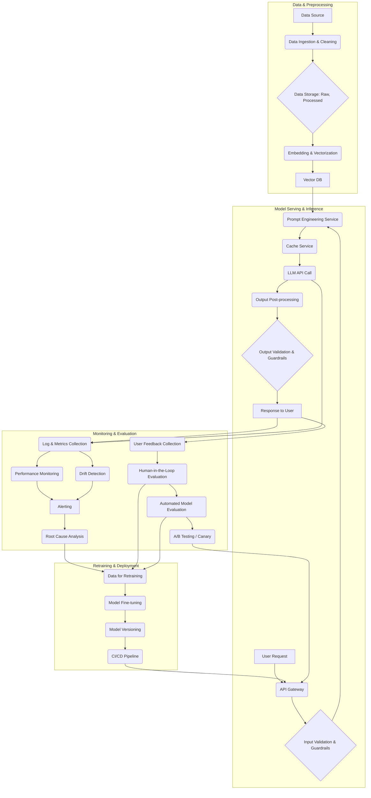

LLM(Large Language Model) 기반 서비스가 프로덕션 환경으로 확대되면서, 단순히 모델을 개발하는 것을 넘어 이를 안정적이고 효율적으로 운영하기 위한 LLM Ops(Operations) 파이프라인의 중요성이 증대되고 있습니다. LLM Ops는 모델 개발부터 배포, 모니터링, 재학습에 이르는 전 과정에 걸쳐 MLOps(Machine Learning Operations) 원칙을 적용하며, 특히 LLM의 특성(비용, 지연 시간, 할루시네이션, 프롬프트 드리프트)을 고려한 고유한 디자인 패턴을 요구합니다. 2026년 기준, 엔터프라이즈 환경에서는 LLM 기반 애플리케이션의 안정성과 신뢰성 확보를 위한 표준화된 아키텍처와 방법론이 필수적입니다. 이 엔트리에서는 LLM Ops 파이프라인의 핵심 디자인 패턴들을 상세히 설명합니다.

## LLM Ops 파이프라인 핵심 구성 요소

LLM Ops 파이프라인은 여러 단계로 구성되며, 각 단계는 특정 목적을 수행합니다.

### 1. 데이터 파이프라인 (Data Pipeline)

LLM의 성능은 고품질 데이터에 의해 크게 좌우됩니다. 데이터 파이프라인은 프롬프트, 응답, 사용자 피드백, RAG(Retrieval Augmented Generation) 소스 문서 등 LLM과 관련된 모든 데이터를 수집, 전처리, 저장하는 역할을 합니다.

*   **데이터 수집 및 정제:** 다양한 소스(로그, 데이터베이스, 웹 크롤링)에서 데이터를 수집하고, 편향 제거, 노이즈 필터링, 형식 통일 등의 정제 과정을 거칩니다.
*   **임베딩 및 벡터화:** RAG 시스템을 위한 문서 임베딩을 생성하고, 벡터 데이터베이스에 저장하여 검색 효율성을 높입니다.
*   **피드백 루프:** 사용자 피드백, 모델 평가 결과 등을 수집하여 다음 학습 주기에 활용될 수 있도록 데이터를 준비합니다.

### 2. 모델 서빙 및 추론 파이프라인 (Model Serving & Inference Pipeline)

배포된 LLM이 사용자 요청에 효율적으로 응답하도록 관리하는 단계입니다.

*   **API Gateway 및 로드 밸런싱:** 대량의 요청을 처리하고, 여러 모델 인스턴스 간에 트래픽을 분산하여 고가용성을 보장합니다.
*   **캐싱 전략:** 반복되는 프롬프트에 대한 응답을 캐싱하여 지연 시간을 줄이고 비용을 절감합니다.
*   **프롬프트 엔지니어링 서비스:** 프롬프트 템플릿 관리, 버전 관리, 동적 프롬프트 구성 등을 지원하여 프롬프트 드리프트(drift)를 최소화하고 일관성을 유지합니다.
*   **가드레일 및 안전 장치:** LLM의 Input과 Output에 대해 유해성, 보안 취약성, 형식 준수 여부 등을 검증하는 가드레일(Guardrails)을 적용하여 안전한 서비스를 제공합니다.

```python
import openai
import json
import logging
from tenacity import retry, wait_random_exponential, stop_after_attempt

# Configure logging
logging.basicConfig(level=logging.INFO, format='%(asctime)s - %(levelname)s - %(message)s')

class LLMInferenceService:
    def __init__(self, api_key: str, model: str = "gpt-4o"):
        openai.api_key = api_key
        self.model = model
        self.cache = {}

    def _validate_input(self, prompt: str) -> bool:
        # Example: Simple input validation for length or specific keywords
        if not isinstance(prompt, str) or len(prompt) < 10 or len(prompt) > 2000:
            logging.warning(f"Invalid input prompt length: {len(prompt)} characters.")
            return False
        if "malicious_keyword" in prompt.lower():
            logging.warning("Malicious keyword detected in prompt.")
            return False
        return True

    def _post_process_output(self, response_text: str) -> str:
        # Example: Basic output sanitization or formatting
        return response_text.strip().replace("\n\n", "\n")

    @retry(wait=wait_random_exponential(min=1, max=60), stop=stop_after_attempt(6))
    def _call_llm_api(self, prompt: str) -> str:
        logging.info(f"Calling LLM API for prompt: {prompt[:50]}...")
        try:
            response = openai.chat.completions.create(
                model=self.model,
                messages=[{"role": "user", "content": prompt}]
            )
            content = response.choices[0].message.content
            logging.info("LLM API call successful.")
            return content
        except openai.APITimeoutError:
            logging.error("LLM API request timed out.")
            raise
        except openai.APIConnectionError as e:
            logging.error(f"LLM API connection error: {e}")
            raise
        except openai.RateLimitError:
            logging.warning("LLM API rate limit exceeded. Retrying...")
            raise
        except Exception as e:
            logging.error(f"An unexpected error occurred during LLM API call: {e}")
            raise

    def get_llm_response(self, prompt: str, use_cache: bool = True) -> str:
        if not self._validate_input(prompt):
            return "Input validation failed. Please check your request."

        if use_cache and prompt in self.cache:
            logging.info("Cache hit for prompt.")
            return self.cache[prompt]

        try:
            raw_response = self._call_llm_api(prompt)
            processed_response = self._post_process_output(raw_response)
            if use_cache:
                self.cache[prompt] = processed_response
            return processed_response
        except Exception as e:
            logging.error(f"Failed to get LLM response after retries: {e}")
            return "Error processing your request. Please try again later."

# Usage example
# api_key = "YOUR_OPENAI_API_KEY"
# service = LLMInferenceService(api_key)
# response = service.get_llm_response("Explain the concept of quantum entanglement in simple terms.")
# print(response)
```

### 3. 모니터링 및 로깅 파이프라인 (Monitoring & Logging Pipeline)

LLM 서비스의 상태와 성능을 지속적으로 관찰하고 문제를 식별하는 데 필수적입니다.

*   **지표 수집:** 지연 시간(latency), 처리량(throughput), 오류율(error rate), 토큰 사용량, 비용 등 핵심 성능 지표(KPI)를 실시간으로 수집합니다.
*   **모델 드리프트 감지:** 프롬프트 분포, 응답 품질, 사용자 피드백 등의 변화를 모니터링하여 모델 성능 저하(drift)를 조기에 감지합니다. 2026년에는 LLM 특화된 드리프트 감지 모델이 더욱 고도화될 것입니다.
*   **이상 감지:** 비정상적인 사용 패턴이나 성능 저하를 자동으로 감지하여 경고를 발생시킵니다.
*   **로깅 및 감사:** 모든 LLM 호출, 응답, 중간 단계 정보를 기록하여 디버깅, 감사, 규제 준수에 활용합니다.

### 4. 평가 및 검증 파이프라인 (Evaluation & Validation Pipeline)

모델의 성능과 품질을 정량적, 정성적으로 평가하고 검증하는 과정입니다.

*   **자동화된 지표 평가:** ROUGE, BLEU, BERTScore와 같은 전통적인 NLG(Natural Language Generation) 지표와 더불어, LLM 자체를 평가 모델로 활용하는 LLM-as-a-judge 방식이 확산되고 있습니다. 특히 정확성(accuracy), 일관성(consistency), 안전성(safety), 유용성(helpfulness) 등 LLM에 특화된 지표를 중점적으로 평가합니다.
*   **Human-in-the-Loop (HITL):** 자동화된 평가의 한계를 보완하기 위해 인간 평가자가 모델 응답의 품질, 할루시네이션 여부, 편향 등을 검토하고 라벨링하는 프로세스입니다.
*   **A/B 테스팅 및 Canary Deployment:** 새로운 모델이나 프롬프트 변경 사항을 소규모 사용자 그룹에 먼저 배포하여 실제 환경에서의 성능을 검증하고 점진적으로 확산시킵니다.

### 5. 재학습 및 배포 파이프라인 (Retraining & Deployment Pipeline)

모델 성능 저하를 해결하고 새로운 요구사항을 반영하기 위해 모델을 업데이트하고 배포하는 과정입니다.

*   **CI/CD for LLMs:** 지속적인 통합(CI) 및 지속적인 배포(CD) 파이프라인을 구축하여 모델 코드, 프롬프트, 설정 변경 사항을 자동으로 테스트하고 배포합니다.
*   **Fine-tuning 및 지식 업데이트:** 드리프트 감지 또는 새로운 데이터에 기반하여 모델을 fine-tuning하거나, RAG 시스템의 지식 기반을 업데이트합니다.
*   **버전 관리:** 모델, 프롬프트, 데이터셋의 모든 버전을 관리하여 재현 가능성을 보장하고 롤백(rollback)을 용이하게 합니다.



## 트레이드오프

LLM Ops 파이프라인을 설계할 때는 다양한 트레이드오프를 고려해야 합니다.

*   **종합적인 자동화 vs. Human-in-the-Loop (HITL):**
    *   **언제 좋고:** 반복적이고 명확한 작업(예: 지표 수집, 간단한 입력 검증)에 대한 빠른 처리와 일관성을 보장할 때 좋습니다. 비용 절감 및 확장성이 우수합니다.
    *   **언제 나쁜지:** 복잡하거나 주관적인 판단이 필요한 작업(예: 할루시네이션 미세 조정, 윤리적 판단, 새로운 유형의 편향 감지)에서는 인간의 개입 없이 완전 자동화하면 품질 저하 또는 심각한 오류가 발생할 수 있습니다.
*   **빠른 배포 주기 vs. 안정성 및 신뢰성:**
    *   **언제 좋고:** 시장의 변화에 빠르게 대응하거나 새로운 아이디어를 신속하게 검증해야 할 때 유리합니다. 애자일 개발 문화에 적합합니다.
    *   **언제 나쁜지:** 금융, 의료와 같이 높은 안정성과 규제 준수가 요구되는 도메인에서는 철저한 테스트와 검증 없이 빠른 배포를 시도하면 치명적인 서비스 장애나 법적 문제를 야기할 수 있습니다. 잠재적 위험이 높을수록 배포 속도를 희생하여 안정성을 확보해야 합니다.
*   **고도화된 모니터링 vs. 운영 복잡성 및 비용:**
    *   **언제 좋고:** 서비스의 Critical Path에 있는 핵심 LLM 애플리케이션의 경우, 상세한 모니터링은 잠재적 문제를 조기에 파악하고 신속하게 대응하는 데 필수적입니다. 예측 불가능한 LLM 행동을 이해하는 데 도움이 됩니다.
    *   **언제 나쁜지:** 모든 지표를 과도하게 수집하고 분석 시스템을 구축하는 것은 상당한 개발 및 운영 리소스와 비용을 소모합니다. 비즈니스 가치가 낮은 LLM 기능에 대해 과도한 모니터링은 자원 낭비가 될 수 있습니다.
*   **단일 모델 아키텍처 vs. 멀티 모델/앙상블 아키텍처:**
    *   **언제 좋고:** 단일 모델은 파이프라인의 단순성을 유지하고 관리 용이성을 제공합니다. 리소스 효율적입니다.
    *   **언제 나쁜지:** 다양한 태스크나 특정 도메인에 특화된 성능을 요구할 경우, 단일 모델로는 한계가 있습니다. 여러 모델을 조합하거나 앙상블하는 경우 복잡성은 증가하지만, 전반적인 성능과 견고성을 향상시킬 수 있습니다.
*   **데이터 거버넌스 강화 vs. 데이터 활용 유연성:**
    *   **언제 좋고:** 민감한 데이터를 다루거나 규제 준수가 필요한 경우(GDPR, CCPA 등), 강력한 데이터 거버넌스는 보안과 신뢰를 확보하는 데 필수적입니다.
    *   **언제 나쁜지:** 지나치게 엄격한 데이터 거버넌스는 데이터 과학자와 엔지니어가 새로운 아이디어를 탐색하고 모델을 개선하는 데 필요한 데이터 접근 및 활용을 제약하여 혁신을 저해할 수 있습니다. 민감하지 않은 데이터의 경우, 유연성을 확보하는 것이 좋습니다.

## 실전 체크리스트

LLM Ops 파이프라인을 프로젝트에 적용할 때 다음 항목들을 검토하십시오.

- [ ] LLM Input/Output에 대한 명확한 가드레일 정책(예: 유해 콘텐츠 필터링, 길이 제한, 형식 검증)이 정의되고 코드에 반영되었는가?
- [ ] LLM API 호출에 대한 재시도(Retry) 로직, 서킷 브레이커(Circuit Breaker), 타임아웃(Timeout) 설정 등 견고성 패턴이 적용되었는가?
- [ ] 프롬프트 템플릿의 버전 관리 시스템이 구축되어 있으며, 변경 사항 이력 추적 및 롤백이 가능한가?
- [ ] LLM 지연 시간(latency), 토큰 사용량, 비용, 오류율 등을 측정하는 핵심 모니터링 지표가 수집되고 대시보드에서 시각화되는가?
- [ ] 모델 응답의 품질(예: 정확성, 일관성, 할루시네이션 비율)을 자동 및 수동으로 평가하는 파이프라인이 구현되었는가?
- [ ] 사용자 피드백을 수집하여 데이터 파이프라인으로 다시 주입하는 메커니즘이 존재하며, 이를 통해 모델 개선 주기를 단축하는가?
- [ ] CI/CD 파이프라인이 LLM 모델, 프롬프트, 관련 코드의 테스트, 배포, 버전 관리를 자동화하는 데 활용되고 있는가?
- [ ] 새로운 LLM 모델 또는 프롬프트 변경 시, A/B 테스팅 또는 Canary Deployment를 통해 실제 사용자 환경에서 점진적으로 검증하는 전략이 수립되었는가?
- [ ] LLM 관련 로그(입력 프롬프트, 출력 응답, API 응답 코드 등)가 적절히 수집 및 저장되며, 개인 식별 정보(PII)는 마스킹 처리되는가?
- [ ] 데이터 드리프트(Data Drift) 및 모델 드리프트(Model Drift)를 주기적으로 감지하고 알림을 생성하는 시스템이 구축되었는가?
