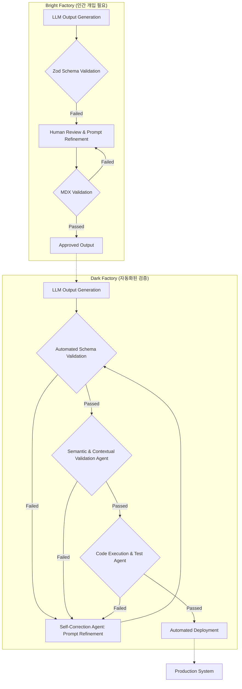

## LLM 출력 검증 파이프라인: 다크 팩토리로의 진화

대규모 언어 모델(LLM) 출력의 신뢰성과 정확성 확보는 시스템 안정성의 핵심 과제입니다. LLM 출력 검증 파이프라인은 '소프트웨어 팩토리(Software Factory)' 개념을 적용, 인간 개입 수준에 따라 '밝은 팩토리(Bright Factory)'와 '어두운 팩토리(Dark Factory)' 모델로 진화하고 있습니다.

## 소프트웨어 팩토리와 LLM 검증의 교차점

소프트웨어 팩토리는 컨텍스트 수집(Context Gathering), 행동(Acting), 검증(Verification) 루프를 하네스(Harness)로 운영하는 시스템입니다. LLM 출력 검증 역시 이 모델에 맞춰 설계될 수 있습니다.

### 밝은 팩토리 (Bright Factory): 인간 개입 검증

밝은 팩토리는 인간의 판단과 개입이 필수적인 검증 단계를 포함합니다.
*   **스키마 기반 검증**: Zod, Pydantic 등으로 LLM 출력의 데이터 구조와 타입이 사전 정의된 스키마를 준수하는지 확인합니다. 불일치 시 인간 개발자가 검토하고 수정합니다.
*   **수동 코드/콘텐츠 리뷰**: 인간이 LLM 생성 코드/콘텐츠의 품질, 보안, 비즈니스 로직 적합성을 평가합니다.
*   **사용자 피드백 루프**: 사용자 피드백을 통해 LLM 출력의 유용성과 정확성을 검증하고 모델 개선에 반영합니다.

현재 MDX validation 및 Zod schema 기반 LLM 출력 검증 파이프라인은 전형적인 밝은 팩토리 모델입니다. 높은 신뢰성을 보장하지만 확장성과 속도 면에서 한계가 있습니다.

### 어두운 팩토리 (Dark Factory): 완전 자동화 검증

어두운 팩토리는 검증을 포함한 전체 루프에서 인간 개입을 최소화하거나 완전히 제거하는 것을 목표로 합니다.
*   **자동화된 의미론적 검증**: LLM 또는 에이전트 시스템이 출력 내용이 특정 도메인 지식, 비즈니스 규칙에 부합하는지 스스로 판단하고 검증합니다.
*   **자율적인 에러 복구 및 재시도**: 검증 실패 시 시스템이 문제 진단, 프롬프트 수정, 모델 재호출 등으로 자동으로 복구를 시도합니다.
*   **코드 생성 및 테스트 자동화**: LLM 생성 코드를 기반으로 테스트 케이스를 자동 생성, 실행하여 코드의 유효성을 검증합니다.
*   **지속적인 자체 학습 및 개선**: 검증 결과와 복구 시도 이력을 바탕으로 LLM 성능과 파이프라인 효율성을 자율적으로 최적화합니다.

궁극적으로 다크 팩토리는 LLM 생성 출력이 인간 개입 없이 생산 시스템에 배포될 수 있도록 하는 것을 목표로 합니다.

## LLM 출력 검증의 Dark Factory 지향

MDX validation 및 Zod schema는 구조적 유효성을 보장하지만, 내용의 '의미론적' 정확성과 '의도' 부합 여부는 여전히 인간 판단에 의존합니다. 다크 팩토리로의 진화는 이 '인간 판단' 영역을 기계 자동화로 확장하는 데 중점을 둡니다.

### 단계적 자동화 확장 전략

1.  **스키마 확장 및 동적 생성**: LLM 출력 유형에 따라 동적으로 스키마를 생성하거나, 복잡한 의미론적 제약 조건을 스키마에 포함시킵니다.
2.  **교차 검증 에이전트 도입**: 여러 LLM 또는 전용 검증 에이전트를 활용하여 출력을 다각도로 교차 검증합니다. (예: Red Teaming, 지식 그래프 비교)
3.  **코드 실행 기반 검증**: LLM 생성 코드 블록에 대해 실제 런타임 환경에서 실행 가능한 테스트 코드를 자동 생성하고 실행하여 동작을 검증합니다.
4.  **피드백 루프 자동화**: 검증 실패 패턴 분석 및 LLM 프롬프트/파이프라인 설정을 자동 조정하는 피드백 루프를 구축합니다. 이는 LLM의 '자율적인 자기 수정(Self-correction)'을 파이프라인 수준으로 확장합니다.

다음 Mermaid 다이어그램은 밝은 팩토리와 다크 팩토리 간의 LLM 출력 검증 파이프라인 진화 방향성을 보여줍니다.



## 코드 예제: Zod 기반 스키마 검증

```typescript
import { z } from 'zod';

const userSchema = z.object({
  id: z.string().uuid(),
  name: z.string().min(1),
  email: z.string().email(),
  age: z.number().int().min(18),
  roles: z.array(z.enum(["admin", "editor", "viewer"])).min(1),
  isActive: z.boolean(),
});

type User = z.infer<typeof userSchema>;

function validateLLMOutput(output: any): { success: boolean; data?: User; errors?: z.ZodIssue[] } {
  try {
    const parsedData = userSchema.parse(output);
    return { success: true, data: parsedData };
  } catch (error) {
    if (error instanceof z.ZodError) {
      return { success: false, errors: error.errors };
    }
    throw error;
  }
}

// 예시 사용:
// const validOutput = { id: "a1b2c3d4-e5f6-7890-1234-567890abcdef", name: "John Doe", email: "john.doe@example.com", age: 30, roles: ["editor"], isActive: true };
// validateLLMOutput(validOutput); // { success: true, ... }

// const invalidOutput = { id: "invalid", name: "", email: "bad", age: 10, roles: [], isActive: "no" };
// validateLLMOutput(invalidOutput); // { success: false, ... errors ... }
```
이 예제는 구조적 유효성을 검사합니다. 다크 팩토리 진화를 위해 의미론적 검증 및 자동 수정 로직 추가가 필요합니다.

## 트레이드오프

### 1. Bright Factory (인간 개입) 모델
*   **장점**: **높은 신뢰성/초기 품질**: 복잡한 맥락적/비즈니스 로직 오류를 인간이 식별, 창의적 출력에 유리. **빠른 문제 해결/적응**: 예기치 않은 오류, 새 요구사항 발생 시 인간의 즉각적 판단/수정 가능.
*   **단점**: **확장성/속도 한계**: 대량 출력 시 병목, 처리 속도 저하. **인적 오류/피로**: 반복 작업 시 집중력 저하, 인력 소모.

### 2. Dark Factory (자동화된 검증) 모델
*   **장점**: **높은 확장성/효율성**: 인간 개입 최소화, 대량 출력의 빠르고 일관된 검증. 24/7 운영 가능. **일관성/반복성**: 자동화된 규칙/에이전트 로직으로 검증, 결과 일관성/재현성 보장.
*   **단점**: **초기 구축 복잡성/비용**: 자동화 로직/에이전트 시스템/피드백 루프 설계/구현에 큰 초기 투자, 기술 난이도 높음. **예외 처리/미묘한 오류**: 예측 어려운 오류, 미묘한 의미론적 오류 대응력 낮음. '지식 공백(Knowledge Gap)' 위험.

## 실전 체크리스트

LLM 출력 검증 파이프라인 다크 팩토리 진화를 위한 실전 체크리스트:

*   [ ] **현재 스키마 검증 실패율 측정 및 분석**: 기존 밝은 팩토리 실패 패턴 정량 분석 및 자동화 우선순위 식별 완료 여부.
*   [ ] **의미론적 검증 기준 정의**: '정확성', '일관성', '적합성' 등 의미론적 검증 기준을 명확히 정의하고 정량화 가능한 지표로 변환 완료 여부.
*   [ ] **자동 복구 에이전트 PoC 개발**: 검증 실패 시 LLM 프롬프트 자동 재작성 및 재시도를 수행하는 자율 복구 에이전트 PoC 개발 및 유효성 검증 완료 여부.
*   [ ] **교차 검증 에이전트 통합 계획**: 기존 데이터베이스, 지식 그래프 또는 다른 LLM을 활용하여 출력 내용의 사실 관계를 교차 검증하는 에이전트 통합 계획 수립 완료 여부.
*   [ ] **코드 실행 기반 검증 환경 구축**: LLM 생성 코드에 대해 격리된 환경에서 테스트를 자동 실행하고 결과를 분석할 수 있는 인프라 마련 완료 여부.
*   [ ] **자동 피드백 루프 설계**: 검증 실패 이력을 바탕으로 LLM 프롬프트 또는 파이프라인 설정을 자동 조정하는 피드백 루프의 초기 설계 완료 여부.
*   [ ] **인간 개입 지점 재정의**: 다크 팩토리 전환 후에도 인간 개발자의 최종 판단이 필요한 '최후의 보루(Last Resort)' 지점과 트리거 조건 명확히 설정 완료 여부.