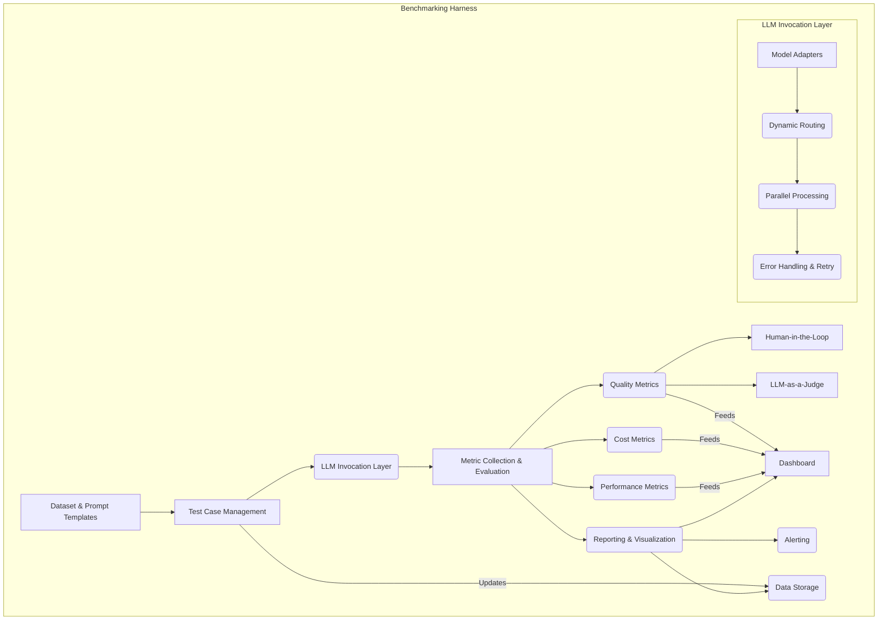

급변하는 LLM 기술 스택 환경에서 최적의 모델과 프레임워크를 선택하고 운영하기 위해서는 체계적인 벤치마킹 방법론이 필수적이다. LLM 기반 시스템의 성능(Performance)과 비용(Cost) 효율성을 극대화하기 위한 벤치마킹 하네스(Benchmarking Harness)는 단순한 테스트 도구를 넘어, 지속적인 평가와 최적화를 위한 핵심 인프라 역할을 수행한다. 이 엔트리는 벤치마킹 하네스 구축의 중요성, 핵심 구성 요소 및 실제 구현 전략을 다룬다.

## 벤치마킹 하네스의 중요성
LLM의 추론 비용과 응답 시간은 비즈니스 KPI에 직접적인 영향을 미친다. 다양한 LLM 모델(예: Claude 3.5 Sonnet, Gemini 1.5 Pro, GPT-4o)과 공급자(Provider), 그리고 서빙 인프라(Serving Infrastructure)의 옵션을 고려할 때, 특정 워크로드(Workload)에 가장 적합한 조합을 찾아내는 것은 복잡한 문제다. 벤치마킹 하네스는 이러한 복잡성을 관리하고, 데이터 기반의 의사결정을 가능하게 하여 다음을 돕는다:
*   **성능 최적화(Performance Optimization)**: Latency(응답 시간), Throughput(처리량), 그리고 TTFT(Time To First Token) 같은 지표를 측정하여 사용자 경험(User Experience)을 개선한다.
*   **비용 효율성(Cost Efficiency)**: 토큰 사용량(Token Usage) 및 API 호출 비용을 모니터링하여 예산(Budget) 내에서 최적의 모델을 선택하고, 불필요한 비용 지출을 방지한다.
*   **모델 선택 및 버전 관리(Model Selection & Versioning)**: 신규 모델이나 업데이트된 모델 버전이 출시될 때마다 기존 시스템과의 성능 및 비용 변화를 비교하여 안정적인 전환을 지원한다. 2026년에는 더 많은 Fine-tuned 모델과 Specialized 모델들이 등장할 것이므로, 이들의 비교 평가 중요성은 더욱 커질 것이다.
*   **회귀 테스트(Regression Testing)**: 프롬프트 엔지니어링(Prompt Engineering) 변경, RAG(Retrieval Augmented Generation) 전략 업데이트, 또는 기타 시스템 변경이 LLM의 성능이나 비용에 부정적인 영향을 주는지 지속적으로 검증한다.

## 벤치마킹 하네스 아키텍처
효과적인 LLM 벤치마킹 하네스는 여러 모듈로 구성된다.

### 1. 테스트 케이스 관리 (Test Case Management)
*   **데이터셋(Dataset) 생성 및 관리**: 실제 사용 시나리오를 반영하는 다양한 유형의 프롬프트(Prompt)와 기대 응답(Expected Response)을 포함하는 데이터셋을 구축한다. 이는 정량적(Quantitative) 및 정성적(Qualitative) 평가 모두에 사용된다. 2026년에는 멀티모달(Multimodal) LLM의 등장으로 이미지, 오디오 등의 입력도 관리해야 할 수 있다.
*   **프롬프트 템플릿(Prompt Template)**: 다양한 모델에 일관된 입력 형식을 제공하기 위한 템플릿 시스템. 변수 주입(Variable Injection) 및 버전 관리 기능을 포함한다.

### 2. LLM 호출 레이어 (LLM Invocation Layer)
*   **모델 어댑터(Model Adapter)**: 각 LLM 공급자(OpenAI, Anthropic, Google 등)의 API에 대한 추상화 계층(Abstraction Layer)을 제공하여, 모델 변경 시 하네스 코드 수정 없이 쉽게 전환할 수 있도록 한다.
*   **동적 라우팅(Dynamic Routing)**: 특정 조건(예: 응답 Latency, 토큰 비용, 특정 프롬프트 유형)에 따라 자동으로 최적의 모델로 요청을 라우팅하는 로직을 포함한다. 이는 2026년 실시간 성능 및 비용 최적화의 핵심 요소이다.
*   **병렬 처리(Parallel Processing)**: 동시에 여러 LLM 요청을 실행하여 Throughput을 측정하고, 벤치마킹 시간을 단축한다.
*   **오류 처리 및 재시도(Error Handling & Retry)**: API 제한(Rate Limit), 네트워크 오류(Network Error) 등에 대한 견고한 처리 로직을 구현한다.

### 3. 메트릭 수집 및 평가 (Metric Collection & Evaluation)
*   **성능 메트릭(Performance Metrics)**: Latency (total, TTFT), Throughput (TPS, Tokens per Second), Success Rate 등을 수집한다.
*   **비용 메트릭(Cost Metrics)**: 입력 토큰(Input Tokens), 출력 토큰(Output Tokens), 총 비용(Total Cost) 등을 기록한다.
*   **품질 메트릭(Quality Metrics)**:
    *   **정량적(Quantitative)**: Exact Match, F1 Score, ROUGE, BLEU (코드 생성 등 특정 태스크).
    *   **정성적(Qualitative)**: Human-in-the-Loop(HITL) 평가 시스템을 통합하여 전문가 또는 크라우드 소싱(Crowd-sourcing)을 통해 LLM 응답의 정확성, 일관성, 유용성 등을 평가한다. (예: Gemini 3.5 Flash Agentic Coding Evaluation Integration과 같은 에이전트 기반 평가)
*   **LLM 기반 평가(LLM-as-a-Judge)**: 다른 LLM을 사용하여 모델 응답의 품질을 평가하는 기법. 이는 비용 효율적인 대규모 평가에 유용하지만, 평가 LLM의 편향(Bias)을 고려해야 한다.

### 4. 리포팅 및 시각화 (Reporting & Visualization)
*   **대시보드(Dashboard)**: 수집된 모든 메트릭을 시각적으로 표현하여 LLM 성능 및 비용 추이를 한눈에 파악할 수 있도록 한다. (예: Grafana, Kibana, custom UI).
*   **알림(Alerting)**: 성능 저하, 비용 초과 등의 이상 징후(Anomaly) 발생 시 즉시 알림을 발생시킨다.
*   **데이터 저장소(Data Storage)**: 벤치마크 결과를 장기간 저장하여 추세 분석 및 과거 데이터와의 비교를 가능하게 한다 (예: PostgreSQL, TimescaleDB, S3).

```python
import httpx
import time
from typing import Dict, Any, List
import asyncio

class LLMBenchmarkingResult:
    def __init__(self, model_name: str, latency_ms: float, input_tokens: int, output_tokens: int, cost_usd: float, success: bool, error: str = None):
        self.model_name = model_name
        self.latency_ms = latency_ms
        self.input_tokens = input_tokens
        self.output_tokens = output_tokens
        self.cost_usd = cost_usd
        self.success = success
        self.error = error

    def to_dict(self):
        return {
            "model_name": self.model_name,
            "latency_ms": self.latency_ms,
            "input_tokens": self.input_tokens,
            "output_tokens": self.output_tokens,
            "cost_usd": self.cost_usd,
            "success": self.success,
            "error": self.error
        }

class LLMBenchmarkHarness:
    def __init__(self, api_keys: Dict[str, str], model_configs: Dict[str, Dict[str, Any]]):
        self.api_keys = api_keys
        self.model_configs = model_configs
        self.client = httpx.AsyncClient() # Use async client for parallel requests

    async def _call_llm_api(self, model_name: str, prompt: str, config: Dict[str, Any]) -> LLMBenchmarkingResult:
        provider = config["provider"]
        endpoint = config["endpoint"]
        api_key = self.api_keys.get(provider)
        
        if not api_key:
            return LLMBenchmarkingResult(model_name, 0, 0, 0, 0, False, f"API key for {provider} not found")

        headers = {"Authorization": f"Bearer {api_key}", "Content-Type": "application/json"}
        payload = {
            "model": config.get("model_id"),
            "messages": [{"role": "user", "content": prompt}],
            "max_tokens": config.get("max_tokens", 500),
            "temperature": config.get("temperature", 0.7)
        }
        
        start_time = time.monotonic()
        try:
            response = await self.client.post(endpoint, json=payload, headers=headers, timeout=config.get("timeout", 30))
            response.raise_for_status() # Raise an exception for 4xx or 5xx responses

            end_time = time.monotonic()
            latency_ms = (end_time - start_time) * 1000
            
            response_data = response.json()
            
            # Placeholder for token usage and cost calculation
            # In a real scenario, these would come from the API response or calculated based on pricing
            input_tokens = response_data.get("usage", {}).get("prompt_tokens", len(prompt) // 4) # Rough estimate
            output_tokens = response_data.get("usage", {}).get("completion_tokens", len(response_data.get("choices", [{}])[0].get("message", {}).get("content", "")) // 4) # Rough estimate
            cost_usd = (input_tokens * config.get("input_cost_per_token", 0)) + (output_tokens * config.get("output_cost_per_token", 0))
            
            return LLMBenchmarkingResult(model_name, latency_ms, input_tokens, output_tokens, cost_usd, True)
        except httpx.HTTPStatusError as e:
            return LLMBenchmarkingResult(model_name, (time.monotonic() - start_time) * 1000, 0, 0, 0, False, f"HTTP Error: {e.response.status_code} - {e.response.text}")
        except httpx.RequestError as e:
            return LLMBenchmarkingResult(model_name, (time.monotonic() - start_time) * 1000, 0, 0, 0, False, f"Request Error: {e}")
        except Exception as e:
            return LLMBenchmarkingResult(model_name, (time.monotonic() - start_time) * 1000, 0, 0, 0, False, f"An unexpected error occurred: {e}")

    async def run_benchmark(self, prompts: List[str]) -> Dict[str, List[LLMBenchmarkingResult]]:
        results_by_model: Dict[str, List[LLMBenchmarkingResult]] = {name: [] for name in self.model_configs}
        
        for prompt in prompts:
            tasks = []
            for model_name, config in self.model_configs.items():
                tasks.append(self._call_llm_api(model_name, prompt, config))
            
            # Run all model calls for a single prompt concurrently
            model_results = await asyncio.gather(*tasks)
            
            for result in model_results:
                results_by_model[result.model_name].append(result)
        
        await self.client.aclose() # Close the async client
        return results_by_model

# Example Usage
async def main():
    api_keys = {
        "openai": "YOUR_OPENAI_API_KEY",
        "anthropic": "YOUR_ANTHROPIC_API_KEY"
    }

    model_configs = {
        "gpt-4o": {
            "provider": "openai",
            "endpoint": "https://api.openai.com/v1/chat/completions",
            "model_id": "gpt-4o",
            "input_cost_per_token": 0.000005,  # Example cost
            "output_cost_per_token": 0.000015, # Example cost
            "max_tokens": 800,
            "temperature": 0.1
        },
        "claude-3-5-sonnet": {
            "provider": "anthropic",
            "endpoint": "https://api.anthropic.com/v1/messages",
            "model_id": "claude-3-5-sonnet-20240620",
            "input_cost_per_token": 0.000003, # Example cost
            "output_cost_per_token": 0.000015, # Example cost
            "max_tokens": 800,
            "temperature": 0.1
        }
    }

    harness = LLMBenchmarkHarness(api_keys, model_configs)
    
    test_prompts = [
        "Generate a Python function to reverse a string efficiently.",
        "Explain the concept of quantum entanglement in simple terms.",
        "Write a short story about an AI agent discovering art."
    ]

    print("Running benchmarks...")
    results = await harness.run_benchmark(test_prompts)

    for model_name, model_results in results.items():
        print(f"\n--- Results for {model_name} ---")
        total_latency = sum(r.latency_ms for r in model_results if r.success)
        total_cost = sum(r.cost_usd for r in model_results if r.success)
        successful_requests = sum(1 for r in model_results if r.success)
        
        print(f"Average Latency: {total_latency / successful_requests if successful_requests > 0 else 0:.2f} ms")
        print(f"Total Cost: ${total_cost:.6f}")
        print(f"Success Rate: {successful_requests / len(model_results) * 100:.2f}%")
        
        for r in model_results:
            if not r.success:
                print(f"  Error: {r.error}")

if __name__ == "__main__":
    asyncio.run(main())
```



## 트레이드오프

*   **종합성(Comprehensiveness) vs. 단순성(Simplicity)**
    *   **언제 좋고**: LLM 시스템의 모든 잠재적 성능 및 비용 요소를 심층적으로 이해하고 싶을 때 (예: 다양한 프롬프트 전략, 컨텍스트 길이, 모델 온도, RAG 구성 변화 등). 복잡한 프로덕션 환경에서 미세한 최적화 포인트를 찾고자 할 때 유용하다.
    *   **언제 나쁜지**: 빠른 초기 피드백이나 특정 핵심 지표에만 집중해야 할 때, 혹은 리소스(시간, 컴퓨팅 파워)가 제한적일 때 과도한 오버헤드(Overhead)를 유발할 수 있다. 하네스 구축 및 유지보수 비용이 증가한다.

*   **실시간(Real-time) 벤치마킹 vs. 배치(Batch) 벤치마킹**
    *   **언제 좋고**: 동적으로 변화하는 모델 성능, API Latency, 또는 비용 변동을 즉시 감지하여 빠른 대응이 필요할 때 (예: Dynamic Routing 시스템에서 모델 스위칭 기준). 사용자 경험에 직접적인 영향을 미치는 Latency 민감 애플리케이션에 필수적이다.
    *   **언제 나쁜지**: 일관된 환경에서 대량의 데이터를 안정적으로 처리하여 통계적으로 유의미한 결과를 도출해야 할 때, 혹은 실시간 데이터 수집 및 분석 인프라 구축 비용이 부담될 때 복잡성과 비용이 증가한다.

*   **비용(Cost) vs. 정확성(Accuracy)**
    *   **언제 좋고**: Human-in-the-Loop(HITL) 평가나 LLM-as-a-Judge와 같은 고품질 평가를 통해 모델 응답의 미묘한 차이까지 정확하게 평가하여 시스템의 신뢰성을 극대화하고자 할 때. 특히 안전(Safety)이나 비즈니스 크리티컬(Business-Critical)한 애플리케이션에 중요하다.
    *   **언제 나쁜지**: 초기 개발 단계에서 빠른 반복(Iteration)이 중요하거나, 예산 제약이 심할 때, 혹은 상대적으로 품질 민감도가 낮은 태스크(Task)의 경우, 평가 비용이 모델 운영 비용을 초과할 수 있다.

*   **모델 애그노스틱(Model Agnostic) 하네스 vs. 특정 모델 최적화**
    *   **언제 좋고**: 다양한 LLM 모델과 공급자를 유연하게 비교하고 전환할 수 있는 범용적인 인프라를 구축하고자 할 때. Vendor Lock-in을 피하고, 시장의 최신 모델을 신속하게 도입해야 하는 상황에 적합하다.
    *   **언제 나쁜지**: 특정 모델의 독점적인 기능(예: 특정 도구 사용, 구조화된 출력 포맷)을 최대한 활용하여 성능을 극대화해야 할 때, 범용적인 접근 방식은 해당 모델의 잠재력을 완전히 발휘하지 못하게 할 수 있다.

## 실전 체크리스트

*   - [x] **벤치마킹 지표 정의**: Latency (TTFT 포함), Throughput, Input/Output Token Count, API Cost, Success Rate, 그리고 필요한 경우 ROUGE/BLEU 점수 등 핵심 벤치마킹 지표가 명확하게 정의되었는가?
*   - [x] **테스트 데이터셋 대표성**: 벤치마킹에 사용될 테스트 데이터셋이 실제 프로덕션 사용 시나리오와 사용자 질의 분포를 충분히 대표하는가? (예: 다양한 길이, 복잡도, 도메인 포함 여부)
*   - [x] **다중 LLM 및 버전 관리**: OpenAI, Anthropic, Google, 혹은 온프레미스 모델 등 다양한 LLM 공급자와 모델 버전을 쉽게 전환하고 비교 평가할 수 있는 유연한 아키텍처를 갖추고 있는가?
*   - [x] **비용 모니터링 및 알림**: 각 벤치마크 실행별 비용을 정확하게 추적하고, 설정된 예산 임계값 초과 시 자동 알림을 받을 수 있는 시스템이 구축되었는가?
*   - [x] **결과 시각화 및 리포팅**: 벤치마크 결과가 직관적인 대시보드 형태로 시각화되며, 정기적으로 이해관계자에게 자동 리포팅되는 파이프라인이 존재하는가?
*   - [x] **프롬프트 및 컨텍스트 영향 분석**: 프롬프트의 변경(길이, 복잡성)이나 컨텍스트 윈도우(Context Window) 사용 방식의 변화가 LLM 성능과 비용에 미치는 영향을 측정하고 분석할 수 있는가?
*   - [x] **견고한 오류 처리**: API Rate Limit, 네트워크 장애, 모델 응답 포맷 오류 등 예상 가능한 오류 상황에 대한 견고한 재시도(Retry) 및 로깅(Logging) 메커니즘이 벤치마킹 하네스에 통합되어 있는가?