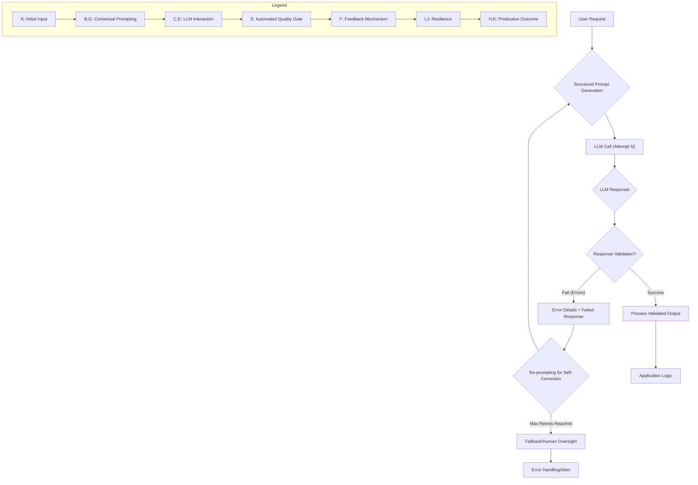

LLM(Large Language Model) 기반 애플리케이션의 신뢰성은 프롬프트의 품질과 응답의 유효성에 직접적으로 좌우됩니다. 단순한 프롬프트 엔지니어링만으로는 예측 불가능한 LLM의 특성을 완전히 제어하기 어렵고, 응답 유효성 검증만으로는 비효율적인 LLM 호출 또는 반복적인 오류를 야기할 수 있습니다. 따라서 이 둘을 유기적으로 통합하는 패턴은 LLM 시스템의 안정성과 정확성을 극대화하는 핵심 전략입니다.

### 통합 패턴의 필요성
LLM은 본질적으로 통계적 모델이며, 항상 예상된 형식과 내용을 생성한다는 보장이 없습니다. 특히 중요한 비즈니스 로직이나 시스템 통합 시 LLM의 출력은 엄격한 기준을 충족해야 합니다. 프롬프트 엔지니어링은 LLM이 원하는 형태의 출력을 생성하도록 유도하지만, 완벽하지 않습니다. 이때 응답 유효성 검증 레이어를 도입하여 LLM의 출력을 검사하고, 문제가 발생할 경우 다시 LLM에 피드백하여 자체 수정(self-correction)을 유도하는 통합된 접근 방식이 필수적입니다. 이는 **Closed-Loop Automation**의 한 형태로, LLM을 시스템의 신뢰할 수 있는 컴포넌트로 만듭니다.

### 핵심 개념 및 동작 방식
이 패턴은 주로 다음 단계로 구성됩니다:

1.  **구조화된 프롬프트 생성 (Structured Prompt Generation)**: LLM에게 명확하고 구체적인 지시와 함께, 기대하는 응답의 형식(JSON, XML, YAML 등)을 명시합니다. 스키마 정의, Few-shot 예제, 제약 조건 등을 포함하여 LLM이 올바른 형태의 출력을 생성하도록 강력하게 유도합니다.
2.  **LLM 응답 생성 (LLM Response Generation)**: LLM이 프롬프트에 따라 응답을 생성합니다.
3.  **응답 유효성 검증 (Response Validation)**: LLM이 생성한 응답이 사전에 정의된 스키마, 비즈니스 규칙, 안전 필터 등을 충족하는지 검사합니다. Python의 Pydantic, JavaScript의 Zod 같은 라이브러리를 활용하여 구조적 유효성을, 추가적인 로직을 통해 의미론적 유효성을 검증할 수 있습니다.
4.  **재프롬프팅/수정 루프 (Re-prompting/Correction Loop)**: 유효성 검증에 실패할 경우, LLM에게 원본 프롬프트, 실패한 응답, 실패 이유(검증 오류 메시지)를 포함한 새로운 프롬프트를 전송하여 자체 수정을 요청합니다. 이 과정은 정해진 횟수만큼 반복될 수 있습니다.
5.  **휴먼 개입/대체 메커니즘 (Human Oversight/Fallback)**: 재프롬프팅 루프가 모두 실패하거나 예상치 못한 오류가 발생할 경우, 로깅, 알림, 기본값 사용, 휴먼 검토 프로세스 트리거 등의 대체 메커니즘을 작동시킵니다.

이 과정은 `Harness Engineering` 관점에서 LLM 호출을 단순한 블랙박스가 아닌, 오류를 감지하고 복구할 수 있는 `Reliable Orchestration Layer`의 일부로 간주합니다.

### 코드 예제 (Python with Pydantic)

다음 Python 코드는 사용자 요청을 기반으로 JSON 형태의 보고서를 생성하고, 이를 Pydantic 스키마로 검증하며, 실패 시 LLM에 자체 수정을 요청하는 패턴을 보여줍니다.

```python
import os
import json
from typing import List
from pydantic import BaseModel, ValidationError
from openai import OpenAI

# 1. 응답 유효성 검증을 위한 Pydantic 스키마 정의
class ReportSection(BaseModel:
    title: str
    content: str

class FinancialReport(BaseModel:
    report_title: str
    date: str
    sections: List[ReportSection]
    summary: str

# OpenAI 클라이언트 초기화 (API 키는 환경 변수에서 로드)
client = OpenAI(api_key=os.environ.get("OPENAI_API_KEY"))

def call_llm_with_validation(user_prompt: str, max_retries: int = 3) -> dict or None:
    system_prompt = (
        "You are an AI assistant that generates financial reports in JSON format. "
        "Ensure the output strictly adheres to the provided JSON schema. "
        "If there are any errors in the format, you will be prompted to correct them. "
        "The JSON should represent a FinancialReport with report_title, date, sections (list of title/content), and a summary."
        "Example: {\"report_title\": \"Q1 Earnings Report\", \"date\": \"2026-03-31\", \"sections\": [{\"title\": \"Revenue\", \"content\": \"...\"}], \"summary\": \"...\"}"
    )

    messages = [
        {"role": "system", "content": system_prompt},
        {"role": "user", "content": user_prompt}
    ]

    for attempt in range(max_retries):
        try:
            print(f"--- LLM Call Attempt {attempt + 1}/{max_retries} ---")
            # 2. LLM 호출
            response = client.chat.completions.create(
                model="gpt-4o", # 2026년 최신 모델 사용 예시
                messages=messages,
                response_format={"type": "json_object"} # JSON 형식 강제
            )
            llm_output_str = response.choices[0].message.content
            print("Raw LLM Output:\n" + llm_output_str)
            llm_output_json = json.loads(llm_output_str)

            # 3. Pydantic을 이용한 유효성 검증
            validated_report = FinancialReport(**llm_output_json)
            print("\n--- Validation Successful ---")
            return validated_report.model_dump() # 유효성 검증 통과한 데이터 반환

        except json.JSONDecodeError as e:
            error_msg = f"JSON decoding failed: {e}"
            print(f"Validation Failed: {error_msg}")
            # 4. 재프롬프팅을 위한 메시지 추가
            messages.append({"role": "assistant", "content": llm_output_str})
            messages.append({"role": "user", "content": f"The previous response was not valid JSON. Please correct it to be a valid JSON object. Error: {error_msg}"})
        except ValidationError as e:
            error_msg = f"Pydantic validation failed: {e.errors()}"
            print(f"Validation Failed: {error_msg}")
            # 4. 재프롬프팅을 위한 메시지 추가
            messages.append({"role": "assistant", "content": llm_output_str})
            messages.append({"role": "user", "content": f"The previous JSON output failed schema validation. Please correct the JSON to match the FinancialReport schema exactly. Specific errors: {json.dumps(e.errors())}"})
        except Exception as e:
            error_msg = f"An unexpected error occurred: {e}"
            print(f"Validation Failed: {error_msg}")
            messages.append({"role": "assistant", "content": llm_output_str})
            messages.append({"role": "user", "content": f"An unexpected error occurred during processing. Please ensure your JSON is perfectly formed and adheres to the schema. Error: {error_msg}"})

    # 5. 모든 재시도 실패 시
    print(f"\n--- Max retries ({max_retries}) reached. LLM response could not be validated. ---")
    return None

# 사용 예시
if __name__ == "__main__":
    # os.environ["OPENAI_API_KEY"] = "YOUR_API_KEY"
    if not os.environ.get("OPENAI_API_KEY"):
        print("Please set the OPENAI_API_KEY environment variable.")
    else:
        prompt = "Generate a quarterly financial report for a tech startup, highlighting revenue, expenses, and profit for Q4 2025. Include a summary of key takeaways."
        report = call_llm_with_validation(prompt)

        if report:
            print("\nSuccessfully generated and validated report:")
            print(json.dumps(report, indent=2, ensure_ascii=False))
        else:
            print("Failed to generate a valid report.")
```

### Mermaid 다이어그램: 통합 프롬프트-검증 흐름



### 2026년 트렌드 및 진화 방향

1.  **동적 스키마/가이드라인 생성**: 단순히 정적 스키마를 사용하는 것을 넘어, 런타임에 사용자 요청의 맥락이나 이전 LLM 응답을 기반으로 동적으로 스키마나 검증 규칙을 생성하고 적용하는 패턴이 부상하고 있습니다. 이를 통해 더 유연하고 적응적인 유효성 검증이 가능합니다.
2.  **Self-Correction Agent의 진화**: 재프롬프팅 루프가 더욱 정교해져, 단순 오류 메시지 전달을 넘어 `Reasoning Path`나 `Tool Use` 결과 등 LLM의 내부 사고 과정을 활용하여 오류 원인을 진단하고 수정하는 `Agentic Self-Correction`이 보편화될 것입니다.
3.  **Cross-Model Validation**: 단일 LLM의 응답을 다른 LLM(또는 더 작고 저렴한 검증 특화 모델)이 검증하는 방식이 도입되어, 검증의 정확성을 높이고 비용을 최적화합니다.
4.  **Explainable Validation Failures**: 유효성 검증 실패 시 단순히 오류 메시지를 제공하는 것을 넘어, 왜 실패했는지, 어떤 부분이 문제인지에 대한 상세한 `Explainable AI` 분석을 제공하여 개발자와 운영자가 문제를 빠르게 이해하고 해결할 수 있도록 돕습니다.
5.  **Multi-Modal Output Validation**: 텍스트 외에 이미지, 오디오, 비디오 등 다양한 모달리티의 출력에 대한 복합적인 유효성 검증 패턴이 중요해질 것입니다.

## 트레이드오프

*   **정확성 및 안정성 향상 vs Latency 증가**: 통합 패턴은 LLM 응답의 신뢰성을 크게 높이지만, 유효성 검증 및 재시도 루프로 인해 응답 Latency가 증가합니다. 크리티컬한 비즈니스 로직이나 데이터 무결성이 중요한 경우(좋음)에 적합하며, 실시간 사용자 인터랙션이 매우 중요한 저지연 서비스(나쁨)에는 신중한 최적화가 필요합니다.
*   **개발 복잡도 증가 vs 유지보수 비용 감소**: 초기 설정 및 구현에 더 많은 코드(스키마 정의, 검증 로직, 재시도 핸들링)가 필요하여 개발 복잡도가 증가합니다. 하지만, 오류 발생 시 디버깅 시간 감소, 예측 불가능한 LLM 응답으로 인한 버그 감소 등 장기적인 유지보수 비용은 절감됩니다. 프로덕션 환경에서 견고함이 요구되는 시스템(좋음)에 적합하며, 프로토타이핑이나 POC 단계(나쁨)에서는 과도할 수 있습니다.
*   **LLM API 호출 비용 증가 vs 오류로 인한 비즈니스 손실 방지**: 유효성 검증 실패 시 재시도 과정에서 LLM API 호출 횟수가 증가하여 비용이 상승할 수 있습니다. 이는 재시도로 인한 비즈니스 손실(데이터 오염, 잘못된 정보 제공 등)을 방지하는 것이 더 중요한 경우(좋음)에 감수할 만한 트레이드오프입니다. 비용 효율이 최우선이고 오류의 영향이 미미한 경우(나쁨)에는 다른 접근 방식이 더 나을 수 있습니다.
*   **스키마 정의의 유연성 vs 엄격성**: Pydantic과 같은 라이브러리를 사용하면 응답 스키마를 엄격하게 정의할 수 있어(좋음) LLM이 특정 형식에 따르도록 강제합니다. 그러나 LLM의 창의성이나 유연한 응답이 중요한 시나리오(나쁨)에서는 스키마가 오히려 제약이 될 수 있습니다. 적절한 스키마 설계와 더불어 `allow_extra` 같은 옵션으로 균형을 맞출 수 있습니다.

## 실전 체크리스트

LLM 호출 시 프롬프트 엔지니어링과 응답 유효성 검증 통합 패턴을 프로젝트에 적용할 때 다음 항목을 검증합니다.

- [ ] **명확한 스키마 정의**: LLM이 생성할 응답에 대한 JSON, XML 등 구조화된 스키마를 확정하고 문서화했습니다. (예: Pydantic 모델, OpenAPI 스키마)
- [ ] **프롬프트 내 스키마 포함**: LLM 프롬프트에 기대하는 응답 스키마(또는 그에 준하는 명확한 지시)를 명시적으로 포함하고, Few-shot 예제를 제공했습니다.
- [ ] **자동화된 유효성 검증 구현**: LLM 응답을 파싱하여 정의된 스키마에 따라 유효성을 검증하는 자동화된 로직이 구현되었습니다. (예: `json.loads` 및 Pydantic `parse_obj` 또는 `validate`)
- [ ] **재시도 및 재프롬프팅 로직**: 유효성 검증 실패 시, 오류 메시지와 실패한 응답을 포함하여 LLM에 재수정을 요청하는 재프롬프팅 로직이 `최소 2회, 최대 3~4회`로 구현되었습니다.
- [ ] **최대 재시도 횟수 및 Fallback 처리**: 모든 재시도가 실패할 경우, 시스템의 안정성을 보장하기 위한 Fallback 메커니즘(예: 기본값 반환, 에러 로깅, 사용자에게 알림, 수동 개입 트리거)이 명확히 정의되고 구현되었습니다.
- [ ] **성능 및 비용 모니터링**: 유효성 검증 및 재시도 루프가 Latency와 LLM API 호출 비용에 미치는 영향을 측정하고 모니터링하는 시스템(예: `LLM Observability Tool`)이 구축되었습니다.
- [ ] **지속적인 스키마 및 프롬프트 개선**: 실제 LLM 응답 데이터를 기반으로 스키마 정의와 프롬프트 엔지니어링 전략을 주기적으로 검토하고 개선하는 프로세스가 수립되었습니다.