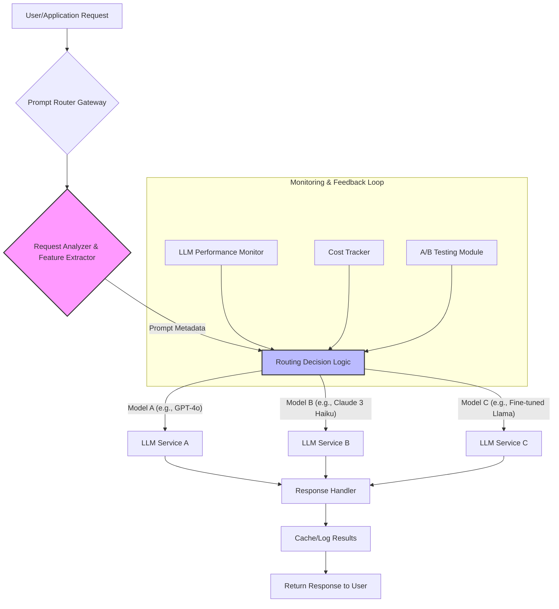

LLM (Large Language Model) 기반 애플리케이션의 복잡성이 증가하면서, 단일 모델에 의존하는 것은 성능, 비용, 안정성 측면에서 한계를 드러냅니다. 다양한 LLM 모델과 서비스(예: GPT-4o, Claude 3 Opus, Gemini, Llama 3)를 통합할 때 각 모델의 고유한 강점과 비용 구조를 최적화하는 기법이 필수적입니다. 프롬프트 라우팅(Prompt Routing)은 이러한 갭을 해소하고, 특정 요구사항에 가장 적합한 LLM을 동적으로 선택하여 애플리케이션의 전반적인 효율성을 극대화하는 핵심 전략입니다.

## 프롬프트 라우팅의 필요성
LLM 시장은 빠르게 진화하고 있으며, 각 모델은 특정 작업에 특화된 강점을 가집니다. 예를 들어, GPT-4o는 멀티모달 기능과 범용 추론에 강하고, Claude 3 Opus는 장문 분석 및 복잡한 추론에, Llama 3는 온프레미스 배포 및 비용 효율성에 유리합니다. 이러한 모델들을 고정적으로 사용하는 대신, 들어오는 프롬프트의 특성을 분석하여 가장 적합한 모델로 요청을 라우팅하는 것은 다음과 같은 이점을 제공합니다.

*   **비용 효율성 (Cost Efficiency)**: 고성능이지만 고비용인 모델은 복잡한 작업에만 사용하고, 간단한 작업에는 저비용 모델을 사용하여 전체 비용을 절감합니다.
*   **성능 최적화 (Performance Optimization)**: 각 작업에 최적화된 모델을 사용하여 응답 지연 시간(Latency)을 줄이고, 결과 품질(Quality)을 향상시킵니다.
*   **신뢰성 및 가용성 (Reliability and Availability)**: 특정 모델의 서비스 중단이나 속도 저하 시 다른 모델로 자동 페일오버(Failover)하여 서비스 연속성을 확보합니다.
*   **확장성 (Scalability)**: 다양한 모델을 유연하게 활용하여 트래픽 증가에 효과적으로 대응할 수 있습니다.

## 고급 프롬프트 라우팅 전략

### 1. 규칙 기반 라우팅 (Rule-based Routing)
가장 기본적인 형태로, 미리 정의된 규칙(예: 키워드, 프롬프트 길이, 사용자 역할)에 따라 모델을 선택합니다. 구현이 간단하며 예측 가능성이 높습니다.

```python
import openai
import anthropic

# Mock LLM API clients for demonstration
class MockOpenAIChat:
    def create(self, model, messages, **kwargs):
        if model == "gpt-4o":
            return {"choices": [{"message": {"content": f"[GPT-4o] {messages[-1]['content']}"}}]}
        elif model == "gpt-3.5-turbo":
            return {"choices": [{"message": {"content": f"[GPT-3.5-Turbo] {messages[-1]['content']}"}}]}
        raise ValueError("Unknown OpenAI model")

class MockAnthropicMessages:
    def create(self, model, messages, **kwargs):
        if model == "claude-3-opus-20240229":
            return {"content": [{"text": f"[Claude Opus] {messages[-1]['content']}"}]}
        elif model == "claude-3-haiku-20240307":
            return {"content": [{"text": f"[Claude Haiku] {messages[-1]['content']}"}]}
        raise ValueError("Unknown Anthropic model")

openai_client = MockOpenAIChat()
anthropic_client = MockAnthropicMessages()

def route_prompt(prompt: str, user_context: dict = None) -> str:
    """
    Analyzes a prompt and routes it to the most suitable LLM based on rules.
    """
    user_context = user_context or {}
    message = [{"role": "user", "content": prompt}]

    # Rule 1: Coding tasks go to GPT-4o for its code generation capabilities
    if any(keyword in prompt.lower() for keyword in ["code", "python", "javascript", "refactor"]):
        print("DEBUG: Routing to GPT-4o for coding task.")
        response = openai_client.create(model="gpt-4o", messages=message)
        return response["choices"][0]["message"]["content"]

    # Rule 2: High complexity or creative writing tasks to Claude Opus
    if "creative writing" in user_context.get("task_type", "") or len(prompt.split()) > 300:
        print("DEBUG: Routing to Claude Opus for complex/creative task.")
        response = anthropic_client.create(model="claude-3-opus-20240229", messages=message, max_tokens=1000)
        return response["content"][0]["text"]

    # Rule 3: Short, simple questions to GPT-3.5-Turbo for cost-effectiveness
    if len(prompt.split()) < 50:
        print("DEBUG: Routing to GPT-3.5-Turbo for short questions.")
        response = openai_client.create(model="gpt-3.5-turbo", messages=message)
        return response["choices"][0]["message"]["content"]

    # Default: Balanced model like Claude Haiku
    print("DEBUG: Routing to Claude Haiku as default.")
    response = anthropic_client.create(model="claude-3-haiku-20240307", messages=message, max_tokens=500)
    return response["content"][0]["text"]

# Example Usage
print(route_prompt("Write a Python function to check if a number is prime."))
print(route_prompt("Summarize the latest AI trends in 2026 in one paragraph."))
print(route_prompt("Brainstorm 10 innovative features for a new sustainable urban planning app.", user_context={"task_type": "creative writing"}))
print(route_prompt("What is the capital of South Korea?"))

# Long prompt example to trigger Claude Opus
long_prompt = """
Detailed analysis of the geopolitical impacts of global warming in the next 50 years, focusing on resource scarcity, migration patterns, and potential international conflicts. Discuss the role of renewable energy adoption and international cooperation in mitigating these effects. Provide a comprehensive overview of potential scenarios and their probabilities.
"""
print(route_prompt(long_prompt))
```

### 2. 모델 기반 라우팅 (Model-based Routing)
규칙 기반 라우팅의 한계를 넘어, 경량 LLM 또는 별도의 분류 모델(Classifier Model)을 사용하여 들어오는 프롬프트의 의도(Intent), 복잡도(Complexity), 작업 유형 등을 예측하고, 그 결과에 따라 최종 LLM을 선택합니다. 이는 더욱 정교하고 유연한 라우팅을 가능하게 합니다.

*   **경량 LLM (Lightweight LLM) 사용**: 비용 효율적인 소형 LLM(예: GPT-3.5-Turbo, Llama 3 8B)에게 프롬프트의 카테고리를 분류하거나, 특정 메타데이터를 추출하도록 지시합니다. 이 정보는 이후 라우팅 결정에 활용됩니다.
*   **컨텍스트 임베딩 (Contextual Embedding) 및 벡터 검색 (Vector Search)**: 들어오는 프롬프트를 임베딩으로 변환하고, 미리 정의된 '모델 페르소나' 또는 '작업 유형' 임베딩과 비교하여 가장 유사한 모델로 라우팅합니다. 예를 들어, `faiss`나 `pgvector` 같은 벡터 데이터베이스를 활용할 수 있습니다.

### 3. 동적 로드 밸런싱 및 레이턴시-어웨어 라우팅 (Dynamic Load Balancing & Latency-aware Routing)
실시간으로 각 LLM 서비스의 로드(Load), 응답 시간(Latency), 에러율(Error Rate)을 모니터링하여 가장 여유롭거나 빠르게 응답할 수 있는 모델로 요청을 분산합니다. 이는 고가용성(High Availability) 및 최적의 사용자 경험을 보장합니다.

### 4. 비용-성능 최적화 라우팅 (Cost-Performance Optimized Routing)
모델의 성능 지표(예: 정확도, 토큰 생성 속도)와 비용(예: 토큰당 가격)을 함께 고려하여 라우팅 정책을 결정합니다. 긴급하고 중요한 요청에는 고성능/고비용 모델을, 시간에 민감하지 않거나 품질 허용 범위가 넓은 요청에는 저비용 모델을 할당합니다.

### 5. 하이브리드 라우팅 (Hybrid Routing)
위 전략들을 조합하여 사용합니다. 예를 들어, 1차적으로 규칙 기반으로 대략적인 카테고리를 분류한 후, 2차적으로 경량 LLM이 복잡도를 평가하고, 최종적으로 실시간 로드 밸런싱을 통해 모델을 선택하는 방식입니다.

## 프롬프트 라우팅 시스템 아키텍처
프롬프트 라우팅은 일반적으로 LLM 서비스 앞에 위치하는 프록시(Proxy) 또는 게이트웨이(Gateway) 형태로 구현됩니다.



## 2026년 트렌드: 적응형 및 에이전틱 라우팅
2026년에는 프롬프트 라우팅이 더욱 고도화될 것으로 예상됩니다. 멀티모달 프롬프트를 위한 라우팅 (텍스트, 이미지, 음성 등), 에이전틱(Agentic) 시스템 내에서 특정 도구(Tool) 사용에 최적화된 LLM을 선택하는 라우팅, 그리고 지속적인 학습을 통해 라우팅 정책을 스스로 개선하는 적응형 라우팅(Adaptive Routing) 기법이 주목받을 것입니다. 특히, 동적 컨텍스트와 에이전트의 현재 목표에 따라 LLM을 유연하게 전환하는 능력은 복잡한 AI 워크플로우에서 필수적인 요소가 될 것입니다.

## 트레이드오프

*   **복잡성 증가 vs. 최적화 이점**: 고급 라우팅 로직을 구현하면 시스템의 복잡성이 증가합니다. 작은 규모의 애플리케이션이나 단일 모델로도 충분한 경우, 과도한 라우팅 도입은 유지보수 비용만 높일 수 있습니다. 반면, 다수의 모델과 서비스가 통합되는 대규모 프로덕션 환경에서는 성능과 비용 최적화에 필수적입니다.
*   **라우팅 오버헤드 vs. LLM 지연 시간 감소**: 라우팅 결정을 내리는 과정(예: 경량 LLM 호출, 특징 추출)에서 추가적인 지연 시간이 발생할 수 있습니다. 이미 낮은 지연 시간이 요구되는 상황에서는 이 오버헤드가 전체 응답 시간에 부정적인 영향을 줄 수 있습니다. 그러나 복잡하고 긴 프롬프트를 비효율적인 모델로 보내는 것보다 라우팅 오버헤드를 감수하고 최적 모델을 선택하는 것이 전체 지연 시간을 줄일 수 있습니다.
*   **초기 설정 및 지속적인 튜닝 vs. '설정 후 망각'**: 규칙 기반 라우팅은 초기 설정이 비교적 간단하지만, 모델 기반 라우팅은 분류 모델 훈련 및 지속적인 데이터 갱신이 필요합니다. 시장에 새로운 모델이 등장하거나 기존 모델의 성능/비용이 변동할 때마다 라우팅 로직을 업데이트해야 하는 운영 부담이 발생합니다. 정기적인 모델 성능 및 비용 모니터링 시스템이 구축되어 있다면 이러한 부담을 상쇄하고 지속적인 최적화를 이룰 수 있습니다.
*   **모델 다양성 및 API 표준화 vs. 공급업체 종속성**: 여러 LLM API를 통합하려면 각기 다른 API 스펙을 추상화하는 계층(Abstraction Layer)이 필요합니다. 이는 개발 초기 단계의 노력을 증가시키지만, 특정 LLM 공급업체에 대한 종속성을 줄이고 유연성을 확보하는 장점이 있습니다. 특정 클라우드 벤더의 통합 프레임워크를 사용하면 초기 통합은 쉽지만, 벤더 종속성이 심화될 수 있습니다.

## 실전 체크리스트

LLM 기반 애플리케이션에 고급 프롬프트 라우팅을 적용하기 위한 실전 체크리스트입니다.

*   [ ] **라우팅 목표 정의**: 애플리케이션의 핵심 목표(예: 비용 30% 절감, 응답 시간 20% 단축, 특정 작업 정확도 5% 향상)를 명확히 정의했는가?
*   [ ] **프롬프트 특성 분석**: 현재 들어오는 프롬프트 데이터를 분석하여 의도, 길이, 복잡도, 키워드 등 라우팅에 활용할 수 있는 주요 특성을 식별했는가?
*   [ ] **모델 역량 매핑**: 사용 가능한 각 LLM 모델의 강점(예: 코딩, 창의적 글쓰기, 사실 기반 질문)과 비용, 성능(Latency, Throughput)을 파악하고 라우팅 규칙에 매핑했는가?
*   [ ] **라우팅 게이트웨이 구현**: 모든 LLM 요청이 통과하는 중앙화된 라우팅 게이트웨이 또는 프록시를 설계하고 구현했는가?
*   [ ] **성능 및 비용 모니터링**: 각 라우팅 정책과 LLM 모델별로 실제 비용과 성능(정확도, Latency, 에러율)을 실시간으로 추적하는 모니터링 시스템을 구축했는가?
*   [ ] **페일오버 및 폴백 전략**: 특정 LLM 서비스가 지연되거나 장애 발생 시 다른 모델로 자동 전환되는 페일오버(Failover) 및 폴백(Fallback) 메커니즘을 구현했는가?
*   [ ] **A/B 테스트 프레임워크**: 새로운 라우팅 정책이나 모델 도입 시 기존 시스템에 미치는 영향을 측정하고 검증하기 위한 A/B 테스트 환경을 갖추었는가?