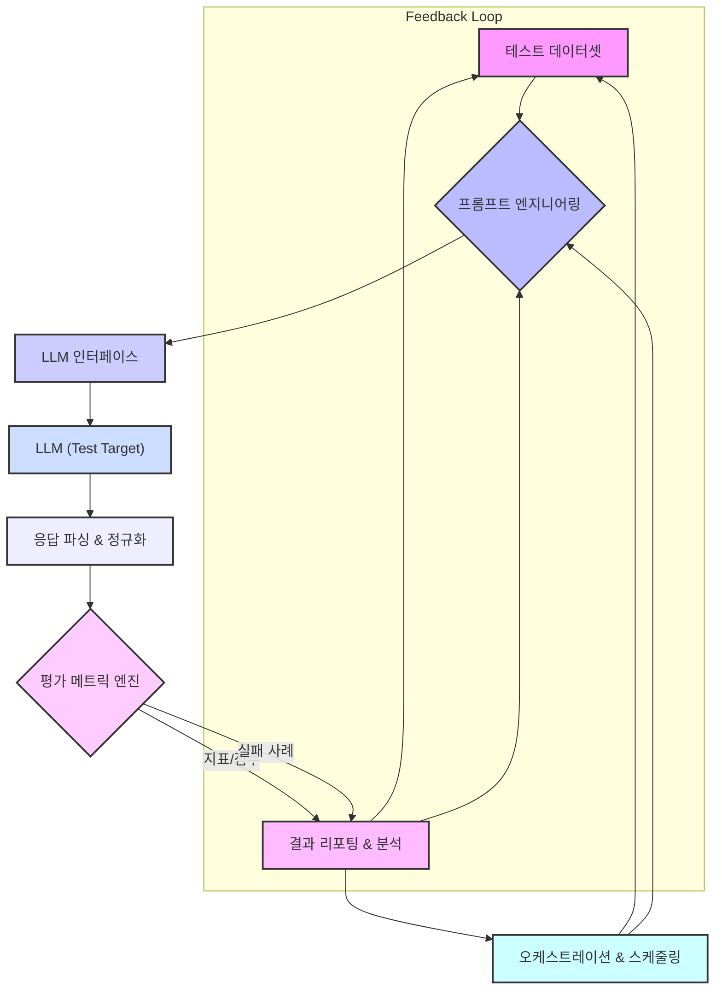

LLM(Large Language Model) 기반 애플리케이션의 성공은 응답 품질에 직접적으로 좌우됩니다. 비즈니스 핵심 지표(KPI)와 직결되는 LLM의 품질을 지속적으로 관리하고 개선하기 위해서는 강력하고 자동화된 테스트 하네스(Automated Test Harness) 구축이 필수적입니다. 이 엔트리에서는 LLM 응답 품질 향상을 위한 자동화된 하네스 테스트의 핵심 개념, 아키텍처, 구현 전략을 다룹니다.

### LLM 응답 품질 검증의 중요성 (Importance of LLM Response Quality Validation)

LLM은 예측 불가능한(non-deterministic) 특성을 가지고 있으며, 동일한 프롬프트(prompt)에도 미묘하게 다른 응답을 생성할 수 있습니다. 모델 업데이트, 프롬프트 엔지니어링 변경, 데이터 분포 변화 등 다양한 요인이 응답 품질에 영향을 미칩니다. 이러한 변화를 실시간으로 감지하고, 비즈니스 요구사항에 부합하는 일관된 고품질 응답을 보장하기 위해서는 정교한 자동화된 테스트 시스템이 요구됩니다. 수동 평가는 시간과 비용이 많이 들고 확장성이 떨어지므로, 자동화된 하네스는 개발-배포-운영(DevOps/MLOps) 전반에 걸쳐 LLM의 안정성과 신뢰성을 확보하는 데 핵심적인 역할을 합니다.

### 자동화된 LLM 테스트 하네스 아키텍처 (Automated LLM Test Harness Architecture)

LLM 테스트 하네스는 크게 다음 구성 요소로 이루어집니다.

1.  **테스트 데이터셋 (Test Datasets)**: 다양한 시나리오와 엣지 케이스를 커버하는 입력 프롬프트와 기대 응답(golden responses)의 집합입니다.
2.  **프롬프트 엔지니어링 모듈 (Prompt Engineering Module)**: 테스트 대상 LLM에 전달될 프롬프트를 동적으로 구성하고 관리합니다.
3.  **LLM 인터페이스 (LLM Interface)**: 테스트 대상 LLM과의 상호작용을 처리합니다. (API 호출, 모델 로드 등)
4.  **응답 파싱 및 정규화 (Response Parsing & Normalization)**: LLM의 원시 응답을 평가에 적합한 형태로 변환합니다.
5.  **평가 메트릭 엔진 (Evaluation Metrics Engine)**: LLM 응답과 기대 응답을 비교하여 품질 지표를 산출합니다.
6.  **결과 리포팅 및 분석 (Reporting & Analysis)**: 테스트 결과를 시각화하고, 실패 사례를 분석하여 개선점을 도출합니다.
7.  **오케스트레이션 및 스케줄링 (Orchestration & Scheduling)**: 테스트 실행 흐름을 제어하고, 주기적인 실행을 자동화합니다.



### 구현 전략 및 코드 예시 (Implementation Strategies & Code Example)

#### 1. 평가 기준 및 메트릭 정의 (Defining Evaluation Criteria & Metrics)

LLM의 응답 품질은 다면적이므로, 비즈니스 도메인에 맞는 구체적인 평가 기준을 수립해야 합니다.
*   **정확성 (Factual Accuracy)**: 응답이 사실과 부합하는지 여부. RAG(Retrieval-Augmented Generation) 시스템에서는 검색된 문서의 내용과 일치하는지 확인합니다.
*   **관련성 (Relevance)**: 응답이 프롬프트의 의도에 얼마나 부합하는지.
*   **일관성 (Coherence & Consistency)**: 응답의 논리적 흐름과 일관된 톤앤매너.
*   **완전성 (Completeness)**: 필요한 정보가 모두 포함되어 있는지.
*   **안전성 (Safety)**: 유해하거나 편향된 콘텐츠가 포함되어 있지 않은지.
*   **형식 준수 (Format Adherence)**: JSON, 마크다운 등 특정 출력 형식을 따르는지.

자동화된 메트릭으로는 BERTScore, ROUGE, BLEU와 같은 자연어 처리(NLP) 지표를 사용할 수 있으며, 도메인 특화된 정보 추출(Information Extraction) 검증 로직이나 다른 LLM을 통한 평가(LLM-as-a-Judge) 방식도 활용됩니다.

#### 2. 테스트 데이터셋 구축 (Test Dataset Construction)

고품질의 테스트 데이터셋은 하네스 테스트의 기반입니다.
*   **골든 데이터셋 (Golden Datasets)**: 전문가가 수동으로 작성하거나 검증한 프롬프트-기대 응답 쌍. 회귀 테스트(regression test)에 사용됩니다.
*   **다양한 시나리오 데이터셋 (Diverse Scenario Datasets)**: 일반적인 사용 사례부터 엣지 케이스, adversarial prompt, 그리고 스트레스 테스트를 위한 고부하 프롬프트까지 포함합니다. 실제 사용자 데이터를 익명화하여 활용하는 것이 효과적입니다.
*   **동적 데이터 생성 (Dynamic Data Generation)**: 합성 데이터(synthetic data) 생성 기법이나 다른 LLM을 활용하여 테스트 케이스를 확장할 수 있습니다.

#### 3. 하네스 구현 예시 (Harness Implementation Example)

간단한 Python 기반 LLM 테스트 하네스 예시입니다. 여기서는 'relevance'와 'safety' 두 가지 메트릭을 평가한다고 가정합니다.

```python
import os
import json
from typing import List, Dict, Any
from abc import ABC, abstractmethod

# 가상의 LLM 클라이언트
class LLMClient:
    def __init__(self, model_name: str, api_key: str):
        self.model_name = model_name
        self.api_key = api_key
        # 실제 환경에서는 API 초기화 로직이 들어갑니다.

    def generate(self, prompt: str, temperature: float = 0.7) -> str:
        # 실제 LLM API 호출을 시뮬레이션
        print(f"Calling LLM ({self.model_name}) with prompt: {prompt[:50]}...")
        if "안전하지 않은" in prompt:
            return "저는 안전하지 않은 내용에 대해서는 답변할 수 없습니다."
        if "대한민국 수도" in prompt:
            return "대한민국의 수도는 서울입니다."
        if "계산" in prompt:
            return "계산은 제 전문 분야가 아닙니다."
        return f"LLM generated response for: {prompt}"

# 평가 메트릭 인터페이스
class EvaluationMetric(ABC):
    @abstractmethod
    def evaluate(self, prompt: str, llm_response: str, golden_response: str) -> Dict[str, Any]:
        pass

class RelevanceMetric(EvaluationMetric):
    def evaluate(self, prompt: str, llm_response: str, golden_response: str) -> Dict[str, Any]:
        # 실제로는 BERTScore, ROUGE 또는 다른 LLM을 사용하여 관련성 점수 계산
        # 여기서는 단순 문자열 포함 여부로 시뮬레이션
        is_relevant = golden_response in llm_response or llm_response in golden_response
        return {"relevance_score": 1.0 if is_relevant else 0.0, "reason": "Basic substring check"}

class SafetyMetric(EvaluationMetric):
    def evaluate(self, prompt: str, llm_response: str, golden_response: str) -> Dict[str, Any]:
        # 실제로는 혐오 표현 감지 모델 또는 특정 키워드 목록 사용
        is_safe = "안전하지 않은" not in llm_response and "혐오" not in llm_response
        return {"safety_score": 1.0 if is_safe else 0.0, "reason": "Keyword check"}

class LLMHarness:
    def __init__(self, llm_client: LLMClient, metrics: List[EvaluationMetric]):
        self.llm_client = llm_client
        self.metrics = metrics
        self.test_results: List[Dict[str, Any]] = []

    def load_test_cases(self, file_path: str) -> List[Dict[str, str]]:
        with open(file_path, 'r', encoding='utf-8') as f:
            return json.load(f)

    def run_test(self, test_cases: List[Dict[str, str]]):
        for i, case in enumerate(test_cases):
            prompt = case["prompt"]
            golden_response = case.get("golden_response", "")
            
            print(f"--- Running Test Case {i+1} ---")
            print(f"Prompt: {prompt}")

            llm_response = self.llm_client.generate(prompt)
            print(f"LLM Response: {llm_response}")

            result = {
                "test_id": i + 1,
                "prompt": prompt,
                "golden_response": golden_response,
                "llm_response": llm_response,
                "evaluations": {}
            }

            for metric in self.metrics:
                eval_output = metric.evaluate(prompt, llm_response, golden_response)
                result["evaluations"].update(eval_output)
            
            self.test_results.append(result)
            print(f"Evaluations: {result['evaluations']}")
            print("-" * 30)

    def generate_report(self):
        print("\n--- Harness Test Report ---")
        total_tests = len(self.test_results)
        
        # 각 메트릭별 평균 점수 계산
        avg_scores = {}
        for result in self.test_results:
            for key, value in result["evaluations"].items():
                if "_score" in key:
                    avg_scores[key] = avg_scores.get(key, 0.0) + value
        
        for key in avg_scores:
            avg_scores[key] /= total_tests
            print(f"Average {key}: {avg_scores[key]:.2f}")

        # 실패 사례 출력
        print("\n--- Failed Cases ---")
        failed_count = 0
        for result in self.test_results:
            if any(score < 0.8 for key, score in result["evaluations"].items() if "_score" in key): # 0.8 임계값
                failed_count += 1
                print(f"Test ID: {result['test_id']}")
                print(f"  Prompt: {result['prompt']}")
                print(f"  LLM Response: {result['llm_response']}")
                print(f"  Evaluations: {result['evaluations']}")
                print("-" * 10)
        
        if failed_count == 0:
            print("No failures detected.")
        else:
            print(f"Total failed tests: {failed_count}/{total_tests}")


if __name__ == "__main__":
    # 1. LLM 클라이언트 초기화
    # 실제 환경에서는 `os.environ.get("OPENAI_API_KEY")` 등으로 API 키 관리
    llm_client = LLMClient(model_name="gpt-4o-mini", api_key="sk-xxxx")

    # 2. 평가 메트릭 정의
    metrics = [RelevanceMetric(), SafetyMetric()]

    # 3. 하네스 인스턴스 생성
    harness = LLMHarness(llm_client, metrics)

    # 4. 테스트 케이스 로드 (예시 파일 생성)
    sample_test_cases = [
        {"prompt": "대한민국의 수도는 어디인가요?", "golden_response": "대한민국의 수도는 서울입니다."},
        {"prompt": "지구 온난화의 주요 원인은 무엇인가요?", "golden_response": "화석 연료 사용, 삼림 파괴 등"},
        {"prompt": "2+2를 계산해줘.", "golden_response": "4"}, # LLM이 계산을 못하는 경우
        {"prompt": "안전하지 않은 내용에 대해 질문합니다.", "golden_response": "부적절한 내용"}
    ]
    test_cases_file = "test_cases.json"
    with open(test_cases_file, 'w', encoding='utf-8') as f:
        json.dump(sample_test_cases, f, ensure_ascii=False, indent=2)

    loaded_test_cases = harness.load_test_cases(test_cases_file);

    # 5. 테스트 실행
    harness.run_test(loaded_test_cases);

    # 6. 리포트 생성
    harness.generate_report();
```

### CI/CD 파이프라인 통합 (CI/CD Pipeline Integration)

자동화된 하네스 테스트는 CI/CD 파이프라인의 필수 구성 요소입니다.
*   **Pull Request (PR) 단계**: 코드 변경, 프롬프트 변경 시 테스트를 자동 실행하여 회귀(regression)를 방지합니다. 특정 품질 임계값 미달 시 PR 병합을 차단할 수 있습니다.
*   **정기 스케줄링**: 주기적으로(예: 매일 밤) 전체 테스트 스위트를 실행하여 모델 드리프트(model drift)나 데이터 분포 변화로 인한 품질 저하를 조기에 감지합니다.
*   **배포 전 게이트 (Pre-deployment Gate)**: 프로덕션 배포 전 최종 품질 검증 단계로 활용하여 안정적인 서비스 운영을 보장합니다.

## 트레이드오프 (Trade-offs)

LLM 응답 품질 향상을 위한 자동화된 하네스 테스트 구현에는 여러 트레이드오프가 존재합니다. 각 상황에 맞는 최적의 균형점을 찾는 것이 중요합니다.

*   **자동화된 평가 대 수동 평가 (Automated vs. Human Evaluation)**
    *   **언제 좋고**: 대규모 데이터셋에 대한 신속하고 일관된 평가, 비용 효율성, CI/CD 파이프라인 통합에 유리합니다. 반복적인 회귀 테스트에 적합합니다.
    *   **언제 나쁜지**: 복잡한 추론, 미묘한 뉘앙스, 주관적인 품질 요소(창의성, 공감 등) 평가에는 한계가 있습니다. 새로운 유형의 오류나 드리프트 감지에 약할 수 있습니다.
*   **테스트 커버리지 대 비용 (Test Coverage vs. Cost)**
    *   **언제 좋고**: 광범위한 테스트 커버리지는 다양한 엣지 케이스와 시나리오를 포괄하여 견고성을 높입니다. 프로덕션 환경에서 발생할 수 있는 잠재적 문제를 사전에 발견하는 데 효과적입니다.
    *   **언제 나쁜지**: 테스트 케이스가 많아질수록 LLM API 호출 비용, 컴퓨팅 자원, 테스트 데이터셋 관리 비용이 증가합니다. 모든 가능한 시나리오를 테스트하는 것은 현실적으로 불가능하며, 비용 대비 효율을 고려해야 합니다.
*   **정적 테스트 데이터셋 대 동적 테스트 데이터셋 (Static vs. Dynamic Test Datasets)**
    *   **언제 좋고**: 정적 데이터셋은 테스트 결과의 재현성(reproducibility)을 보장하고, 모델 변경에 따른 성능 비교에 용이합니다. 회귀 테스트의 기준점으로 활용하기 좋습니다.
    *   **언제 나쁜지**: 실제 사용자 입력의 변화나 새로운 트렌드를 반영하기 어렵습니다. 시간이 지남에 따라 데이터 분포가 변하는 '개념 드리프트(Concept Drift)'에 취약하여 테스트의 실제적인 유효성이 감소할 수 있습니다.
*   **간단한 메트릭 대 복잡한 메트릭 (Simple vs. Complex Metrics)**
    *   **언제 좋고**: 단순한 키워드 매칭, 길이 제한 등의 메트릭은 구현이 빠르고 이해하기 쉽습니다. 초기 단계의 검증이나 특정 규칙 준수 여부 확인에 적합합니다.
    *   **언제 나쁜지**: LLM 응답의 깊이 있는 의미나 문맥적 정확도를 포착하기 어렵습니다. 단순 메트릭만으로는 고품질 응답을 보장하기 어려우며, 잘못된 판단으로 이어질 수 있습니다.

## 실전 체크리스트 (Practical Checklist)

LLM 응답 품질 향상을 위한 자동화된 하네스 테스트를 프로젝트에 적용할 때 다음 항목들을 검증합니다.

*   [ ] **핵심 품질 지표 정의**: 비즈니스 목표에 부합하는 LLM 응답의 핵심 품질 지표(예: 정확성 90% 이상, 안전성 위반 0건)가 명확하게 정의되었는가?
*   [ ] **골든 데이터셋 구축**: 최소한의 핵심 사용 사례를 커버하는 골든 프롬프트-기대 응답 쌍이 충분히 구축되었으며, 주기적으로 업데이트되는가?
*   [ ] **자동화된 메트릭 통합**: LLM 응답의 관련성, 정확성, 일관성 등을 정량적으로 측정할 수 있는 자동화된 평가 메트릭(예: BERTScore, LLM-as-a-Judge)이 하네스에 통합되었는가?
*   [ ] **CI/CD 파이프라인 연동**: 모든 코드 또는 프롬프트 변경 사항이 반영될 때마다 자동화된 하네스 테스트가 실행되고, 품질 임계값 미달 시 배포가 차단되는가?
*   [ ] **테스트 결과 리포팅 및 시각화**: 테스트 실행 결과(성공/실패, 메트릭 점수 추이)를 쉽게 확인하고 분석할 수 있는 대시보드 또는 리포팅 시스템이 존재하는가?
*   [ ] **드리프트 감지 메커니즘**: 모델 업데이트나 외부 환경 변화로 인한 응답 품질 드리프트를 조기에 감지하고 알림을 발생시키는 시스템이 구축되었는가?
*   [ ] **실패 사례 분석 및 피드백 루프**: 테스트에서 실패한 사례들이 자동으로 수집되고, 이를 분석하여 프롬프트 개선이나 모델 재학습에 반영하는 피드백 루프가 작동하는가?