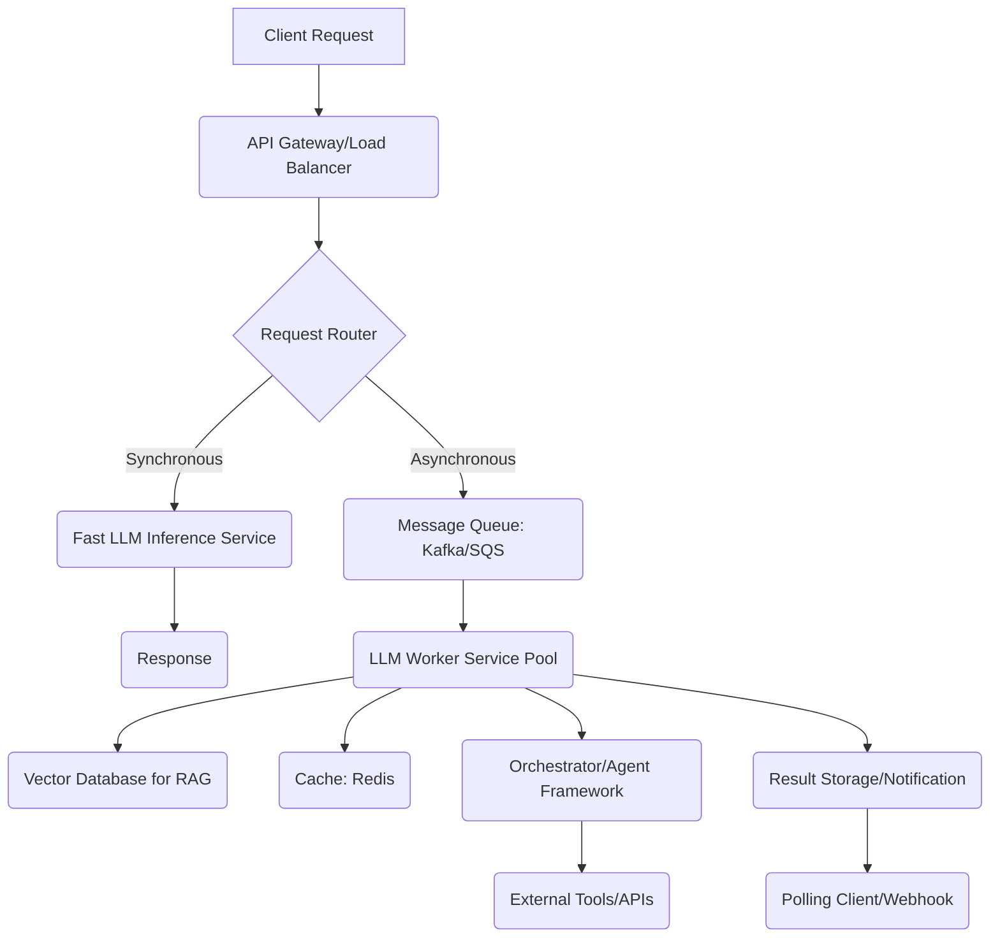

대규모 언어 모델(LLM) 기반 서비스는 빠른 발전과 함께 복잡성, 비용, 지연 시간, 확장성이라는 도전 과제를 안고 있습니다. 안정적이고 고성능의 서비스를 제공하기 위해서는 잘 설계된 아키텍처가 필수적입니다. 이 문서는 LLM 기반 서비스의 확장성을 보장하는 핵심 아키텍처 설계 패턴을 제시합니다.

### LLM 기반 서비스의 주요 도전 과제

*   **높은 추론 비용 (High Inference Cost)**: LLM 추론은 상당한 컴퓨팅 자원을 소모하며, 이는 곧 높은 운영 비용으로 이어진다.
*   **지연 시간 (Latency)**: 실시간 상호작용이 요구되는 서비스에서 LLM 추론 지연은 사용자 경험을 심각하게 저해할 수 있다.
*   **높은 처리량 요구사항 (High Throughput Requirements)**: 다수의 동시 사용자 요청을 안정적으로 처리하기 위한 시스템 설계가 필요하다.
*   **동적 로드 (Dynamic Load)**: 트래픽의 변동성이 커서 자원을 유연하게 확장/축소할 수 있는 아키텍처가 필수적이다.
*   **모델 업데이트 및 관리 (Model Updates & Management)**: 모델 버전 관리, A/B 테스트, 점진적 배포 등이 복잡하며, 서비스 중단 없이 이루어져야 한다.
*   **컨텍스트 관리 (Context Management)**: 긴 대화나 복잡한 지식 검색 시 LLM의 컨텍스트 윈도우 한계를 효율적으로 다루는 것이 중요하다.

### 확장 가능한 LLM 아키텍처 설계 패턴

#### 1. 분산 추론 및 로드 밸런싱 (Distributed Inference & Load Balancing)

LLM 추론 워크로드를 여러 서버에 분산하여 처리량을 늘리고 지연 시간을 줄이는 것이 핵심입니다. API 게이트웨이와 로드 밸런서(예: Nginx, AWS ALB)를 활용하여 요청을 효율적으로 분배하고, 트래픽에 따라 인스턴스를 자동으로 확장(auto-scaling)해야 합니다. TensorRT-LLM, vLLM과 같은 고성능 추론 엔진을 사용하여 단일 GPU의 처리량을 극대화하는 것도 중요한 최적화 전략입니다.

#### 2. 비동기 처리 및 메시지 큐 (Asynchronous Processing & Message Queues)

장시간이 소요되는 LLM 작업(예: 긴 문서 요약, 복잡한 코드 생성)은 동기식으로 처리할 경우 사용자 경험을 저해하고 시스템 리소스를 비효율적으로 사용합니다. RabbitMQ, Kafka, AWS SQS와 같은 메시지 큐를 사용하여 작업을 비동기적으로 처리하고, 워커 풀(Worker Pool)을 통해 병렬로 수행함으로써 시스템 처리량을 높입니다.

```python
# 비동기 LLM 작업 처리 예시 (Pseudo-code)
from fastapi import FastAPI
from pydantic import BaseModel
import uuid
import asyncio

app = FastAPI()
task_queue = asyncio.Queue()
task_results = {}

class LLMRequest(BaseModel):
    prompt: str
    max_tokens: int = 512

async def llm_worker():
    while True:
        task_id, request_data = await task_queue.get()
        print(f"Processing task {task_id}: {request_data.prompt[:30]}...")
        # 실제 LLM 추론 로직 (예: OpenAI, Anthropic API 호출)
        await asyncio.sleep(5) # Simulate LLM inference time
        result = f"LLM response for '{request_data.prompt[:20]}' - Task {task_id}"
        task_results[task_id] = {"status": "completed", "result": result}
        print(f"Task {task_id} completed.")
        task_queue.task_done()

@app.on_event("startup")
async def startup_event():
    asyncio.create_task(llm_worker())

@app.post("/generate-async/")
async def generate_async(request: LLMRequest):
    task_id = str(uuid.uuid4())
    await task_queue.put((task_id, request))
    task_results[task_id] = {"status": "pending"}
    return {"task_id": task_id, "message": "Task submitted asynchronously."}

@app.get("/status/{task_id}")
async def get_task_status(task_id: str):
    return task_results.get(task_id, {"status": "not_found"})

# 이 코드는 FastAPI와 asyncio를 사용한 비동기 작업 큐의 개념을 보여줍니다.
# 실제 프로덕션 환경에서는 RabbitMQ, Kafka 등의 외부 메시지 큐를 통합합니다.
```

#### 3. 검색 증강 생성(RAG) 아키텍처의 확장 (Scalable RAG Architectures)

LLM의 지식 한계를 극복하고 최신 정보를 반영하기 위한 RAG는 벡터 데이터베이스(Vector Database)와 긴밀하게 연동됩니다.

*   **확장 가능한 벡터 DB**: Milvus, Pinecone, Qdrant, Weaviate 등 고성능 분산 벡터 DB를 사용하여 대규모 임베딩 데이터를 관리하고 효율적인 검색을 수행합니다. 샤딩(sharding), 복제(replication)를 통해 검색 처리량과 가용성을 확보합니다.
*   **임베딩 파이프라인 최적화**: 문서 수집, 청킹(chunking), 임베딩 생성 파이프라인을 병렬화하고 배치 처리하여 실시간에 가까운 데이터 업데이트를 지원합니다. AWS Kinesis, Apache Flink 같은 스트리밍 기술을 활용할 수 있습니다.

#### 4. 캐싱 전략 (Caching Strategies)

LLM 서비스의 비용과 지연 시간을 줄이기 위해 다양한 캐싱 전략을 적용합니다.

*   **프롬프트 캐시 (Prompt Cache)**: 동일하거나 유사한 프롬프트 요청에 대해 이전 응답을 반환합니다. Redis, Memcached와 같은 인메모리 캐시를 활용하며, semantic similarity 기반 캐시도 고려할 수 있습니다.
*   **임베딩 캐시 (Embedding Cache)**: 자주 사용되는 텍스트의 임베딩 결과를 캐시하여 임베딩 API 호출 비용과 시간을 절약합니다.
*   **부분 응답 캐시 (Partial Response Cache)**: 스트리밍 응답이 필요한 경우, 일부 초기 응답을 캐시하여 사용자에게 빠르게 제공합니다.

#### 5. Multi-LLM 오케스트레이션 및 에이전트(Agent) 아키텍처 (Multi-LLM Orchestration & Agent Architectures)

특정 작업에 최적화된 여러 LLM을 조합하거나, 소형 언어 모델(SLM)과 대형 언어 모델(LLM)을 혼합하여 사용하는 하이브리드 접근 방식이 2026년에도 중요해질 것입니다. 이를 통해 비용 효율성과 성능을 동시에 개선합니다. 에이전트 프레임워크(LangChain, LlamaIndex)를 활용하여 복잡한 워크플로우를 자동화하고, 각 에이전트의 워크로드를 분산 처리하는 패턴을 적용합니다.



### 2026년 트렌드 반영

*   **Edge LLMs & Quantization**: 모바일, IoT 기기 등 엣지 디바이스에서의 LLM 추론을 위한 최적화(양자화, 경량화 모델)가 더욱 확산될 것입니다.
*   **Specialized Hardware**: GPU를 넘어 NPU, ASIC 등 AI 가속기에 최적화된 LLM 배포 및 추론 기술이 일반화됩니다.
*   **Hybrid Cloud & Multi-Cloud**: 비용, 규제, 성능 최적화를 위해 온프레미스와 클라우드, 또는 여러 클라우드 벤더를 조합한 하이브리드/멀티 클라우드 아키텍처가 보편화됩니다.
*   **Multi-modal AI**: 텍스트를 넘어 이미지, 음성, 비디오 등을 처리하는 멀티모달 LLM이 주류가 되면서, 각 모달리티별 데이터 처리 및 임베딩 파이프라인의 복잡성과 확장성 요구사항이 증가합니다.

## 트레이드오프

1.  **분산 추론 (Distributed Inference)**
    *   **언제 좋은가?**: 높은 처리량(throughput) 요구사항이 있고, 지연 시간(latency)을 줄여야 하는 대규모 사용자 서비스에 적합합니다. 단일 서버의 리소스 한계를 초과하는 워크로드에 효과적입니다.
    *   **언제 나쁜가?**: 소규모 서비스나 예측 가능한 낮은 트래픽 환경에서는 인프라 관리 복잡성과 추가 비용이 증가합니다. 시스템 아키텍처가 불필요하게 복잡해질 수 있습니다.

2.  **비동기 처리 및 메시지 큐 (Asynchronous Processing & Message Queues)**
    *   **언제 좋은가?**: 장시간 소요되는 LLM 작업이 많거나, 백그라운드에서 처리되어도 사용자 경험에 큰 지장이 없는 작업에 유용합니다. 시스템 안정성과 내결함성을 높일 수 있습니다.
    *   **언제 나쁜가?**: 실시간 상호작용이 필수적인 짧은 응답 시간의 서비스에는 추가적인 지연을 유발할 수 있습니다. 메시지 큐 관리와 모니터링에 대한 추가 오버헤드가 발생합니다.

3.  **검색 증강 생성(RAG) 아키텍처 (RAG Architectures)**
    *   **언제 좋은가?**: 최신 정보를 반영해야 하거나, LLM의 환각(hallucination)을 줄이고 정확성을 높여야 하는 지식 기반 서비스에 필수적입니다. 특정 도메인 지식에 특화된 응답이 필요할 때 효과적입니다.
    *   **언제 나쁜가?**: 검색 대상 데이터의 규모가 작거나, LLM 자체의 생성 능력만으로 충분한 경우 불필요한 복잡성과 비용(벡터 DB 운영, 임베딩 생성)을 초래합니다. 검색 성능 최적화가 어려울 수 있습니다.

4.  **캐싱 전략 (Caching Strategies)**
    *   **언제 좋은가?**: 반복적인 프롬프트 요청이 많거나, 응답 내용의 변화가 적은 서비스에서 비용 절감 및 지연 시간 단축에 매우 효과적입니다.
    *   **언제 나쁜가?**: 응답의 무결성(freshness)이 매우 중요하여 항상 최신 LLM 응답이 필요한 경우, 캐시 무효화(invalidation) 전략이 복잡해지거나 캐시 사용의 이점이 줄어듭니다. 캐시 적중률(hit rate)이 낮으면 오히려 오버헤드만 발생할 수 있습니다.

5.  **Multi-LLM 오케스트레이션 (Multi-LLM Orchestration)**
    *   **언제 좋은가?**: 비용 최적화(작업에 따라 적합한 LLM 사용), 성능 최적화(특정 작업에 빠른 SLM 사용), 특정 기능에 특화된 LLM 활용이 필요한 복합적인 서비스에 유리합니다.
    *   **언제 나쁜가?**: 단일 LLM으로도 충분한 간단한 서비스에는 오케스트레이션 계층의 도입이 불필요한 복잡성만 추가합니다. 여러 모델의 관리, 버전 호환성, 오류 처리 등이 어려워집니다.

## 실전 체크리스트

- [ ] **로드 테스트 및 성능 벤치마킹 수행**: 예상 피크 트래픽을 견딜 수 있는지, 각 컴포넌트의 지연 시간 및 처리량 병목 현상이 없는지 검증합니다.
- [ ] **오토스케일링 전략 구현 및 검증**: 트래픽 증감에 따라 LLM 추론 서버 및 관련 리소스(예: 벡터 DB 읽기 복제본)가 자동으로 확장/축소되는지 확인합니다.
- [ ] **비용 모니터링 및 최적화**: LLM API 호출 비용, 인프라 비용 등을 지속적으로 모니터링하고, 캐싱 전략 및 모델 선택을 통해 비용 효율성을 극대화합니다.
- [ ] **관측 가능성(Observability) 확보**: 로그(logging), 메트릭(metrics), 추적(tracing) 시스템을 구축하여 시스템의 상태, 성능 병목, 오류를 실시간으로 파악할 수 있도록 합니다.
- [ ] **RAG 파이프라인 데이터 신선도 유지**: 임베딩 업데이트 파이프라인의 지연 시간을 최소화하고, 최신 데이터가 LLM 추론에 반영되는 주기를 정의하고 준수합니다.
- [ ] **폴백(Fallback) 및 재시도(Retry) 전략 구현**: LLM API 호출 실패나 네트워크 오류 발생 시 자동으로 재시도하거나, 대체 모델/응답으로 폴백하는 로직을 구현합니다.
- [ ] **보안 및 규정 준수 검토**: 사용자 데이터 처리, LLM 입력/출력 필터링, API 키 관리 등 보안 취약점을 점검하고 관련 규정(GDPR, CCPA 등)을 준수합니다.
- [ ] **GitOps 기반 배포 자동화**: 모든 인프라 및 애플리케이션 코드를 Git으로 관리하고, CI/CD 파이프라인을 통해 배포 과정을 자동화하여 일관성과 안정성을 확보합니다.