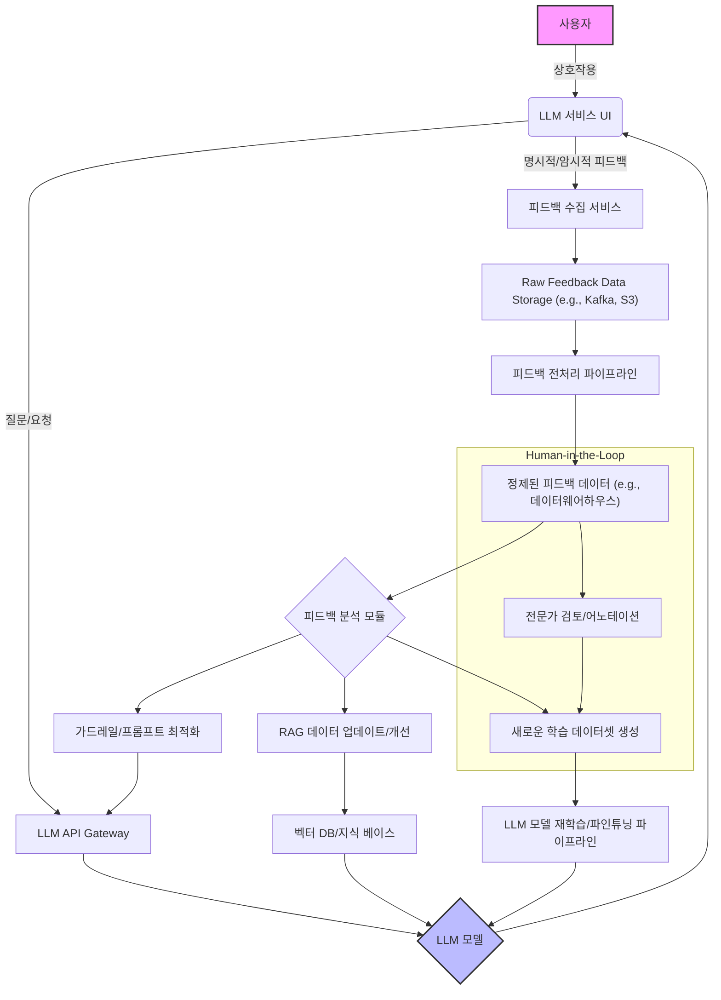

LLM 기반 서비스의 성공은 단순히 초기 모델 배포에 그치지 않고, 사용자 경험으로부터 지속적으로 학습하고 진화하는 능력에 달려 있습니다. 사용자 피드백 루프는 이러한 지속적인 개선을 위한 핵심 엔지니어링 메커니즘으로, 서비스가 실제 사용자 니즈와 기대에 부합하도록 안내하는 필수적인 가이드 역할을 수행합니다.

## 피드백 루프의 중요성

LLM은 본질적으로 통계적 모델이며, 배포 환경에서 예측하지 못한 행동, 할루시네이션(Hallucination) 또는 사용자 의도와의 불일치가 발생할 수 있습니다. 피드백 루프는 이러한 '갭 분석'을 실시간으로 수행하여, 모델의 편향을 줄이고 정확도를 높이며, 궁극적으로 사용자 만족도를 향상시킵니다. 2026년 기준, 사용자 피드백은 LLM의 지속적인 파인튜닝(fine-tuning)과 RAG(Retrieval-Augmented Generation) 시스템의 개선을 위한 가장 가치 있는 'Human-in-the-Loop' 데이터 소스로 인식됩니다.

## 피드백 유형 및 수집 전략

사용자 피드백은 크게 명시적(Explicit) 피드백과 암시적(Implicit) 피드백으로 나눌 수 있습니다.

### 명시적 피드백

*   **직접적인 평가**: '좋아요/싫어요' 버튼, 별점, '도움이 되었나요?'와 같은 설문. 이는 모델 응답의 품질을 직접적으로 평가하는 가장 기본적인 방법입니다.
*   **자유 형식 텍스트**: 사용자 의견, 개선 제안, 문제 보고 등. 이 데이터를 통해 모델이 놓치고 있는 복잡한 사용자 의도나 특정 도메인 지식을 파악할 수 있습니다.
*   **편집 피드백**: LLM이 생성한 텍스트를 사용자가 직접 수정하는 경우, 수정 전후의 텍스트를 비교하여 모델의 취약점을 분석합니다.

### 암시적 피드백

*   **사용자 행동 로그**: LLM 응답을 얼마나 오래 보았는지, 다음 질문으로 빠르게 넘어갔는지, 응답을 복사하거나 공유했는지 등의 행동 데이터를 분석합니다.
*   **세션 길이 및 이탈률**: 사용자가 서비스와 상호작용하는 시간이나 특정 지점에서의 이탈은 LLM 응답의 유용성 또는 관련성을 간접적으로 나타냅니다.
*   **재시도 패턴**: 동일하거나 유사한 질문을 여러 번 반복하는 것은 LLM이 초기 질문 의도를 제대로 파악하지 못했음을 시사합니다.

## 피드백 처리 및 통합 아키텍처

피드백 루프는 수집된 데이터를 처리하고, 분석하며, 최종적으로 LLM 성능 개선에 활용하는 일련의 파이프라인으로 구성됩니다.



### 파이프라인 단계

1.  **데이터 수집 (Collection)**: UI/UX 요소와 백엔드 로깅을 통해 명시적, 암시적 피드백을 수집합니다. 실시간 스트리밍 플랫폼(예: Apache Kafka)을 활용하여 대규모 데이터를 안정적으로 수집하는 것이 일반적입니다.
2.  **전처리 (Preprocessing)**: 수집된 Raw 데이터를 정제하고 구조화합니다. 자유 형식 텍스트는 토큰화, 개체명 인식(NER), 감성 분석 등을 거쳐 정량화 가능한 형태로 변환될 수 있습니다.
3.  **분석 (Analysis)**: 정제된 피드백 데이터를 분석하여 LLM 성능의 강점과 약점을 식별합니다. 이 단계에서는 통계 분석, 머신러닝 기반의 이상 탐지, 클러스터링 등을 활용하여 패턴을 발견합니다.
4.  **조치 (Action)**: 분석 결과를 바탕으로 LLM을 개선합니다.
    *   **모델 파인튜닝**: 사용자 피드백을 통해 생성된 고품질 데이터셋으로 LLM을 재학습시켜 특정 도메인이나 태스크에 최적화합니다.
    *   **프롬프트 엔지니어링 개선**: 특정 유형의 사용자 피드백이 반복될 경우, 시스템 프롬프트나 Few-shot 예제를 업데이트하여 모델의 응답 경향을 조정합니다.
    *   **RAG 시스템 강화**: 검색된 문서의 관련성 부족 피드백은 RAG 시스템의 검색 전략, 임베딩 모델, 또는 지식 베이스의 업데이트 필요성을 시사합니다.
    *   **가드레일 조정**: 안전성, 일관성 관련 피드백은 LLM의 출력 가드레일(Guardrails)을 정교하게 조정하는 데 사용됩니다.

### 코드 예시: 간단한 피드백 API (Python Flask)

```python
# feedback_service.py
from flask import Flask, request, jsonify
import datetime
import json

app = Flask(__name__)

# Hypothetical storage for feedback data
feedback_data = []

@app.route('/feedback', methods=['POST'])
def submit_feedback():
    data = request.get_json()
    if not data:
        return jsonify({"error": "Invalid JSON"}), 400

    required_fields = ['user_id', 'session_id', 'llm_query', 'llm_response', 'feedback_type']
    if not all(field in data for field in required_fields):
        return jsonify({"error": "Missing required fields"}), 400

    feedback_entry = {
        "timestamp": datetime.datetime.now().isoformat(),
        "user_id": data.get('user_id'),
        "session_id": data.get('session_id'),
        "llm_query": data.get('llm_query'),
        "llm_response": data.get('llm_response'),
        "feedback_type": data.get('feedback_type'), # e.g., 'like', 'dislike', 'correction', 'report'
        "user_comment": data.get('user_comment', None), # Optional
        "edited_response": data.get('edited_response', None) # Optional, for explicit corrections
    }

    feedback_data.append(feedback_entry)
    print(f"Received feedback: {json.dumps(feedback_entry, indent=2)}")
    # In a real system, this would push to Kafka or a database
    return jsonify({"message": "Feedback submitted successfully"}), 201

if __name__ == '__main__':
    app.run(debug=True, port=5000)

# Example usage with curl:
# curl -X POST -H "Content-Type: application/json" \
#      -d '{ "user_id": "user123", "session_id": "sess456", "llm_query": "What is quantum physics?", "llm_response": "Quantum physics is the study...", "feedback_type": "like" }' \
#      http://127.0.0.1:5000/feedback
```

위 코드는 Flask를 사용하여 기본적인 피드백 수집 엔드포인트를 구현한 예시입니다. 실제 프로덕션 환경에서는 이 피드백을 메모리가 아닌, Kafka와 같은 메시지 큐 또는 영구 데이터베이스에 저장하고, 별도의 배치/스트리밍 파이프라인을 통해 분석해야 합니다.

## 2026년 트렌드: 실시간 적응 및 합성 데이터 활용

2026년 LLM 서비스의 피드백 루프는 더욱 자동화되고 실시간으로 진화하고 있습니다.

*   **실시간 적응 (Real-time Adaptation)**: 사용자 피드백이 수집되는 즉시 LLM의 행동에 영향을 미치는 시스템이 중요해지고 있습니다. 이는 전체 모델 재학습이 아닌, 동적 프롬프트 조정, 사용자별 페르소나 업데이트, 또는 경량 어댑터(LoRA 등)의 빠른 업데이트를 통해 이루어집니다.
*   **합성 데이터 생성 (Synthetic Data Generation)**: 소수의 고품질 사용자 피드백으로부터 더 많은 학습 데이터를 합성하는 기술이 발전하고 있습니다. 이를 통해 수동 어노테이션의 부담을 줄이고, 모델의 개선 속도를 가속화할 수 있습니다.
*   **개인화된 피드백 루프**: 사용자 개개인의 상호작용 패턴과 선호도를 학습하여, LLM 응답을 개인화하고 이에 대한 피드백을 다시 개인화된 모델 개선에 활용하는 순환 구조가 도입되고 있습니다.

## 트레이드오프

### 1. 명시적 피드백 vs. 암시적 피드백
*   **언제 좋은가**: 명시적 피드백은 사용자 의도를 가장 명확하게 반영하여 모델의 치명적인 오류나 할루시네이션을 빠르게 식별하고 수정하는 데 유리합니다. 암시적 피드백은 대규모로 자동으로 수집되어 스케일 아웃이 용이하며, 사용자의 불편함을 명시적으로 표현하기 어려운 상황에서도 유용한 행동 패턴을 제공합니다.
*   **언제 나쁜가**: 명시적 피드백은 수집 비용이 높고, 사용자가 적극적으로 제공해야 하므로 양이 적을 수 있습니다. 또한, 사용자의 피드백이 편향되거나 일관성이 없을 수 있습니다. 암시적 피드백은 해석이 어렵고 노이즈가 많을 수 있으며, 특정 행동이 항상 부정적인 피드백을 의미하지 않을 수 있습니다(예: 짧은 세션이 항상 나쁜 UX를 의미하는 것은 아님).

### 2. 자동화된 분석 vs. Human-in-the-Loop 분석
*   **언제 좋은가**: 자동화된 분석은 대규모 피드백 데이터를 실시간으로 처리하여 빠른 의사결정과 모델 업데이트를 가능하게 합니다. Human-in-the-Loop 분석은 복잡하거나 미묘한 오류, 새로운 유형의 문제, 또는 LLM의 문화적, 윤리적 편향과 같이 기계가 파악하기 어려운 심층적인 인사이트를 제공합니다.
*   **언제 나쁜가**: 자동화된 분석은 사전에 정의된 규칙이나 모델에 의존하므로, 새로운 패턴이나 예상치 못한 문제에 취약할 수 있습니다. Human-in-the-Loop 분석은 비용과 시간이 많이 소요되며, 분석가의 주관적인 판단이 개입될 수 있습니다. 대규모 서비스에서는 모든 피드백을 사람이 검토하기 어렵습니다.

### 3. 즉각적인 모델 업데이트 vs. 배치 모델 업데이트
*   **언제 좋은가**: 즉각적인 모델 업데이트(예: 동적 프롬프트 조정, LoRA 업데이트)는 긴급한 문제 해결이나 사용자별 개인화에 유리하여 빠른 사용자 경험 개선을 가져옵니다. 배치 모델 업데이트는 충분한 데이터를 모아 안정적이고 철저한 검증 과정을 거치므로, 모델의 전반적인 안정성과 성능 향상에 기여합니다. 중요한 프로덕션 서비스의 경우 예측 가능성이 중요합니다.
*   **언제 나쁜가**: 즉각적인 업데이트는 충분한 검증 없이 적용될 경우 예상치 못한 부작용(회귀)을 초래할 위험이 있습니다. 소량의 데이터에 과적합될 가능성도 있습니다. 배치 업데이트는 피드백이 모델에 반영되기까지 시간이 오래 걸려, 사용자들이 개선을 느끼기까지 지연될 수 있습니다.

## 실전 체크리스트

LLM 기반 서비스에 사용자 피드백 루프를 통합할 때 다음 항목들을 검증해야 합니다.

- [ ] **피드백 수집 메커니즘 확인**: 서비스의 주요 상호작용 지점에 명시적 '좋아요/싫어요', '수정 제안' 버튼 및 암시적 행동 로깅이 모두 통합되어 있는가?
- [ ] **데이터 파이프라인 견고성**: 수집된 Raw 피드백 데이터가 손실 없이 전처리, 정제되어 분석 가능한 형태로 저장되는 자동화된 파이프라인이 구축되어 있는가?
- [ ] **핵심 피드백 지표 정의**: 'LLM 응답 품질', '사용자 만족도', '할루시네이션 비율' 등 피드백을 기반으로 LLM 성능을 정량화할 수 있는 핵심 지표들이 명확히 정의되어 있는가?
- [ ] **모델 개선 자동화 전략**: 특정 피드백 유형(예: 부정 피드백 임계값 초과)이 감지되었을 때, 모델 재학습, 프롬프트 업데이트, 또는 RAG 지식 베이스 수정 등의 자동화된 조치 트리거 시스템이 설계되어 있는가?
- [ ] **Human-in-the-Loop 워크플로우**: 자동화된 분석으로 해결하기 어려운 복잡하거나 모호한 피드백에 대해 전문가가 개입하여 검토하고 어노테이션하는 워크플로우가 확립되어 있는가?
- [ ] **개인정보 보호 및 동의**: 사용자 피드백 수집 시 개인정보 보호(Privacy) 규정을 준수하며, 사용자로부터 명확한 데이터 활용 동의를 받고 있는가?
- [ ] **피드백 루프 모니터링**: 피드백 수집률, 분석 대기 시간, 모델 업데이트 주기 및 그에 따른 성능 변화를 실시간으로 모니터링하여 루프의 건강 상태를 추적하고 있는가?
