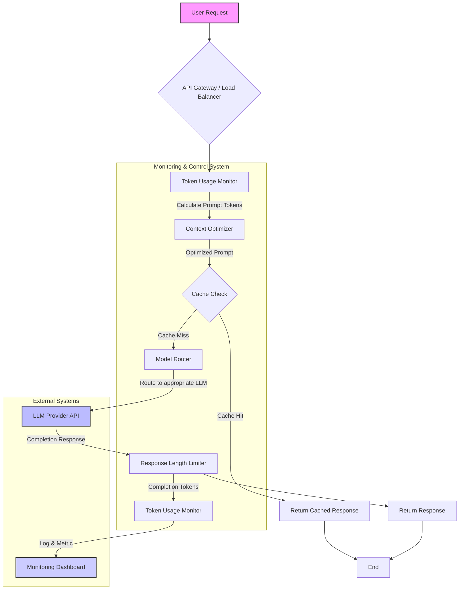

LLM(Large Language Model) 애플리케이션의 비용 효율성(Cost Efficiency)은 실제 서비스 도입 및 확장에 핵심적인 요소입니다. LLM API 호출은 사용된 토큰(Token)의 양에 비례하여 비용이 발생하므로, 토큰 사용량을 효율적으로 모니터링하고 제어하는 패턴을 구축하는 것이 필수적입니다.

## 토큰 사용량 모니터링의 중요성
LLM 모델은 입력(Input) 및 출력(Output) 텍스트를 토큰 단위로 처리합니다. 모델마다 토큰 계산 방식이 다르며, 동일한 텍스트라도 인코딩 방식에 따라 토큰 수가 달라질 수 있습니다. 예상치 못한 높은 토큰 사용량은 서비스 운영 비용을 급증시킬 수 있으며, 이는 특히 사용자 트래픽이 많거나 복잡한 Agentic workflow에서 더욱 두드러집니다. 따라서 실시간 토큰 사용량 모니터링은 비용 최적화의 첫 걸음입니다.

### 모니터링 패턴

1.  **API 호출 인터셉션 (API Call Interception) 및 로깅**: LLM API 호출 전후에 토큰 사용량을 측정하고 로깅하는 미들웨어(Middleware) 또는 훅(Hook)을 구현합니다. 이는 입력 프롬프트(Prompt)와 모델 응답(Response)의 토큰 수를 `tiktoken` (OpenAI), `Anthropic's tokenizer` 또는 기타 모델별 토크나이저를 사용하여 계산합니다. 각 요청에 대한 `prompt_tokens`, `completion_tokens`, `total_tokens` 값을 기록하고, 이를 통해 비용 데이터를 집계할 수 있습니다.

2.  **메트릭 및 대시보드 구축**: 수집된 토큰 사용량 데이터를 Prometheus, Grafana와 같은 모니터링 시스템으로 전송하여 시각화된 대시보드를 구축합니다. 시간대별 토큰 사용량, 사용자별/기능별 비용 분포, 이상 감지(Anomaly Detection) 알림 등을 설정하여 잠재적인 비용 문제를 조기에 파악할 수 있습니다.

    ```python
    import tiktoken
    import time
    import logging

    logging.basicConfig(level=logging.INFO)

    class LLMTokenMonitor:
        def __init__(self, model_name="gpt-4o"): # 2026년 최신 모델 반영
            self.encoding = tiktoken.encoding_for_model(model_name)
            self.model_name = model_name

        def count_tokens(self, text: str) -> int:
            if not text: return 0
            return len(self.encoding.encode(text))

        def monitor_api_call(self, prompt: str, completion: str):
            prompt_tokens = self.count_tokens(prompt)
            completion_tokens = self.count_tokens(completion)
            total_tokens = prompt_tokens + completion_tokens

            # 실제 API 호출 시간 시뮬레이션
            time.sleep(0.1) 

            logging.info(f"[{self.model_name}] Prompt Tokens: {prompt_tokens}, "
                         f"Completion Tokens: {completion_tokens}, "
                         f"Total Tokens: {total_tokens}")
            # 여기에 Prometheus/Grafana 등으로 전송하는 로직 추가
            # push_metrics_to_monitoring_system(self.model_name, prompt_tokens, completion_tokens, total_tokens)

    # 예시 사용
    monitor = LLMTokenMonitor()
    sample_prompt = "Please summarize the key points of large language model token usage monitoring for cost efficiency."
    sample_completion = "LLM token usage monitoring is crucial for cost efficiency by tracking prompt and completion tokens. Implementing API interception, detailed logging, and dashboard visualization helps identify and mitigate unexpected cost surges. Control patterns include dynamic context adjustment, response limiting, caching, and model routing." # 예시 생성 텍스트
    monitor.monitor_api_call(sample_prompt, sample_completion)
    ```

## 토큰 사용량 제어 패턴
모니터링을 통해 문제가 파악되면, 실제 토큰 사용량을 줄이기 위한 제어 전략을 적용해야 합니다.

### 제어 패턴

1.  **동적 컨텍스트 최적화 (Dynamic Context Optimization)**: LLM에 전달되는 프롬프트의 길이를 최소화합니다. RAG(Retrieval Augmented Generation) 시스템에서는 관련성이 높은 문서만 선별하여 컨텍스트에 포함시키고, 대화 기록(Chat History)이 길어질 경우 요약(Summarization) 또는 슬라이딩 윈도우(Sliding Window) 기법을 적용하여 불필요한 토큰을 제거합니다. `agentic-context-compaction-trigger-heuristics`와 같은 패턴을 활용할 수 있습니다.

2.  **응답 길이 제한 (Response Length Limiting)**: LLM이 생성하는 응답의 최대 길이를 제한합니다. `max_tokens` 파라미터를 사용하여 모델이 불필요하게 긴 답변을 생성하는 것을 방지하고, 필요한 경우 후처리(Post-processing)를 통해 추가적인 정보 압축을 수행합니다.

3.  **프롬프트 및 응답 캐싱 (Prompt and Response Caching)**: 동일하거나 매우 유사한 프롬프트에 대한 LLM 호출 결과를 캐싱합니다. 자주 요청되는 질의나 예측 가능한 응답에 대해 LLM API 호출 없이 캐시된 결과를 반환하여 토큰 사용량과 지연 시간(Latency)을 모두 줄일 수 있습니다. Redis, Memcached와 같은 인메모리(In-memory) 캐시 시스템을 활용합니다.

4.  **모델 라우팅 (Model Routing)**: 비용과 성능 특성이 다른 여러 LLM 모델(예: `GPT-4o`, `GPT-3.5-turbo`, `Gemini-Flash`)을 워크로드(Workload)에 따라 동적으로 라우팅합니다. 복잡도가 낮은 작업에는 저렴한 모델을 사용하고, 높은 정확도나 추론 능력이 필요한 경우에만 고비용 모델을 사용하도록 정책을 설정합니다. `ai-model-router-cost-performance-optimization` 패턴이 대표적입니다.

5.  **사용자별 할당량 및 예산 관리 (User Quotas & Budgeting)**: 엔터프라이즈 환경에서는 사용자 또는 팀별로 LLM 사용에 대한 할당량(Quota)이나 예산(Budget)을 설정하여 무분별한 토큰 사용을 방지합니다. 할당량 초과 시 경고 알림을 보내거나 API 호출을 제한하는 시스템을 구축합니다.

다음 Mermaid 다이어그램은 토큰 사용량 모니터링 및 제어 패턴의 일반적인 흐름을 보여줍니다.



## 트레이드오프

*   **비용 절감 vs. 지연 시간 (Latency)**:
    *   **언제 좋고**: 캐싱, 컨텍스트 압축, 모델 라우팅 등은 토큰 사용량을 줄여 비용을 절감하는 데 매우 효과적입니다. 특히 캐싱은 반복적인 요청에 대한 지연 시간을 크게 줄일 수 있습니다.
    *   **언제 나쁜지**: 과도한 컨텍스트 압축은 LLM의 추론 품질(Inference Quality)을 저하시킬 수 있으며, 모델 라우팅 로직의 복잡성은 시스템 지연 시간을 증가시킬 수 있습니다. 캐시 미스(Cache Miss) 시 추가적인 로직 처리로 인해 지연이 발생할 수도 있습니다.

*   **비용 절감 vs. 구현 복잡도 (Implementation Complexity)**:
    *   **언제 좋고**: 초기 구현 복잡도를 감수하면 장기적으로 상당한 운영 비용 절감을 가져올 수 있습니다. 특히 대규모 LLM 애플리케이션의 경우 필수적입니다.
    *   **언제 나쁜지**: 소규모 PoC(Proof of Concept)나 간단한 유틸리티 애플리케이션에서는 과도한 모니터링 및 제어 로직 구현이 개발 시간과 유지보수 비용을 증가시켜 오히려 비효율적일 수 있습니다.

*   **토큰 제한 vs. 응답 품질 (Response Quality)**:
    *   **언제 좋고**: 적절한 응답 길이 제한은 핵심 정보만 제공하여 사용자 경험을 개선하고 불필요한 토큰 사용을 막습니다.
    *   **언제 나쁜지**: 너무 엄격한 응답 길이 제한은 중요한 정보가 잘리거나, 불완전하고 맥락이 끊긴 응답을 생성하여 응답 품질을 심각하게 저하시킬 수 있습니다.

## 실전 체크리스트

- [ ] 모든 LLM API 호출에 대해 입력 프롬프트 및 응답의 토큰 사용량을 측정하고 기록하는 미들웨어/훅이 구현되었는가?
- [ ] 실시간 토큰 사용량, 비용, 그리고 사용자/기능별 집계 데이터를 시각화하는 대시보드(예: Grafana)가 구축되었는가?
- [ ] 특정 토큰 사용량 임계치(Threshold) 또는 비용을 초과할 경우 자동 경고(Alerting) 시스템이 설정되어 있는가?
- [ ] 긴 대화 컨텍스트 또는 RAG 입력에 대해 동적 요약, 슬라이딩 윈도우, 또는 핵심 정보 추출과 같은 컨텍스트 최적화 기법이 적용되었는가?
- [ ] 자주 요청되는 프롬프트-응답 쌍에 대한 캐싱 전략(Cache Strategy)이 구현되어 LLM API 호출을 회피하고 있는가?
- [ ] 작업의 복잡도와 비용/성능 요구사항에 따라 여러 LLM 모델을 동적으로 선택하고 라우팅하는 시스템이 구축되었는가?
- [ ] LLM 응답의 최대 길이를 제한하는 `max_tokens` 파라미터가 적절히 설정되어 불필요하게 긴 응답을 방지하고 있는가?