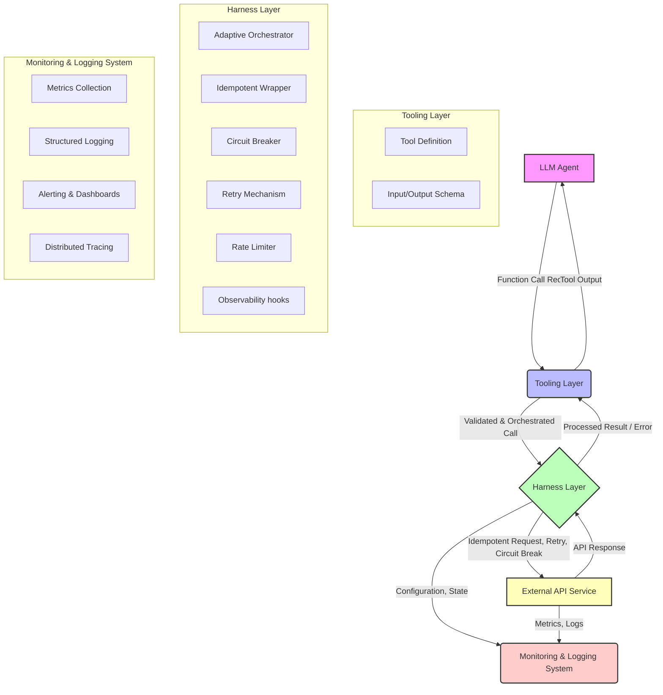

LLM(Large Language Model) 기반의 에이전트가 실제 세계와 상호작용하기 위해서는 외부 시스템 및 API 연동이 필수적입니다. 그러나 외부 API는 다양한 특성과 제약을 가지며, LLM이 이를 직접적이고 무방비하게 호출할 경우 예측 불가능한 오류, 비용 초과, 보안 문제 등 심각한 부작용을 초래할 수 있습니다. 본 문서에서는 이러한 복잡한 외부 API 연동 문제를 해결하고 LLM 에이전트의 안정성과 신뢰성을 높이기 위한 LLM 툴링(Tooling) 및 하네스(Harness) 디자인 패턴을 제시합니다.

## 핵심 개념: 툴링과 하네스의 분리

LLM 에이전트가 외부 API를 활용하는 과정은 크게 두 가지 계층으로 나눌 수 있습니다.

### 툴링 레이어 (Tooling Layer)
LLM이 특정 작업을 수행하기 위해 호출할 수 있는 함수 또는 API의 추상화 계층입니다. LLM의 함수 호출(Function Calling) 능력과 연계되어, LLM이 상황에 맞는 적절한 툴을 선택하고 필요한 인자를 생성하여 호출할 수 있도록 돕습니다. 주로 OpenAPI(Swagger) 스키마 또는 Pydantic 모델과 같은 형태로 정의되며, LLM에게 툴의 목적, 입력, 출력, 부작용을 명확하게 설명하는 역할을 합니다.

### 하네스 레이어 (Harness Layer)
툴링 레이어에서 정의된 툴 호출이 실제 외부 시스템으로 전달되고 응답이 처리되는 과정 전반을 제어하고 안정성을 확보하는 인프라 계층입니다. 단순히 툴을 실행하는 것을 넘어, 호출 전/후 검증, 에러 처리, 재시도 로직, 서킷 브레이커(Circuit Breaker), 로깅, 모니터링, 보안 및 비용 관리 등 운영에 필요한 다양한 기능을 담당합니다. 하네스는 LLM의 자율성을 보장하면서도 시스템의 견고함을 유지하는 핵심 요소입니다.

## 디자인 패턴

### 1. 적응형 툴 오케스트레이터 (Adaptive Tool Orchestrator)
LLM의 툴 호출 요청을 직접 실행하기 전에, 유효성 검사, 컨텍스트 기반 재조정, 실패 시 대체 툴 선정 로직을 포함하는 오케스트레이터 패턴입니다. 단일 툴 호출 실패가 전체 워크플로우를 중단시키지 않도록 합니다.

### 2. 멱등성 API 래퍼 (Idempotent API Wrapper)
외부 API 호출 시 네트워크 문제나 타임아웃으로 인해 동일한 요청이 여러 번 전송될 수 있습니다. 멱등성 래퍼는 고유한 요청 ID를 생성하고 이를 활용하여 동일한 요청이 여러 번 발생하더라도 외부 시스템에서 단 한 번만 처리되도록 보장합니다. 이는 특히 결제, 주문 생성 등 상태를 변경하는 API에 필수적입니다.

### 3. 서킷 브레이커 & 재시도 메커니즘 (Circuit Breaker & Retry Mechanism)
외부 API의 장애가 전체 시스템으로 전파되는 것을 방지하기 위해 서킷 브레이커 패턴을 적용합니다. 특정 API가 반복적으로 실패할 경우, 일시적으로 해당 API 호출을 중단하여 부하를 줄이고 복구를 기다립니다. 또한, 네트워크 불안정이나 일시적인 서버 오류에 대비하여 지수 백오프(Exponential Backoff)를 포함한 재시도 로직을 구현합니다.

### 4. 확장 가능한 모니터링 및 로깅 (Scalable Monitoring & Logging)
LLM의 툴 호출 요청부터 외부 API 응답까지의 전체 흐름을 추적하고 기록하는 시스템입니다. API 호출 파라미터, 응답 내용, 소요 시간, 에러 코드 등을 상세하게 로깅하고, Prometheus, Grafana 같은 도구를 활용하여 실시간으로 모니터링 대시보드를 구축합니다. 비정상적인 호출 패턴이나 과도한 비용 발생 시 즉시 알림을 받을 수 있도록 설정합니다. 2026년에는 OpenTelemetry 표준을 활용한 분산 트레이싱(Distributed Tracing)이 더욱 중요해져 LLM과 외부 시스템 간의 복잡한 상호작용을 통합적으로 시각화하는 것이 트렌드입니다.

## 코드 예제: Python 기반 하네스 설계

아래는 Python에서 간단한 툴과 이를 감싸는 하네스 패턴의 예시입니다. `requests` 라이브러리와 `tenacity`를 사용하여 재시도 및 서킷 브레이커를 구현합니다.

```python
import requests
import json
from tenacity import retry, wait_exponential, stop_after_attempt, before_log, after_log, circuit_breaker, wait_fixed, stop_after_delay, RetryError
import logging
import uuid

logging.basicConfig(level=logging.INFO)
logger = logging.getLogger(__name__)

# 1. Tool Definition (LLM이 인식하는 함수)
class PaymentTool:
    def create_payment(self, user_id: str, amount: float, currency: str, idempotency_key: str) -> dict:
        """
        새로운 결제를 생성합니다.
        :param user_id: 결제를 요청하는 사용자 ID
        :param amount: 결제 금액
        :param currency: 통화 (예: 'USD', 'KRW')
        :param idempotency_key: 중복 요청 방지를 위한 고유 키 (UUID 형식 권장)
        :return: 결제 결과 (status, transaction_id 등 포함)
        """
        return self._execute_payment_api(user_id, amount, currency, idempotency_key)

    @retry(
        wait=wait_exponential(multiplier=1, min=1, max=10),
        stop=stop_after_attempt(3) | stop_after_delay(30), # 최대 3번 재시도 또는 30초 내
        reraise=True,
        before=before_log(logger, logging.INFO, "Attempting payment API call"),
        after=after_log(logger, logging.INFO, "Payment API call finished"),
        retry=(tenacity.retry_if_exception_type(requests.exceptions.ConnectionError) | 
               tenacity.retry_if_exception_type(requests.exceptions.Timeout) | 
               tenacity.retry_if_exception_type(requests.exceptions.HTTPError, lambda e: e.response.status_code == 503))
    )
    @circuit_breaker(
        failure_threshold=3, 
        recovery_timeout=60, # 3회 연속 실패 시 60초간 호출 차단
        # open_immediately=True # 특정 예외 발생 시 즉시 서킷 오픈
    )
    def _execute_payment_api(self, user_id, amount, currency, idempotency_key):
        # 실제 외부 결제 API 호출 로직 시뮬레이션
        api_endpoint = "https://api.external-payment.com/v1/payments"
        headers = {"Content-Type": "application/json", "X-Idempotency-Key": idempotency_key}
        payload = {
            "user_id": user_id,
            "amount": amount,
            "currency": currency
        }
        
        logger.info(f"Calling payment API with payload: {json.dumps(payload)}")
        
        try:
            response = requests.post(api_endpoint, json=payload, headers=headers, timeout=5) # 5초 타임아웃
            response.raise_for_status() # 4xx, 5xx 에러 발생 시 HTTPError 예외
            return response.json()
        except requests.exceptions.RequestException as e:
            logger.error(f"Payment API call failed: {e}")
            raise # 재시도 로직으로 전달

# LLM 에이전트가 툴을 사용하는 방식 (예시)
# agent = LLMAgent(tools=[PaymentTool()])
# result = agent.run("사용자 'alice'가 10000 KRW를 결제하도록 해줘")

# 실제 사용 예시
if __name__ == "__main__":
    payment_tool = PaymentTool()
    user_id = "alice_123"
    amount = 10000.0
    currency = "KRW"
    idempotency_key = str(uuid.uuid4())

    print(f"--- Attempting payment with idempotency key: {idempotency_key} ---")
    try:
        # 이 부분은 LLM이 `create_payment` 함수를 선택하고 인자를 넘겨주는 것을 시뮬레이션합니다.
        # 실제 `_execute_payment_api`는 이 내부에서 tenacity의 제어를 받습니다.
        payment_result = payment_tool.create_payment(user_id, amount, currency, idempotency_key)
        print(f"Payment successful: {payment_result}")
    except RetryError as e:
        print(f"Payment failed after multiple retries: {e}")
    except Exception as e:
        print(f"An unexpected error occurred: {e}")

    # Circuit Breaker 테스트를 위해 여러 번 실패하는 상황을 가정
    print("\n--- Testing Circuit Breaker (simulating failures) ---")
    # `_execute_payment_api`를 직접 호출하여 Circuit Breaker 로직 테스트
    for i in range(5):
        try:
            print(f"Attempt {i+1} to trigger failure...")
            # 실제 API 호출을 503으로 실패하도록 수정해야 하지만, 예제에서는 강제 예외 발생으로 시뮬레이션
            # requests.post가 항상 503을 반환하도록 Mocking 하는 것이 더 정확함.
            raise requests.exceptions.HTTPError("Simulated 503 Service Unavailable", response=requests.Response()) 
        except RetryError as e:
            print(f"Circuit Breaker open. Cannot call API for a while: {e}")
        except requests.exceptions.HTTPError as e:
            print(f"Simulated error: {e.response.status_code}")
            logger.error(f"Simulated error: {e}")
```

## 아키텍처 다이어그램



## 2026년 최신 트렌드 반영

2026년에는 LLM의 멀티모달(Multi-modal) 능력과 자율성(Autonomy)이 더욱 강화되면서, 외부 API 연동의 복잡성은 더욱 증대될 것입니다. 단순히 REST API를 넘어 GraphQL, gRPC, 심지어 레거시 시스템과의 연동까지 고려해야 합니다. 하네스 설계는 이러한 이질적인 인터페이스를 통합하고, LLM이 각 API의 특성을 이해하고 최적의 방식으로 활용할 수 있도록 지원하는 **시맨틱 라우팅(Semantic Routing)** 기능을 포함해야 합니다. 또한, API 호출 과정에서 발생하는 **데이터 프라이버시 및 보안** 문제가 더욱 중요해져, 민감 정보에 대한 자동 마스킹(Masking), 접근 제어(Access Control), 그리고 감사 로그(Audit Log) 기록 기능이 하네스 내에 필수적으로 내장되어야 합니다. 비용 최적화 측면에서는 **동적 API 선택 및 캐싱 전략**이 중요해져, LLM이 동일한 요청에 대해 여러 API 중 가장 저렴하거나 성능이 좋은 것을 선택하고, 반복적인 데이터 요청을 캐시하여 실제 API 호출을 줄이는 기능이 부각됩니다.

## 트레이드오프

*   **복잡성 증가 vs. 안정성 및 신뢰성**: 
    *   **언제 좋고**: 미션 크리티컬한 서비스에서 외부 API 의존도가 높을 때, 시스템의 장애 복원력과 예측 가능성이 극대화됩니다. 개발 초기 비용은 높지만 장기적인 운영 안정성 비용을 절감합니다.
    *   **언제 나쁜지**: 단순한 PoC(Proof of Concept)나 비즈니스 임팩트가 낮은 내부 스크립트에서는 과도한 설계로 불필요한 개발/유지보수 오버헤드를 유발할 수 있습니다.
*   **레이턴시 증가 vs. 에러 내성**: 
    *   **언제 좋고**: 외부 API의 응답 속도가 불안정하거나, 네트워크 지연이 예상되는 환경에서 지수 백오프 재시도 전략은 최종 성공률을 현저히 높여줍니다.
    *   **언제 나쁜지**: 실시간 응답이 필수적인 서비스 (예: 사용자 인터페이스의 즉각적인 피드백)에서는 재시도나 서킷 브레이커의 지연이 사용자 경험을 저해할 수 있습니다. 이때는 더 빠른 대체 응답 전략(예: 캐시된 응답 제공)을 고려해야 합니다.
*   **유연성 제한 vs. 제어 가능성**: 
    *   **언제 좋고**: LLM이 예측 불가능한 방식으로 툴을 사용하거나, 비용/보안 정책을 위반할 위험이 있을 때 하네스는 강력한 가드레일 역할을 하여 안전한 운영을 보장합니다.
    *   **언제 나쁜지**: LLM의 창의적이고 탐색적인 툴 사용이 중요한 개발 초기 단계에서는 하네스의 엄격한 제어가 LLM의 잠재력을 제한하고 개발 속도를 늦출 수 있습니다. 점진적 적용 전략이 필요합니다.
*   **리소스 사용량 증가 vs. 문제 진단 용이성**: 
    *   **언제 좋고**: 복잡한 분산 시스템에서 문제 발생 시, 상세한 로깅과 분산 트레이싱은 근본 원인 분석(Root Cause Analysis) 시간을 획기적으로 단축시켜 빠르게 복구할 수 있도록 돕습니다.
    *   **언제 나쁜지**: 자원 제약이 심한 엣지(Edge) 환경이나 극도의 비용 효율성이 요구되는 배치 처리에서는 과도한 로깅 및 모니터링이 시스템 오버헤드를 발생시키고 스토리지 비용을 증가시킬 수 있습니다.

## 실전 체크리스트

LLM 툴링 및 하네스 디자인 패턴을 프로젝트에 적용할 때 다음 항목들을 검증합니다.

- [ ] 외부 API별 호출 제한(Rate Limiting) 및 쿼터 관리 로직이 구현되었는가?
- [ ] 모든 외부 API 호출에 대한 멱등성 보장 메커니즘이 설계되고 테스트되었는가?
- [ ] Circuit Breaker 패턴이 각 외부 API 엔드포인트에 적용되었고, 적절한 실패 임계치와 복구 타임아웃이 설정되었는가?
- [ ] LLM의 툴 호출 시도 및 결과에 대한 상세 로깅 및 분산 트레이싱 시스템이 구축되었는가?
- [ ] 외부 API 응답 오류 (예: 4xx, 5xx)에 대한 LLM의 적응형 재시도 전략이 정의되었고, 지수 백오프가 적용되었는가?
- [ ] 비정상적인 툴 사용 패턴 (예: 무한 루프, 과도한 호출)을 감지하고 차단하는 가드레일이 존재하는가?
- [ ] 새 API 연동 시 OpenAPI (Swagger) 스키마 기반의 자동화된 툴 유효성 검증 및 하네스 통합 프로세스가 있는가?
- [ ] 민감 정보(PII)가 외부 API 요청 및 응답에 포함될 경우, 이에 대한 자동 마스킹 또는 암호화 처리 로직이 구현되었는가?