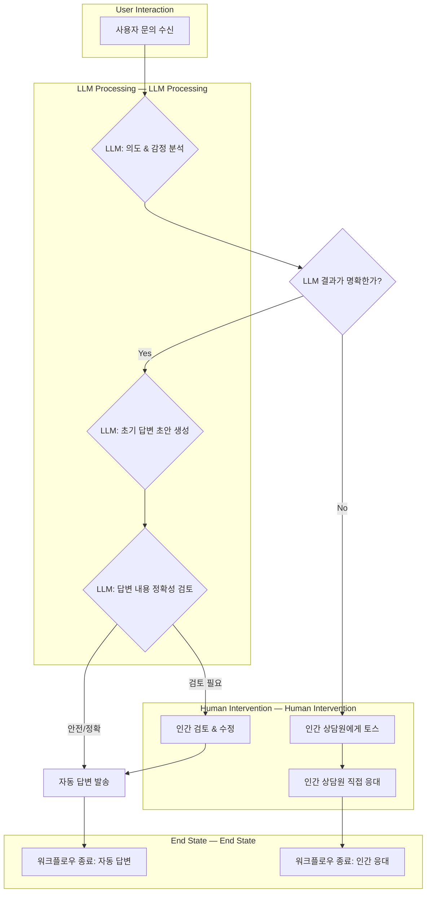

LLM 기반 서비스는 단순 질의응답을 넘어, 여러 단계의 추론, 외부 시스템 연동, 사용자 개입 등을 요구하는 복잡한 비즈니스 로직을 처리해야 할 때가 많습니다. LLM의 비결정론적 특성과 외부 의존성의 불안정성은 이러한 복잡성을 증폭시키며, 안정적이고 예측 가능한 서비스 제공을 위한 워크플로우 오케스트레이션(Workflow Orchestration)의 중요성을 부각합니다. 워크플로우 오케스트레이션은 개별 태스크를 정의하고, 이들을 순서, 조건, 병렬성 등에 따라 연결하여 하나의 비즈니스 프로세스를 완성하는 패턴입니다.

## LLM 워크플로우 오케스트레이션의 필요성

대규모 언어 모델(LLM)을 활용한 애플리케이션은 단일 프롬프트 호출만으로 해결하기 어려운 다단계 의사결정, 외부 API 호출, 데이터베이스 조회, 사용자 피드백 통합 등을 포함합니다. 각 단계의 성공 또는 실패에 따라 다음 단계를 동적으로 결정하고, 오류 발생 시 적절한 재시도(retry)나 대체 경로(fallback)를 제공해야 합니다. 워크플로우 오케스트레이션은 이러한 복잡한 프로세스의 정의, 실행, 모니터링, 오류 처리를 체계적으로 관리하여 서비스의 견고성과 확장성을 보장합니다.

### 핵심 오케스트레이션 패턴

LLM 기반 서비스에서 활용될 수 있는 주요 워크플로우 오케스트레이션 패턴은 다음과 같습니다.

1.  **순차적 실행 (Sequential Execution)**: 한 태스크의 출력이 다음 태스크의 입력이 되는 직렬 구조입니다. LLM의 추론 결과를 바탕으로 다음 액션을 결정하거나, 일련의 데이터 처리 단계를 거칠 때 유용합니다.
    *   **예시**: 사용자 질의 -> LLM (의도 파악) -> 외부 API (데이터 조회) -> LLM (응답 생성).

2.  **병렬 실행 (Parallel Execution)**: 여러 태스크를 동시에 실행하고, 모든 결과가 준비되면 다음 단계로 진행하는 패턴입니다. 독립적인 정보 조회나 여러 LLM 모델의 동시 호출을 통해 응답 시간을 단축하거나 다양한 관점을 취합할 때 활용됩니다.
    *   **예시**: 사용자 질의 -> [병렬] DB 조회 & 외부 지식 베이스 검색 -> 모든 결과 취합 -> LLM (최종 응답 생성).

3.  **조건부 분기 (Conditional Branching)**: 특정 조건에 따라 워크플로우 실행 경로를 변경합니다. LLM 분류 결과, 외부 시스템 상태, 사용자 입력 등에 따라 동적으로 다음 단계를 결정할 때 중요합니다.
    *   **예시**: LLM (사용자 요청 분류: 예약/문의) -> [조건부] 예약 시스템 연동 OR 상담원 연결.

4.  **인간 개입 (Human-in-the-Loop, HITL)**: 자동화된 워크플로우 중간에 인간의 검토, 승인 또는 정보 입력을 포함합니다. LLM 결과가 민감하거나 중요한 의사결정, 또는 LLM이 처리하기 어려운 예외 상황에 대처하기 위해 사용됩니다.
    *   **예시**: LLM (초안 문서 생성) -> 인간 검토 및 수정 -> LLM (최종 발행).

5.  **보상 및 재시도 (Compensation & Retry)**: 태스크 실행 실패 시 정의된 정책에 따라 재시도하거나, 이미 실행된 태스크의 영향을 되돌리는 보상 로직을 실행합니다. 외부 API의 일시적 오류나 LLM의 예측 불가능한 응답에 대비하여 워크플로우의 안정성을 높입니다.

### 워크플로우 정의 및 실행 예제

다음은 파이썬 유사 코드로 간단한 LLM 기반 주문 처리 워크플로우를 정의하고 실행하는 예시입니다.

```python
import time

class LLMService:
    def process_request(self, data: dict) -> dict:
        print(f"LLM: Classifying request for {data.get('item')}...")
        time.sleep(0.5)
        return {"type": "urgent" if "urgent" in data.get("item", "").lower() else "standard"}

    def generate_summary(self, details: dict) -> str:
        print("LLM: Generating summary...")
        time.sleep(0.3)
        return f"Summary: {details['type']} order for {details['item']}."

class InventoryService:
    def check_stock(self, item: str) -> bool:
        print(f"Inventory: Checking stock for {item}...")
        time.sleep(0.4)
        return item != "out-of-stock-item"

class ShippingService:
    def initiate_shipping(self, order_info: dict) -> dict:
        print(f"Shipping: Initiating for {order_info['order_id']}...")
        time.sleep(0.6)
        return {"tracking_id": f"TRK-{order_info['order_id']}", "eta": "3-5 days"}

class OrderWorkflow:
    def __init__(self):
        self.llm = LLMService()
        self.inventory = InventoryService()
        self.shipping = ShippingService()

    def run(self, order_data: dict) -> dict:
        print("--- Order Workflow Start ---")
        order_id = f"ORD-{time.time()}"
        order_data["order_id"] = order_id

        # Step 1: LLM classification
        llm_result = self.llm.process_request(order_data)
        order_data.update(llm_result)
        print(f"Workflow: Classified as {order_data['type']}")

        # Step 2: Conditional stock check
        if not self.inventory.check_stock(order_data["item"]):
            print(f"Workflow: {order_data['item']} out of stock.")
            return {"status": "failed", "reason": "out_of_stock"}

        # Step 3: Initiate shipping
        shipping_result = self.shipping.initiate_shipping(order_data)
        order_data.update(shipping_result)
        print(f"Workflow: Shipping with tracking {order_data['tracking_id']}")

        # Step 4: LLM summary
        order_data["summary"] = self.llm.generate_summary(order_data)
        print("--- Order Workflow Complete ---")
        return {"status": "success", "order": order_data}

# Example Usage
wf = OrderWorkflow()
wf.run({"item": "Laptop X1"})
wf.run({"item": "Urgent Gadget"})
wf.run({"item": "Out-of-stock-item"})
```

### LLM 워크플로우 오케스트레이션 다이어그램

복잡한 LLM 기반 서비스의 워크플로우는 다음과 같이 시각화할 수 있습니다. 고객 문의 처리 및 자동 응답/인간 개입 결정 과정을 보여줍니다.



## 트레이드오프

LLM 워크플로우 오케스트레이션 패턴을 적용할 때는 다음 트레이드오프를 고려해야 합니다.

*   **유연성 vs. 복잡성**:
    *   **언제 좋고**: 동적이고 복잡한 비즈니스 로직을 LLM과 결합하여 처리할 때 워크플로우를 명확히 정의하고 관리할 수 있어 유연성이 증대됩니다.
    *   **언제 나쁜지**: 단순 LLM 호출만으로 충분한 서비스에 과도한 프레임워크를 도입하면 불필요한 복잡성과 오버헤드를 초래합니다.

*   **견고성 vs. 성능**:
    *   **언제 좋고**: 재시도, 보상 로직 등을 통해 LLM의 비결정론적 특성이나 외부 시스템 장애에 대비하여 서비스의 안정성을 크게 향상시킬 수 있습니다.
    *   **언제 나쁜지**: 각 단계 간 통신 오버헤드, 상태 저장 및 복원 비용, 재시도 로직으로 인한 지연 가능성 때문에 실시간 응답이 필수적인 서비스에서는 성능 저하를 야기할 수 있습니다.

*   **가시성 vs. 개발 속도**:
    *   **언제 좋고**: 워크플로우 엔진이 각 태스크의 상태, 실행 로그, 오류 발생 지점 등을 명확히 보여주므로, 복잡한 프로세스의 디버깅 및 모니터링 가시성이 크게 향상됩니다.
    *   **언제 나쁜지**: 워크플로우 설계 및 배포 도구 학습 및 설정에 초기 개발 시간이 소요될 수 있으며, 간소화된 스크립트 기반 개발 방식에 비해 초기 개발 속도가 느릴 수 있습니다.

*   **재사용성 vs. 특정 LLM 의존성**:
    *   **언제 좋고**: 잘 설계된 워크플로우 태스크는 독립적인 컴포넌트로 재사용될 수 있으며, LLM 공급자나 모델 변경 시에도 특정 태스크만 교체하여 유연하게 대응할 수 있습니다.
    *   **언제 나쁜지**: 특정 LLM의 고유 프롬프트 형식, 응답 구조 등에 너무 밀접하게 결합된 태스크는 다른 LLM으로의 마이그레이션을 어렵게 만듭니다.

## 실전 체크리스트

LLM 워크플로우 오케스트레이션 패턴을 실제 프로젝트에 적용할 때 검증할 항목들입니다.

*   [ ] **워크플로우 정의 명확성**: 각 워크플로우 단계가 명확히 정의되고, 입력/출력, 예상 동작, 오류 시나리오가 문서화되어 있는가?
*   [ ] **상태 관리 일관성**: 워크플로우의 각 단계 간 상태 전이가 일관성 있게 관리되며, 영속성 및 복구 메커니즘이 고려되었는가?
*   [ ] **오류 처리 및 재시도 전략**: LLM 호출 실패, 외부 API 타임아웃 등 각 태스크의 잠재적 오류에 대한 재시도 및 대체 전략이 적절히 구현되었는가?
*   [ ] **모니터링 및 가시성**: 워크플로우의 전체 진행 상황, 각 단계의 실행 시간, 성공/실패 여부를 실시간으로 모니터링하고 시각화할 수 있는 대시보드가 마련되어 있는가?
*   [ ] **확장성 설계**: 서비스 트래픽 증가에 따라 워크플로우 인스턴스가 병렬로 처리될 수 있도록 확장성 있는 아키텍처로 설계되었는가? (예: 분산 큐 시스템 활용)
*   [ ] **인간 개입 지점 (HITL)**: LLM의 결과가 민감하거나 불확실할 때 인간의 검토나 승인을 요청하는 지점이 명확하게 정의되고 통합되어 있는가?
*   [ ] **프롬프트 버전 관리**: 워크플로우 내에서 사용되는 모든 LLM 프롬프트가 버전 관리되고, 변경 이력 및 A/B 테스트가 가능한 구조인가?