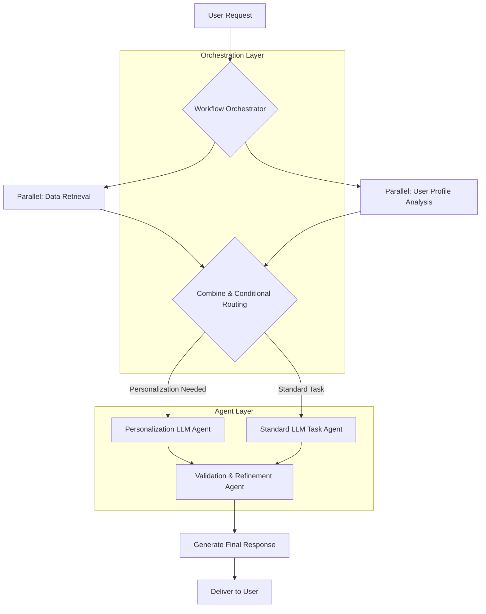

대규모 언어 모델(LLM)을 활용한 애플리케이션이 점점 더 복잡해지면서, 단일 프롬프트 호출만으로는 해결하기 어려운 다단계, 다중 구성 요소 상호작용이 요구됩니다. 이러한 복잡성을 관리하고, 시스템의 확장성, 유지보수성, 신뢰성을 확보하기 위해 '워크플로우 오케스트레이션'은 필수적인 설계 패턴으로 부상하고 있습니다. 이 패턴은 LLM 호출, 외부 도구 사용, 데이터 처리, 조건부 로직, 심지어 인간 개입까지 포함하는 일련의 작업을 체계적으로 구성하고 실행합니다. 단순히 LLM API를 호출하는 것을 넘어, 비즈니스 로직과 AI 기능을 결합하여 견고한 프로덕션 시스템을 구축하는 핵심적인 접근 방식입니다.

## 워크플로우 오케스트레이션의 핵심 요소

복잡한 LLM 워크플로우를 성공적으로 오케스트레이션하기 위해서는 다음과 같은 핵심 요소들이 고려되어야 합니다.

### 1. Sequential Chains (순차 체인)
가장 기본적인 형태로, LLM 호출이나 도구 사용 등 일련의 작업이 순서대로 실행됩니다. 이전 단계의 출력이 다음 단계의 입력으로 사용되는 것이 일반적입니다. 예를 들어, 사용자 질의를 받아 요약한 후, 요약된 내용을 바탕으로 데이터베이스를 검색하는 과정입니다.

### 2. Parallel Processing (병렬 처리)
서로 독립적인 여러 작업을 동시에 실행하여 전체 워크플로우의 지연 시간(latency)을 줄이는 패턴입니다. 예를 들어, 사용자 질의에 대한 답변을 생성하는 동안, 동시에 사용자 프로필을 분석하여 개인화된 추천 정보를 준비할 수 있습니다. 두 작업의 결과는 나중에 병합될 수 있습니다.

### 3. Conditional Routing (조건부 라우팅)
LLM의 출력, 외부 시스템의 상태, 또는 특정 비즈니스 로직에 따라 워크플로우의 다음 경로를 동적으로 결정하는 기능입니다. 이는 유연하고 적응적인 애플리케이션을 구축하는 데 필수적입니다. 예를 들어, LLM이 '긴급'으로 분류한 요청은 특정 에이전트에게 전달하고, '일반' 요청은 다른 처리 파이프라인으로 라우팅하는 식입니다.

### 4. Agentic Workflows (에이전트 기반 워크플로우)
자율적으로 판단하고, 도구를 사용하며, 목표를 달성하기 위해 여러 단계를 수행할 수 있는 LLM 에이전트를 워크플로우의 구성 요소로 포함하는 것입니다. 이는 복잡한 문제를 해결하거나 예측 불가능한 상황에 대응하는 데 효과적입니다. 에이전트들이 서로 협력하거나, 특정 역할을 맡아 작업을 분담할 수 있습니다.

### 5. Human-in-the-Loop (인간 개입)
특정 조건(예: LLM의 낮은 신뢰도, 민감한 결정, 규제 준수 필요)에서 인간이 워크플로우에 개입하여 검토, 승인 또는 수정을 수행하는 패턴입니다. 이는 LLM 기반 시스템의 안전성과 신뢰성을 높이는 데 중요합니다.

## 아키텍처 패턴

워크플로우 오케스트레이션은 다양한 아키텍처 패턴으로 구현될 수 있습니다.

*   **Directed Acyclic Graph (DAG)**: Airflow, Prefect, KFP (Kubeflow Pipelines) 등 전통적인 워크플로우 관리 시스템에서 널리 사용되는 방식으로, 작업 간의 의존성을 명확하게 표현합니다.
*   **State Machines (상태 머신)**: 복잡한 상태 전환과 장기 실행 워크플로우에 적합하며, 각 상태에서 특정 로직을 실행하고 다음 상태로 전환하는 규칙을 정의합니다. Saga 패턴과 유사하게 분산 트랜잭션 관리에 유용합니다.
*   **Event-Driven Architectures (이벤트 기반 아키텍처)**: 워크플로우 구성 요소들이 이벤트를 발행하고 구독함으로써 느슨하게 결합되고 비동기적으로 통신합니다. 높은 확장성과 탄력성을 제공합니다.

## 코드 예시: 간단한 LLM 워크플로우 오케스트레이터 (Python)

다음 Python 코드 스니펫은 개념적인 LLM 워크플로우 오케스트레이션을 보여줍니다. 실제 프로덕션에서는 LangChain, LlamaIndex, `aiolifecycle`과 같은 프레임워크를 활용하는 것이 일반적입니다.

```python
import asyncio
from typing import Dict, Any, List

async def call_llm(prompt: str, model_name: str = "gpt-4") -> str:
    """Simulates an asynchronous LLM call."""
    print(f"Calling LLM ({model_name}) with: {prompt[:50]}...")
    await asyncio.sleep(0.5) # Simulate API latency
    if "summarize" in prompt.lower():
        return f"Summary of '{prompt[:20]}...': Important points were made."
    elif "recommend" in prompt.lower():
        return f"Recommendation for '{prompt[:20]}...': Personalized suggestion."
    elif "validate" in prompt.lower():
        return "Validation: Output appears correct."
    return f"LLM response to: {prompt[:20]}..."

async def search_database(query: str) -> List[str]:
    """Simulates an asynchronous database search."""
    print(f"Searching DB for: {query[:50]}...")
    await asyncio.sleep(0.3)
    return [f"DB Result 1 for {query}", f"DB Result 2 for {query}"]

async def analyze_user_profile(user_id: str) -> Dict[str, Any]:
    """Simulates user profile analysis."""
    print(f"Analyzing user profile: {user_id}")
    await asyncio.sleep(0.2)
    return {"user_id": user_id, "preferences": ["tech", "programming"], "is_premium": True}

async def execute_complex_llm_workflow(user_query: str, user_id: str) -> str:
    print("\n--- Starting LLM Workflow ---")
    context = {"user_query": user_query, "user_id": user_id}

    # Step 1: Parallel processing for initial data and profile analysis
    summary_task = asyncio.create_task(call_llm(f"Summarize the user query: {user_query}", model_name="claude-3-5-sonnet"))
    profile_task = asyncio.create_task(analyze_user_profile(user_id))

    summary = await summary_task
    user_profile = await profile_task

    context["summary"] = summary
    context["user_profile"] = user_profile
    print(f"Parallel tasks completed. Summary: {summary[:30]}..., Profile: {user_profile}")

    # Step 2: Conditional Routing based on user profile
    next_action_prompt = f"Given the user query '{user_query}' and profile {user_profile}, what is the best next action?"
    action_recommendation = await call_llm(next_action_prompt)
    print(f"Action recommended by LLM: {action_recommendation}")

    if "personalized suggestion" in action_recommendation.lower() or user_profile.get("is_premium"):
        print("Routing to Personalization Agent.")
        personalized_response = await call_llm(
            f"Generate a personalized recommendation for '{user_query}' based on {user_profile} and summary '{summary}'.",
            model_name="gemini-1.5-flash"
        )
        final_output = f"Personalized: {personalized_response}"
    else:
        print("Routing to Standard Task Agent.")
        db_results = await search_database(user_query)
        standard_response = await call_llm(
            f"Answer '{user_query}' using summary '{summary}' and DB results {db_results}.",
            model_name="gpt-4o"
        )
        final_output = f"Standard: {standard_response}"

    # Step 3: Final validation and refinement (Agentic approach)
    validation_prompt = f"Validate and refine the following response: {final_output}. Ensure it addresses '{user_query}'."
    refined_output = await call_llm(validation_prompt, model_name="claude-3-opus")

    print("--- LLM Workflow Completed ---")
    return refined_output

# Example usage
# asyncio.run(execute_complex_llm_workflow("Explain quantum computing and recommend resources", "user123"))
```

## 워크플로우 시각화

다음 Mermaid 다이어그램은 위에서 설명한 복합 LLM 워크플로우 오케스트레이션 패턴을 시각적으로 보여줍니다.



## 트레이드오프

워크플로우 오케스트레이션 패턴은 강력하지만, 항상 최적의 솔루션은 아닙니다. 장단점을 명확히 이해하고 프로젝트의 요구사항에 맞춰 적용해야 합니다.

*   **복잡성 증가 vs. 유연성 및 제어 향상**: 워크플로우를 명시적으로 정의하고 관리하는 것은 초기 설정 및 유지보수 복잡성을 증가시킵니다. 그러나 이는 복잡한 비즈니스 로직과 다양한 LLM 상호작용을 정밀하게 제어하고 유연하게 변경할 수 있는 기반을 제공합니다. (언제 좋고/나쁜지: 다단계의 복잡한 로직, 다양한 LLM 모델/도구 통합, 높은 신뢰성이 요구될 때 좋고, 간단한 단일 LLM 호출이나 프로토타이핑 단계에서는 과도한 오버헤드가 될 수 있어 나쁩니다.)
*   **지연 시간(Latency) 및 처리량(Throughput) 최적화 vs. 오케스트레이션 오버헤드**: 병렬 처리 및 비동기 작업은 전체 워크플로우의 실행 시간을 단축하고 처리량을 높일 수 있습니다. 하지만 워크플로우 엔진의 상태 관리, 스케줄링, 통신 오버헤드가 발생하여 관리 비용이 증가할 수 있습니다. (언제 좋고/나쁜지: 여러 독립적인 LLM 호출이나 외부 API 호출이 필요한 경우 지연 시간을 줄이는 데 좋고, 각 단계의 실행 시간이 매우 짧고 의존성이 높은 순차적 작업에서는 오케스트레이션 자체가 병목이 될 수 있어 나쁩니다.)
*   **내결함성 및 신뢰성 증대 vs. 자원 소모**: 워크플로우 내의 각 단계에 재시도(Retry), 폴백(Fallback), 오류 처리 로직을 적용하여 시스템의 견고성을 높일 수 있습니다. 이는 장애 발생 시 전체 시스템의 안정성을 보장하지만, 추가적인 로직 구현과 모니터링을 위한 자원을 소모합니다. (언제 좋고/나쁜지: 외부 API 의존성이 높거나, LLM 응답이 불안정할 수 있는 프로덕션 환경에서 좋고, 내부적으로 완벽하게 제어되는 간단한 로직에서는 불필요한 복잡성이 될 수 있어 나쁩니다.)
*   **개발자 경험(DX) 향상 vs. 특정 프레임워크 종속성**: LangChain과 같은 오케스트레이션 프레임워크는 워크플로우 정의를 간소화하고 개발 생산성을 높입니다. 하지만 이러한 프레임워크에 대한 종속성이 생길 수 있으며, 커스터마이징이 어렵거나 특정 기능이 제한될 수 있습니다. (언제 좋고/나쁜지: 표준화된 패턴으로 빠르게 개발해야 하거나, 팀원 간의 협업 효율을 높일 때 좋고, 고도로 최적화된 성능이나 특정 시스템과의 긴밀한 통합이 필요할 때는 맞지 않을 수 있습니다.)

## 실전 체크리스트

복잡한 LLM 애플리케이션에 워크플로우 오케스트레이션을 도입할 때 다음 항목들을 검토하고 적용하세요.

*   [ ] 워크플로우의 각 단계별로 명확한 입출력 스키마와 예상되는 LLM 동작, 오류 유형이 정의되어 있는가?
*   [ ] 워크플로우 상태 관리 전략(예: DB 저장, 메시지 큐 활용)이 정의되었고, 각 단계가 멱등성(idempotent)을 보장하도록 설계되었는가?
*   [ ] LLM 호출 실패, 외부 도구 타임아웃 등 잠재적 오류에 대한 재시도, 폴백, 타임아웃 전략이 각 단계 또는 서브 워크플로우 레벨에서 통합되어 있는가?
*   [ ] 워크플로우 실행 흐름, 단계별 소요 시간, LLM API 비용, 오류 발생률 등을 추적할 수 있는 모니터링 및 로깅 시스템이 구축되어 있는가?
*   [ ] LLM의 동적 출력에 기반한 조건부 라우팅 로직이 견고하며, 예외적인 LLM 응답(예: 가비지 출력, 형식 미준수)을 안전하게 처리할 수 있는가?
*   [ ] 민감한 데이터 처리, 외부 도구 접근 시 보안 및 권한 관리가 워크플로우 전반에 걸쳐 적절하게 적용되어 있는가?
*   [ ] 예상되는 동시성(concurrency) 및 처리량(throughput) 요구사항을 충족하기 위한 병렬 처리 또는 분산 워크플로우 실행 전략이 설계되어 있는가?
*   [ ] LLM의 낮은 신뢰도, 중요 의사결정 등 특정 조건에서 인간의 개입(Human-in-the-Loop)을 위한 메커니즘이 설계되고 구현되어 있는가?
*   [ ] 워크플로우 버전 관리 및 롤백 전략이 마련되어 있어, 변경 사항으로 인한 문제를 신속하게 해결할 수 있는가?