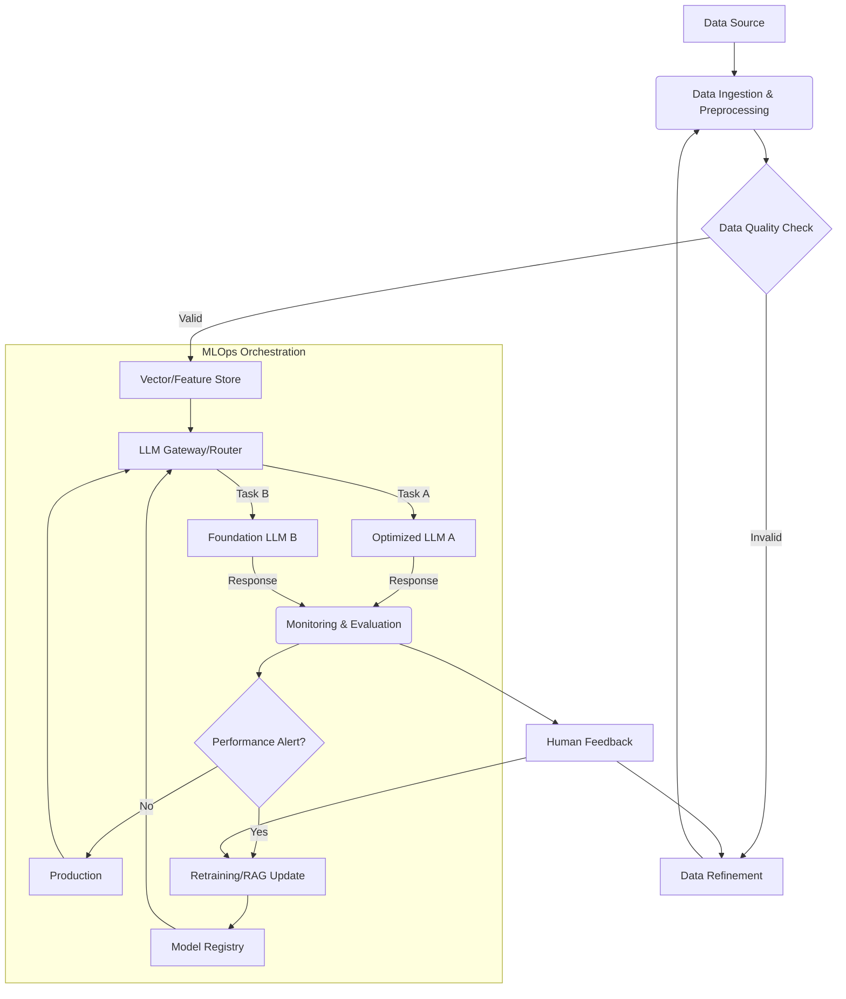

대규모 언어 모델 (LLM) 기반 애플리케이션의 복잡성은 배포, 관리, 확장에 상당한 운영 과제를 제기합니다. 2026년 기준, 에이전트 기반 시스템과 동적 자원 할당 같은 정교한 LLM 워크로드를 위해 MLOps (Machine Learning Operations) 파이프라인 디자인 패턴은 필수적입니다. 이는 개발 주기를 가속화하고 프로덕션 안정성을 확보하는 핵심입니다.

## LLM MLOps 파이프라인 핵심 원칙

효과적인 LLM MLOps 파이프라인은 **모듈성, 자동화, 관측 가능성, 확장성, 신속성** 원칙에 기반합니다.

## 대규모 LLM 워크로드를 위한 디자인 패턴

### 1. 데이터 중심 파이프라인 (Data-Centric Pipelines)
LLM 성능은 고품질 데이터에 좌우됩니다. 데이터 수집, 정제, 임베딩 생성 및 벡터 스토어 업데이트가 지속적으로 관리되어야 합니다. RAG 시스템을 위한 최신 지식 기반 유지와 더불어, **자동화된 데이터 품질 검증 및 드리프트 감지**는 데이터 무결성을 보장합니다.

### 2. 동적 모델 관리 및 배포 (Dynamic Model Management & Deployment)
다양한 LLM (상용 API, 오픈소스) 통합 및 관리가 중요합니다. **동적 LLM 라우팅**은 비용, 성능, 태스크에 따라 최적 모델을 선택하며, **캐싱 전략**으로 API 호출 비용을 절감합니다. **Blue/Green 또는 Canary 배포**는 무중단 배포를, **서버리스/컨테이너 기반 추론 엔드포인트**는 유연한 확장성을 제공합니다.

### 3. 지속적 평가 및 피드백 루프 (Continuous Evaluation & Feedback Loop)
LLM 성능과 안전성 모니터링 및 평가 시스템이 필수적입니다. **자동화된 오프라인/온라인 평가 프레임워크**는 정량적 지표를 제공하며, **인간 참여 (Human-in-the-Loop)** 피드백 메커니즘으로 환각, 편향 문제를 개선합니다. 모니터링 결과는 데이터 또는 모델 학습 파이프라인으로 피드백되어 지속적 개선을 이끌어냅니다. 2026년에는 **에이전트 기반 자동화**가 평가 및 개선 워크플로우에 적극 활용됩니다.

### 4. 인프라스트럭처 애즈 코드 (IaC) 기반 배포
Terraform, Pulumi 같은 IaC 도구로 LLM 파이프라인 인프라를 코드로 관리합니다. 이는 재현 가능한 배포, 환경 일관성, 빠른 프로비저닝 및 확장성을 보장합니다.

다음 Mermaid 다이어그램은 대규모 LLM 워크로드를 위한 MLOps 파이프라인의 핵심 흐름을 시각화합니다.



### 동적 LLM 라우터 예시 (Python, FastAPI)
요청 유형에 따라 다른 LLM 엔드포인트로 라우팅하는 FastAPI 코드 예시입니다.

```python
from fastapi import FastAPI, HTTPException
from pydantic import BaseModel
import httpx

app = FastAPI()

class LLMRequest(BaseModel):
    prompt: str
    request_type: str # 'summary', 'qa'

LLM_ENDPOINTS = {
    "summary": "http://summary-llm-service/predict",
    "qa": "http://qa-llm-service/predict",
}

@app.post("/route_llm")
async def route_llm_request(request: LLMRequest):
    endpoint = LLM_ENDPOINTS.get(request.request_type)
    if not endpoint:
        raise HTTPException(status_code=400, detail=f"Unknown request type: {request.request_type}")

    try:
        async with httpx.AsyncClient() as client:
            response = await client.post(endpoint, json={"text": request.prompt})
            response.raise_for_status()
            return response.json()
    except httpx.RequestError as e:
        raise HTTPException(status_code=500, detail=f"LLM service call failed: {e}")
    except httpx.HTTPStatusError as e:
        raise HTTPException(status_code=e.response.status_code, detail=f"LLM service error: {e.response.text}")
```

## 트레이드오프 (Trade-offs)

*   **복잡성 vs. 유연성 및 확장성 (Complexity vs. Flexibility & Scalability)**:
    *   **언제 좋은가**: 마이크로서비스 아키텍처는 구성 요소의 독립적 개발/확장을 통해 유연성과 확장성을 극대화, 대규모 서비스에 필수적.
    *   **언제 나쁜가**: 초기 설정/유지 보수 복잡도 높음, 소규모 프로젝트에 오버헤드 큼.

*   **비용 효율성 vs. 성능 최적화 (Cost Efficiency vs. Performance Optimization)**:
    *   **언제 좋은가**: 동적 LLM 라우팅/캐싱은 최적/최저 비용 모델 선택, 반복 요청 비용 절감으로 운영 비용 최적화.
    *   **언제 나쁜가**: 라우팅 로직 개발/유지 보수 비용 발생, 복잡한 정책 시 추가 지연 시간(Latency) 가능, 지속적 모니터링/튜닝 요구.

*   **자동화 vs. 인간 개입 및 통제 (Automation vs. Human Intervention & Control)**:
    *   **언제 좋은가**: 에이전트 기반 자동화 및 드리프트 감지는 반복 작업을 줄이고 모델 성능 저하에 빠르게 대응하여 운영 효율성 증대.
    *   **언제 나쁜가**: 고도 자동화는 예상치 못한 오류/편향 확산 위험. LLM 생성 결과의 불확실성으로, 중요한 결정엔 인간 검토/승인 (Human-in-the-loop) 필수.

## 실전 체크리스트 (Practical Checklist)

LLM MLOps 파이프라인 적용 시 다음 항목을 검증합니다.

*   [ ] **데이터 파이프라인 자동화**: LLM 데이터 수집, 전처리, 품질 검증, 드리프트 감지가 완전 자동화되어 있는가?
*   [ ] **모델 재현성 및 버전 관리**: 모든 LLM 모델이 버전 관리되고, 특정 모델 버전이 데이터셋과 코드로부터 완벽하게 재현 가능한가?
*   [ ] **LLM 라우팅 및 폴백**: 여러 LLM 간 동적 라우팅이 구현되고, 주력 LLM 서비스 장애 시 폴백 전략이 작동하는가?
*   [ ] **무중단 배포 및 롤백**: CI/CD를 통한 Blue/Green 또는 Canary 배포로 무중단 배포가 자동화되어 있으며, 문제 발생 시 즉시 롤백 가능한가?
*   [ ] **실시간 모니터링**: LLM 추론 지연 시간, 처리량, 에러율, API 비용 등 핵심 지표를 실시간 모니터링하고 이상 감지 시 경고 시스템이 작동하는가?
*   [ ] **피드백 루프**: 사용자 피드백과 모델 평가 결과가 데이터 개선 또는 모델 재학습 파이프라인으로 자동으로 연결되는가?
*   [ ] **보안 및 규정 준수**: LLM API 키, 민감 데이터 처리, 접근 제어 등 보안 원칙이 파이프라인 전반에 적용되고 관련 규정을 준수하는가?