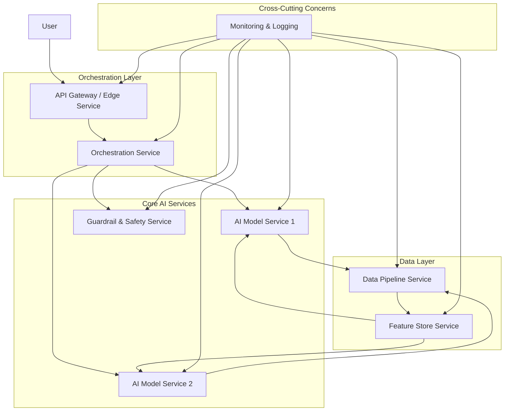

대규모 AI 시스템의 복잡성이 심화됨에 따라, 유연하고 확장 가능한 아키텍처는 필수적인 요소가 되었습니다. 마이크로서비스 기반 하네스(Harness) 아키텍처는 이러한 AI 시스템의 배포, 관리, 확장 및 운영을 위한 강력한 프레임워크를 제공하며, 2026년 실무에서 요구되는 핵심 역량 중 하나입니다. 이 패턴은 AI 모델, 데이터 파이프라인, 비즈니스 로직, 그리고 안전(Safety) 및 거버넌스(Governance) 메커니즘을 독립적인 서비스로 분리하여 각 컴포넌트의 개발, 배포, 확장을 민첩하게 만듭니다.

## 마이크로서비스 기반 하네스 아키텍처의 핵심 원칙

마이크로서비스 기반 하네스는 다음과 같은 핵심 원칙에 기반합니다:

*   **모듈성 (Modularity) 및 분리 (Decoupling)**: AI 모델, 데이터 처리, 추론 로직, 사용자 인터페이스 등 각 기능을 독립적인 서비스로 분리하여 서비스 간의 의존성을 최소화합니다. 이를 통해 특정 서비스의 장애가 전체 시스템에 미치는 영향을 줄입니다.
*   **확장성 (Scalability)**: 각 마이크로서비스는 독립적으로 확장될 수 있어, AI 워크로드의 변화에 따라 필요한 리소스만 유연하게 증설하거나 축소할 수 있습니다. 예를 들어, 특정 모델의 추론 요청이 급증할 경우 해당 추론 서비스만 스케일 아웃할 수 있습니다.
*   **탄력성 (Resilience)**: 서비스 격리(Service Isolation)를 통해 한 서비스의 실패가 다른 서비스로 전파되는 것을 방지합니다. 서킷 브레이커(Circuit Breaker), 리트라이(Retry), 폴백(Fallback) 패턴 등을 적용하여 시스템의 가용성을 높입니다.
*   **관측 가능성 (Observability)**: 분산된 시스템에서 문제 진단 및 성능 모니터링은 필수적입니다. 중앙 집중식 로깅(Logging), 분산 트레이싱(Distributed Tracing), 메트릭(Metrics) 수집 시스템을 통해 시스템의 상태를 실시간으로 파악합니다.
*   **자동화 (Automation)**: CI/CD 파이프라인을 구축하여 서비스의 빌드, 테스트, 배포 과정을 자동화합니다. 이는 개발 속도를 높이고, 인적 오류를 줄이며, 일관된 배포 환경을 유지하는 데 기여합니다.

## 핵심 컴포넌트 디자인 패턴

대규모 AI 시스템을 위한 마이크로서비스 하네스는 일반적으로 다음 컴포넌트들로 구성됩니다.

### 1. API Gateway / Edge Service
모든 외부 요청의 단일 진입점(Single Entry Point) 역할을 합니다. 요청 라우팅, 인증(Authentication), 권한 부여(Authorization), 로드 밸런싱(Load Balancing), 캐싱(Caching) 등의 기능을 수행하여 백엔드 AI 서비스의 복잡성을 숨기고 보안을 강화합니다.

### 2. Orchestration Service (오케스트레이션 서비스)
여러 AI 마이크로서비스 간의 복잡한 워크플로우를 조정하고 관리합니다. 에이전트 기반 AI 시스템에서는 LLM Agent의 추론 체인(Inference Chain) 관리, 도구 사용(Tool Use) 조정, 장기 목표 관리 등의 역할을 수행할 수 있습니다. Saga 패턴이나 Workfow Engine을 활용하여 분산 트랜잭션(Distributed Transaction)을 관리할 수 있습니다.

### 3. AI Model Services (AI 모델 서비스)
각 AI 모델 또는 특정 추론 로직을 캡슐화한 독립적인 서비스입니다. 언어 모델(LLM), 비전 모델, 추천 모델 등 다양한 유형의 모델이 개별 서비스로 배포될 수 있습니다. 버전 관리, A/B 테스팅, 실시간 모델 업데이트 등을 지원합니다.

### 4. Data Pipeline & Feature Store Services
AI 모델에 필요한 데이터를 수집, 전처리, 변환하여 제공하는 서비스입니다. 스트리밍 데이터 처리(Streaming Data Processing), 배치 처리(Batch Processing)를 위한 파이프라인과 모델 훈련 및 추론에 필요한 피처(Feature)를 저장하고 관리하는 피처 스토어(Feature Store) 서비스가 포함됩니다.

### 5. Guardrail & Safety Services
AI 시스템의 출력(Output)이 안전하고 윤리적인 가이드라인을 준수하는지 검증하는 서비스입니다. 유해 콘텐츠 필터링, 편향 감지(Bias Detection), 정책 준수 검사 등을 수행하여 AI Agent의 'Superpowers'가 의도와 일치하는지 확인합니다. 이는 AI Agent safety constraint control design patterns과 직접적으로 연관됩니다.

## 아키텍처 시각화

다음 Mermaid 다이어그램은 마이크로서비스 기반 AI 하네스 아키텍처의 개요를 보여줍니다.



## 코드 예제: 간단한 API Gateway와 AI 서비스 라우팅

다음은 Python Flask를 사용하여 API Gateway가 `/predict` 요청을 AI 모델 서비스로 라우팅하는 간단한 예제입니다. 실제 프로덕션 환경에서는 서비스 디스커버리(Service Discovery), 고급 로드 밸런싱, 인증 등을 위한 더 복잡한 메커니즘이 필요합니다.

```python
# app_gateway.py (API Gateway Example)
from flask import Flask, request, jsonify
import requests

app = Flask(__name__)

AI_MODEL_SERVICE_URL = "http://localhost:5001/ai-predict" # AI Model Service Endpoint

@app.route("/predict", methods=["POST"])
def predict():
    """
    API Gateway endpoint for AI prediction requests.
    Routes requests to the AI Model Service.
    """
    data = request.json
    if not data:
        return jsonify({"error": "No data provided"}), 400

    try:
        # Route request to AI Model Service
        response = requests.post(AI_MODEL_SERVICE_URL, json=data)
        response.raise_for_status() # Raise HTTPError for bad responses (4xx or 5xx)
        return jsonify(response.json()), response.status_code
    except requests.exceptions.ConnectionError as e:
        return jsonify({"error": f"AI Model Service unavailable: {e}"}), 503
    except requests.exceptions.HTTPError as e:
        return jsonify({"error": f"AI Model Service returned error: {e.response.text}"}), e.response.status_code
    except Exception as e:
        return jsonify({"error": f"An unexpected error occurred: {e}"}), 500

if __name__ == "__main__":
    app.run(port=5000, debug=True)

# ai_model_service.py (AI Model Service Example)
from flask import Flask, request, jsonify

ai_app = Flask(__name__)

@ai_app.route("/ai-predict", methods=["POST"])
def ai_predict():
    """
    Simulated AI Model Prediction Service.
    """
    data = request.json
    if "input" not in data:
        return jsonify({"error": "Missing 'input' in request"}), 400

    # Simulate AI model prediction logic
    input_text = data["input"]
    processed_text = input_text.upper() # Simple processing
    prediction_result = f"Processed: {processed_text}"

    return jsonify({"original_input": input_text, "prediction": prediction_result}), 200

if __name__ == "__main__":
    ai_app.run(port=5001, debug=True)
```

위 코드는 `app_gateway.py` (포트 5000)와 `ai_model_service.py` (포트 5001) 두 개의 독립적인 Flask 애플리케이션으로 구성됩니다. API Gateway는 클라이언트 요청을 받아 AI 모델 서비스로 전달하고, AI 모델 서비스는 실제 AI 로직을 수행하는 것을 시뮬레이션합니다.

## 트레이드오프

마이크로서비스 기반 하네스 아키텍처는 많은 이점을 제공하지만, 고려해야 할 트레이드오프도 존재합니다.

*   **복잡성 증가 (Increased Complexity) vs. 유연성 및 확장성 (Flexibility & Scalability)**
    *   **언제 좋고**: 시스템의 기능이 많고, 각 기능의 변화 주기가 다르며, 독립적인 팀이 병렬로 개발해야 할 때 이상적입니다. 높은 확장성과 특정 컴포넌트의 유연한 기술 스택 선택이 중요할 때 좋습니다.
    *   **언제 나쁜지**: 시스템이 비교적 작고, 기능이 안정적이며, 단일 팀이 관리하는 경우 마이크로서비스의 오버헤드가 더 클 수 있습니다. 초기 개발 비용과 운영 복잡성이 증가합니다.

*   **성능 오버헤드 (Performance Overhead) vs. 서비스 격리 (Service Isolation) 및 탄력성 (Resilience)**
    *   **언제 좋고**: 각 서비스 간의 네트워크 통신으로 인한 지연(Latency)이 허용 가능하고, 서비스 장애가 전체 시스템에 미치는 영향을 최소화해야 할 때 좋습니다. 고가용성(High Availability)이 핵심 요구사항일 때 유리합니다.
    *   **언제 나쁜지**: 밀리초 단위의 매우 낮은 지연 시간이 요구되는 실시간 처리 시스템에는 부적합할 수 있습니다. 서비스 간 빈번한 동기 통신은 성능 병목을 유발할 수 있습니다.

*   **운영 비용 (Operational Cost) vs. 리소스 효율성 (Resource Efficiency) 및 민첩성 (Agility)**
    *   **언제 좋고**: 각 서비스를 독립적으로 배포하고 스케일링함으로써 특정 서비스의 부하에 따라 리소스를 최적화하고, 팀이 민첩하게 기능을 개발하고 배포해야 할 때 효율적입니다.
    *   **언제 나쁜지**: 더 많은 서비스 인스턴스와 인프라를 관리해야 하므로 모놀리식 아키텍처보다 초기 설정 및 지속적인 운영 비용이 높을 수 있습니다. 분산 시스템 모니터링 및 로깅 도구에 대한 투자와 전문 인력이 필요합니다.

*   **데이터 일관성 도전 (Data Consistency Challenges) vs. 데이터 독립성 (Data Independence)**
    *   **언제 좋고**: 각 서비스가 자신의 데이터를 독립적으로 관리하여 데이터베이스 기술 선택의 유연성을 확보하고, 서비스 간의 데이터 스키마 변경이 다른 서비스에 미치는 영향을 최소화할 수 있을 때 좋습니다.
    *   **언제 나쁜지**: 여러 서비스에 걸친 비즈니스 트랜잭션에서 데이터 일관성을 유지하기 위한 복잡한 메커니즘(예: Saga 패턴)이 필요하며, 이는 개발 복잡성을 가중시킵니다.

## 실전 체크리스트

대규모 AI 시스템을 위한 마이크로서비스 기반 하네스 아키텍처를 도입할 때 다음 항목들을 검토해야 합니다.

*   - [ ] **서비스 경계 및 책임 명확화**: 각 마이크로서비스의 기능적 경계와 책임이 명확하게 정의되었는가? (Bounded Contexts)
*   - [ ] **API 계약 및 버전 관리**: 서비스 간의 API 계약(Contract)이 명확히 정의되고, 버전 관리가 체계적으로 이루어지는가?
*   - [ ] **종단 간 관측 가능성 구현**: 중앙 집중식 로깅, 분산 트레이싱, 메트릭 수집 시스템이 모든 서비스에 걸쳐 통합되어 실시간 모니터링이 가능한가?
*   - [ ] **자동화된 CI/CD 파이프라인**: 각 마이크로서비스의 빌드, 테스트, 배포를 위한 CI/CD 파이프라인이 자동화되어 있는가?
*   - [ ] **부하 테스트 및 확장성 검증**: 예상되는 최대 부하 및 AI 워크로드 변화에 대한 확장성(Scalability) 테스트를 수행하고 병목 지점을 식별했는가?
*   - [ ] **장애 복구 및 탄력성 패턴 적용**: 서킷 브레이커, 리트라이, 폴백, 타임아웃 등 분산 시스템의 탄력성(Resilience) 패턴이 적절하게 적용되었는가?
*   - [ ] **AI 안전 및 거버넌스 가드레일 통합**: AI 모델의 출력에 대한 안전 및 윤리적 가이드라인 준수를 검증하는 가드레일 서비스가 핵심 흐름에 통합되어 있는가?