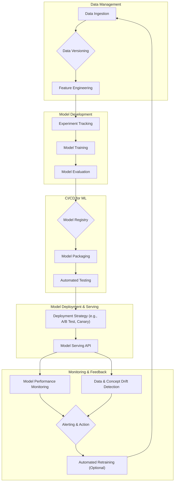

AI 서비스의 안정적인 배포 및 운영은 모델 개발만큼이나 중요한 과제입니다. MLOps (Machine Learning Operations)는 머신러닝 모델의 개발(Development)부터 배포(Deployment), 모니터링(Monitoring)까지 전체 라이프사이클을 효율적으로 관리하여 운영 안정성과 재현성을 확보하는 방법론입니다. 이는 AI 모델의 빠른 시장 출시, 성능 저하 방지, 그리고 예측 불가능한 오류로부터의 복구 능력을 강화하는 핵심 기반이 됩니다.

## MLOps 워크플로우의 핵심 구성 요소

안정적인 AI 서비스 운영을 위한 MLOps 워크플로우는 다음과 같은 주요 단계를 포함합니다.

### 1. 데이터 관리 및 버전 관리 (Data Management & Versioning)

AI 모델의 성능은 데이터에 크게 의존합니다. 특징 공학(Feature Engineering)에 사용된 원본 데이터와 파생 데이터, 그리고 학습 데이터셋에 대한 체계적인 버전 관리는 모델 재현성과 감사를 위해 필수적입니다. DVC (Data Version Control)나 MLflow와 같은 도구를 활용하여 데이터의 변경 이력을 추적하고, 특정 시점의 데이터셋을 재현할 수 있도록 해야 합니다.

### 2. 모델 개발 및 실험 추적 (Model Development & Experiment Tracking)

다양한 모델 아키텍처, 하이퍼파라미터, 학습 전략이 시도되는 모델 개발 단계에서는 모든 실험의 결과를 체계적으로 기록하는 것이 중요합니다. MLflow, Weights & Biases 등의 플랫폼을 통해 코드 버전, 사용된 데이터셋, 하이퍼파라미터, 성능 지표 등을 추적하여 최적의 모델을 선정하고, 향후 모델 개선에 활용할 수 있습니다.

### 3. CI/CD for ML (Continuous Integration/Continuous Delivery for Machine Learning)

전통적인 소프트웨어 개발의 CI/CD 파이프라인을 ML 워크플로우에 적용합니다. 이는 코드 변경 시 자동 테스트, 모델 학습 및 평가, 모델 레지스트리 등록 등의 과정을 자동화하여 모델 배포 과정을 가속화하고 휴먼 에러를 줄입니다.

*   **CI (Continuous Integration)**: 코드 변경 시 모델 학습 파이프라인의 유효성을 검사하고, 새로운 모델 후보를 생성합니다.
*   **CD (Continuous Delivery/Deployment)**: 검증된 모델을 프로덕션 환경에 배포하거나, A/B 테스트와 같은 점진적 배포 전략을 적용합니다.

```python
# Simplified CI/CD pipeline step: Model Validation
def validate_model(model_path: str, test_data_path: str) -> bool:
    """Loads a model and validates its performance against a test set."""
    import pandas as pd
    import joblib
    from sklearn.metrics import accuracy_score

    model = joblib.load(model_path)
    test_data = pd.read_csv(test_data_path)
    X_test = test_data.drop('target', axis=1)
    y_test = test_data['target']

    predictions = model.predict(X_test)
    accuracy = accuracy_score(y_test, predictions)

    print(f"Model Accuracy: {accuracy:.4f}")
    if accuracy > 0.85: # Threshold for production readiness
        print("Model meets performance requirements.")
        return True
    else:
        print("Model performance is below threshold.")
        return False

# Example usage in a CI script
# if validate_model("artifacts/latest_model.pkl", "data/test_dataset.csv"):
#     print("Proceeding to deployment...")
# else:
#     print("Model validation failed. Aborting deployment.")
```

### 4. 모델 배포 및 서빙 (Model Deployment & Serving)

학습 및 검증된 모델은 RESTful API, gRPC 서비스, 혹은 온디바이스(on-device) 형태로 배포되어 실제 서비스에서 추론(inference) 요청을 처리합니다. Kubernetes, Docker, Kubeflow, SageMaker Endpoint와 같은 기술 스택을 활용하여 모델을 컨테이너화하고, 확장 가능하며 고가용성(High Availability)을 갖춘 형태로 서빙할 수 있도록 설계해야 합니다.

### 5. 모니터링 및 피드백 루프 (Monitoring & Feedback Loops)

배포된 모델은 지속적으로 모니터링되어야 합니다. 데이터 드리프트(Data Drift), 모델 드리프트(Model Drift), 성능 저하, 이상치 등을 감지하고, 이에 대한 알림 및 자동화된 재학습(retraining) 또는 롤백(rollback) 메커니즘을 구현하는 것이 중요합니다. Prometheus, Grafana, Evidently AI, WhyLabs 등의 도구를 활용하여 모델의 입력/출력 데이터 분포, 추론 지연 시간(latency), 에러율, 비즈니스 지표에 대한 영향을 실시간으로 추적합니다. 이 모니터링 결과는 다시 모델 재학습 데이터로 활용되는 피드백 루프를 형성합니다.

### MLOps 워크플로우 다이어그램



## 2026년 MLOps 트렌드 반영

2026년의 MLOps는 더욱 고도화된 자동화, 설명 가능성(Explainability), 그리고 효율적인 리소스 관리에 초점을 맞추고 있습니다.

*   **AIOps for MLOps**: AI 기반의 운영 관리(AIOps)를 MLOps 자체에 적용하여, MLOps 파이프라인의 이상 징후를 스스로 감지하고 최적화하는 움직임이 강화되고 있습니다. 예를 들어, 모니터링 시스템이 특정 패턴의 드리프트를 감지하면, 자동으로 재학습 트리거를 조정하거나 데이터 전처리 단계를 최적화하는 식입니다.
*   **설명 가능한 AI (XAI) 통합**: 모델이 왜 특정 결정을 내렸는지 이해하는 것은 규제 준수 및 사용자 신뢰 확보에 필수적입니다. MLOps 워크플로우는 LIME, SHAP과 같은 XAI 기법을 모델 평가 및 모니터링 단계에 통합하여, 모델의 의사결정 과정을 추적하고 설명할 수 있는 기능을 제공해야 합니다.
*   **실시간 및 에지 AI 최적화**: IoT 장치나 모바일 환경에서 실시간 추론을 제공하는 에지 AI(Edge AI)의 확산으로, 모델 경량화(quantization, pruning), 최적화된 서빙 인프라, 그리고 에지 디바이스에서의 배포 및 업데이트 관리가 MLOps의 중요한 부분이 되고 있습니다.
*   **LLM 기반 워크플로우 자동화**: 최신 대규모 언어 모델(LLM)은 MLOps 워크플로우의 특정 단계를 자동화하는 데 활용될 수 있습니다. 예를 들어, 모델 학습 보고서 자동 생성, 모니터링 알림 요약 및 해결 방안 제안, 심지어 경미한 모델 코드 수정 제안 등입니다.

## 트레이드오프

MLOps 워크플로우를 디자인할 때는 항상 여러 요소 간의 트레이드오프를 고려해야 합니다.

*   **완전 자동화 vs. 수동 개입의 유연성**: 초기 설정 및 유지보수 비용을 줄이기 위해 모든 단계를 자동화하려 할 수 있습니다. 완전 자동화는 반복적인 작업에 효율적이지만, 예측 불가능한 상황이나 모델의 성능이 급격히 저하될 경우 빠른 수동 개입이 어려울 수 있습니다. 복잡성이 높은 초기 단계에서는 수동 개입 지점을 유지하여 유연성을 확보하고, 성숙도에 따라 점진적으로 자동화하는 것이 효과적입니다.
*   **포괄적 모니터링 vs. 운영 오버헤드**: 모든 지표를 모니터링하는 것은 문제 발생 시 진단에 유리하지만, 데이터 저장, 처리, 분석에 막대한 리소스와 비용이 발생합니다. 비즈니스 크리티컬한 지표와 모델 성능에 직접적인 영향을 미치는 핵심 지표 위주로 모니터링을 시작하고, 점진적으로 확장하면서 불필요한 지표는 제거하여 운영 오버헤드를 최소화해야 합니다.
*   **빠른 배포 vs. 엄격한 검증**: 신속한 배포는 시장의 변화에 빠르게 대응할 수 있는 장점이 있습니다. 그러나 엄격한 검증 절차 없이는 프로덕션 환경에 버그나 성능 문제가 있는 모델이 배포될 위험이 커집니다. A/B 테스트나 Canary 배포와 같은 점진적 배포 전략을 통해 위험을 줄이면서 빠른 배포를 시도하거나, 비즈니스 영향도가 낮은 모델부터 빠른 배포를 적용하는 것이 바람직합니다.
*   **재현성 확보 vs. 스토리지 및 관리 복잡성**: 데이터와 모델의 모든 버전을 관리하는 것은 모델의 재현성을 보장하고 규제 준수에 필수적입니다. 하지만 이는 엄청난 스토리지 비용과 복잡한 관리 프로세스를 야기합니다. 규제 요구사항이 높은 산업(금융, 의료)에서는 재현성에 더 큰 비중을 두는 반면, 빠르게 변화하는 서비스에서는 핵심 데이터 및 모델 버전에 대한 스냅샷(snapshot) 관리만으로 충분할 수 있습니다.

## 실전 체크리스트

MLOps 워크플로우를 프로젝트에 적용할 때 다음과 같은 항목들을 검증해야 합니다.

*   [ ] 모든 데이터셋(원본, 학습, 테스트)이 버전 관리 시스템(예: DVC, Git LFS)에 의해 추적되고 재현 가능한가?
*   [ ] 모델 학습 및 평가 파이프라인이 CI(Continuous Integration)를 통해 자동으로 실행되고, 최소한의 성능 기준을 충족하는지 검증되는가?
*   [ ] 새로운 모델 배포 시, 자동화된 테스트(예: 통합 테스트, 성능 테스트)가 수행되며, 실패 시 롤백(Rollback) 절차가 명확하게 정의되어 있는가?
*   [ ] 프로덕션 환경에서 모델의 입력 데이터 분포(Data Drift) 및 출력 예측 분포(Concept Drift)를 실시간으로 모니터링하고, 이상 감지 시 알림이 전송되는가?
*   [ ] 배포된 모델의 성능 지표(예: 정확도, 정밀도, 재현율, F1-score) 및 서비스 지표(예: 지연 시간, 에러율, 처리량)가 대시보드를 통해 시각화되고 주기적으로 검토되는가?
*   [ ] 모델 재학습(Retraining) 주기가 데이터 드리프트 또는 성능 저하 감지에 따라 동적으로 조정될 수 있는 메커니즘이 마련되어 있는가?
*   [ ] 모델 배포 환경(컨테이너화, 오케스트레이션)이 고가용성(High Availability) 및 확장성(Scalability)을 보장하며, 장애 발생 시 자동 복구(Self-healing) 기능을 제공하는가?