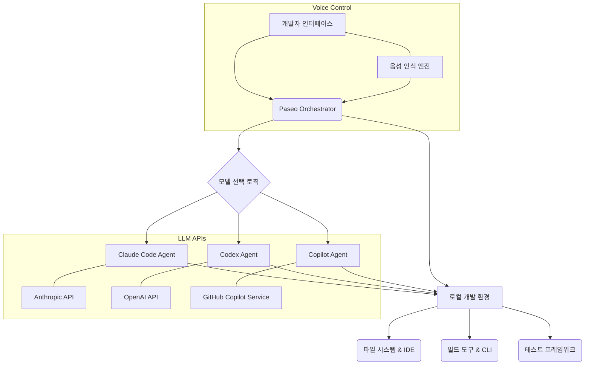

다중 AI 코딩 에이전트 오케스트레이션은 복잡한 소프트웨어 개발 워크플로우를 효율적으로 관리하고 최적화하는 데 필수적인 요소로 부상하고 있다. 특히 Paseo와 같은 오케스트레이터는 Claude Code, Codex, Copilot, OpenCode, Pi 등 다양한 AI 코딩 에이전트를 단일 인터페이스에서 통합 관리하여, 개발자가 최적의 에이전트를 적재적소에 활용할 수 있도록 지원한다. 이 접근 방식은 AI 에이전트의 파편화를 해소하고, 개발 환경과의 깊은 통합을 통해 생산성을 극대화하는 데 중점을 둔다.

## Paseo 기반 다중 에이전트 오케스트레이션의 핵심 개념

Paseo는 여러 AI 코딩 에이전트가 개발자의 데스크톱 또는 모바일 환경에서 Self-hosted 방식으로 실행될 수 있도록 하는 통합 플랫폼이다. 이는 에이전트가 개발자의 전체 개발 환경(도구, 설정, 스킬 등)에 직접 접근하여 작업을 수행할 수 있음을 의미한다. 2026년 현재, 이러한 Self-hosted 접근 방식은 데이터 보안, 개인화된 개발 환경 활용, 그리고 클라우드 기반 서비스의 제약으로부터 자유로워진다는 점에서 큰 주목을 받고 있다.

### 통합 인터페이스 및 모델 선택
Paseo는 파편화된 AI 에이전트들을 하나의 통합된 GUI 또는 CLI 인터페이스 아래에 둔다. 이를 통해 개발자는 특정 작업에 가장 적합한 모델(예: 코드 생성에는 Claude Code, 버그 수정에는 Codex)을 직관적으로 선택하거나, 시스템이 자동으로 최적의 에이전트를 할당하도록 할 수 있다. 이 '작업별 알맞은 모델 선택(Task-specific Model Selection)' 기능은 비용 효율성과 성능 최적화에 기여한다.

### Self-hosted 환경의 장점
에이전트가 개발자의 로컬 머신에서 실행된다는 것은 다음과 같은 이점을 제공한다:
1.  **전체 개발 환경 접근**: 에이전트가 로컬 파일 시스템, IDE 설정, 빌드 도구, 테스트 프레임워크 등 개발자의 모든 도구에 접근하여 실제 개발 워크플로우와 동일한 조건에서 작업을 수행할 수 있다. 이는 클라우드 기반 에이전트가 가상화된 환경에서만 동작하는 한계를 극복한다.
2.  **데이터 주권 및 보안**: 민감한 코드나 프로젝트 데이터를 외부에 노출하지 않고 로컬에서 처리함으로써 데이터 보안 및 기업의 컴플라이언스(Compliance) 요구사항을 충족시킨다.
3.  **오프라인 작업 및 낮은 Latency**: 인터넷 연결 없이도 작업이 가능하며, 클라우드 API 호출에 따른 네트워크 Latency를 제거하여 더 빠른 응답 시간을 제공한다.

### 음성 제어(Voice Control)를 통한 접근성 강화
Paseo는 음성 제어 기능을 통합하여 개발자가 음성 명령으로 에이전트를 조작하고 작업을 할당할 수 있도록 한다. 이는 코딩 과정에서의 핸즈프리(Hands-free) 경험을 제공하여 생산성을 더욱 높이고, 신체적 제약이 있는 개발자에게도 접근성을 향상시킨다. 2026년의 인터랙션 트렌드에 부합하는 기능으로 평가된다.

## 다중 에이전트 오케스트레이션 아키텍처 예시

다음 Mermaid 다이어그램은 Paseo와 같은 오케스트레이터가 여러 코딩 에이전트 및 로컬 개발 환경과 어떻게 상호작용하는지 보여준다.



이 아키텍처는 Paseo Orchestrator가 개발자 인터페이스와 LLM 기반 에이전트, 그리고 실제 개발 환경 사이의 중재자 역할을 수행함을 나타낸다. 모델 선택 로직은 작업의 성격과 에이전트의 역량에 따라 최적의 경로를 결정한다.

## 실제 동작 코드 예시: 간단한 Paseo Playbook (가상)

Paseo는 내부적으로 태스크 정의를 위한 DSL(Domain-Specific Language)이나 설정 파일을 활용할 수 있다. 다음은 Python 스크립트에서 Paseo 라이브러리(가상)를 사용하여 간단한 코드 리팩토링 작업을 오케스트레이션하는 예시이다.

```python
# paseo_orchestrator.py (가상 코드)
from paseo import Paseo
from paseo.agents import ClaudeCode, Copilot
from paseo.tasks import CodeRefactoringTask

# Paseo Orchestrator 초기화
orchestrator = Paseo(
    config_path="./paseo_config.yaml", # 에이전트 및 환경 설정
    log_level="INFO"
)

# 사용 가능한 에이전트 등록 (실제는 config에서 로드)
orchestrator.register_agent(ClaudeCode(api_key="sk-claude-xxx"))
orchestrator.register_agent(Copilot(api_key="gh-copilot-xxx"))

# 코드 리팩토링 태스크 정의
refactoring_task = CodeRefactoringTask(
    name="RefactorLegacyFunction",
    description="Refactor 'old_calculate_total' function for better readability and performance.",
    file_path="./src/utils/legacy_calculator.py",
    target_function="old_calculate_total",
    requirements=["Improve readability", "Optimize for large datasets"],
    preferred_agents=["ClaudeCode", "Copilot"] # 특정 에이전트 선호도
)

# 태스크 실행 및 에이전트 할당
# Paseo는 preferred_agents와 작업 특성을 고려하여 최적의 에이전트(예: ClaudeCode)를 선택
result = orchestrator.execute_task(refactoring_task)

if result.status == "SUCCESS":
    print(f"Refactoring completed by {result.agent_used.name}.")
    print("Suggested changes:")
    print(result.output_diff)
    # 로컬 파일 시스템에 변경 사항 자동 적용 또는 사용자 승인 대기
    # orchestrator.apply_changes(result.output_diff)
else:
    print(f"Refactoring failed: {result.error_message}")
    print(f"Fallback attempt or human intervention needed. Agent used: {result.agent_used.name}")

# paseo_config.yaml (가상 설정 파일)
# agents:
#   - name: ClaudeCode
#     model: claude-3-5-sonnet
#     capabilities: ["code-generation", "refactoring", "documentation"]
#   - name: Copilot
#     model: gpt-4o-mini-copilot
#     capabilities: ["code-completion", "simple-refactoring"]
# environment:
#   workspace_root: /Users/developer/my_project
#   tools: ["git", "pytest", "mypy"]
#   voice_control_enabled: true
```

위 예시에서 `Paseo` 인스턴스는 에이전트들을 등록하고, `CodeRefactoringTask`를 실행할 때 내부 로직에 따라 가장 적합한 에이전트를 동적으로 선택한다. 이는 `paseo_config.yaml`에 정의된 에이전트의 `capabilities`와 태스크의 `requirements`를 기반으로 할 수 있다.

## 트레이드오프

### 1. 통합 인터페이스의 편의성 vs. 초기 설정 및 유지보수 복잡성
*   **언제 좋고**: 다양한 AI 에이전트를 사용하면서 발생하는 컨텍스트 스위칭(Context Switching) 비용을 줄이고 싶을 때, 일관된 사용자 경험을 제공하여 생산성을 높일 때 유리하다. 특히 여러 AI 모델의 장점을 활용해야 하는 복잡한 프로젝트에서 효과적이다.
*   **언제 나쁜지**: 단일 AI 에이전트만 사용하거나, 단순 반복 작업을 수행하는 소규모 프로젝트의 경우, Paseo와 같은 오케스트레이터의 초기 설정 및 관리 오버헤드가 불필요하게 느껴질 수 있다. 에이전트 추가 시 호환성 문제가 발생할 수도 있다.

### 2. Self-hosted 환경의 보안 및 유연성 vs. 리소스 관리 및 인프라 부담
*   **언제 좋고**: 민감한 기업 코드나 기밀 데이터를 다루는 프로젝트에서 데이터 유출 위험을 최소화하고 싶을 때, 또는 특정 로컬 개발 도구나 환경에 깊이 의존하는 작업을 수행할 때 강력한 이점을 제공한다. 클라우드 비용을 절감하는 효과도 있다.
*   **언제 나쁜지**: 로컬 머신의 리소스(CPU, GPU, RAM)가 제한적이거나, 여러 개발자가 공유하는 중앙 집중식 환경이 필요한 경우, Self-hosted 환경의 설정 및 유지보수, 그리고 성능 최적화가 상당한 부담이 될 수 있다.

### 3. 작업별 최적 모델 선택 vs. 모델 선정 로직의 복잡성 및 성능 불균일성
*   **언제 좋고**: 특정 태스크에 특화된 고성능 에이전트(예: 특정 언어에 강한 에이전트)를 활용하여 최적의 결과물을 얻고 싶거나, 비용 효율성을 극대화하기 위해 저렴한 모델과 고성능 모델을 적절히 조합하고 싶을 때 유용하다.
*   **언제 나쁜지**: 모델 선택 로직 자체가 복잡해지면 디버깅이 어렵고, 각 에이전트의 실시간 성능 변화나 미세한 능력 차이를 정확히 반영하기 어렵다. 또한, 모델 간 전환 시 Latency가 발생하여 실시간성이 중요한 작업에서는 오히려 비효율적일 수 있다.

### 4. 음성 제어의 접근성 및 효율성 vs. 인식 오류 및 사생활 보호 문제
*   **언제 좋고**: 키보드/마우스 사용이 불편하거나, 멀티태스킹 환경에서 핸즈프리(Hands-free)로 빠르게 명령을 내리고 싶을 때 생산성과 접근성을 크게 향상시킨다.
*   **언제 나쁜지**: 시끄러운 환경에서 음성 인식 정확도가 떨어지거나, 민감한 정보를 음성으로 명령하는 것이 부담스러울 수 있다. 음성 데이터 처리 및 저장에 대한 개인정보 보호(Privacy) 문제가 발생할 가능성도 있다.

## 실전 체크리스트

Paseo와 같은 다중 AI 코딩 에이전트 오케스트레이션 시스템을 프로젝트에 도입할 때 다음 사항을 확인하십시오.

*   [ ] **에이전트 호환성 및 기능 매핑**: 현재 사용 중인 또는 사용할 예정인 AI 에이전트(Claude Code, Copilot 등)가 오케스트레이터와 원활하게 통합되고, 각 에이전트의 핵심 기능(코드 생성, 리팩토링, 디버깅)이 특정 작업 유형에 정확히 매핑되는지 검증하십시오.
*   [ ] **Self-hosted 환경 리소스 계획**: 오케스트레이터 및 AI 에이전트 실행에 필요한 로컬 컴퓨팅 리소스(CPU, GPU, 메모리)를 충분히 확보하고, 동시에 여러 에이전트가 실행될 때의 성능 저하를 방지하기 위한 리소스 할당 전략을 수립했는지 확인하십시오.
*   [ ] **보안 및 접근 제어(Access Control)**: 에이전트가 로컬 개발 환경에 접근할 때 필요한 최소한의 권한만 부여하고, 민감한 파일이나 디렉터리에 대한 접근을 엄격히 제한하는 샌드박스(Sandbox) 메커니즘을 구현했는지 체크하십시오.
*   [ ] **작업 할당 및 모델 선택 로직 최적화**: 특정 코딩 작업(예: 새로운 기능 개발, 기존 코드 버그 수정)에 대해 어떤 에이전트가 가장 효율적인지 판단하는 로직을 정의하고, 이를 통해 비용과 성능의 균형을 맞출 수 있는지 테스트하십시오.
*   [ ] **워크플로우 통합 및 자동화**: 기존 CI/CD 파이프라인, 버전 관리 시스템(Git), IDE 등 개발 워크플로우에 오케스트레이터의 에이전트 작업 실행 결과가 어떻게 통합될지 계획하고, 필요한 경우 자동화 스크립트를 준비했는지 확인하십시오.
*   [ ] **음성 제어 인터랙션 설계**: 음성 제어 기능을 도입한다면, 명확하고 간결한 음성 명령 체계를 설계하고, 오인식으로 인한 잘못된 작업 실행을 방지하기 위한 확인 절차(Confirmation Prompts)를 마련했는지 검토하십시오.
*   [ ] **성능 및 비용 모니터링**: 각 에이전트의 작업 처리 시간, 성공률, 그리고 LLM API 호출 비용을 지속적으로 모니터링하여 시스템의 전반적인 효율성을 평가하고, 필요한 경우 에이전트 구성이나 할당 전략을 조정할 수 있는 대시보드를 구축하십시오.