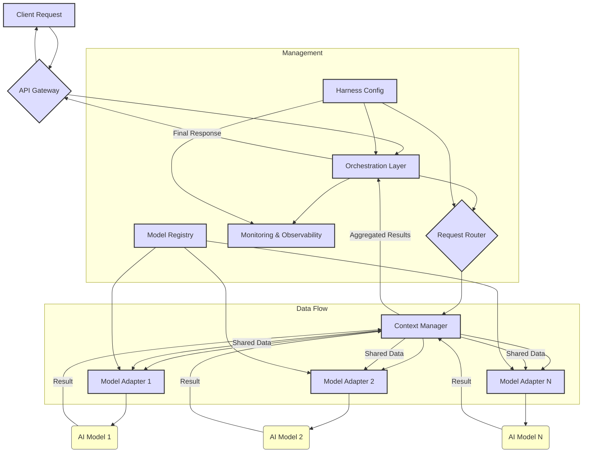

대규모 AI 서비스가 점점 더 복잡해지면서, 단일 AI 모델로는 해결하기 어려운 다양한 요구사항이 발생하고 있습니다. 이미지 인식, 자연어 처리, 추천 시스템 등 여러 도메인의 AI 모델을 조합하여 사용자에게 가치를 제공하는 복합 서비스의 등장은 필연적입니다. 이러한 다중 AI 모델 기반 복합 서비스의 안정성, 확장성, 그리고 효율성을 보장하기 위해서는 견고한 Harness 설계가 필수적입니다.

## 핵심 아키텍처 패턴

다중 AI 모델을 효과적으로 통합하고 관리하기 위한 Harness 설계에는 몇 가지 핵심 아키텍처 패턴이 존재합니다.

### 1. Orchestrator-Agent 패턴

중앙 Orchestrator가 전체 워크플로우를 관리하고, 각 AI 모델은 특정 기능을 수행하는 Agent 역할을 합니다. Orchestrator는 사용자 요청을 받아 이를 하위 태스크로 분해하고, 각 태스크에 가장 적합한 AI Agent에게 위임합니다. Agent는 태스크를 처리한 후 결과를 Orchestrator에게 반환하며, Orchestrator는 이 결과들을 종합하여 최종 응답을 생성합니다. 이 패턴은 복잡한 비즈니스 로직을 모듈화하고, 각 모델의 독립적인 배포 및 확장을 용이하게 합니다.

### 2. Router-Ensemble 패턴

들어오는 요청의 특성이나 복잡성에 따라 적절한 AI 모델 또는 모델 조합으로 라우팅하는 방식입니다. Router는 요청을 분석하여 동적으로 최적의 모델 경로를 결정하고, Ensemble은 여러 모델의 예측을 결합하여 최종 결정을 내리는 역할을 합니다. 이는 비용 최적화 (예: 간단한 요청은 경량 모델로, 복잡한 요청은 고성능 모델로) 및 성능 향상에 기여합니다.

### 3. Gateway-Adapter 패턴

다양한 종류의 AI 모델(예: LLM, Vision Model, Recommender System)이 각각 다른 API 인터페이스를 가질 때 유용합니다. Gateway는 외부 시스템과의 단일 접점을 제공하고, 각 모델에 대한 Adapter는 해당 모델의 인터페이스를 Gateway에서 정의한 표준 인터페이스로 변환합니다. 이를 통해 모델 교체나 추가가 용이해지며, 시스템 전체의 결합도를 낮출 수 있습니다.

## Harness 주요 구성 요소

성공적인 다중 AI 모델 Harness는 다음과 같은 주요 구성 요소들을 포함해야 합니다.

### 1. 요청 라우팅 및 태스크 분해 (Request Routing & Task Decomposition)

들어오는 사용자 요청을 분석하여 어떤 AI 모델(들)이 필요한지 식별하고, 요청을 모델별 하위 태스크로 분해하는 로직입니다. 이는 동적 라우팅, 조건부 실행, 병렬 처리 등을 포함할 수 있습니다. 2026년에는 AI 기반의 지능형 라우터가 등장하여, 과거 실행 이력과 실시간 모델 성능 지표를 기반으로 최적의 라우팅 결정을 내리는 방향으로 발전하고 있습니다.

### 2. 모델 어댑터 및 표준화 (Model Adapters & Standardization)

각 AI 모델은 입력/출력 형식, API 호출 방식 등이 다를 수 있습니다. 모델 어댑터는 이러한 차이를 추상화하여, Harness의 코어 로직이 모델의 세부 구현에 의존하지 않도록 표준화된 인터페이스를 제공합니다. 이는 새로운 모델의 통합 비용을 절감하고, 기존 모델을 쉽게 교체할 수 있게 합니다.

### 3. 컨텍스트 및 상태 관리 (Context & State Management)

복합 서비스는 여러 AI 모델 간의 정보 공유와 상태 유지가 필수적입니다. 이전 모델의 출력이 다음 모델의 입력이 되거나, 전체 서비스의 컨텍스트(예: 사용자 세션 정보, 이전 대화 기록)가 여러 모델에 걸쳐 유지되어야 합니다. 분산 캐시, 공유 메모리 저장소, 혹은 전용 Context Store 등을 활용하여 효율적인 컨텍스트 전달 및 관리를 구현해야 합니다.

### 4. 모니터링 및 관측 가능성 (Monitoring & Observability)

각 AI 모델의 성능, Latency, 에러율, 자원 사용량 등을 실시간으로 모니터링해야 합니다. 또한, 전체 워크플로우의 진행 상황을 추적하고, 각 단계에서의 입력/출력 데이터를 로깅하여 문제 발생 시 신속하게 원인을 파악할 수 있는 강력한 관측 가능성(Observability) 시스템을 구축해야 합니다. 분산 트레이싱(Distributed Tracing)은 필수적인 요소입니다.

### 5. 회복력 및 장애 조치 (Resilience & Fallback)

특정 AI 모델에 장애가 발생하거나 응답이 지연될 경우를 대비한 회복력(Resilience) 설계가 중요합니다. Circuit Breaker, Retry, Timeout 패턴을 적용하고, 모델 장애 시 대체 모델로 전환하거나, 미리 정의된 안전한 폴백(Fallback) 응답을 제공하는 메커니즘을 구현해야 합니다.

### 6. 보안 및 거버넌스 (Security & Governance)

다중 AI 모델 환경에서는 데이터 접근 제어, 모델별 권한 관리, 민감 정보 보호, 그리고 모델의 공정성과 투명성(Explainability)을 위한 거버넌스 정책이 필요합니다. 모델 간 통신 시에도 암호화 및 인증/인가 메커니즘을 적용하여 보안을 강화해야 합니다.

## 코드 예제: 파이썬 기반 간단한 오케스트레이터

아래는 요청 라우팅과 모델 호출을 담당하는 간단한 Python 기반 오케스트레이터의 의사 코드입니다. `ModelAdapter`는 각 모델의 인터페이스를 추상화합니다.

```python
from abc import ABC, abstractmethod

class BaseModelAdapter(ABC):
    @abstractmethod
    def process(self, data: dict) -> dict:
        pass

class ImageRecognitionAdapter(BaseModelAdapter):
    def process(self, data: dict) -> dict:
        print("Processing image with ImageRecognition model...")
        # Simulate image recognition logic
        return {"image_labels": ["cat", "mammal"]}

class NaturalLanguageAdapter(BaseModelAdapter):
    def process(self, data: dict) -> dict:
        print("Processing text with NaturalLanguage model...")
        # Simulate NLP logic
        return {"sentiment": "positive", "keywords": ["product", "good"]}

class RecommendationAdapter(BaseModelAdapter):
    def process(self, data: dict) -> dict:
        print("Generating recommendations...")
        # Simulate recommendation logic
        return {"recommended_items": ["item_A", "item_B"]}

class MultiAIOrchestrator:
    def __init__(self):
        self.models = {
            "image": ImageRecognitionAdapter(),
            "nlp": NaturalLanguageAdapter(),
            "reco": RecommendationAdapter()
        }

    def orchestrate_request(self, request_data: dict) -> dict:
        service_type = request_data.get("service_type")
        payload = request_data.get("payload")
        context = {"request_id": "12345"} # Shared context
        results = {}

        print(f"Orchestrating request for service_type: {service_type}")

        if service_type == "product_review_analysis":
            # Step 1: NLP model for sentiment and keywords
            nlp_output = self.models["nlp"].process(payload)
            results.update(nlp_output)
            context["nlp_results"] = nlp_output # Update context

            # Step 2: Recommendation model based on keywords
            reco_input = {"user_id": request_data.get("user_id"), "keywords": nlp_output["keywords"]}
            reco_output = self.models["reco"].process(reco_input)
            results.update(reco_output)

        elif service_type == "visual_search":
            # Step 1: Image recognition model
            image_output = self.models["image"].process(payload)
            results.update(image_output)
            context["image_results"] = image_output

            # Step 2: (Hypothetical) If image labels contain specific items, trigger recommendation
            if "cat" in image_output.get("image_labels", []):
                reco_input = {"user_id": request_data.get("user_id"), "context_labels": image_output["image_labels"]}
                reco_output = self.models["reco"].process(reco_input)
                results.update(reco_output)
        else:
            results["error"] = "Unknown service type"

        print(f"Orchestration complete. Final results: {results}")
        return results

# Example Usage
orchestrator = MultiAIOrchestrator()

# Product Review Analysis
review_request = {
    "service_type": "product_review_analysis",
    "user_id": "user_A",
    "payload": {"text": "This product is good, I really love it!"}
}
orchestrator.orchestrate_request(review_request)

# Visual Search
visual_request = {
    "service_type": "visual_search",
    "user_id": "user_B",
    "payload": {"image_data": "base64_encoded_image_of_cat"}
}
orchestrator.orchestrate_request(visual_request)
```

## 아키텍처 다이어그램



## 2026년 최신 트렌드

2026년에는 다중 AI 모델 Harness 설계가 다음과 같은 방향으로 발전하고 있습니다.

*   **Adaptive Routing & Dynamic Model Selection**: 실시간으로 입력 데이터, 사용 가능한 모델의 성능 및 비용, 그리고 과거 실행 데이터를 분석하여 최적의 모델 또는 모델 체인을 동적으로 선택하는 지능형 라우팅이 일반화됩니다. 이는 LLM의 추론 성능과 Latency, 비용 사이의 트레이드오프를 최적화하는 데 필수적입니다.
*   **Real-time Feedback Loops & Self-Optimization**: Harness 자체가 모델의 추론 결과를 모니터링하고, 성능 저하나 편향(Bias) 발생 시 자동으로 모델을 업데이트하거나 라우팅 정책을 변경하는 자율 최적화 메커니즘이 강조됩니다. 이는 MLOps 파이프라인과 긴밀하게 통합됩니다.
*   **Declarative Orchestration with AI-native Tools**: 복잡한 워크플로우를 코드로 정의하는 대신, YAML이나 DSL(Domain-Specific Language)을 사용하여 선언적으로 정의하고, AI-native 툴체인(예: GenAI 프레임워크 확장)이 이를 해석하여 실행하는 방식이 확산됩니다. 이는 개발 및 유지보수 효율성을 크게 향상시킵니다.

## 트레이드오프

다중 AI 모델 Harness 설계에는 여러 트레이드오프가 존재하며, 프로젝트의 특성에 맞게 신중하게 고려해야 합니다.

*   **복잡성 vs. 유연성 (Complexity vs. Flexibility)**: Harness 계층이 추가되면 시스템의 복잡도가 증가하지만, 다양한 AI 모델을 쉽게 통합하고 교체할 수 있는 유연성을 얻습니다. 언제 좋고/언제 나쁜지: 초기 개발 단계에서는 오버헤드가 될 수 있지만, 장기적으로 여러 AI 모델을 지속적으로 추가하거나 업데이트해야 하는 대규모 서비스에 좋습니다.
*   **성능 vs. 범용성 (Performance vs. Generality)**: 범용적인 모델 어댑터와 오케스트레이션 로직은 다양한 모델에 적용할 수 있지만, 특정 모델에 최적화된 직접 호출보다 Latency가 발생할 수 있습니다. 언제 좋고/언제 나쁜지: 모델의 종류가 다양하고 변화가 잦은 서비스에 좋으며, 초고성능을 요구하는 특정 Critical Path에는 불리할 수 있습니다.
*   **비용 vs. 신뢰성 (Cost vs. Reliability)**: 여러 모델을 병렬로 실행하거나 장애 조치(Fallback)를 위해 중복 모델을 사용하는 것은 신뢰성을 높이지만 인프라 및 API 호출 비용이 증가합니다. 언제 좋고/언제 나쁜지: 서비스 중단이나 오류가 치명적인 비즈니스에 필수적이며, 비용에 민감한 Non-Critical 서비스에는 과도할 수 있습니다.
*   **개발 속도 vs. 견고성 (Development Speed vs. Robustness)**: 빠른 개발을 위해 최소한의 Harness를 구축할 수 있지만, 이는 잠재적인 오류와 유지보수 문제를 야기할 수 있습니다. 반면, 견고한 Harness는 초기 설계 및 구현에 시간이 더 소요됩니다. 언제 좋고/언제 나쁜지: 빠른 시장 출시(Time-to-market)가 중요한 MVP(Minimum Viable Product) 단계에서는 개발 속도가 우선될 수 있으나, 프로덕션 서비스에서는 견고성이 훨씬 중요합니다.
*   **중앙 집중 vs. 분산 제어 (Centralized vs. Decentralized Control)**: 중앙 Orchestrator가 모든 로직을 제어하는 것은 관리하기 쉽지만, 병목 현상이 발생하거나 단일 장애 지점(Single Point of Failure)이 될 수 있습니다. 분산된 Agent들이 자율적으로 동작하는 것은 확장성이 높지만, 전체 시스템의 상태를 파악하기 어렵습니다. 언제 좋고/언제 나쁜지: 워크플로우가 비교적 단순하고 모델 간 의존성이 강한 경우 중앙 집중 방식이 좋고, 복잡하고 독립적인 태스크가 많은 경우 분산 제어 방식이 유리합니다.

## 실전 체크리스트

다중 AI 모델 Harness를 프로젝트에 적용할 때 다음 항목들을 검증해야 합니다.

*   [ ] **확장성 테스트 (Scalability Testing)**: 다양한 모델 로드 시나리오에서 시스템의 Latency, 처리량(Throughput), 자원 사용량이 SLA(Service Level Agreement)를 충족하는지 검증했는가?
*   [ ] **워크플로우 Latency 및 Throughput SLA**: 각 복합 서비스 워크플로우의 종단 간(End-to-End) Latency와 Throughput에 대한 목표를 설정하고, 실제 운영 환경에서 이 목표가 달성되는지 측정 및 모니터링하고 있는가?
*   [ ] **자동화된 모델 헬스 체크 및 폴백 메커니즘**: 각 AI 모델의 상태를 주기적으로 확인하고, 장애 발생 시 자동으로 대체 모델로 전환하거나 안전한 폴백 응답을 제공하는 메커니즘이 구현 및 테스트되었는가?
*   [ ] **세분화된 모니터링 및 로깅**: 각 AI 모델의 호출 횟수, 성공/실패율, Latency, 자원 사용량 등 세분화된 지표를 수집하고 있으며, 문제가 발생했을 때 특정 모델의 기여도를 추적할 수 있는 로깅 시스템이 구축되었는가?
*   [ ] **모델 간 통신 보안 정책**: 모델 간 데이터 전송 시 암호화, 인증, 인가 등 적절한 보안 프로토콜이 적용되었으며, 민감 데이터 처리 시 가명화 또는 익명화 정책을 준수하는가?
*   [ ] **하네스 및 모델 버전 관리 및 배포 전략**: Harness 코드와 각 AI 모델의 버전을 체계적으로 관리하고, Blue/Green 또는 Canary 배포와 같은 무중단 배포 전략이 수립되었는가?
*   [ ] **다중 모델 추론 비용 최적화**: 모델 라우팅 정책, 캐싱 전략, 배치 추론(Batch Inference) 등을 통해 AI 모델 호출 비용을 최적화하고 있으며, 비용 모니터링 시스템을 운영하는가?
*   [ ] **컨텍스트 일관성 및 동기화**: 여러 모델에 걸쳐 전달되는 컨텍스트 데이터의 일관성(Consistency)이 보장되며, 분산 환경에서 컨텍스트 동기화 문제가 발생하지 않도록 설계되었는가?
*   [ ] **AI 윤리 및 책임성 가이드라인**: 다중 AI 모델의 복합적인 상호작용이 예상치 못한 결과나 편향을 일으키지 않도록 AI 윤리 가이드라인을 수립하고, 정기적인 감사 프로세스를 운영하는가?
```