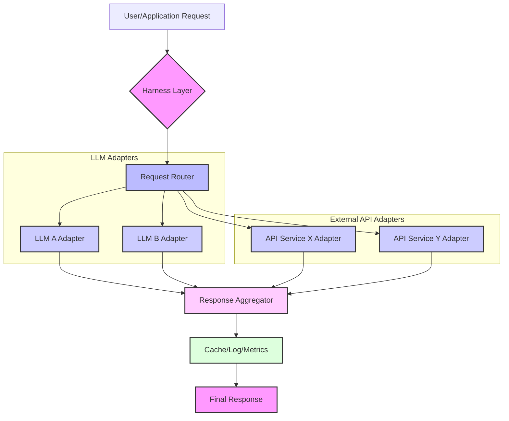

복잡한 AI 시스템을 구축할 때, 단일 LLM에 의존하기보다는 여러 LLM의 강점을 조합하고, 외부 API를 연동하여 시스템의 기능을 확장하는 것이 일반적입니다. 하지만 이러한 다중 LLM 및 외부 API 연동은 개발 및 운영 복잡성을 크게 증가시킵니다. 이 문제를 해결하기 위해 'Harness' 설계 패턴이 필수적입니다. Harness는 다양한 AI 모델과 외부 서비스를 통합하고, 일관된 인터페이스를 제공하며, 시스템의 안정성, 확장성, 관리 용이성을 보장하는 추상화 계층입니다.

## Harness의 필요성 및 핵심 개념

2026년 현재, LLM 기술은 빠르게 발전하고 있으며, 특정 작업에 최적화된 다양한 모델(예: Anthropic의 Claude, OpenAI의 GPT, Google의 Gemini 등)이 존재합니다. 각 모델은 비용, 성능, 기능, 토큰 제한 등에서 고유한 특성을 가집니다. 또한, 실용적인 AI 애플리케이션은 검색, 데이터베이스 접근, 이메일 전송 등 외부 도구와의 연동 없이는 불가능합니다. Harness는 이러한 이질적인 구성 요소들을 엮어 유연하고 견고한 시스템을 만드는 데 중심적인 역할을 합니다.

핵심 개념은 다음과 같습니다:

*   **추상화 (Abstraction)**: 하위 LLM이나 API의 구체적인 구현 세부 사항을 숨기고, 통일된 인터페이스를 제공합니다.
*   **오케스트레이션 (Orchestration)**: 여러 LLM 호출, API 연동, 데이터 전처리/후처리 등의 복잡한 워크플로우를 조정하고 관리합니다.
*   **라우팅 (Routing)**: 요청의 특성(비용, 성능 요구사항, 특정 LLM의 강점)에 따라 가장 적합한 LLM 또는 API 서비스로 동적으로 요청을 보냅니다.
*   **탄력성 (Resilience)**: 외부 서비스의 오류, 지연, 단절에 대응하여 재시도, 폴백, 회로 차단기(Circuit Breaker) 패턴을 적용하여 시스템의 안정성을 확보합니다.
*   **관측 가능성 (Observability)**: 모든 요청과 응답, 라우팅 결정, 에러 등을 로깅하고 모니터링하여 시스템 상태를 투명하게 파악할 수 있게 합니다.

## Harness 아키텍처 및 동작 방식

Harness는 주로 요청을 받아 처리하고, 적절한 모델이나 서비스로 전달한 후, 결과를 통합하여 반환하는 게이트웨이 또는 미들웨어 계층으로 작동합니다. 아래 Mermaid 다이어그램은 일반적인 Harness 아키텍처의 흐름을 보여줍니다.



1.  **Request Router**: 들어오는 요청을 분석하여 어떤 LLM과 어떤 외부 API를 호출할지 결정합니다. 이는 비즈니스 로직, 비용, 성능 메트릭, LLM의 강점 등을 기반으로 합니다.
2.  **LLM Adapters**: 각 LLM 서비스(예: OpenAI API, Anthropic API)에 특화된 인터페이스를 추상화합니다. 동일한 입력 스키마를 받아 각 LLM에 맞는 요청으로 변환하고, 응답을 표준화된 형식으로 파싱합니다.
3.  **External API Adapters**: 외부 데이터베이스, 검색 엔진, 비즈니스 애플리케이션 등 다양한 외부 API와의 상호작용을 캡슐화합니다. 인증, 에러 처리, 데이터 변환 등을 담당합니다.
4.  **Response Aggregator**: 여러 LLM 또는 API 호출 결과들을 병렬 또는 직렬로 실행하고, 그 결과를 취합하여 최종 응답을 구성합니다.
5.  **Cache/Log/Metrics**: 응답 캐싱을 통해 비용과 지연 시간을 최적화하고, 모든 과정을 로깅 및 모니터링하여 가시성을 확보합니다.

### 코드 예제: 간단한 Harness 구현 (Python)

아래 Python 코드는 `Harness`가 여러 LLM 및 외부 API를 어떻게 통합하고 라우팅하는지 보여주는 간소화된 예제입니다. 여기서는 `FakeLLM`과 `FakeExternalAPI`를 사용하여 실제 API 호출 없이 개념을 설명합니다.

```python
import time
import random
from typing import Dict, Any, Optional

# 1. LLM Adapter Interface
class LLMAdapter:
    def process_request(self, prompt: str, model_config: Dict[str, Any]) -> str:
        raise NotImplementedError

# 2. Concrete LLM Adapters
class FakeGPTAdapter(LLMAdapter):
    def process_request(self, prompt: str, model_config: Dict[str, Any]) -> str:
        print(f"  [GPT] Processing: '{prompt[:30]}...' with config {model_config}")
        time.sleep(random.uniform(0.5, 1.5)) # Simulate network latency
        return f"GPT_Response_for_'{prompt}'_temp_{model_config.get('temperature', 0.7)}"

class FakeClaudeAdapter(LLMAdapter):
    def process_request(self, prompt: str, model_config: Dict[str, Any]) -> str:
        print(f"  [Claude] Processing: '{prompt[:30]}...' with config {model_config}")
        time.sleep(random.uniform(0.8, 2.0)) # Simulate network latency
        return f"Claude_Response_for_'{prompt}'_top_p_{model_config.get('top_p', 0.9)}"

# 3. External API Adapter Interface
class ExternalAPIAdapter:
    def fetch_data(self, query: str) -> Dict[str, Any]:
        raise NotImplementedError

class FakeSearchAPIAdapter(ExternalAPIAdapter):
    def fetch_data(self, query: str) -> Dict[str, Any]:
        print(f"  [SearchAPI] Fetching data for '{query}'")
        time.sleep(random.uniform(0.2, 0.8))
        return {"source": "search_api", "data": f"Search results for {query}"}

# 4. Harness Core
class LLMHarness:
    def __init__(self):
        self.llm_adapters: Dict[str, LLMAdapter] = {
            "gpt": FakeGPTAdapter(),
            "claude": FakeClaudeAdapter()
        }
        self.api_adapters: Dict[str, ExternalAPIAdapter] = {
            "search": FakeSearchAPIAdapter()
        }

    def _route_llm(self, prompt: str, request_context: Dict[str, Any]) -> str:
        # Simple routing logic: choose LLM based on keyword or default
        if "complex" in prompt.lower():
            model_name = "claude" # Claude for complex tasks
            model_config = {"top_p": 0.95, "max_tokens": 1024}
        else:
            model_name = "gpt" # GPT for general tasks
            model_config = {"temperature": 0.7, "max_tokens": 512}

        print(f"[Router] Routing LLM request to: {model_name}")
        return self.llm_adapters[model_name].process_request(prompt, model_config)

    def _call_external_api(self, api_name: str, query: str) -> Dict[str, Any]:
        if api_name not in self.api_adapters:
            raise ValueError(f"Unknown API: {api_name}")
        print(f"[Router] Calling external API: {api_name}")
        return self.api_adapters[api_name].fetch_data(query)

    def process(self, request: Dict[str, Any]) -> Dict[str, Any]:
        request_type = request.get("type")
        prompt = request.get("prompt")
        api_call = request.get("api_call")
        request_context = request.get("context", {})

        response_data: Dict[str, Any] = {}

        # Step 1: Potentially call external API first for context
        if api_call:
            api_name = api_call.get("name")
            api_query = api_call.get("query")
            if api_name and api_query:
                try:
                    api_result = self._call_external_api(api_name, api_query)
                    response_data["api_result"] = api_result
                    # Enhance prompt with API result
                    prompt = f"Based on the following data: {api_result['data']}. {prompt}"
                    print(f"[Harness] Prompt enhanced with API data.")
                except Exception as e:
                    print(f"[Harness] API call failed: {e}")
                    response_data["api_error"] = str(e)

        # Step 2: Route to LLM
        if prompt:
            try:
                llm_response = self._route_llm(prompt, request_context)
                response_data["llm_response"] = llm_response
            except Exception as e:
                print(f"[Harness] LLM call failed: {e}")
                response_data["llm_error"] = str(e)
        else:
            response_data["error"] = "No prompt provided for LLM."

        return response_data

# Example Usage
harness = LLMHarness()

print("\n--- Scenario 1: Simple GPT request ---")
response1 = harness.process({
    "type": "llm_query",
    "prompt": "Summarize the key points of large language models."
})
print(f"Final Response 1: {response1}\n")

print("\n--- Scenario 2: Complex Claude request ---")
response2 = harness.process({
    "type": "llm_query",
    "prompt": "Analyze the complex socio-economic impact of AI on global labor markets."
})
print(f"Final Response 2: {response2}\n")

print("\n--- Scenario 3: LLM request with preceding external API call ---")
response3 = harness.process({
    "type": "hybrid_query",
    "prompt": "Based on the search results, what are the recent advancements in quantum computing?",
    "api_call": {"name": "search", "query": "recent quantum computing news"}
})
print(f"Final Response 3: {response3}\n")
```

이 예제는 Harness가 어떻게 들어오는 요청을 분석하고, 내부 라우팅 로직에 따라 최적의 LLM 어댑터를 선택하거나 외부 API 어댑터를 호출하여 데이터를 보강하는지를 보여줍니다. 실제 시스템에서는 여기에 캐싱, 로깅, 재시도 로직, 인증, 보안 강화 등이 추가됩니다.

## 트레이드오프

### 1. 초기 복잡성 vs. 장기적 유연성
*   **언제 좋은가?** 장기적으로 다양한 LLM 및 외부 API를 유연하게 통합하고 관리해야 하는 복잡한 AI 시스템에 적합합니다. 변화하는 AI 생태계에 빠르게 대응할 수 있습니다.
*   **언제 나쁜가?** 단일 LLM에만 의존하거나, 외부 API 연동이 거의 없는 매우 간단한 프로젝트의 경우, Harness의 초기 설계 및 구현 비용이 불필요한 오버헤드가 될 수 있습니다.

### 2. 성능 오버헤드 vs. 시스템 안정성 및 최적화
*   **언제 좋은가?** Harness 계층은 라우팅, 캐싱, 재시도 로직 등으로 인해 약간의 지연 시간(latency)을 추가하지만, 이는 외부 서비스의 불안정성(Rate Limit, 5xx 에러 등)으로부터 전체 시스템을 보호하고, 비용/성능 최적화 기회를 제공하여 장기적인 시스템 안정성과 효율성을 높입니다.
*   **언제 나쁜가?** 극도의 저지연(ultra-low latency)이 요구되는 애플리케이션에서는 Harness의 추가적인 계층이 병목 지점이 될 수 있습니다. 이 경우 핵심 경로에 대한 최적화된 직접 호출을 고려해야 합니다.

### 3. 개발 속도 (초기) vs. 유지보수 및 확장성 (장기)
*   **언제 좋은가?** 처음에는 Harness 구축에 시간이 걸리지만, 일단 구축되면 새로운 LLM이나 API를 추가하거나 기존 로직을 변경할 때 훨씬 빠르고 안전하게 처리할 수 있어 장기적인 유지보수 및 확장성이 우수합니다.
*   **언제 나쁜가?** Proof-of-Concept (PoC) 단계나 빠른 프로토타이핑이 중요한 경우에는 Harness 구축보다는 직접적인 API 호출을 통해 빠르게 기능을 구현하는 것이 효율적일 수 있습니다.

### 4. 자원 소비 (추가 인프라) vs. 자율적인 비용 및 성능 관리
*   **언제 좋은가?** Harness는 라우팅, 로깅, 모니터링을 위한 추가적인 컴퓨팅 자원이나 인프라가 필요할 수 있습니다. 하지만 이는 LLM 호출 비용 최적화 (예: 저렴한 모델로 라우팅, 캐싱) 및 성능 관리 (예: 부하 분산)를 자율적으로 수행하여 전체적인 운영 비용을 절감하는 데 기여합니다.
*   **언제 나쁜가?** 제한된 예산과 인프라를 가진 소규모 프로젝트의 경우, Harness를 위한 추가 자원 할당이 부담이 될 수 있습니다.

## 실전 체크리스트

AI 시스템에 Harness 설계 패턴을 적용할 때 다음 사항들을 검토하십시오.

- [ ] **LLM/API 인터페이스 표준화**: 모든 LLM 및 외부 API에 대한 입력/출력 스키마를 정의하고, 통일된 어댑터 인터페이스를 구축했는가?
- [ ] **동적 라우팅 로직 구현**: 비용, 성능, 기능, 신뢰성 등 다양한 기준에 따라 최적의 LLM 또는 API를 선택하는 동적 라우팅 전략을 수립하고 구현했는가?
- [ ] **탄력성 메커니즘 통합**: 재시도(Retry), 회로 차단기(Circuit Breaker), 폴백(Fallback) 등 외부 서비스 장애에 대비한 안정성 패턴을 Harness에 내장했는가?
- [ ] **관측 가능성 확보**: 모든 LLM/API 호출, 라우팅 결정, 지연 시간, 에러 발생 등을 추적하고 모니터링할 수 있는 로깅, 트레이싱, 메트릭 시스템을 구축했는가?
- [ ] **보안 및 인증 관리**: Harness 계층에서 외부 API 키, LLM 인증 토큰 등 민감한 자격 증명을 안전하게 관리하고 접근 제어를 구현했는가?
- [ ] **캐싱 전략 도입**: 반복적인 요청에 대한 응답을 캐싱하여 비용을 절감하고 응답 속도를 향상시키는 전략을 적용했는가?
- [ ] **버전 관리 및 배포 자동화**: LLM 어댑터, 라우팅 로직, API 어댑터의 변경 사항을 효율적으로 버전 관리하고 배포할 수 있는 CI/CD 파이프라인을 구축했는가?
- [ ] **성능 벤치마킹 및 스트레스 테스트**: Harness를 통해 실제 워크로드 환경에서 LLM 및 API 연동의 성능과 안정성을 검증하는 벤치마킹 및 스트레스 테스트 계획이 있는가?