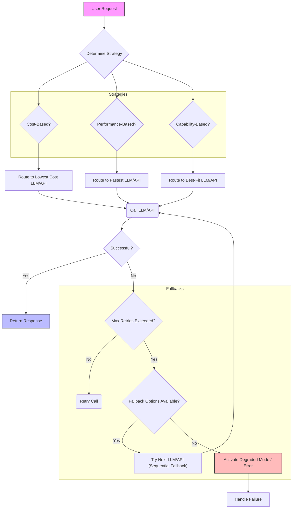

복잡한 AI 서비스 환경에서 다수의 Large Language Models (LLMs)과 외부 Application Programming Interface (APIs)를 연동하는 것은 현대 AI 애플리케이션의 핵심 역량입니다. 이러한 시스템의 안정성, 비용 효율성, 성능을 보장하기 위해서는 정교한 라우팅 (Routing) 및 폴백 (Fallback) 전략 설계가 필수적입니다. 특히 2026년에는 모델의 다양화와 전문화가 심화되면서, 특정 작업에 최적화된 LLM을 선택적으로 사용하고, 외부 API의 잠재적 실패에 유연하게 대응하는 능력이 더욱 중요해지고 있습니다.

## 다중 LLM 및 외부 API 연동의 복잡성

AI 서비스는 종종 다양한 제공업체의 LLM (예: OpenAI GPT, Anthropic Claude, Google Gemini)과 다양한 외부 API (예: 검색 엔진, 데이터베이스, 이미지 생성 서비스)를 활용합니다. 이러한 다중 의존성은 서비스에 강력한 기능을 제공하지만, 동시에 다음과 같은 복잡성을 야기합니다:

*   **비용 변동성 (Cost Volatility)**: 각 LLM 및 API는 고유한 요금 정책을 가지며, 사용량에 따라 비용이 크게 달라질 수 있습니다.
*   **성능 불균일성 (Performance Disparity)**: 모델의 추론 속도, API 응답 시간은 네트워크 상태, 로드, 서비스 제공업체의 SLA에 따라 달라집니다.
*   **안정성 문제 (Reliability Issues)**: 특정 LLM이나 API의 일시적 장애, 속도 제한 (rate limiting), 유지보수는 서비스 전체의 중단을 초래할 수 있습니다.
*   **기능적 차이 (Functional Differences)**: 각 LLM은 특정 작업에 더 강점을 보이거나, 특정 API는 고유한 데이터 또는 기능을 제공합니다.

이러한 복잡성을 관리하기 위해, 요청을 적절한 대상으로 전달하는 라우팅 전략과 예상치 못한 문제 발생 시 서비스를 지속시키는 폴백 전략이 핵심적인 역할을 합니다.

## 라우팅 전략 (Routing Strategies)

라우팅 전략은 들어오는 요청을 처리하기 위한 최적의 LLM 또는 외부 API를 결정하는 메커니즘입니다.

### 1. 비용 기반 라우팅 (Cost-Based Routing)

가장 저렴한 비용으로 요청을 처리할 수 있는 LLM 또는 API를 선택합니다. 이는 주로 비동기 처리나 중요도가 낮은 작업에 유용합니다.

### 2. 성능 기반 라우팅 (Performance-Based Routing)

가장 빠른 응답 시간을 제공할 수 있는 LLM 또는 API를 선택합니다. 실시간 상호작용이 중요한 애플리케이션에 필수적입니다. 실시간 모니터링을 통해 각 서비스의 현재 지연 시간 (latency)을 측정하고 동적으로 라우팅 결정을 내립니다.

### 3. 기능 기반 라우팅 (Capability-Based Routing)

특정 요청에 필요한 기능 (예: 긴 컨텍스트 윈도우, 특정 언어 모델, 이미지 생성 능력)을 제공하는 LLM 또는 API를 선택합니다. 이는 모델의 강점을 최대한 활용하여 응답 품질을 높이는 데 기여합니다.

### 4. 부하 분산 (Load Balancing)

여러 LLM 인스턴스 또는 API 게이트웨이 간에 요청을 균등하게 분산하여 특정 엔드포인트에 과부하가 걸리는 것을 방지하고 가용성을 높입니다. 라운드 로빈, 최소 연결 수 등의 알고리즘이 사용될 수 있습니다.

### 5. 동적 라우팅 (Dynamic Routing)

위의 전략들을 조합하여 실시간으로 변화하는 서비스 상태 (비용, 성능, 가용성)에 따라 가장 최적의 라우팅 결정을 내립니다. 이는 복잡하지만 가장 유연하고 효율적인 방법입니다.

## 폴백 전략 (Fallback Strategies)

폴백 전략은 LLM 또는 외부 API 호출이 실패하거나 기대한 결과를 반환하지 않을 때, 서비스 중단 없이 기능을 유지하기 위한 대안적인 방법을 제공합니다.

### 1. 순차적 폴백 (Sequential Fallback)

기본 (Primary) LLM/API 호출이 실패하면 미리 정의된 순서에 따라 보조 (Secondary) LLM/API로 전환합니다. 예를 들어, GPT-4 호출 실패 시 Claude 3.5로 전환하고, 그것마저 실패 시 GPT-3.5로 전환하는 방식입니다.

### 2. 조건부 폴백 (Conditional Fallback)

실패의 유형 (예: 속도 제한, 인증 오류, 모델 응답 포맷 오류)에 따라 적절한 폴백 메커니즘을 적용합니다. 예를 들어, 속도 제한 발생 시에는 잠시 대기 후 재시도하거나, 다른 제공업체의 LLM으로 전환합니다.

### 3. 캐시 응답 (Cached Response) / 스태일 데이터 (Stale Data)

실시간 응답이 불가능할 경우, 이전에 성공적으로 처리된 요청의 캐시된 응답을 제공하여 부분적인 기능 저하 모드 (Degraded Mode)로 서비스를 유지합니다. 검색 API 호출 실패 시에는 오래된 검색 결과를 반환하는 것이 예시입니다.

### 4. 기능 저하 모드 (Degraded Mode)

모든 LLM/API 호출이 실패하거나 과도한 지연이 발생할 경우, 핵심 기능만 유지하거나 사용자에게 서비스가 일시적으로 제한됨을 알리는 모드입니다. 예를 들어, LLM을 사용한 복잡한 답변 대신 정해진 FAQ를 제공합니다.

### 5. 재시도 메커니즘 (Retry Mechanisms)

일시적인 네트워크 문제나 서비스 불안정으로 인한 실패의 경우, 지수 백오프 (Exponential Backoff)와 같은 전략을 사용하여 일정 시간 후 요청을 재시도합니다.

## 아키텍처 패턴 및 구현

이러한 라우팅 및 폴백 전략을 효과적으로 구현하기 위해서는 중앙 집중식 게이트웨이 (Gateway) 또는 프록시 (Proxy) 패턴이 일반적으로 사용됩니다. 이 게이트웨이는 모든 LLM 및 외부 API 호출을 가로채서 라우팅 및 폴백 로직을 적용합니다.

다음은 간단한 Python 예제를 통해 라우팅과 폴백의 기본 아이디어를 보여줍니다. 실제 시스템에서는 더 복잡한 로직과 모니터링이 필요합니다.

```python
import time
import random

class LLMService:
    def __init__(self, name, cost_per_token, latency_ms, capability_score):
        self.name = name
        self.cost_per_token = cost_per_token
        self.latency_ms = latency_ms
        self.capability_score = capability_score

    def predict(self, prompt):
        # Simulate API call with potential failure and latency
        time.sleep(self.latency_ms / 1000.0)
        if random.random() < 0.1: # 10% chance of failure
            raise Exception(f"Service {self.name} failed")
        return f"Response from {self.name} for: {prompt[:20]}..."

class LLMRouter:
    def __init__(self, services):
        self.services = sorted(services, key=lambda s: s.cost_per_token) # Default: cost-based routing

    def route_and_fallback(self, prompt, strategy='cost', max_retries=2):
        available_services = list(self.services)
        if strategy == 'performance':
            available_services.sort(key=lambda s: s.latency_ms)
        elif strategy == 'capability':
            available_services.sort(key=lambda s: s.capability_score, reverse=True)

        for service in available_services:
            for attempt in range(max_retries + 1):
                try:
                    print(f"Attempting with {service.name} (strategy: {strategy}, attempt: {attempt+1})")
                    response = service.predict(prompt)
                    return response
                except Exception as e:
                    print(f"Error with {service.name}: {e}")
                    if attempt < max_retries:
                        time.sleep(2 ** attempt) # Exponential backoff
                    else:
                        print(f"Max retries exhausted for {service.name}. Trying next service.")
        
        raise Exception("All LLM services failed after retries.")

# Example Usage:
service_gpt4 = LLMService("GPT-4", 0.03, 300, 90)
service_claude = LLMService("Claude-3.5", 0.015, 400, 85)
service_gemini = LLMService("Gemini-Pro", 0.005, 200, 80)

router = LLMRouter([service_gpt4, service_claude, service_gemini])

prompt = "Write a short story about AI agents collaborating."

try:
    # Cost-based routing with fallback
    print("\n--- Cost-based Routing ---")
    response = router.route_and_fallback(prompt, strategy='cost')
    print(f"Final Response: {response}")

    # Performance-based routing with fallback
    print("\n--- Performance-based Routing ---")
    response = router.route_and_fallback(prompt, strategy='performance')
    print(f"Final Response: {response}")

    # Capability-based routing with fallback
    print("\n--- Capability-based Routing ---")
    response = router.route_and_fallback(prompt, strategy='capability')
    print(f"Final Response: {response}")

except Exception as e:
    print(f"Failed to get a response: {e}")
```

위 코드는 간단한 `LLMService` 클래스와 이를 관리하는 `LLMRouter`를 보여줍니다. `route_and_fallback` 메서드는 지정된 전략 (비용, 성능, 기능)에 따라 서비스를 정렬하고, 각 서비스에 대해 재시도를 수행하며, 실패 시 다음 서비스로 폴백합니다.

### Mermaid 다이어그램: 라우팅 및 폴백 흐름



## 트레이드오프 (Trade-offs)

다중 LLM 및 외부 API 라우팅 및 폴백 전략을 설계할 때 고려해야 할 주요 트레이드오프는 다음과 같습니다.

*   **레이턴시 (Latency) vs. 비용 (Cost)**
    *   **언제 좋고**: 실시간 응답이 필수적인 서비스(예: 대화형 AI)에서는 낮은 레이턴시가 우선되어야 합니다. 비용 기반 라우팅은 백그라운드 처리나 비동기 작업에 적합합니다.
    *   **언제 나쁜지**: 낮은 레이턴시를 위해 고성능 모델이나 API를 사용하면 비용이 증가합니다. 반대로 비용을 절감하면 응답 시간이 길어질 수 있습니다.

*   **구현 복잡성 (Implementation Complexity) vs. 시스템 유연성 (System Flexibility)**
    *   **언제 좋고**: 동적 라우팅 및 다단계 폴백은 높은 유연성을 제공하여 다양한 상황에 지능적으로 대응할 수 있습니다.
    *   **언제 나쁜지**: 정교한 라우팅 및 폴백 로직은 개발, 테스트, 유지보수 측면에서 상당한 복잡성을 추가합니다. 시스템의 복잡도가 증가할수록 잠재적 버그 발생 가능성도 커집니다.

*   **응답 일관성 (Response Consistency) vs. 가용성 (Availability)**
    *   **언제 좋고**: 단일 LLM에 대한 의존도를 낮추고 여러 LLM을 사용하는 폴백 전략은 서비스의 가용성을 극대화합니다.
    *   **언제 나쁜지**: 다른 LLM으로 폴백할 경우, 모델마다 미묘한 응답 스타일이나 기능적 차이가 있어 사용자 경험의 일관성이 저해될 수 있습니다. 사용자에게는 항상 동일한 LLM의 응답을 받는 것이 선호될 수 있습니다.

*   **리소스 오버헤드 (Resource Overhead) vs. 신뢰성 (Reliability)**
    *   **언제 좋고**: 여러 LLM/API를 동시에 모니터링하고 관리하는 것은 시스템의 신뢰성을 크게 향상시킵니다.
    *   **언제 나쁜지**: 추가적인 모니터링, 라우팅 로직, 폴백 인프라는 컴퓨팅 리소스와 네트워크 트래픽을 증가시켜 운영 비용을 높일 수 있습니다.

## 실전 체크리스트 (Practical Checklist)

다중 LLM 및 외부 API 연동 라우팅 및 폴백 전략을 프로젝트에 적용할 때 다음 항목들을 검토해야 합니다.

*   [ ] **서비스 레벨 목표 (SLO) 정의**: 각 AI 서비스 요청에 대한 최대 허용 지연 시간과 최소 성공률을 명확히 정의했는가?
*   [ ] **LLM/API 성능 벤치마킹**: 사용하려는 모든 LLM 및 외부 API에 대해 실제 환경에서의 비용, 레이턴시, 응답 품질을 주기적으로 벤치마킹하고 있는가?
*   [ ] **동적 라우팅 메트릭 (Dynamic Routing Metrics) 구현**: LLM/API의 실시간 상태(성능, 비용, 오류율)를 수집하고 라우팅 결정에 활용하는 메커니즘을 구축했는가?
*   [ ] **다단계 폴백 체인 설계**: 기본 LLM/API 실패 시 어떤 순서로 다른 LLM/API 또는 대안 전략(예: 캐시, 단순화된 응답)으로 전환할지 명확한 체인을 정의했는가?
*   [ ] **오류 처리 및 재시도 로직 구현**: 특정 오류 유형(예: Rate Limit, Network Error)에 대한 스마트한 재시도 (Exponential Backoff 포함) 및 적절한 로깅이 구현되었는가?
*   [ ] **기능 저하 모드 (Degraded Mode) 설계**: 모든 LLM/API가 사용 불가능할 경우 서비스의 핵심 기능을 어떻게 최소한으로 유지할지 정의하고 구현했는가?
*   [ ] **모니터링 및 알림 (Monitoring & Alerting) 시스템**: 라우팅 및 폴백 결정, LLM/API 호출 실패율, 지연 시간, 비용 변화를 실시간으로 모니터링하고 비정상 상황에 대한 알림 시스템을 구축했는가?