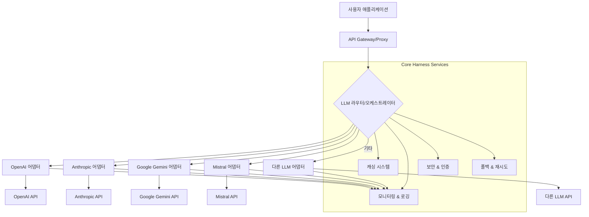

현대 AI 애플리케이션 개발에서 단일 LLM(Large Language Model)에 의존하는 것은 더 이상 최적의 전략이 아닙니다. 2026년 기준, 다양한 LLM 벤더(OpenAI, Anthropic, Google, Mistral 등)는 각기 다른 성능 특성, 가격 모델, 특화된 강점(예: 장문 컨텍스트, 코드 생성, 멀티모달)을 제공합니다. 이러한 다중 LLM 환경을 효과적으로 활용하기 위해서는 각 API의 상이한 인터페이스를 추상화하고 표준화된 방식으로 관리하는 'LLM 하네스(Harness)' 아키텍처가 필수적입니다. 이 엔트리는 LLM 하네스 아키텍처를 구현하기 위한 가이드와 실전 전략을 제시합니다.

## LLM 하네스 아키텍처의 필요성

LLM 시장은 빠르게 진화하고 있으며, 특정 벤더에 대한 종속성(vendor lock-in)은 기술 스택의 유연성을 저해하고 비용 효율성을 악화시킬 수 있습니다. LLM 하네스는 다음과 같은 핵심적인 문제들을 해결합니다:

*   **인터페이스 표준화 (Interface Standardization)**: 각기 다른 LLM API 요청/응답 스키마를 단일하고 일관된 형식으로 통합합니다. 이는 개발자가 새로운 LLM을 쉽게 플러그인하고 교체할 수 있게 합니다.
*   **라우팅 및 로드 밸런싱 (Routing & Load Balancing)**: 특정 요청의 특성(예: 비용 민감도, 지연 시간 요구사항, 컨텍스트 길이, 모델 특화 기능)에 따라 가장 적합한 LLM으로 트래픽을 지능적으로 라우팅합니다. 이를 통해 비용을 최적화하고 성능을 향상시킬 수 있습니다.
*   **폴백 및 재시도 (Fallback & Retry)**: 특정 LLM API의 장애 발생 시, 다른 LLM으로 자동으로 전환하거나 재시도 로직을 구현하여 서비스의 가용성(availability)과 안정성(reliability)을 높입니다.
*   **관측 가능성 (Observability)**: 모든 LLM 호출에 대한 중앙 집중식 로깅, 모니터링, 추적을 통해 성능 병목 현상, 비용 분석, 오류 진단 등을 용이하게 합니다.
*   **보안 및 인증 (Security & Authentication)**: 다양한 LLM API 키를 안전하게 관리하고, 통일된 인증/인가 계층을 제공하여 보안을 강화합니다.
*   **캐싱 (Caching)**: 반복적인 또는 예측 가능한 요청에 대한 LLM 응답을 캐싱하여 지연 시간을 줄이고 API 호출 비용을 절감합니다.

## 핵심 아키텍처 컴포넌트

LLM 하네스 아키텍처는 주로 다음 컴포넌트들로 구성됩니다.

### 1. API Gateway / 프록시

모든 외부 LLM 요청의 단일 진입점 역할을 합니다. 인증, 인가, 로깅, 기본적인 트래픽 관리 등을 담당합니다.

### 2. LLM 어댑터 (Adapter) 레이어

각 LLM 벤더의 API에 특화된 인터페이스를 표준화된 내부 인터페이스로 변환하는 역할을 합니다. 예를 들어, `openai.ChatCompletion`과 `anthropic.messages.create` 호출을 `HarnessLLM.generate`와 같은 단일 메서드 호출로 추상화합니다.

### 3. LLM 라우터 / 오케스트레이터

들어오는 요청을 분석하여 어떤 LLM 어댑터를 사용할지 결정합니다. 이는 정적(pre-configured rules)일 수도 있고, 동적(runtime evaluation based on latency, cost, load)일 수도 있습니다.

### 4. 캐싱 & 토큰 관리

자주 사용되는 프롬프트나 예측 가능한 응답을 캐시하고, 각 LLM의 토큰 사용량을 모니터링하여 비용을 제어합니다.

### 5. 폴백 및 재시도 모듈

API 호출 실패 시 정의된 폴백 전략(다른 LLM으로 전환, 재시도)을 실행합니다.

## LLM 하네스 아키텍처 다이어그램



## 구현 예제: Python LLM 하네스 (간소화)

Python을 사용한 간소화된 LLM 하네스 예제입니다. 각 LLM 벤더에 대한 어댑터를 정의하고, 단일 인터페이스를 통해 호출하는 방법을 보여줍니다.

```python
import os
from abc import ABC, abstractmethod
from typing import Dict, Any, Optional
import openai
import anthropic

# 1. 표준화된 LLM 인터페이스 정의
class LLMAdapter(ABC):
    """모든 LLM 어댑터가 구현해야 할 추상 인터페이스."""
    @abstractmethod
    def generate(self, prompt: str, model: str, **kwargs) -> Dict[str, Any]:
        pass

    @abstractmethod
    def get_model_capabilities(self, model: str) -> Dict[str, Any]:
        pass

# 2. OpenAI 어댑터 구현
class OpenAIAdapter(LLMAdapter):
    def __init__(self, api_key: str):
        openai.api_key = api_key

    def generate(self, prompt: str, model: str, **kwargs) -> Dict[str, Any]:
        try:
            response = openai.chat.completions.create(
                model=model,
                messages=[{"role": "user", "content": prompt}],
                **kwargs
            )
            return {
                "text": response.choices[0].message.content,
                "model": model,
                "usage": response.usage.model_dump()
            }
        except Exception as e:
            return {"error": str(e)}

    def get_model_capabilities(self, model: str) -> Dict[str, Any]:
        # 실제 API 호출 또는 정적 메타데이터 반환
        if model.startswith("gpt-4"): return {"max_tokens": 8192, "cost_tier": "high"}
        if model.startswith("gpt-3.5"): return {"max_tokens": 4096, "cost_tier": "medium"}
        return {}

# 3. Anthropic 어댑터 구현
class AnthropicAdapter(LLMAdapter):
    def __init__(self, api_key: str):
        self.client = anthropic.Anthropic(api_key=api_key)

    def generate(self, prompt: str, model: str, **kwargs) -> Dict[str, Any]:
        try:
            response = self.client.messages.create(
                model=model,
                max_tokens=kwargs.pop('max_tokens', 1024), # Anthropic requires max_tokens
                messages=[{"role": "user", "content": prompt}],
                **kwargs
            )
            return {
                "text": response.content[0].text,
                "model": model,
                "usage": {"input_tokens": response.usage.input_tokens, "output_tokens": response.usage.output_tokens}
            }
        except Exception as e:
            return {"error": str(e)}

    def get_model_capabilities(self, model: str) -> Dict[str, Any]:
        if model.startswith("claude-3"): return {"max_tokens": 200000, "cost_tier": "high"}
        return {}

# 4. LLM 라우터 / 하네스 오케스트레이터
class LLMHarness:
    def __init__(self):
        self.adapters: Dict[str, LLMAdapter] = {}
        self._load_adapters()

    def _load_adapters(self):
        # 환경 변수에서 API 키를 로드하여 어댑터 초기화
        if os.getenv("OPENAI_API_KEY"):
            self.adapters["openai"] = OpenAIAdapter(os.getenv("OPENAI_API_KEY"))
        if os.getenv("ANTHROPIC_API_KEY"):
            self.adapters["anthropic"] = AnthropicAdapter(os.getenv("ANTHROPIC_API_KEY"))
        # 추가 LLM 어댑터 로드

    def route_and_generate(self, prompt: str, preferred_llm: Optional[str] = None, **kwargs) -> Dict[str, Any]:
        if preferred_llm and preferred_llm in self.adapters:
            # 명시적으로 지정된 LLM 사용
            return self.adapters[preferred_llm].generate(prompt, **kwargs)

        # 동적 라우팅 로직 (예: 가장 저렴하거나, 특정 모델 capability를 가진 LLM 선택)
        # 여기서는 간단히 첫 번째 사용 가능한 LLM 사용
        for adapter_name, adapter in self.adapters.items():
            model_name = kwargs.get('model') or 'default'
            capabilities = adapter.get_model_capabilities(model_name)
            if capabilities:
                print(f"Using {adapter_name} with capabilities: {capabilities}")
                return adapter.generate(prompt, **kwargs)
        
        return {"error": "No suitable LLM adapter found."}

# 사용 예시
if __name__ == "__main__":
    # 실제 사용 시 환경 변수 설정 필요
    # os.environ["OPENAI_API_KEY"] = "sk-..."
    # os.environ["ANTHROPIC_API_KEY"] = "sk-..."

    harness = LLMHarness()

    # OpenAI를 통해 요청
    if "openai" in harness.adapters:
        response_openai = harness.route_and_generate(
            prompt="Tell me a short story about a brave knight.",
            preferred_llm="openai",
            model="gpt-3.5-turbo"
        )
        print("\n--- OpenAI Response ---")
        print(response_openai.get("text", response_openai.get("error")))

    # Anthropic을 통해 요청
    if "anthropic" in harness.adapters:
        response_anthropic = harness.route_and_generate(
            prompt="Describe the benefits of LLM harness architecture.",
            preferred_llm="anthropic",
            model="claude-3-opus-20240229",
            max_tokens=500
        )
        print("\n--- Anthropic Response ---")
        print(response_anthropic.get("text", response_anthropic.get("error")))

    # 라우터에 맡김 (현재는 첫 번째 가능한 어댑터 사용)
    response_routed = harness.route_and_generate(
        prompt="What is the capital of France?",
        model="gpt-3.5-turbo" # 또는 claude-3-haiku-20240307 등
    )
    print("\n--- Routed Response ---")
    print(response_routed.get("text", response_routed.get("error")))
```

## 트레이드오프

LLM 하네스 아키텍처는 많은 이점을 제공하지만, 고려해야 할 트레이드오프도 존재합니다.

*   **초기 복잡성 증가 vs. 장기적 유연성 및 안정성**: LLM 하네스를 구축하는 것은 단일 LLM API를 직접 사용하는 것보다 초기 설계 및 구현에 더 많은 시간과 노력이 필요합니다. 언제 좋은가: 다수의 LLM을 사용하거나 향후 확장 가능성이 높은 프로젝트에서, 벤더 종속성을 피하고 싶을 때 좋습니다. 언제 나쁜가: PoC(Proof of Concept) 단계이거나, 단일 LLM으로 충분하며 요구사항이 명확하고 변경 가능성이 낮은 소규모 프로젝트에는 과도한 오버헤드가 될 수 있습니다.
*   **성능 오버헤드 vs. 최적화 및 복원력**: 하네스 계층이 추가되면 API 호출 경로가 길어져 미미한 지연 시간(latency) 증가가 발생할 수 있습니다. 언제 좋은가: 동적 라우팅, 캐싱, 폴백 메커니즘을 통해 전반적인 시스템의 복원력과 비용 효율성을 높일 수 있을 때 좋습니다. 언제 나쁜가: 극도로 낮은 지연 시간이 핵심 요구사항이며, 단일 LLM의 직접 호출이 성능에 결정적인 영향을 미치는 경우 추가 계층이 부담될 수 있습니다.
*   **유지보수 및 업데이트 부담 vs. 통합된 관리 경험**: 여러 LLM API가 변경될 때마다 해당 어댑터를 업데이트해야 하는 유지보수 부담이 발생합니다. 언제 좋은가: 다양한 LLM의 통합과 관리가 중앙 집중화되어 장기적으로 개발 및 운영의 효율성을 높일 수 있을 때 좋습니다. 언제 나쁜가: 팀의 리소스가 제한적이고, LLM API 변경 빈도가 매우 낮을 것으로 예상되는 경우 각 어댑터의 개별적인 유지보수가 부담이 될 수 있습니다.
*   **맞춤형 기능 구현 vs. 표준화 제약**: 하네스 내에서 특정 LLM의 고유한 기능을 완벽히 추상화하기 어려울 수 있으며, 최신 기능 반영이 늦어질 수 있습니다. 언제 좋은가: 대부분의 LLM이 공통적으로 제공하는 핵심 기능(예: 텍스트 생성, 임베딩)을 주로 사용하며, 인터페이스의 일관성이 중요한 경우 좋습니다. 언제 나쁜가: 특정 LLM의 독점적인 고급 기능(예: 복잡한 function calling, 멀티모달 입력)을 적극적으로 활용해야 하며, 이를 하네스 계층으로 완전히 캡슐화하기 어려운 경우 제약이 될 수 있습니다.

## 실전 체크리스트

LLM 하네스 아키텍처를 프로젝트에 성공적으로 적용하기 위한 실전 체크리스트입니다.

*   - [ ] **LLM API 호환성 매트릭스 정의**: 현재 사용 중이거나 잠재적으로 사용할 LLM API들의 핵심 기능(텍스트 생성, function calling, 멀티모달 등) 및 파라미터 호환성을 분석하여 표준화된 인터페이스 스펙을 정의했는가?
*   - [ ] **라우팅 정책 최적화 및 검증**: 비용, 지연 시간, 성능, 가용성을 기준으로 동적 라우팅 정책(예: Cheapest First, Lowest Latency, Capability-based)을 구현하고, 실제 워크로드에서 해당 정책의 효과를 벤치마킹하여 최적화했는가?
*   - [ ] **폴백 및 재시도 전략 구현 및 테스트**: 주 LLM API 장애 시 자동으로 다른 LLM으로 전환되는 폴백 메커니즘과 재시도 로직을 구현하고, 다양한 장애 시나리오에 대해 End-to-End 테스트를 완료했는가?
*   - [ ] **중앙 집중식 Observability 구축**: 모든 LLM 호출에 대한 로그(요청/응답, 소요 시간, 토큰 사용량, 오류 코드), 메트릭(API별 성공률, 지연 시간, 비용), 트레이싱(요청 흐름 추적)을 중앙 집중식으로 수집하고 대시보드를 구축했는가?
*   - [ ] **보안 및 인증 관리 강화**: 각 LLM 벤더의 API 키를 환경 변수, Secrets Manager 등으로 안전하게 관리하고, 하네스 자체에 대한 접근 제어 및 인증/인가 메커니즘을 견고하게 설계했는가?
*   - [ ] **캐싱 전략 적용 및 효과 측정**: 반복적인 프롬프트나 예측 가능한 응답에 대한 캐싱 메커니즘(예: Redis)을 구현하고, 캐시 적중률(hit ratio) 및 비용 절감 효과를 지속적으로 모니터링하여 최적화하고 있는가?
*   - [ ] **성능 및 부하 테스트 수행**: 하네스 계층이 추가됨으로 인한 성능 저하를 최소화하기 위해 충분한 부하 테스트를 수행하고, SLA(Service Level Agreement)를 충족하는지 검증했는가?
