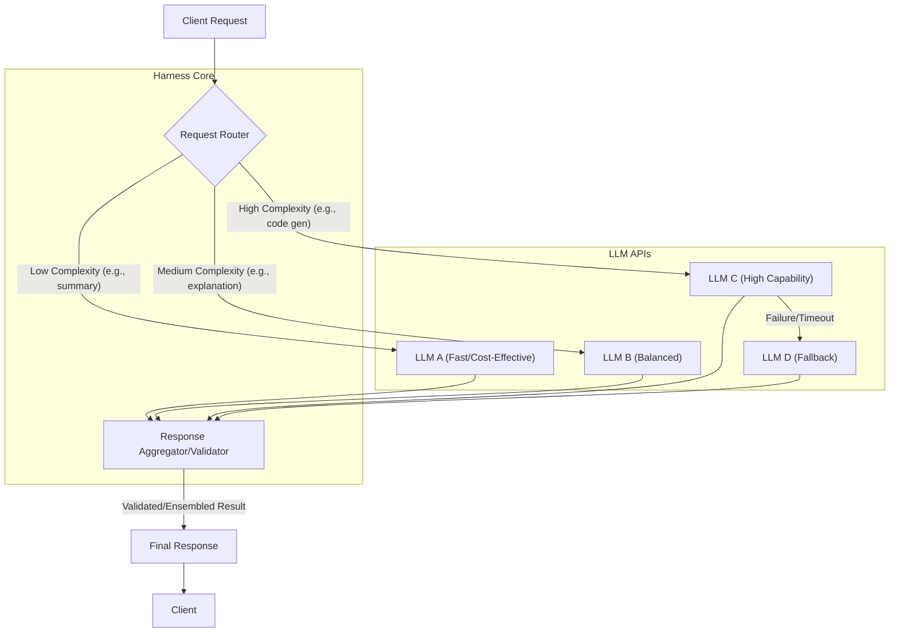

## 다중 LLM 하네스 디자인의 필요성

2026년 현재, 단일 대규모 언어 모델(LLM)만으로는 복잡하고 다양한 서비스 요구사항을 충족하기 어렵다. 특정 작업에 최적화된 소형 모델부터 고도의 추론 능력을 가진 대형 모델까지, 각 LLM은 고유한 강점과 약점, 그리고 상이한 비용 및 지연 시간 특성을 가진다. 서비스의 성능, 비용 효율성, 특정 작업에 대한 전문성, 그리고 지연 시간 최적화를 위해서는 여러 LLM을 조합하여 사용하는 전략이 필수적이다. 다중 LLM 하네스는 이러한 모델들을 유기적으로 연결하고, 최적의 모델을 동적으로 선택하며, 결과물을 통합하는 아키텍처 패턴을 제공한다.

## 핵심 디자인 패턴

### 라우터-평가자 패턴 (Router-Evaluator Pattern)

들어오는 요청의 특성(도메인, 복잡성, 중요도 등)을 분석하여 가장 적합한 LLM으로 요청을 라우팅하는 방식이다. 이 패턴은 단순히 모델을 선택하는 것을 넘어, 라우팅된 LLM의 응답을 다른 LLM이나 규칙 기반 시스템(Evaluator)으로 검증하여 응답의 품질, 일관성, 안전성을 보장하는 데 중점을 둔다. 예를 들어, 간단한 질문은 저비용/고속 모델로, 복잡한 코드 생성 요청은 고성능 모델로 라우팅하고, 그 결과를 다시 다른 모델이 검증하는 방식이다.

### 병렬 실행 및 앙상블 패턴 (Parallel Execution & Ensemble Pattern)

여러 LLM에 동일하거나 유사한 요청을 병렬로 전송하고, 각 모델의 응답을 수집하여 종합적인 결과를 도출하는 패턴이다. 수집된 응답들은 투표(Voting), 가중치 부여, 또는 메타 LLM을 통한 최종 선택 등 다양한 앙상블(Ensemble) 기법을 통해 최적화될 수 있다. 이는 단일 모델의 한계나 편향을 줄이고, 다양한 관점을 통합하여 더 견고하고 신뢰할 수 있는 응답을 생성하는 데 유리하다. 특히 정답의 불확실성이 높은 창의적 작업이나 요약 작업에 유용하다.

### 순차적 체인 패턴 (Sequential Chaining Pattern)

특정 작업 흐름에 따라 여러 LLM을 순차적으로 연결하여 복잡한 태스크를 해결하는 패턴이다. 첫 번째 LLM이 초기 작업을 수행하면, 그 결과를 다음 LLM의 입력으로 사용하여 더욱 정교하거나 다음 단계의 작업을 처리한다. 예를 들어, 긴 문서를 요약하는 LLM, 요약된 내용을 특정 언어로 번역하는 LLM, 번역된 텍스트의 스타일을 변경하는 LLM을 순차적으로 연결하여 하나의 복합 작업을 처리할 수 있다. 각 단계의 LLM이 전문성을 가지므로 효율적이고 모듈화된 파이프라인 구성이 가능하다.

## Harness 아키텍처 구성 요소

다중 LLM 하네스 아키텍처는 다음과 같은 핵심 구성 요소로 이루어진다.

*   **요청 수신기 (Request Listener)**: 사용자 또는 시스템의 LLM 호출 요청을 수신하는 진입점이다.
*   **동적 라우터 (Dynamic Router)**: 요청 메타데이터, 모델 성능 지표, 비용, 부하 등을 기반으로 가장 적합한 LLM을 선택하는 핵심 로직이다. 정책 기반 라우팅 (Policy-based Routing), 성능 기반 라우팅 (Performance-based Routing), 비용 기반 라우팅 (Cost-based Routing) 등의 전략을 포함한다.
*   **LLM 어댑터 (LLM Adapters)**: 각기 다른 LLM API와의 인터페이스를 표준화하여 모델 교체 및 확장을 용이하게 한다. 이는 다양한 제공업체의 모델을 일관된 방식으로 호출하고 관리할 수 있게 한다.
*   **응답 통합 및 검증기 (Response Aggregator & Validator)**: 여러 LLM의 응답을 수집하고, 일관성, 정확성, 안전성 등을 검증한다. 필요에 따라 응답을 결합하거나 재구성하여 최종 결과물을 생성한다.
*   **캐싱 레이어 (Caching Layer)**: 반복되는 요청에 대한 LLM 호출을 줄여 비용과 지연 시간을 최적화한다. 효과적인 캐시 키 생성 및 무효화 전략이 중요하다.
*   **관측 가능성 및 모니터링 (Observability & Monitoring)**: 각 모델의 성능, 비용, 오류율, 지연 시간 등을 실시간으로 추적하여 라우팅 정책을 동적으로 조정하거나 문제 발생 시 빠르게 대응할 수 있도록 한다.

## 코드 예제: 동적 LLM 라우팅

다음 Python (FastAPI) 예제는 요청의 복잡성에 따라 다른 LLM으로 라우팅하고, 고복잡도 요청 시 fallback을 처리하는 기본적인 하네스 디자인을 보여준다. (실제 LLM 클라이언트는 Mock으로 대체)

```python
from fastapi import FastAPI, HTTPException
from pydantic import BaseModel
import os

# Mock clients for demonstration - In production, use actual SDKs (e.g., openai, anthropic)
class MockOpenAIClient:
    def chat(self, **kwargs):
        model_name = kwargs.get('model', 'unknown')
        prompt_content = kwargs['messages'][0]['content']
        return type('obj', (object,), {'choices': [{'message': {'content': f"[OpenAI:{model_name}] Processed: '{prompt_content[:50]}...'"}}]})()

class MockAnthropicClient:
    def messages(self, **kwargs):
        model_name = kwargs.get('model', 'unknown')
        prompt_content = kwargs['messages'][0]['content']
        return type('obj', (object,), {'content': f"[Anthropic:{model_name}] Processed: '{prompt_content[:50]}...'"})()

openai_client = MockOpenAIClient()
anthropic_client = MockAnthropicClient()

app = FastAPI()

class LLMRequest(BaseModel):
    prompt: str
    complexity: str = "medium" # 'low', 'medium', 'high'

@app.post("/process-llm-request")
async def process_llm_request(request: LLMRequest):
    selected_llm = ""
    response_content = ""

    try:
        if request.complexity == "low":
            selected_llm = "OpenAI-GPT-3.5-Turbo"
            response = openai_client.chat(model="gpt-3.5-turbo", messages=[{"role": "user", "content": request.prompt}])
            response_content = response.choices[0].message.content
        elif request.complexity == "medium":
            selected_llm = "Anthropic-Claude-3-Haiku"
            response = anthropic_client.messages(model="claude-3-haiku-20240307", max_tokens=1000, messages=[{"role": "user", "content": request.prompt}])
            response_content = response.content
        elif request.complexity == "high":
            selected_llm = "Anthropic-Claude-3-Opus"
            try:
                response = anthropic_client.messages(model="claude-3-opus-20240229", max_tokens=2000, messages=[{"role": "user", "content": request.prompt}])
                response_content = response.content
            except Exception as e:
                # Fallback to a slightly less capable but reliable model on failure
                print(f"Claude-3-Opus failed, falling back to OpenAI-GPT-4o: {e}")
                selected_llm = "OpenAI-GPT-4o (Fallback)
                response = openai_client.chat(model="gpt-4o", messages=[{"role": "user", "content": request.prompt}])
                response_content = response.choices[0].message.content
        else:
            raise HTTPException(status_code=400, detail="Invalid complexity level")

        return {
            "selected_llm": selected_llm,
            "response": response_content
        }
    except Exception as e:
        raise HTTPException(status_code=500, detail=f"LLM processing failed: {str(e)}")

# To run this example:
# 1. Install dependencies: `pip install fastapi uvicorn pydantic`
# 2. Run the server: `uvicorn your_file_name:app --reload`
# 3. Test with curl:
#    `curl -X POST -H "Content-Type: application/json" -d '{"prompt": "Summarize this article.", "complexity": "low"}' http://127.0.0.1:8000/process-llm-request`
#    `curl -X POST -H "Content-Type: application/json" -d '{"prompt": "Explain quantum computing.", "complexity": "medium"}' http://127.0.0.1:8000/process-llm-request`
#    `curl -X POST -H "Content-Type: application/json" -d '{"prompt": "Design a microservice architecture.", "complexity": "high"}' http://127.0.0.1:8000/process-llm-request`
```

## Mermaid 다이어그램: 다중 LLM 하네스 흐름



## 트레이드오프

*   **복잡성 증가 vs. 최적화된 성능 및 비용**: 다중 LLM 하네스는 단일 모델 사용 대비 아키텍처 및 운영 복잡성이 크게 증가한다.
    *   **언제 좋음**: 다양한 요구사항을 가진 대규모 프로덕션 환경에서 각 모델의 강점을 활용하여 성능을 극대화하고 비용을 최적화해야 할 때. 여러 모델 간의 전환 로직과 관리 오버헤드를 감수할 가치가 있다.
    *   **언제 나쁨**: 소규모 프로젝트나 단일 작업에 대한 간단한 요구사항에는 아키텍처 및 운영 복잡성이 불필요하게 증가하여 개발 및 유지보수 비용이 더 커질 수 있다.

*   **추가 지연 시간 vs. 견고성 및 신뢰성**: 모델 라우팅 로직과 여러 LLM 호출(병렬 또는 순차)로 인해 응답에 추가적인 지연 시간이 발생할 수 있다.
    *   **언제 좋음**: 추가 지연 시간이 허용 가능하며, 특정 모델의 오류나 성능 저하에 대한 탄력적인 대응(Fallback, Retry)이 중요할 때. 서비스의 신뢰성과 사용자 경험의 일관성을 향상시키는 데 기여한다.
    *   **언제 나쁨**: 실시간 응답이 필수적인 초저지연 애플리케이션에서는 모델 라우팅 및 다중 호출의 오버헤드가 사용자 경험을 심각하게 저해할 수 있다.

*   **데이터 일관성 문제 vs. 유연한 모델 교체 및 확장**: 여러 모델이 동일한 데이터를 다른 방식으로 처리하거나 다른 내부 지식을 가질 때, 응답 간의 미묘한 차이나 불일치가 발생할 수 있다.
    *   **언제 좋음**: 특정 도메인에 특화된 모델을 쉽게 통합하거나, 더 나은 성능의 새 모델로 교체, 또는 새로운 기능을 추가하기 위한 모델 확장이 빈번할 때. 비즈니스 요구사항에 빠르게 대응할 수 있는 유연성을 제공한다.
    *   **언제 나쁨**: 여러 모델이 동일한 데이터를 다른 방식으로 처리할 때 발생할 수 있는 데이터 일관성 문제(예: 다른 스타일, 사실적 오류)를 관리하는 비용이 높고, 이에 대한 엄격한 일관성 요구사항이 있는 시스템에는 추가적인 검증 계층이 필요하다.

*   **모니터링 및 로깅 오버헤드 vs. 심층적인 통찰력**: 각 LLM 호출, 라우팅 결정, 응답 통합 과정에 대한 상세한 모니터링 및 로깅은 상당한 오버헤드를 유발한다.
    *   **언제 좋음**: 각 모델의 성능 지표, 비용, 라우팅 결정 이유 등을 상세히 추적하여 시스템 최적화 및 문제 해결을 위한 깊은 통찰력을 얻을 때. A/B 테스트 및 모델 개선에 필수적인 데이터 소스를 제공한다.
    *   **언제 나쁨**: 리소스가 제한적이거나 간단한 시스템에서는 상세한 모니터링 및 로깅 인프라 구축 및 유지보수 비용이 과도할 수 있으며, 이로 인한 성능 저하가 발생할 수도 있다.

## 실전 체크리스트

프로젝트에 다중 LLM 하네스 디자인을 적용할 때 다음 항목들을 검증한다.

*   - [ ] 요청 유형 및 복잡도에 따른 **라우팅 정책**을 명확히 정의하고, 이를 코드와 문서로 관리하고 있는가? (예: 정규 표현식, Semantic similarity, Heuristics 등 구체적인 기준 포함)
*   - [ ] 각 LLM의 **성능(latency, throughput) 및 비용(per token)**을 지속적으로 측정하고, 이 지표를 라우팅 결정에 동적으로 반영하는 자동화된 메커니즘을 구현했는가?
*   - [ ] 특정 LLM의 서비스 중단, 지연, 또는 품질 저하 시 **자동 페일오버(Failover) 및 폴백(Fallback) 전략**을 구현하고, 주기적으로 테스트하여 견고성을 검증하고 있는가?
*   - [ ] 여러 LLM의 응답을 통합하거나 검증하는 로직이 **일관성과 정확성을 유지**하도록 설계되었으며, 이에 대한 자동화된 테스트 케이스(예: 골든 데이터셋 기반)가 포함되어 있는가?
*   - [ ] 캐싱 전략을 도입하여 **반복되는 요청에 대한 LLM 호출을 최소화**하고, 캐시 무효화 정책을 비즈니스 로직에 맞춰 명확히 설정했는가?
*   - [ ] 전체 하네스 시스템의 **관측 가능성(Observability)**을 확보하기 위해 각 LLM 호출, 라우팅 결정, 응답 통합 과정에 대한 로그, 메트릭, 트레이스를 수집하고, 이를 시각화하여 운영 팀이 실시간으로 시스템 상태를 파악할 수 있도록 했는가?
*   - [ ] 모델의 오용 또는 보안 취약점을 방지하기 위한 **입력 프롬프트 및 출력 응답에 대한 보안 검증 및 가드레일**을 구현했는가? (예: Prompt Injection 방어, 민감 정보 필터링)