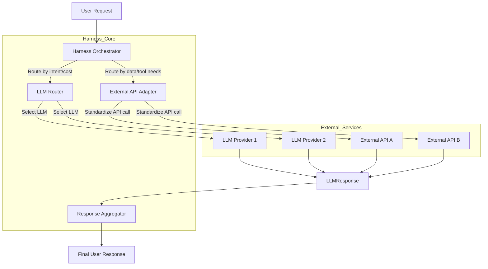

다중 LLM(Large Language Model) 및 다양한 외부 API 연동이 필수적인 복잡한 AI 애플리케이션에서, 확장성과 유지보수성을 보장하기 위한 핵심은 견고한 'Harness' 디자인 패턴 통합입니다. Harness 아키텍처는 LLM 및 외부 서비스와의 상호작용을 추상화하고 표준화하여 통합 복잡성을 해소하고 시스템의 견고성 및 유연성을 향상시킵니다.

## 핵심 디자인 패턴

Harness는 다중 LLM 및 외부 API 연동을 효율적으로 관리하기 위해 다음 패턴들을 활용합니다.

### 1. 라우터 & 오케스트레이터 (Router & Orchestrator)
요청의 의도와 제약사항에 따라 최적의 LLM/API로 동적으로 요청을 라우팅하고, 여러 서비스 호출을 조율하여 최종 응답을 구성합니다.

### 2. 어댑터 (Adapter)
다양한 LLM/API의 고유 인터페이스를 Harness 내부 표준 형식으로 변환, 서비스 종속성을 제거하고 교체 용이성을 높입니다.

### 3. 회로 차단기 & 재시도 (Circuit Breaker & Retry)
외부 서비스 장애 시 회로 차단기로 요청을 방지하고, 재시도 로직으로 일시적 오류를 자동 처리하여 시스템 견고성을 확보합니다.

### 4. 캐싱 (Caching)
반복되거나 Latency에 민감한 LLM 응답/API 호출 결과를 저장하여 성능을 최적화하고 비용을 절감합니다.

### 5. 모니터링 & 로깅 (Monitoring & Logging)
모든 주요 상호작용에 대한 상세 기록과 성능 지표를 수집, 문제 진단 및 성능 최적화에 필요한 가시성을 제공합니다.

## 2026년 트렌드

*   **Adaptive LLM Selection**: 실시간 컨텍스트 기반 LLM 동적 라우팅 표준화.
*   **Dynamic API Schema Fetching**: 런타임 OpenAPI 스키마 활용으로 LLM의 정확한 API 호출 능력 강화.
*   **Agentic Orchestration**: LLM 에이전트의 자율적 계획 및 다중 LLM/툴 조합 통한 복잡 작업 수행.
*   **Enhanced Data Governance & Security**: 민감 데이터 마스킹, 암호화, RBAC 등 보안/규정 준수 기능 Harness 내장.

## Harness 통합 아키텍처



## 코드 예제 (Python)

```python
from typing import Dict, Any

class LLMAdapter:
    def __init__(self, name: str): self.name = name
    async def generate(self, prompt: str, **kwargs) -> str:
        return f"[{self.name} Response] '{prompt[:15]}...'"

class LLMRouter:
    def __init__(self, adapters: Dict[str, 'LLMAdapter']): self.adapters = adapters
    async def route_and_generate(self, prompt: str, strategy: str = "default", **kwargs) -> str:
        selected_llm = self.adapters.get(kwargs.get("llm_name", "OpenAI"))
        if not selected_llm: raise ValueError("No LLM adapter.")
        return await selected_llm.generate(prompt, **kwargs)

class APIDispatcher:
    def __init__(self, api_configs: Dict[str, Any]): self.api_configs = api_configs
    async def call_api(self, api_name: str, endpoint: str, **kwargs) -> Dict[str, Any]:
        if api_name not in self.api_configs: raise ValueError(f"API '{api_name}' not configured.")
        return {"status": "success", "data": f"Response from {api_name}"}

class Harness:
    def __init__(self, llm_router: LLMRouter, api_dispatcher: APIDispatcher):
        self.llm_router = llm_router
        self.api_dispatcher = api_dispatcher
    async def process_request(self, query: str) -> str:
        if "search" in query.lower():
            api_response = await self.api_dispatcher.call_api("SearchService", "/items")
            return await self.llm_router.route_and_generate(f"Summarize: {api_response['data']}", llm_name="OpenAI")
        return await self.llm_router.route_and_generate(query, llm_name="OpenAI")
```

## 트레이드오프

*   **초기 복잡성 vs 장기 유지보수성**:
    *   **장점**: 대규모 AI 시스템에서 LLM/API 변경 및 기능 추가 시 높은 유연성과 유지보수 용이성을 제공합니다.
    *   **단점**: 소규모 POC나 단일 LLM/API 의존 애플리케이션에는 불필요한 오버헤드입니다.
*   **성능 오버헤드 vs 유연한 라우팅**:
    *   **장점**: 지능형 LLM 선택, 부하 분산, 장애 시 자동 전환 등 전략적 유연성으로 Latency 오버헤드를 상쇄합니다.
    *   **단점**: 극도로 Latency에 민감한 실시간 애플리케이션에서는 추가 라우팅 계층의 오버헤드가 문제가 될 수 있습니다.
*   **중앙 집중화 vs 단일 장애점 위험**:
    *   **장점**: LLM/API 통합 로직 중앙 집중화로 관리 용이성 및 일관된 정책 적용을 가능하게 합니다.
    *   **단점**: Harness 자체의 고가용성 및 회복성 설계가 미비할 경우, 전체 시스템의 단일 장애점이 될 위험이 있습니다.

## 실전 체크리스트

*   - [ ] 핵심 LLM 및 외부 API 인터페이스를 정의하고 각 서비스에 대한 어댑터를 구현했는가?
*   - [ ] 요청 의도, 비용, Latency에 기반한 동적 라우팅 로직을 설계 및 테스트했는가?
*   - [ ] 외부 서비스 오류에 대비한 회로 차단기 및 재시도 패턴을 통합했는가?
*   - [ ] Harness의 주요 상호작용에 대한 상세 로깅 및 분산 트레이싱을 구현하여 가시성을 확보했는가?
*   - [ ] Harness의 고가용성 및 재해 복구 전략을 수립하고 테스트했는가?