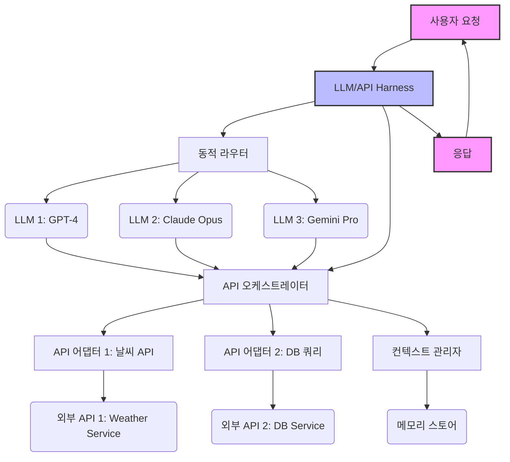

복잡한 AI 애플리케이션 개발에서 다중 LLM(Large Language Model)과 외부 API 연동은 핵심적인 난관입니다. 사용자 요청 처리, 정보 검색, 데이터 조작 등 다양한 작업을 수행하기 위해 여러 LLM의 강점을 활용하고 외부 시스템과 안정적으로 상호작용하는 것은 시스템의 유연성, 확장성, 그리고 안정성을 결정합니다. 이러한 복잡성을 관리하고 일관된 인터페이스를 제공하는 데 필수적인 것이 바로 Harness 디자인 패턴입니다. Harness는 여러 컴포넌트 간의 상호작용을 추상화하고 제어하는 레이어로, 시스템의 견고함을 확보하는 데 기여합니다.

## Harness의 중요성

AI 애플리케이션은 더 이상 단일 LLM에 의존하지 않습니다. 특정 작업에 최적화된 LLM을 선택하거나, 비용 효율적인 모델을 우선 사용하고 필요시 고성능 모델로 전환하는 전략이 일반화되고 있습니다. 또한, 실시간 데이터 조회, 외부 서비스 연동, 사용자 인증 등 LLM 자체의 기능을 넘어선 작업들을 처리하기 위해 다양한 외부 API와의 연동이 필수적입니다. Harness는 이 과정에서 발생하는 다음 과제들을 해결합니다.

*   **모델 다양성 관리 (Model Diversity Management)**: 여러 LLM 프로바이더(OpenAI, Anthropic, Google 등) 및 다양한 모델(GPT-4, Claude Opus, Gemini Pro 등) 간의 인터페이스 통일 및 동적 선택 로직 구현.
*   **외부 API 연동 복잡성 감소 (External API Integration Abstraction)**: 비일관적인 외부 API의 인터페이스를 표준화하고, 인증, 에러 처리, 속도 제한 등을 중앙에서 관리.
*   **탄력성 및 에러 처리 (Resilience & Error Handling)**: LLM 또는 외부 API 호출 실패 시 재시도, 폴백(Fallback) 전략, 서킷 브레이커(Circuit Breaker) 패턴 적용.
*   **옵저버빌리티 및 로깅 (Observability & Logging)**: 각 LLM 호출 및 API 연동 과정에 대한 상세 로깅, 모니터링, 추적을 통해 문제 진단 및 성능 최적화.
*   **비용 최적화 (Cost Optimization)**: 작업의 중요도, 긴급성, 성능 요구사항에 따라 가장 적합하고 비용 효율적인 LLM을 동적으로 선택.

## Harness 디자인 패턴

### 1. 동적 라우터 패턴 (Dynamic Router Pattern)
사용자 요청 또는 내부 로직에 따라 적절한 LLM을 선택하여 호출하는 패턴입니다. 비용, 성능, 기능(예: 특정 LLM만 지원하는 특화 기능) 등을 기준으로 모델을 선택합니다.

### 2. Tool/API 어댑터 패턴 (Tool/API Adapter Pattern)
외부 API를 LLM이 이해할 수 있는 형태로 추상화하고, 호출 결과를 다시 시스템이 처리할 수 있는 형태로 변환합니다. 각 API의 복잡한 인증, 요청/응답 스펙을 캡슐화하여 LLM은 표준화된 `tool` 인터페이스를 통해 기능을 활용할 수 있게 합니다.

### 3. 오케스트레이션 레이어 패턴 (Orchestration Layer Pattern)
여러 LLM 호출과 외부 API 연동을 포함하는 복잡한 워크플로우를 관리합니다. 태스크 분해, 병렬 처리, 조건부 실행, 상태 관리 등을 담당하여 전체 작업 흐름을 제어합니다. 에이전트(Agent) 기반 시스템에서 핵심적인 역할을 합니다.

### 4. 폴백 및 재시도 패턴 (Fallback & Retry Pattern)
LLM 또는 외부 API 호출 실패 시 시스템의 안정성을 확보하기 위한 패턴입니다. 일시적인 네트워크 오류나 서비스 문제에 대해 자동으로 재시도하거나, 미리 정의된 대체 LLM 또는 기본 응답으로 전환합니다.

### 5. 컨텍스트 관리자 패턴 (Context Manager Pattern)
다중 LLM 및 API 연동 과정에서 공유되어야 하는 대화 컨텍스트, 사용자 상태, 작업 관련 정보 등을 중앙에서 관리합니다. 이를 통해 각 컴포넌트가 일관된 정보에 접근하고, LLM의 컨텍스트 윈도우(Context Window)를 효율적으로 사용할 수 있습니다.

## 아키텍처 다이어그램



## 코드 예시: 간단한 Python Harness 구현

이 예시는 동적 LLM 라우팅과 외부 API 호출을 간략하게 보여주는 Harness 클래스입니다.

```python
import os
import requests
from typing import Dict, Any, Optional

class LLMHarness:
    def __init__(self, api_keys: Dict[str, str]):
        self.api_keys = api_keys
        self.llm_clients = {
            "gpt-4": self._init_openai_client(),
            "claude-opus": self._init_anthropic_client(),
            "gemini-pro": self._init_gemini_client()
        }

    def _init_openai_client(self):
        # 실제 구현에서는 OpenAI Python SDK를 사용합니다.
        # from openai import OpenAI
        # return OpenAI(api_key=self.api_keys.get("openai"))
        return {"model": "gpt-4", "endpoint": "https://api.openai.com/v1/chat/completions"}

    def _init_anthropic_client(self):
        # 실제 구현에서는 Anthropic Python SDK를 사용합니다.
        # from anthropic import Anthropic
        # return Anthropic(api_key=self.api_keys.get("anthropic"))
        return {"model": "claude-opus", "endpoint": "https://api.anthropic.com/v1/messages"}
    
    def _init_gemini_client(self):
        # 실제 구현에서는 Google Generative AI SDK를 사용합니다.
        # import google.generativeai as genai
        # genai.configure(api_key=self.api_keys.get("gemini"))
        # return genai
        return {"model": "gemini-pro", "endpoint": "https://generativelanguage.googleapis.com/v1/models/gemini-pro:generateContent"}

    def _call_llm(self, model_name: str, prompt: str, temperature: float = 0.7) -> Optional[str]:
        client_config = self.llm_clients.get(model_name)
        if not client_config:
            print(f"Error: LLM client for {model_name} not found.")
            return None

        print(f"Calling {model_name} with prompt: {prompt[:50]}...")

        try:
            # 실제 LLM API 호출 로직
            if model_name.startswith("gpt"):
                headers = {"Authorization": f"Bearer {self.api_keys.get('openai')}", "Content-Type": "application/json"}
                data = {"model": client_config["model"], "messages": [{"role": "user", "content": prompt}], "temperature": temperature}
                response = requests.post(client_config["endpoint"], headers=headers, json=data)
                response.raise_for_status()
                return response.json()["choices"][0]["message"]["content"]
            elif model_name.startswith("claude"):
                headers = {"x-api-key": self.api_keys.get('anthropic'), "anthropic-version": "2023-06-01", "Content-Type": "application/json"}
                data = {"model": client_config["model"], "messages": [{"role": "user", "content": prompt}], "max_tokens": 1024, "temperature": temperature}
                response = requests.post(client_config["endpoint"], headers=headers, json=data)
                response.raise_for_status()
                return response.json()["content"][0]["text"]
            elif model_name.startswith("gemini"):
                params = {"key": self.api_keys.get('gemini')}
                data = {"contents": [{"parts": [{"text": prompt}]}]}
                response = requests.post(client_config["endpoint"], params=params, json=data)
                response.raise_for_status()
                return response.json()["candidates"][0]["content"]["parts"][0]["text"]
            else:
                return "Simulated LLM response for other models."
        except requests.exceptions.RequestException as e:
            print(f"LLM API call failed for {model_name}: {e}")
            return None

    def route_and_call_llm(self, prompt: str, required_capability: Optional[str] = None, max_cost: Optional[float] = None) -> Optional[str]:
        # 동적 라우팅 로직 (2026 트렌드: 성능, 비용, 기능 기반)
        if required_capability == "complex_reasoning":
            preferred_model = "gpt-4" # 고성능 모델 우선
        elif max_cost is not None and max_cost < 0.01:
            preferred_model = "gemini-pro" # 저비용 모델 우선
        else:
            preferred_model = "claude-opus" # 기본 모델
        
        return self._call_llm(preferred_model, prompt)

    def call_external_api(self, api_name: str, params: Dict[str, Any]) -> Optional[Dict[str, Any]]:
        print(f"Calling external API: {api_name} with params: {params}")
        # 실제 API 어댑터 로직 (여기서는 단순 예시)
        if api_name == "weather_forecast":
            api_key = self.api_keys.get("weather")
            city = params.get("city", "Seoul")
            try:
                response = requests.get(f"https://api.weatherapi.com/v1/current.json?key={api_key}&q={city}")
                response.raise_for_status()
                return response.json()
            except requests.exceptions.RequestException as e:
                print(f"Weather API call failed: {e}")
                return None
        elif api_name == "database_query":
            # 실제 DB 쿼리 로직은 더 복잡합니다.
            print(f"Executing simulated DB query: SELECT * FROM {params.get('table')} WHERE {params.get('condition')}")
            return {"status": "success", "data": [{"id": 1, "name": "item A"}]}
        else:
            print(f"Unknown API: {api_name}")
            return None

# 사용 예시
if __name__ == "__main__":
    # 실제 API 키는 환경 변수 등에서 안전하게 로드해야 합니다.
    # dummy_api_keys = {
    #     "openai": os.environ.get("OPENAI_API_KEY", "sk-..."),
    #     "anthropic": os.environ.get("ANTHROPIC_API_KEY", "sk-..."),
    #     "gemini": os.environ.get("GEMINI_API_KEY", "AIza..."),
    #     "weather": os.environ.get("WEATHER_API_KEY", "...")
    # }
    # API 키를 실제 서비스에서 사용할 때는 절대 하드코딩하지 마십시오.
    dummy_api_keys = {
        "openai": "sk-YOUR_OPENAI_KEY",
        "anthropic": "sk-YOUR_ANTHROPIC_KEY",
        "gemini": "AIzaYOUR_GEMINI_KEY",
        "weather": "YOUR_WEATHER_API_KEY"
    }

    harness = LLMHarness(dummy_api_keys)

    # LLM 호출 예시
    print("\n--- LLM Calls ---")
    llm_response_complex = harness.route_and_call_llm("Explain quantum entanglement in simple terms.", required_capability="complex_reasoning")
    print(f"Complex LLM Response: {(llm_response_complex[:100] + '...') if llm_response_complex else 'None'}\n")

    llm_response_cost_efficient = harness.route_and_call_llm("What is the capital of France?", max_cost=0.005)
    print(f"Cost-efficient LLM Response: {(llm_response_cost_efficient[:100] + '...') if llm_response_cost_efficient else 'None'}\n")
    
    llm_response_default = harness.route_and_call_llm("Tell me a short story about a cat.")
    print(f"Default LLM Response: {(llm_response_default[:100] + '...') if llm_response_default else 'None'}\n")

    # 외부 API 호출 예시
    print("\n--- External API Calls ---")
    weather_data = harness.call_external_api("weather_forecast", {"city": "London"})
    print(f"Weather Data for London: {weather_data}\n")

    db_data = harness.call_external_api("database_query", {"table": "users", "condition": "id = 1"})
    print(f"Database Query Result: {db_data}\n")
```

## 트레이드오프

*   **유연성 및 확장성 vs. 초기 개발 복잡성 (Flexibility & Scalability vs. Initial Development Complexity)**
    *   **언제 좋고**: 다양한 LLM 및 API를 쉽게 추가, 교체, 구성할 수 있어 미래 변화에 강력하게 대응할 수 있습니다. 시스템의 장기적인 생명주기와 기능 확장에 유리합니다.
    *   **언제 나쁜지**: 초기 설계 및 구현에 상당한 시간과 노력이 필요합니다. 소규모, 단일 LLM/API에만 의존하는 프로젝트에는 과도한 오버헤드가 될 수 있습니다.

*   **비용 효율성 및 성능 최적화 vs. 오버헤드 (Cost Efficiency & Performance Optimization vs. Overhead)**
    *   **언제 좋고**: 동적 라우팅을 통해 가장 비용 효율적이거나 성능이 우수한 모델을 선택할 수 있어 운영 비용을 절감하고 사용자 경험을 최적화합니다.
    *   **언제 나쁜지**: Harness 레이어 자체가 추가적인 처리 지연(latency)과 컴퓨팅 리소스 사용을 발생시킬 수 있습니다. 초저지연이 필수적인 애플리케이션에서는 이 오버헤드가 문제가 될 수 있습니다.

*   **표준화된 인터페이스 vs. 특정 LLM/API의 고유 기능 활용 제약 (Standardized Interface vs. Constraint on Unique Features)**
    *   **언제 좋고**: 통일된 인터페이스를 통해 개발 복잡성을 줄이고 유지보수를 용이하게 합니다. 개발자는 개별 LLM이나 API의 특성을 일일이 알 필요 없이 일관된 방식으로 상호작용할 수 있습니다.
    *   **언제 나쁜지**: 표준화는 특정 LLM이나 API가 제공하는 독점적이거나 최적화된 고급 기능을 100% 활용하기 어렵게 만들 수 있습니다. 모든 기능을 포괄하는 일반적인 인터페이스를 만드는 것이 불가능하거나 비효율적일 수 있습니다.

*   **중앙 집중식 제어 및 옵저버빌리티 vs. 단일 장애점 가능성 (Centralized Control & Observability vs. Single Point of Failure)**
    *   **언제 좋고**: 모든 LLM 및 API 호출을 중앙에서 관리하므로 로깅, 모니터링, 보안 정책 적용이 용이하고 시스템 전체의 가시성을 확보할 수 있습니다.
    *   **언제 나쁜지**: Harness 자체에 문제가 발생할 경우, 전체 시스템에 영향을 미치는 단일 장애점(Single Point of Failure)이 될 수 있습니다. Harness의 고가용성 및 견고한 설계가 필수적입니다.

## 실전 체크리스트

다중 LLM 및 외부 API 연동을 위한 Harness 디자인 패턴을 프로젝트에 적용할 때 다음 항목을 검증해야 합니다.

*   [ ] **API 키 및 보안 관리**: 모든 LLM 및 외부 API 키가 환경 변수나 보안 저장소에서 안전하게 로드되고 관리되는지 확인하십시오. (예: HashiCorp Vault, AWS Secrets Manager)
*   [ ] **동적 라우팅 로직 검증**: LLM 라우팅 로직이 정의된 기준(비용, 성능, 기능)에 따라 올바르게 작동하는지, 그리고 예상치 못한 입력에 대해 안전하게 폴백하는지 테스트하십시오.
*   [ ] **API 어댑터 유효성 검사**: 각 외부 API 어댑터가 API의 요청/응답 스펙을 정확하게 처리하고, 에러 상황(HTTP < 400 또는 >= 500)을 적절히 변환하여 상위 레이어로 전달하는지 확인하십시오.
*   [ ] **재시도 및 폴백 전략 적용**: LLM 또는 외부 API 호출 실패 시 자동 재시도 로직이 지수 백오프(Exponential Backoff)와 함께 구현되었는지, 그리고 최종 실패 시 합리적인 폴백(예: 기본 응답, 다른 LLM, 에러 메시지)이 제공되는지 검토하십시오.
*   [ ] **레이턴시 및 처리량 측정**: Harness 도입 후 전체 요청의 평균 레이턴시(latency)와 처리량(throughput)을 측정하고, 성능 목표를 충족하는지 지속적으로 모니터링하십시오.
*   [ ] **비용 모니터링 시스템 구축**: 각 LLM 호출 및 외부 API 사용량에 대한 상세한 비용 추적 시스템을 구축하여, 예산 초과를 방지하고 비용 최적화 기회를 식별하십시오.
*   [ ] **컨텍스트 일관성 보장**: 컨텍스트 관리자가 여러 LLM 호출 및 API 연동 사이에서 대화 컨텍스트나 사용자 상태를 정확하고 일관되게 유지하는지 확인하십시오.