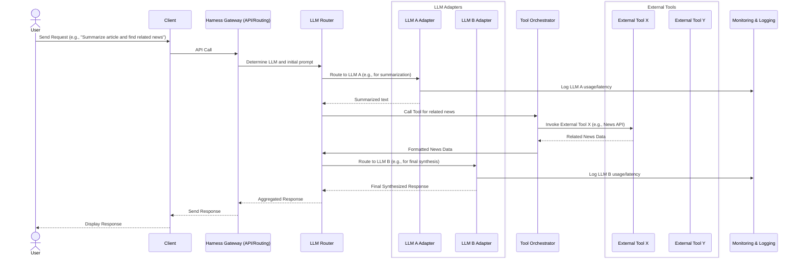

복잡한 AI 애플리케이션의 등장은 단일 LLM에 의존하는 것을 넘어, 여러 LLM과 외부 도구를 유기적으로 통합하는 아키텍처의 필요성을 증대시켰다. 이러한 시스템은 다양한 LLM의 특장점(비용, 성능, 전문성)을 활용하고, 외부 API, 데이터베이스, 커스텀 로직 등 도구를 통해 LLM의 기능을 확장하며, 높은 신뢰성과 유연성을 제공한다. 하네스 아키텍처는 이러한 복잡한 통합을 효율적으로 관리하기 위한 핵심적인 접근 방식이다.

## 하네스 아키텍처의 핵심 원칙

다중 LLM 및 외부 도구를 통합하는 하네스(Harness) 아키텍처는 다음과 같은 원칙을 기반으로 설계되어야 한다.

### 1. 추상화(Abstraction) 및 모듈화(Modularity)
각 LLM과 외부 도구는 자체적인 인터페이스와 특성을 가진다. 하네스는 이들의 복잡성을 추상화하여, 상위 레이어가 일관된 방식으로 접근할 수 있도록 해야 한다. 이는 LLM 어댑터(Adapter) 패턴과 도구 인터페이스 정의를 통해 구현될 수 있다. 모듈화는 시스템의 각 컴포넌트가 독립적으로 개발, 배포, 확장될 수 있도록 지원한다.

### 2. 동적 라우팅(Dynamic Routing) 및 오케스트레이션(Orchestration)
요청의 특성(비용 민감도, 응답 속도, 필요한 기능)에 따라 가장 적합한 LLM을 동적으로 선택하고, 여러 도구와 LLM의 호출 순서를 지능적으로 오케스트레이션하는 기능이 필수적이다. 이는 룰 기반(Rule-based), 머신러닝 기반(ML-based), 또는 컨텍스트 기반(Context-based) 라우팅 전략을 통해 구현될 수 있다.

### 3. 관측 가능성(Observability) 및 모니터링(Monitoring)
복잡한 분산 시스템에서 문제 진단 및 성능 최적화는 매우 중요하다. 모든 LLM 호출, 도구 사용, 데이터 흐름에 대한 상세한 로깅(Logging), 트레이싱(Tracing), 메트릭(Metrics) 수집은 필수적이다. 이를 통해 시스템의 병목 현상을 식별하고, 비용을 추적하며, 이상 징후를 감지할 수 있다.

### 4. 내결함성(Fault Tolerance) 및 신뢰성(Reliability)
외부 시스템 의존성이 높아지므로, LLM이나 도구 호출 실패에 대한 강력한 복구 메커니즘이 필요하다. 재시도(Retry), 서킷 브레이커(Circuit Breaker), 폴백(Fallback) 패턴을 적용하여 부분적인 실패가 전체 시스템에 영향을 미치지 않도록 설계해야 한다.

### 5. 보안(Security) 및 접근 제어(Access Control)
여러 LLM과 외부 도구를 사용함에 따라 민감한 정보가 노출될 위험이 커진다. API 키 관리, 사용자 인증 및 권한 부여, 데이터 암호화, 프롬프트 인젝션 방어 등 강력한 보안 조치가 필수적이다.

## 아키텍처 구성 요소



### 1. LLM Gateway & Router
모든 외부 요청의 진입점(Entry Point)이다. 요청을 파싱하고, 사전 정의된 정책(Policy) 또는 동적 학습(Dynamic Learning)을 기반으로 최적의 LLM을 선택한다. 여기에는 로드 밸런싱(Load Balancing), 캐싱(Caching), 프롬프트 검증(Prompt Validation) 기능이 포함될 수 있다.

### 2. LLM 어댑터
각 LLM 제공자(OpenAI, Anthropic, Google Gemini 등)의 API 인터페이스를 추상화하는 계층이다. 표준화된 인터페이스를 제공하여 새로운 LLM 추가를 용이하게 하고, 각 LLM의 특유의 호출 방식이나 응답 포맷을 처리한다.

### 3. 도구 오케스트레이터 (Tool Orchestrator)
LLM이 사용할 수 있는 외부 도구들을 관리하고 실행하는 역할을 한다. LLM으로부터 특정 도구 사용 요청을 받으면, 해당 도구에 맞는 API 호출을 변환하고, 실행 결과를 LLM이 이해할 수 있는 형식으로 다시 변환하여 전달한다. 여기에는 도구 사용의 안전성(Safety) 및 비용 제어 로직이 포함될 수 있다.

### 4. 컨텍스트 관리 (Context Management)
다중 LLM 및 도구 호출 간에 일관된 대화 상태와 필요한 정보를 유지하는 메커니즘이다. 장기 기억(Long-term Memory), 세션 컨텍스트(Session Context), 관련 문서 검색(RAG) 등을 관리하여 LLM이 더 정확하고 유용한 응답을 생성하도록 돕는다.

### 5. 모니터링 및 로깅 시스템
Jaeger 같은 분산 트레이싱(Distributed Tracing) 도구와 Prometheus 같은 메트릭 수집 시스템을 통합하여, 시스템의 실시간 상태와 성능을 파악한다. 이는 비용 효율성 분석, LLM 버전별 성능 비교, 오류 감지에 필수적이다.

## 2026년 트렌드 반영 설계 고려사항

*   **실시간 처리 및 저지연**: 에지 컴퓨팅(Edge Computing) 및 온디바이스(On-device) LLM 통합을 고려하여 특정 작업의 지연 시간을 최소화한다. 이는 하네스가 클라우드와 에지 환경 모두에서 유연하게 배포될 수 있도록 설계되어야 함을 의미한다.
*   **멀티모달 통합**: 텍스트 외에 이미지, 오디오, 비디오 등 다양한 형태의 입력과 출력을 처리할 수 있는 LLM 및 도구 통합을 지원한다. 하네스는 멀티모달 데이터를 효율적으로 변환하고 전달하는 파이프라인을 포함해야 한다.
*   **강화 학습 기반 동적 적응**: LLM 선택 및 도구 오케스트레이션 로직을 고정된 룰(Rule) 대신 강화 학습(Reinforcement Learning) 또는 적응형 알고리즘을 통해 동적으로 최적화한다. 이는 비용, 성능, 사용자 만족도 피드백을 기반으로 LLM 및 도구 사용 전략을 지속적으로 개선할 수 있게 한다.
*   **에이전트 협업 패턴**: 단일 LLM 에이전트가 아닌, 특화된 역할을 가진 여러 LLM 에이전트 간의 협업(Multi-agent Collaboration)을 하네스 레벨에서 지원한다. 이는 복잡한 작업을 분해하고 병렬 처리하는 데 유용하다.

## 코드 예제: Go 기반 LLM 라우터

다음은 Go 언어로 구현된 간단한 LLM 라우터의 예시이다. `LLMAdapter` 인터페이스를 통해 다양한 LLM을 추상화하고, `LLMRouter`가 요청에 따라 동적으로 LLM을 선택한다.

```go
package main

import (
	"context"
	"errors"
	"fmt"
	"log"
	"time"
)

// LLMAdapter interface defines a common interface for all LLMs
type LLMAdapter interface {
	Generate(ctx context.Context, prompt string) (string, error)
	GetModelName() string
	GetCostPerToken() float64
	GetLatencyMS() int
}

// OpenAIAdapter implements LLMAdapter for OpenAI models
type OpenAIAdapter struct{}

func (o *OpenAIAdapter) Generate(ctx context.Context, prompt string) (string, error) {
	// Simulate API call to OpenAI
	time.Sleep(100 * time.Millisecond) // Simulate network latency
	return fmt.Sprintf("OpenAI response to: %s", prompt), nil
}

func (o *OpenAIAdapter) GetModelName() string { return "gpt-4o" }
func (o *OpenAIAdapter) GetCostPerToken() float64 { return 0.000005 }
func (o *OpenAIAdapter) GetLatencyMS() int { return 100 }

// GeminiAdapter implements LLMAdapter for Gemini models
type GeminiAdapter struct{}

func (g *GeminiAdapter) Generate(ctx context.Context, prompt string) (string, error) {
	// Simulate API call to Gemini
	time.Sleep(50 * time.Millisecond) // Simulate network latency
	return fmt.Sprintf("Gemini response to: %s", prompt), nil
}

func (g *GeminiAdapter) GetModelName() string { return "gemini-1.5-pro" }
func (g *GeminiAdapter) GetCostPerToken() float64 { return 0.000003 }
func (g *GeminiAdapter) GetLatencyMS() int { return 50 }

// LLMRouter handles dynamic routing to different LLMs
type LLMRouter struct {
	llms []LLMAdapter
}

func NewLLMRouter(llms ...LLMAdapter) *LLMRouter {
	return &LLMRouter{llms: llms}
}

// RouteAndGenerate selects an LLM based on criteria and generates a response
func (r *LLMRouter) RouteAndGenerate(ctx context.Context, prompt string, optimizeFor string) (string, error) {
	if len(r.llms) == 0 {
		return "", errors.New("no LLM adapters available")
	}

	var selectedLLM LLMAdapter

	switch optimizeFor {
	case "cost":
		minCost := 1000.0
		for _, llm := range r.llms {
			if llm.GetCostPerToken() < minCost {
				minCost = llm.GetCostPerToken()
				selectedLLM = llm
			}
		}
	case "latency":
		minLatency := 10000 // ms
		for _, llm := range r.llms {
			if llm.GetLatencyMS() < minLatency {
				minLatency = llm.GetLatencyMS()
				selectedLLM = llm
			}
		}
	default:
		// Default to the first available LLM or a specific one
		selectedLLM = r.llms[0]
	}

	if selectedLLM == nil {
		return "", errors.New("failed to select an LLM")
	}

	log.Printf("Routing to LLM: %s for optimization: %s", selectedLLM.GetModelName(), optimizeFor)
	return selectedLLM.Generate(ctx, prompt)
}

func main() {
	router := NewLLMRouter(&OpenAIAdapter{}, &GeminiAdapter{})

	ctx := context.Background()

	// Optimize for cost
	response, err := router.RouteAndGenerate(ctx, "Hello, world!", "cost")
	if err != nil {
		log.Fatalf("Error generating response: %v", err)
	}
	fmt.Printf("Cost optimized response: %s\n", response)

	// Optimize for latency
	response, err = router.RouteAndGenerate(ctx, "What's the weather?", "latency")
	if err != nil {
		log.Fatalf("Error generating response: %v", err)
	}
	fmt.Printf("Latency optimized response: %s\n", response)
}
```

## 트레이드오프

*   **복잡성 증가 vs. 유연성 및 최적화**: 다중 LLM 및 도구 하네스 아키텍처는 초기 설계 및 구현의 복잡성을 크게 증가시킨다. 이는 개발 초기 단계에서 리소스 소모가 크지만, 장기적으로는 특정 작업에 최적화된 LLM을 선택하고 비용을 절감하며, 새로운 LLM 기술을 유연하게 통합할 수 있는 기반을 제공한다. 단순한 단일 LLM 사용 시 초기 개발 속도는 빠르지만, 확장성 및 최적화에 한계가 있다.
*   **성능 오버헤드 vs. 기능 확장성**: 하네스 레이어는 요청 처리 과정에 추가적인 지연 시간(Latency)을 발생시킬 수 있다. LLM 라우팅, 도구 오케스트레이션, 컨텍스트 관리 등의 로직이 실행되기 때문이다. 이는 실시간 응답이 매우 중요한 애플리케이션에서는 단점으로 작용할 수 있으나, 외부 도구를 통한 LLM의 기능 확장이나 여러 LLM의 장점을 결합해야 하는 복잡한 시나리오에서는 필수적인 선택이다. 단순한 LLM 호출만 필요한 경우에는 오버헤드가 단점으로 부각된다.
*   **표준화된 인터페이스 vs. 개별 LLM/도구의 고유 기능 활용**: 하네스는 일반적으로 LLM과 도구에 대한 표준화된 인터페이스를 강제한다. 이는 통합의 용이성을 높이지만, 특정 LLM이나 도구가 제공하는 고유하고 강력한 특수 기능(예: 특정 LLM의 고급 추론 기능, 특정 도구의 특화된 데이터 처리 방식)을 직접적으로 활용하기 어렵게 만들 수 있다. 인터페이스가 너무 추상적이면 고유 기능의 이점을 잃을 수 있고, 너무 구체적이면 모듈화가 저해된다. 균형 잡힌 설계가 필요하다.
*   **중앙 집중식 제어 vs. 분산된 자율성**: 하네스는 LLM과 도구의 선택, 실행 순서, 컨텍스트 흐름 등을 중앙에서 제어하는 경향이 있다. 이는 시스템의 일관성과 관리 용이성을 높이지만, 개별 에이전트나 하위 시스템의 자율적인 의사 결정 및 동적인 적응 능력을 제한할 수 있다. 고도로 자율적인 에이전트 시스템을 지향하는 경우, 중앙 제어가 병목이 될 수 있다.

## 실전 체크리스트

다중 LLM 및 외부 도구 하네스 아키텍처를 프로젝트에 적용할 때 다음 항목들을 검증한다.

- [ ] **LLM 라우팅 로직 유연성**: LLM 라우팅 로직이 Cost, Latency, Capability, Accuracy 등 최소 2가지 이상의 동적 기준(Dynamic Criteria)에 따라 LLM을 선택하는가?
- [ ] **외부 도구 추상화 계층**: 각 외부 도구에 대한 추상화 계층(Adapter Interface)이 명확히 분리되어 있으며, 새로운 도구 추가 시 기존 코드 수정 없이 확장 가능한가?
- [ ] **엔드투엔드 관측 가능성**: 통합된 시스템 전반에 걸쳐 요청의 시작부터 응답까지 모든 LLM 호출 및 도구 사용에 대한 상세한 로깅, 트레이싱, 메트릭이 수집되고 대시보드를 통해 실시간 모니터링 가능한가?
- [ ] **내결함성 구현**: LLM 및 외부 도구 호출 실패에 대한 재시도(Retry), 서킷 브레이커(Circuit Breaker), 폴백(Fallback) 패턴이 핵심 경로에 적용되어 있으며, 오류 발생 시 적절히 처리되는가?
- [ ] **보안 및 접근 제어**: LLM API 키, 외부 도구 인증 정보 등 민감한 데이터는 안전하게 관리(예: 시크릿 관리 시스템)되며, 사용자 및 시스템 간 접근 제어 메커니즘이 구현되어 있는가?
- [ ] **확장성 및 유지보수성**: 새로운 LLM 모델 또는 도구의 통합이 명확한 가이드라인과 최소한의 개발 노력으로 가능한가?
- [ ] **성능 벤치마킹 및 최적화**: 다양한 LLM 및 도구 조합에 대한 성능 벤치마킹이 주기적으로 수행되며, 병목 현상 식별 및 최적화 전략이 수립되어 있는가?