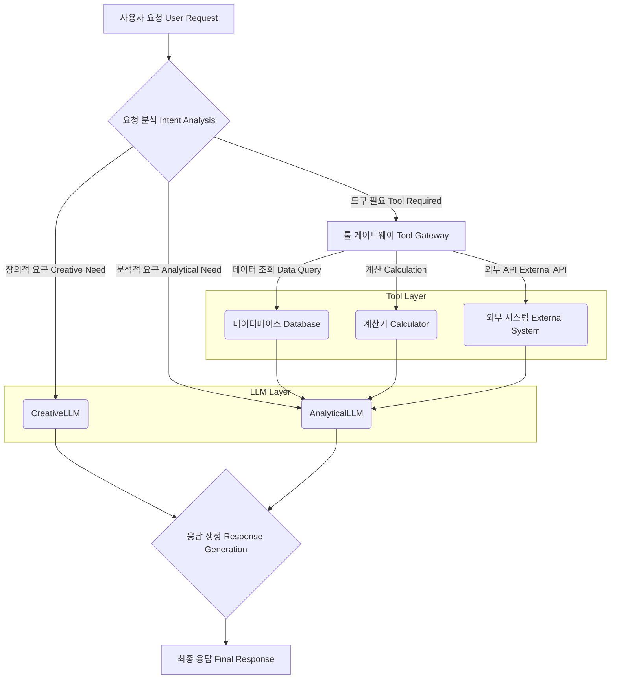

현대 AI 시스템은 단일 LLM(Large Language Model)이나 독립적인 도구만으로 복잡한 사용자 요구사항을 충족하기 어렵습니다. 다양한 LLM의 특화된 강점과 외부 도구의 데이터 접근 및 실행 능력을 결합하는 것이 필수적이며, 이를 위한 효과적인 오케스트레이션(Orchestration) 패턴이 핵심 설계 요소로 부상하고 있습니다. 이 문서는 복잡한 AI 애플리케이션의 견고성과 확장성을 보장하는 다양한 오케스트레이션 패턴을 다룹니다.

### 핵심 개념: 다중 LLM 및 외부 도구 연동

다중 LLM 연동은 각 LLM이 가진 고유한 강점(예: 창의성, 논리 추론, 특정 도메인 지식)을 활용하여 전체 시스템의 성능을 최적화하는 전략입니다. 예를 들어, 비용 효율적인 경량 LLM으로 초기 분류를 수행하고, 복잡한 추론에는 고성능 LLM을 사용하는 방식입니다. 외부 도구 연동은 LLM의 한계를 넘어서 실시간 데이터 검색, 외부 API 호출, 복잡한 계산 수행 등 실제 환경과의 상호작용을 가능하게 합니다. 이러한 요소들을 효율적으로 조율하는 오케스트레이션은 시스템의 신뢰성, 확장성, 비용 효율성을 결정합니다.

### 오케스트레이션 패턴

다중 LLM과 외부 도구를 효과적으로 통합하기 위한 주요 오케스트레이션 패턴은 다음과 같습니다.

**1. 순차적 체인 (Sequential Chain)**
가장 기본적인 패턴으로, 일련의 LLM 또는 도구 호출이 정해진 순서대로 실행됩니다. 이전 단계의 출력이 다음 단계의 입력으로 전달되어 복잡한 작업을 여러 단계로 분해하여 처리합니다.

**2. 병렬 처리 (Parallel Processing)**
동일하거나 다른 여러 LLM 또는 도구 호출을 동시에 실행하고, 그 결과를 취합하여 다음 단계로 넘기는 패턴입니다. 여러 정보 원천에서 동시에 데이터를 검색하거나, 다양한 LLM에 동일한 프롬프트를 보내 비교 분석하는 데 유용합니다.

**3. 계층적/에이전트 기반 오케스트레이션 (Hierarchical/Agentic Orchestration)**
하나의 상위 LLM (Supervisor LLM)이 전체 목표를 이해하고 하위 LLM(Worker LLM)이나 특정 도구에 작업을 위임하는 구조입니다. Supervisor는 작업 분해, 결과 통합, 오류 처리 등 고수준의 제어를 담당하며, Worker들은 특정 전문 분야를 처리합니다. 2026년 트렌드에서는 자율 에이전트(Autonomous Agent) 간의 협업 모델로 발전하고 있습니다.

**4. 동적 라우팅 (Dynamic Routing)**
사용자 요청의 특성, 현재 컨텍스트, 비용, 성능 메트릭 등에 따라 실시간으로 가장 적합한 LLM 또는 도구를 선택하여 호출하는 패턴입니다. 이는 `Prompt Router`나 `LLM Router` 개념으로 구현될 수 있으며, 시스템의 적응성과 효율성을 극대화합니다.

**5. 툴 게이트웨이 및 어댑터 (Tool Gateway & Adapters)**
다양한 외부 도구에 대한 접근을 표준화된 인터페이스(Tool Gateway)를 통해 제공하고, 각 도구의 특정 API 요구사항을 처리하는 어댑터(Adapter)를 구현하는 패턴입니다. 이는 도구 통합의 복잡성을 줄이고 시스템의 모듈성을 높입니다.

### 코드 예제: 간단한 오케스트레이션 구현 (Python)

아래 Python 예제는 사용자 요청에 따라 동적으로 LLM을 선택하고 외부 도구 사용을 결정하는 간단한 오케스트레이터의 개념을 보여줍니다. 이 예제는 실제 LLM API 호출이나 도구 실행 대신 시뮬레이션된 응답을 사용합니다.

```python
class LLM:
    def __init__(self, name):
        self.name = name
    def process(self, prompt, context):
        # Simulate LLM processing
        return f"Response from {self.name} for: {prompt} with context: {context[:20]}..."

class Tool:
    def __init__(self, name):
        self.name = name
    def execute(self, query):
        # Simulate tool execution
        return f"Result from {self.name} for: {query}"

class Orchestrator:
    def __init__(self):
        self.llms = {
            "creative": LLM("CreativeLLM"),
            "analytical": LLM("AnalyticalLLM")
        }
        self.tools = {
            "search_db": Tool("DatabaseSearch"),
            "calculate": Tool("Calculator")
        }

    def orchestrate(self, user_request, shared_context):
        # Dynamic Routing Example
        if "creative writing" in user_request.lower():
            llm_to_use = self.llms["creative"]
            response = llm_to_use.process(user_request, shared_context)
            return f"Creative task handled. {response}"
        elif "data analysis" in user_request.lower() or "calculate" in user_request.lower():
            llm_to_use = self.llms["analytical"]
            # Sequential Chain: LLM decides to use a tool
            if "calculate" in user_request.lower():
                calculation_query = user_request.split("calculate ")[-1]
                tool_result = self.tools["calculate"].execute(calculation_query)
                shared_context += f" Calculation result: {tool_result}"
                response = llm_to_use.process(f"Analyze: {user_request}", shared_context)
                return f"Analytical task with calculation. {response}"
            else:
                response = llm_to_use.process(user_request, shared_context)
                return f"Analytical task handled. {response}"
        else:
            # Fallback to creative LLM
            llm_to_use = self.llms["creative"]
            response = llm_to_use.process(user_request, shared_context)
            return f"General task handled. {response}"

# Usage Example
orchestrator = Orchestrator()
print(orchestrator.orchestrate("Write a creative story about a robot.", "User preference: Sci-Fi."))
print(orchestrator.orchestrate("Analyze sales data for Q1 2026.", "Company data: 2026 Q1 reports."))
print(orchestrator.orchestrate("I need to calculate 123 + 456. Then summarize the answer.", "Current task: Financial Report."))
```

### Mermaid 다이어그램: 오케스트레이션 워크플로우

아래 다이어그램은 다중 LLM 및 외부 도구 연동을 위한 일반적인 오케스트레이션 워크플로우를 시각화합니다.



## 트레이드오프

다중 LLM 및 외부 도구 오케스트레이션 패턴을 적용할 때는 다음과 같은 트레이드오프를 고려해야 합니다.

*   **복잡성 vs. 유연성 (Complexity vs. Flexibility)**: 오케스트레이션 계층은 시스템에 높은 유연성을 제공하여 다양한 LLM과 도구를 조합할 수 있게 하지만, 그만큼 설계 및 구현의 복잡성이 증가합니다. 단순한 작업에는 과도한 오케스트레이션이 불필요하며, 복잡한 비즈니스 로직과 동적 처리가 필요한 경우에 유리합니다.
*   **지연 시간 vs. 정확도 (Latency vs. Accuracy)**: 여러 LLM 호출과 도구 실행이 포함된 오케스트레이션은 단일 LLM 호출보다 총 지연 시간(Latency)이 길어질 수 있습니다. 그러나 각 단계에서 최적의 모델과 도구를 사용하여 최종 결과의 정확도(Accuracy)는 크게 향상될 수 있습니다. 실시간 응답이 중요한 애플리케이션에서는 지연 시간 최적화가 필수적이며, 깊은 분석이 필요한 경우 정확도에 더 비중을 두어야 합니다.
*   **비용 효율성 vs. 성능 (Cost Efficiency vs. Performance)**: 저비용 LLM과 고성능 LLM을 적절히 조합하고 동적 라우팅을 활용하면 전반적인 비용 효율성을 높일 수 있습니다. 하지만 이는 라우팅 로직의 복잡성을 증가시키고, 잘못된 라우팅은 성능 저하를 야기할 수 있습니다. 비용보다 절대적인 성능이 중요한 경우, 고성능 모델의 우선 사용을 고려해야 합니다.
*   **유지보수성 vs. 맞춤형 로직 (Maintainability vs. Customization)**: 표준화된 오케스트레이션 프레임워크나 패턴을 사용하면 시스템의 유지보수성이 향상됩니다. 그러나 특정 비즈니스 요구사항을 위한 고도로 맞춤화된 오케스트레이션 로직은 초기 개발 및 유지보수 비용을 증가시킬 수 있습니다. 변화가 잦은 환경에서는 모듈화된 표준 패턴이 유리하며, 안정적인 도메인에서는 맞춤형 로직으로 성능을 극대화할 수 있습니다.

## 실전 체크리스트

다중 LLM 및 외부 도구 연동 오케스트레이션 패턴을 프로젝트에 적용할 때 다음 항목들을 검증하십시오.

*   - [ ] **도구 API 계약 명확화 (Clear Tool API Contracts)**: 연동할 각 외부 도구의 API(Application Programming Interface) 스펙, 입력/출력 형식, 오류 응답을 명확히 정의하고 문서화했는가?
*   - [ ] **강력한 오류 처리 및 재시도 메커니즘 구현 (Robust Error Handling & Retry Mechanisms Implemented)**: LLM 호출 실패, 도구 실행 오류, 네트워크 지연 등 예상 가능한 실패 시나리오에 대비한 재시도(Retry), 대체 로직(Fallback), 타임아웃(Timeout) 전략이 구현되었는가?
*   - [ ] **LLM 및 도구 호출 비용/지연 시간 모니터링 (LLM & Tool Call Cost/Latency Monitoring)**: 각 LLM 호출 및 도구 실행 단계별 비용과 지연 시간을 실시간으로 모니터링하고 분석하여 병목 현상 및 비용 최적화 포인트를 식별할 수 있는가?
*   - [ ] **동적 라우팅 전략의 정확성 검증 (Dynamic Routing Strategy Validation)**: 사용자 요청의 의도(Intent)와 컨텍스트(Context)를 기반으로 LLM 또는 도구를 동적으로 선택하는 라우팅 로직의 정확성과 효율성을 주기적으로 평가하고 개선하고 있는가?
*   - [ ] **오케스트레이션 로직 및 프롬프트 버저닝 (Orchestration Logic & Prompt Versioning)**: 오케스트레이션 스크립트, 프롬프트, 도구 어댑터 코드 등 모든 구성 요소에 대한 버저닝 시스템을 구축하여 변경 이력 관리 및 롤백(Rollback)이 가능한가?
*   - [ ] **보안 및 접근 제어 설계 (Security & Access Control Design)**: 외부 도구 접근 시 필요한 인증(Authentication) 및 인가(Authorization) 메커니즘을 견고하게 설계하고, LLM과 도구 간의 데이터 전송 경로에 대한 보안(예: 암호화) 조치가 적용되었는가?
*   - [ ] **확장성 및 부하 분산 고려 (Scalability & Load Balancing Consideration)**: 트래픽 증가에 대비하여 LLM 인스턴스 및 외부 도구 호출에 대한 부하 분산(Load Balancing) 전략이 적용되었으며, 시스템 전체의 확장성(Scalability)이 확보되었는가?
