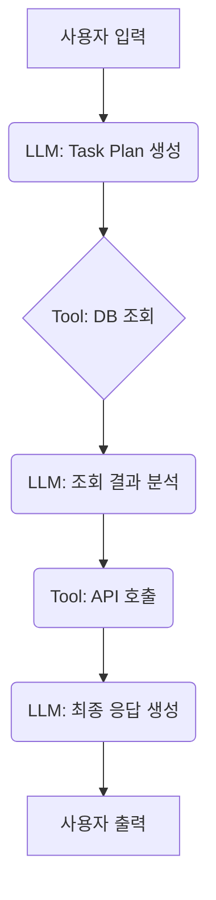
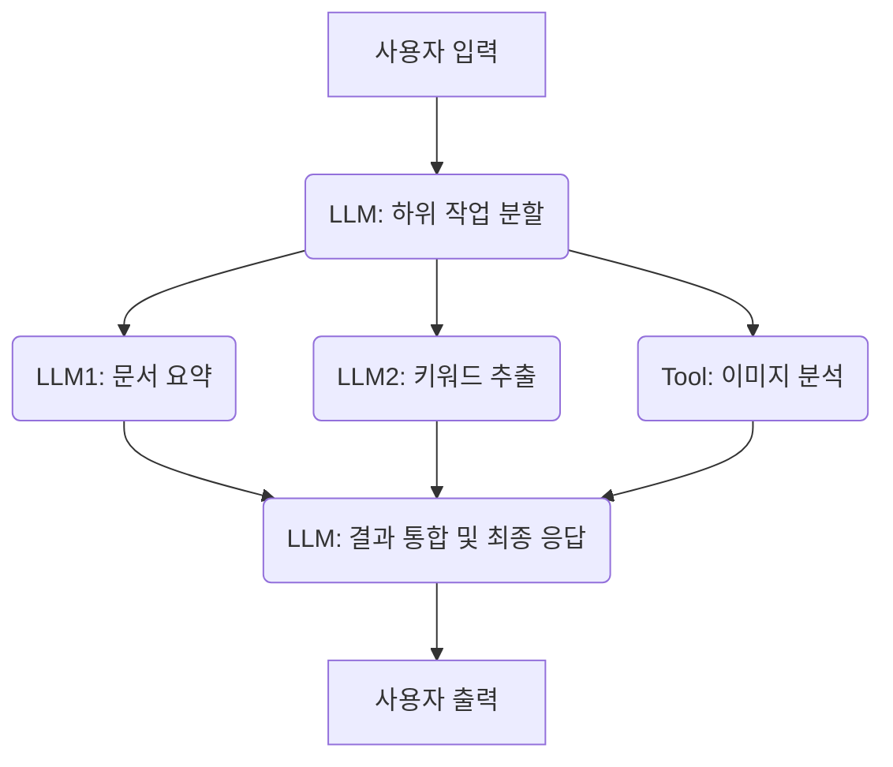
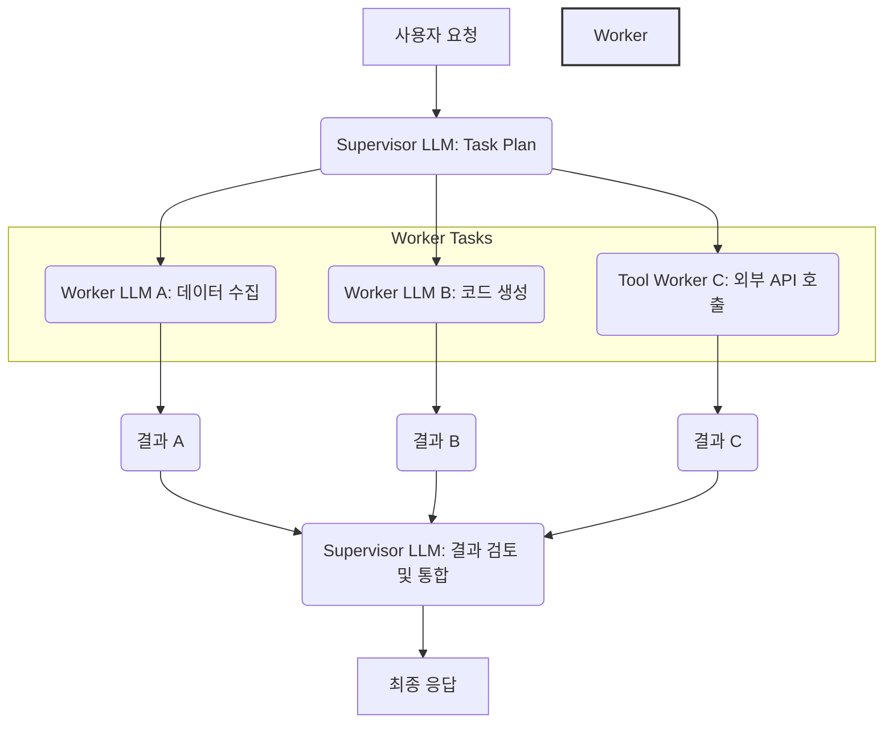

복잡한 인공지능 시스템을 구축할 때, 단일 대규모 언어 모델(LLM)이나 단일 도구만으로는 해결하기 어려운 과제가 많습니다. 이 지식 그래프 엔트리는 여러 LLM과 외부 도구를 유기적으로 결합하여 복잡한 워크플로우를 효과적으로 오케스트레이션하는 설계 패턴을 다룹니다. 이는 단순한 체인 구성(chaining)을 넘어선 동적이고 지능적인 제어 흐름을 구현하는 데 초점을 맞춥니다. 특히 2026년에는 AI 시스템의 규모와 복잡성이 증대함에 따라, 이러한 복합 워크플로우 오케스트레이션의 중요성이 더욱 강조되고 있습니다.

## 복합 워크플로우 오케스트레이션의 필요성

다중 LLM과 외부 도구의 조합은 다음과 같은 이점을 제공합니다:

*   **모듈성(Modularity)**: 각 LLM이나 도구는 특정 작업에 특화될 수 있어 시스템의 모듈성을 높이고 유지보수를 용이하게 합니다.
*   **정확성 및 신뢰성(Accuracy & Reliability)**: 특정 작업에 최적화된 LLM(예: 코드 생성 LLM, 요약 LLM)을 사용하거나 외부 도구(예: 데이터베이스, API, 계산 엔진)를 활용하여 LLM의 환각(hallucination)을 줄이고 사실적 정확성을 높일 수 있습니다.
*   **확장성(Scalability)**: 워크플로우 단계를 분리하여 독립적으로 확장하거나 병렬 처리할 수 있습니다.
*   **비용 효율성(Cost Efficiency)**: 특정 작업에 저비용의 소형 LLM을 사용하거나, 고비용의 대형 LLM은 꼭 필요한 핵심 추론 단계에만 활용하여 전체 시스템의 운영 비용을 최적화할 수 있습니다.

## 주요 오케스트레이션 설계 패턴

### 1. 순차적 체인(Sequential Chaining)

가장 기본적인 패턴으로, 한 LLM 또는 도구의 출력이 다음 LLM 또는 도구의 입력으로 전달되는 방식입니다. 각 단계는 이전 단계의 결과에 의존하며, 명확한 순서가 필요한 작업에 적합합니다.



**예시**: 사용자 질문 -> 검색 쿼리 생성(LLM) -> DB 검색(Tool) -> 검색 결과 요약(LLM) -> 요약 기반 답변 생성(LLM)

### 2. 병렬 처리(Parallel Processing)

독립적으로 수행될 수 있는 여러 작업을 동시에 처리하여 전체 워크플로우 시간을 단축하는 패턴입니다. 모든 병렬 작업이 완료되면 결과가 통합됩니다.



**예시**: 멀티모달 입력 처리 -> 텍스트 분석(LLM), 이미지 분석(Tool), 오디오 분석(LLM)을 병렬 수행 -> 최종 결과 통합(LLM)

### 3. 계층적 오케스트레이션(Hierarchical Orchestration) - Supervisor/Worker 패턴

중앙 Supervisor LLM이 전체 목표를 관리하고, 이 목표를 달성하기 위한 구체적인 하위 작업을 Worker LLM 또는 특정 도구에 위임하는 방식입니다. Supervisor는 Worker의 진행 상황을 모니터링하고 필요에 따라 개입하거나 다음 단계를 지시합니다.



**예시**: 복잡한 문제 해결 -> Supervisor가 계획 수립 -> 데이터 수집 Worker, 분석 Worker, 보고서 작성 Worker에게 위임

### 4. 동적 도구 선택(Dynamic Tool Selection)

LLM이 현재 컨텍스트와 목표에 따라 가장 적합한 외부 도구를 스스로 판단하고 호출하는 패턴입니다. 이는 ReAct(Reasoning and Acting)와 같은 Agentic 시스템의 핵심 요소입니다. 도구 목록과 각 도구의 기능 설명을 LLM에 제공하여 LLM이 도구 사용 여부와 방법을 결정하게 합니다.

```python
from typing import List, Dict

class Tool:
    def __init__(self, name: str, description: str, function):
        self.name = name
        self.description = description
        self.function = function

    def execute(self, **kwargs):
        return self.function(**kwargs)

def search_web(query: str) -> str:
    # Simulate web search API call
    print(f"Searching web for: {query}")
    return f"Search results for '{query}': ..."

def calculate_expression(expression: str) -> float:
    # Simulate a calculator tool
    print(f"Calculating: {expression}")
    return eval(expression)

class LLMOrchestrator:
    def __init__(self, llm_api_client, tools: List[Tool]):
        self.llm = llm_api_client
        self.tools = {tool.name: tool for tool in tools}
        self.tool_descriptions = "\n".join(
            [f"Tool {t.name}: {t.description}" for t in tools]
        )

    def orchestrate_workflow(self, prompt: str) -> str:
        full_prompt = (
            f"You are an AI assistant. You have access to the following tools:\n"
            f"{self.tool_descriptions}\n"
            f"Based on the user's request, decide whether to use a tool.\n"
            f"If using a tool, respond with TOOL_CALL: {{'tool_name': '...', 'args': {{...}}}}\n"
            f"If not, respond with FINAL_ANSWER: {{'answer': '...'}}\n"
            f"User request: {prompt}"
        )

        response = self.llm.generate(full_prompt) # Assume LLM returns a structured response

        if response.startswith("TOOL_CALL:"):
            tool_call_str = response.replace("TOOL_CALL:", "").strip()
            tool_call = eval(tool_call_str) # Careful with eval in production!
            tool_name = tool_call['tool_name']
            args = tool_call['args']
            
            if tool_name in self.tools:
                tool_output = self.tools[tool_name].execute(**args)
                # Feed tool_output back to LLM for next step or final answer
                return self.orchestrate_workflow(f"Tool output: {tool_output}. Continue based on original request: {prompt}")
            else:
                return "Error: Unknown tool."
        elif response.startswith("FINAL_ANSWER:"):
            return response.replace("FINAL_ANSWER:", "").strip()
        else:
            return "Error: Invalid LLM response format."

# Example Usage (assuming a mock LLM client)
class MockLLMClient:
    def generate(self, prompt: str) -> str:
        if "search web" in prompt.lower():
            return "TOOL_CALL: {'tool_name': 'web_search', 'args': {'query': 'latest AI trends'}}"
        elif "calculate 2+2" in prompt.lower():
            return "TOOL_CALL: {'tool_name': 'calculator', 'args': {'expression': '2+2'}}"
        elif "tool output" in prompt.lower() and "latest AI trends" in prompt.lower():
            return "FINAL_ANSWER: {'answer': 'Based on web search, latest AI trends include multimodal AI and advanced agents.'}"
        elif "tool output" in prompt.lower() and "4" in prompt.lower():
            return "FINAL_ANSWER: {'answer': 'The result of 2+2 is 4.'}"
        else:
            return "FINAL_ANSWER: {'answer': 'I am ready to help.'}"

llm_client = MockLLMClient()
tools_list = [
    Tool("web_search", "Searches the internet for information.", search_web),
    Tool("calculator", "Evaluates mathematical expressions.", calculate_expression)
]
orchestrator = LLMOrchestrator(llm_client, tools_list)

# print(orchestrator.orchestrate_workflow("What are the latest AI trends?"))
# print(orchestrator.orchestrate_workflow("Calculate 2+2."))
```

이 예제는 LLM이 사용자의 요청을 분석하여 `web_search` 또는 `calculator` 도구를 동적으로 선택하고 사용하는 과정을 보여줍니다. 실제 시스템에서는 `eval()` 대신 안전한 파싱 및 호출 메커니즘을 사용해야 합니다.

## 트레이드오프

복합 워크플로우 오케스트레이션 설계 시 고려해야 할 주요 트레이드오프는 다음과 같습니다.

*   **복잡성 vs. 유연성 (Complexity vs. Flexibility)**
    *   **언제 좋은가**: 변화하는 요구사항에 빠르게 대응해야 하거나, 다양한 유형의 작업을 처리할 수 있는 범용적인 시스템이 필요할 때 좋습니다. 새로운 LLM이나 도구 통합이 용이합니다.
    *   **언제 나쁜가**: 단순하고 반복적인 작업을 처리하는 데는 과도한 오버헤드를 발생시켜 불필요한 복잡도를 초래합니다. 디버깅 및 테스트가 어려워질 수 있습니다.

*   **성능 vs. 비용 (Performance vs. Cost)**
    *   **언제 좋은가**: 작업 특성에 맞는 최적의 LLM과 도구를 선택하여 각 단계의 성능을 극대화하고, 불필요한 고비용 LLM 사용을 줄여 전체 비용을 효율적으로 관리할 때 좋습니다.
    *   **언제 나쁜가**: 오케스트레이션 로직 자체의 실행 시간, 다수의 LLM API 호출에 따른 대기 시간(latency), 그리고 여러 모델을 관리하는 운영 비용이 증가하여 단일 LLM 시스템보다 전체 성능이 저하되거나 비용이 높아질 수 있습니다.

*   **제어 vs. 자율성 (Control vs. Autonomy)**
    *   **언제 좋은가**: LLM Agent에 높은 자율성을 부여하여 예측 불가능한 상황에 유연하게 대응하고, 인간 개입 없이 복잡한 문제를 해결해야 할 때 효과적입니다. 새로운 문제 유형에 대한 일반화 능력을 향상시킵니다.
    *   **언제 나쁜가**: 시스템의 동작을 예측하고 디버깅하기 어려워질 수 있으며, LLM의 의도하지 않은 행동(hallucination, toxic output)에 대한 제어가 어려워질 수 있습니다. 규제 준수나 안정성이 매우 중요한 시스템에는 부적합할 수 있습니다.

*   **초기 개발 속도 vs. 장기 유지보수(Initial Dev Speed vs. Long-term Maintenance)**
    *   **언제 좋은가**: 모듈화된 구성 요소 덕분에 개별 LLM이나 도구의 개선이 전체 시스템에 미치는 영향을 최소화하면서 장기적으로 안정적인 유지보수와 업데이트가 가능합니다.
    *   **언제 나쁜가**: 초기 시스템 설계 및 통합 과정에서 더 많은 시간과 노력이 필요합니다. 각 구성 요소 간의 인터페이스 정의, 데이터 형식 변환, 오류 처리 로직 구현 등 초기 개발 비용이 높습니다.

## 실전 체크리스트

다중 LLM 및 외부 도구 워크플로우를 프로젝트에 적용할 때 다음 항목들을 검증해야 합니다.

*   [ ] **단계별 목표 명확화**: 각 LLM 또는 도구가 수행할 작업의 입력, 출력, 그리고 성공 기준을 명확하게 정의했는가?
*   [ ] **강력한 오류 처리 및 재시도**: LLM API 호출 실패, 도구 실행 오류, 응답 형식 불일치 등 다양한 실패 시나리오에 대비한 견고한 오류 처리 및 재시도(retry) 메커니즘이 구현되어 있는가?
*   [ ] **관측 가능성(Observability) 설계**: 각 워크플로우 단계의 시작, 종료, 성공/실패, 지연 시간(latency), 토큰 사용량 등을 추적할 수 있는 로깅 및 트레이싱 시스템이 구축되어 있는가?
*   [ ] **비용 모니터링 및 최적화**: 각 LLM 호출 및 외부 도구 사용에 대한 비용을 실시간으로 추적하고 있으며, 비용 최적화를 위한 LLM 라우팅(routing) 전략이나 캐싱(caching) 전략을 적용했는가?
*   [ ] **데이터 일관성 및 보안**: 워크플로우를 거치는 데이터의 일관성(consistency)이 유지되고, 민감한 정보가 안전하게 처리되며 각 도구 간에 적절한 권한 관리가 이루어지는가?
*   [ ] **Human-in-the-Loop(HITL) 설계**: 중요하거나 불확실한 결정 지점에 인간의 검토 또는 승인을 위한 인터벤션(intervention) 지점을 마련했는가?
*   [ ] **성능 벤치마킹 및 SLA 정의**: 워크플로우의 엔드투엔드(end-to-end) 성능(예: 응답 시간, 처리량)에 대한 벤치마킹을 수행하고, 기대 서비스 수준 협약(SLA)을 정의했는가?