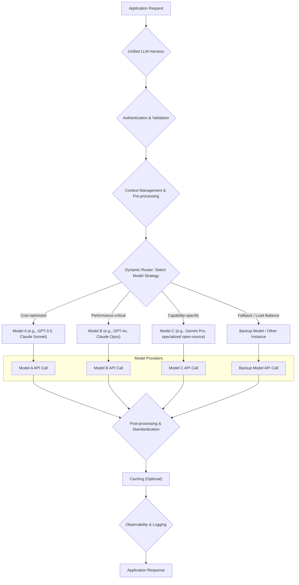

다양한 Large Language Models (LLMs)와 파운데이션 모델 (Foundation Models, FMs)의 확산은 애플리케이션 개발에 강력한 기능을 제공하지만, 동시에 상당한 운영 복잡성을 야기합니다. 여러 제공업체(예: OpenAI, Anthropic, Google, 오픈소스 모델)의 API, 요금 체계, 성능 특성, 고유한 통합 요구사항을 관리하는 것은 쉽지 않습니다. 이러한 복잡성을 해결하기 위해, 통합 LLM/FM 하네스(harness) 구축 패턴은 애플리케이션에 표준화된 인터페이스를 제공하면서, 하위 모델의 복잡성을 추상화하는 필수적인 솔루션입니다.

통합 하네스는 지능형 프록시 역할을 하며, 비용, 지연 시간(latency), 기능, 사용자별 선호도 등 미리 정의된 기준에 따라 요청을 가장 적절한 모델로 라우팅합니다. 주요 구성 요소는 다음과 같습니다:
*   **API 추상화 계층 (API Abstraction Layer)**: 이질적인 모델 전반에 걸쳐 입력/출력 형식을 표준화합니다.
*   **동적 라우터 (Dynamic Router)**: 각 요청에 대해 최적의 모델을 선택합니다.
*   **로드 밸런서 (Load Balancer) 및 폴백 (Failover)**: 트래픽을 분산하고 시스템 탄력성을 보장합니다.
*   **캐싱 메커니즘 (Caching Mechanism)**: 중복 호출을 줄이고 지연 시간을 개선합니다.
*   **옵저버빌리티 (Observability) 및 모니터링 (Monitoring)**: 성능, 비용 및 오류를 추적합니다.
*   **보안 및 접근 제어 (Security & Access Control)**: API 키와 사용자 권한을 관리합니다.

### 동적 라우팅 (Dynamic Routing) 및 모델 선택 (Model Selection)

동적 라우팅은 통합 하네스의 핵심 기능입니다. 요청의 특성(예: 비용 민감도, 응답 속도 요구사항, 특정 기능 필요 여부)에 따라 가장 적합한 LLM 또는 FM을 실시간으로 선택합니다. 이는 단순히 비용 효율적인 모델을 사용하는 것을 넘어, 특정 작업에 특화된 모델 (예: 코드 생성용, 요약용, 다국어 처리용)을 활용하여 전반적인 성능과 품질을 최적화할 수 있게 합니다.

라우팅 전략:
*   **비용 기반 (Cost-based)**: 가장 저렴한 모델 우선.
*   **성능 기반 (Performance-based)**: 최저 지연 시간(latency) 모델 우선.
*   **정확도/품질 기반 (Accuracy/Quality-based)**: 특정 벤치마크에서 우수한 모델 우선.
*   **기능 기반 (Capability-based)**: 이미지 처리, 특정 도구 사용 등 특정 기능이 필요한 경우 해당 모델 선택.
*   **트래픽 분산 (Traffic Distribution)**: A/B 테스트 또는 Canary 배포를 위한 가중치 기반 라우팅.

### API 추상화 (API Abstraction) 및 표준화 (Standardization)

다양한 LLM 제공업체는 고유한 API 서명, 인증 메커니즘, 입력/출력 형식을 가지고 있습니다. 통합 하네스는 이러한 차이를 추상화하여 개발자가 단일의 표준화된 인터페이스를 통해 모든 모델과 상호작용할 수 있도록 합니다. 이는 개발 복잡성을 줄이고, 모델 교체나 추가를 용이하게 하여 미래 변화에 대한 유연성을 확보합니다.

```python
# Conceptual Python code for an API Abstraction Layer
import requests
import json

class LLMAdapter:
    def __init__(self, api_key):
        self.api_key = api_key

    def generate_text(self, prompt, model_params):
        raise NotImplementedError

class OpenAIAdapter(LLMAdapter):
    def __init__(self, api_key):
        super().__init__(api_key)
        self.endpoint = "https://api.openai.com/v1/chat/completions"

    def generate_text(self, prompt, model_params):
        headers = {
            "Content-Type": "application/json",
            "Authorization": f"Bearer {self.api_key}"
        }
        data = {
            "model": model_params.get("model", "gpt-4o"),
            "messages": [{"role": "user", "content": prompt}],
            "max_tokens": model_params.get("max_tokens", 500)
        }
        response = requests.post(self.endpoint, headers=headers, data=json.dumps(data))
        response.raise_for_status()
        return response.json()["choices"][0]["message"]["content"]

class AnthropicAdapter(LLMAdapter):
    def __init__(self, api_key):
        super().__init__(api_key)
        self.endpoint = "https://api.anthropic.com/v1/messages"

    def generate_text(self, prompt, model_params):
        headers = {
            "Content-Type": "application/json",
            "x-api-key": self.api_key,
            "anthropic-version": "2023-06-01"
        }
        data = {
            "model": model_params.get("model", "claude-3-5-sonnet-20240620"),
            "messages": [{"role": "user", "content": prompt}],
            "max_tokens": model_params.get("max_tokens", 500)
        }
        response = requests.post(self.endpoint, headers=headers, data=json.dumps(data))
        response.raise_for_status()
        return response.json()["content"][0]["text"]

class UnifiedLLMHarness:
    def __init__(self, adapters_config):
        self.adapters = {}
        for provider, config in adapters_config.items():
            if provider == "openai":
                self.adapters["openai"] = OpenAIAdapter(config["api_key"])
            elif provider == "anthropic":
                self.adapters["anthropic"] = AnthropicAdapter(config["api_key"])
            # Add other adapters here

    def route_and_generate(self, prompt, routing_strategy, model_params=None):
        model_params = model_params or {}
        # Simple routing logic for demonstration
        if routing_strategy == "cost_optimized":
            # In a real scenario, this would involve more complex logic
            # e.g., checking current prices, token usage, or fallbacks
            if "openai" in self.adapters:
                print("Routing to OpenAI (cost_optimized placeholder)...")
                return self.adapters["openai"].generate_text(prompt, model_params)
            elif "anthropic" in self.adapters:
                print("Routing to Anthropic (cost_optimized placeholder)...")
                return self.adapters["anthropic"].generate_text(prompt, model_params)
        elif routing_strategy == "performance_critical":
            if "anthropic" in self.adapters: # Hypothetically faster for a given task
                print("Routing to Anthropic (performance_critical placeholder)...")
                return self.adapters["anthropic"].generate_text(prompt, model_params)
            elif "openai" in self.adapters:
                print("Routing to OpenAI (performance_critical placeholder)...")
                return self.adapters["openai"].generate_text(prompt, model_params)
        else:
            raise ValueError(f"Unknown routing strategy: {routing_strategy}")

# Example Usage (replace with actual API keys)
# openai_key = "YOUR_OPENAI_API_KEY"
# anthropic_key = "YOUR_ANTHROPIC_API_KEY"

# harness = UnifiedLLMHarness({
#     "openai": {"api_key": openai_key},
#     "anthropic": {"api_key": anthropic_key}
# })

# text_prompt = "Explain the concept of quantum entanglement in simple terms."
# try:
#     response_cost = harness.route_and_generate(text_prompt, "cost_optimized", {"max_tokens": 150})
#     print(f"Cost optimized response: {response_cost}")

#     response_perf = harness.route_and_generate(text_prompt, "performance_critical", {"max_tokens": 150})
#     print(f"Performance critical response: {response_perf}")
# except Exception as e:
#     print(f"An error occurred: {e}")
```

### 로드 밸런싱 (Load Balancing) 및 폴백 (Fallback) 메커니즘

단일 모델 공급자에 대한 의존성을 줄이고 시스템의 안정성을 높이기 위해 로드 밸런싱과 폴백 전략이 필수적입니다. 하네스는 여러 모델 인스턴스 또는 다른 공급자의 모델로 트래픽을 분산하여 과부하를 방지하고, 특정 모델이 실패하거나 응답이 느릴 경우 자동으로 다른 모델로 전환하는 폴백 기능을 제공할 수 있습니다. 이는 2026년 대규모 AI 서비스 운영의 핵심 요구사항입니다.

Mermaid Diagram for Request Flow:



### 옵저버빌리티 (Observability) 및 모니터링 (Monitoring)

통합 하네스는 모든 LLM 호출에 대한 중앙 집중식 모니터링 및 로깅 기능을 제공해야 합니다. API 호출의 성공/실패율, 지연 시간, 사용된 토큰 수, 실제 비용, 모델별 성능 메트릭 등을 추적하여 시스템의 건강 상태를 파악하고, 최적의 라우팅 전략을 지속적으로 개선할 수 있습니다. 2026년에는 이 데이터가 모델 선택 및 리소스 할당의 핵심 근거가 됩니다.

## 트레이드오프

*   **구현 복잡성 증가 (Increased Implementation Complexity)**:
    *   **좋은 경우**: 다양한 LLM/FM을 대규모로 운영하거나, 비용/성능 최적화가 중요하며, 미래 모델 변경에 대한 유연성이 필요한 경우.
    *   **나쁜 경우**: 단일 LLM/FM만 사용하고, 요구사항이 단순하며, 빠른 MVP(Minimum Viable Product) 개발이 최우선인 경우.
*   **추가적인 지연 시간 (Additional Latency)**:
    *   **좋은 경우**: 라우팅 로직이 모델 선택에 필요한 정보를 빠르게 처리하고, 그로 인한 이득(비용 절감, 품질 향상)이 지연 시간 증가분보다 큰 경우.
    *   **나쁜 경우**: 극도로 낮은 지연 시간이 요구되는 실시간 애플리케이션에서 라우팅 로직의 오버헤드가 허용 범위를 초과하는 경우.
*   **유지보수 오버헤드 (Maintenance Overhead)**:
    *   **좋은 경우**: 여러 LLM API가 빈번하게 변경되거나 새로운 모델이 지속적으로 추가될 때, 중앙 집중식 관리로 인해 전체적인 유지보수 부담이 줄어드는 경우.
    *   **나쁜 경우**: 모델 API가 안정적이고 변경이 거의 없으며, 운영하는 모델의 수가 적어 개별 관리의 부담이 적은 경우.
*   **비용 발생 (Cost Implications)**:
    *   **좋은 경우**: 동적 라우팅을 통해 가장 비용 효율적인 모델을 선택하고, 캐싱 등으로 불필요한 API 호출을 줄여 장기적으로 총 소유 비용(TCO)을 절감할 수 있는 경우.
    *   **나쁜 경우**: 하네스 자체의 인프라 및 개발 비용이 모델 API 직접 호출로 얻는 절감 효과를 상회하여 초기 투자 회수(ROI)가 낮은 경우.
*   **잠재적 단일 장애점 (Potential Single Point of Failure)**:
    *   **좋은 경우**: 하네스 아키텍처 자체를 고가용성(High Availability) 및 분산 시스템 패턴으로 설계하여 견고성을 확보한 경우.
    *   **나쁜 경우**: 하네스 인프라에 대한 고려 없이 단일 인스턴스로만 구성하여, 하네스 자체의 실패가 전체 시스템 중단으로 이어질 위험이 있는 경우.

## 실전 체크리스트

*   [ ] 현재 사용 중인 LLM/FM 목록과 각 모델의 API 사양 (인증, 입력/출력 형식)을 명확히 문서화했는가?
*   [ ] 각 사용 사례 (use case)별로 선호하는 LLM/FM (비용, 성능, 기능)과 해당 라우팅 로직을 정의하고 구현 계획을 수립했는가?
*   [ ] 통합 하네스를 통해 모든 LLM 호출의 지연 시간 (latency), 비용 (cost), 성공률 (success rate)을 추적하는 모니터링 대시보드를 구축했는가?
*   [ ] 특정 LLM/FM 제공자의 장애 발생 시, 다른 모델로 자동 전환되는 폴백 (fallback) 메커니즘이 설계되고 테스트되었는가?
*   [ ] 새로운 LLM/FM을 하네스에 통합할 때 필요한 변경 사항을 최소화할 수 있는 API 추상화 계층을 구현했는가?
*   [ ] LLM 사용량에 따른 비용 예측 및 최적화 로직 (예: 저렴한 모델 우선, 캐싱)이 하네스에 포함되어 있으며 효과를 검증했는가?
*   [ ] 하네스 자체가 단일 장애점(SPOF)이 되지 않도록 고가용성(High Availability) 및 확장성(Scalability)을 고려한 아키텍처를 적용했는가?