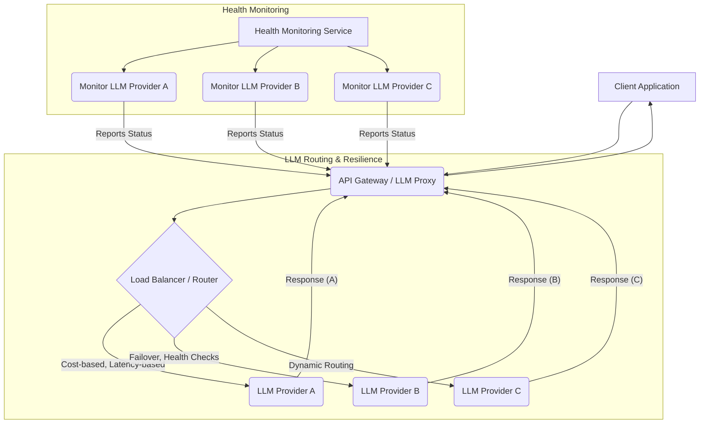

대규모 언어 모델 (LLM) 기반 서비스는 단일 모델이나 제공자에 의존할 때 여러 취약점을 가집니다. 높은 트래픽 부하 (High Traffic Load), 특정 모델의 지연 (Latency) 또는 장애 (Failure), 벤더 종속성 (Vendor Lock-in) 및 비용 문제는 프로덕션 환경 (Production Environment)에서 서비스의 안정성과 효율성을 저해할 수 있습니다. 다중 LLM 추론 (Multi-LLM Inference)을 위한 로드밸런싱 (Load Balancing) 및 페일오버 (Failover) 설계는 이러한 도전과제를 해결하고, 고가용성 (High Availability), 성능 최적화 (Performance Optimization), 그리고 비용 효율성 (Cost-effectiveness)을 달성하기 위한 핵심 전략입니다. 이 문서는 다중 LLM 환경에서 견고한 서비스 아키텍처 (Service Architecture)를 구축하기 위한 실질적인 설계 패턴 (Design Patterns)과 구현 전략 (Implementation Strategies)을 제시합니다.

## 핵심 개념

### 로드밸런싱 (Load Balancing)
로드밸런싱은 여러 LLM 인스턴스 또는 제공자 간에 요청을 분산하여 개별 엔드포인트의 과부하를 방지하고 전체 시스템 처리량 (Throughput)을 최적화하는 기술입니다. 2026년에는 단순한 분배를 넘어 동적 요소가 강조됩니다.

*   **라운드 로빈 (Round Robin)**: 가장 기본적인 방식으로, 요청을 순차적으로 분배합니다. 구현이 간단하지만, 각 LLM의 실제 부하나 성능을 고려하지 않습니다.
*   **가장 적은 연결 (Least Connection)**: 현재 활성 연결이 가장 적은 LLM에 요청을 보냅니다. 부하가 적은 인스턴스에 우선권을 주어 균형을 맞춥니다.
*   **지연 시간 기반 (Latency-based)**: 과거 응답 시간을 기준으로 응답이 가장 빠른 LLM에 우선적으로 요청을 보냅니다. 실시간 성능 최적화에 유리합니다.
*   **토큰 기반 (Token-based)**: 각 모델의 토큰 처리량 (Token Throughput)과 비용 (Cost)을 고려하여 프롬프트의 길이나 예상 응답 길이에 따라 최적의 모델을 선택합니다.
*   **비용 기반 (Cost-based)**: 동일하거나 유사한 품질을 제공하면서도 비용이 가장 저렴한 모델을 우선적으로 사용합니다. 특히 대규모 배치 (Batch) 추론에 효과적입니다.

### 페일오버 (Failover)
페일오버는 특정 LLM 인스턴스나 제공자가 응답하지 않거나 오류를 반환할 때, 자동으로 다른 정상적인 LLM으로 요청을 전환하여 서비스 중단 (Service Interruption)을 방지하는 메커니즘입니다.

*   **상태 검사 (Health Checks)**: 주기적으로 LLM 엔드포인트의 가용성 및 응답성을 확인하여 비정상적인 인스턴스를 요청 대상에서 제외합니다.
*   **재시도 정책 (Retry Policies)**: 일시적인 네트워크 오류나 LLM의 내부 오류 발생 시, 미리 정의된 횟수만큼 요청을 다시 시도합니다. 지수 백오프 (Exponential Backoff)를 사용하여 시스템 부하를 줄이는 것이 일반적입니다.
*   **서킷 브레이커 (Circuit Breaker)**: 특정 LLM에서 연속적인 오류가 발생할 경우, 해당 LLM으로의 요청을 일시적으로 차단하여 시스템 부하를 줄이고 복구를 기다립니다. 일정 시간 후 제한된 수의 요청을 다시 보내 상태를 확인합니다.
*   **대체 모델 (Fallback Models)**: 주 모델이 사용 불가능할 경우, 성능은 다소 낮더라도 항상 응답할 수 있는 보조 모델이나 캐시된 응답을 사용하여 최소한의 서비스를 유지합니다.

### 동적 라우팅 (Dynamic Routing)
요청의 특성 (예: 중요도, 길이, 필요한 품질, 특정 기능 요구사항)에 따라 가장 적합한 LLM (성능, 비용, 특정 기능)으로 요청을 유연하게 보냅니다. 이는 로드밸런싱의 고급 형태로, 비즈니스 로직과 긴밀하게 연동됩니다.

## 아키텍처 패턴

일반적으로, 다중 LLM 환경에서 로드밸런싱 및 페일오버는 API Gateway 또는 전용 프록시 계층에서 구현됩니다. 이 계층은 클라이언트 요청을 가로채어 적절한 LLM 엔드포인트로 라우팅하고, 응답을 처리하며, 오류 상황에 대응합니다.



## 구현 상세

### API Gateway 및 프록시 구현
다중 LLM 서비스의 핵심은 요청을 효과적으로 관리하고 라우팅하는 게이트웨이 또는 프록시 계층입니다.

*   **서비스 디스커버리 (Service Discovery)**: 사용 가능한 LLM 엔드포인트를 동적으로 등록하고 관리합니다. Kubernetes 환경에서는 서비스 메시 (Service Mesh)가 이를 지원하며, AWS API Gateway나 Nginx, Envoy와 같은 프록시를 사용할 수 있습니다.
*   **요청 인터셉션 및 라우팅 (Request Interception & Routing)**: 모든 LLM 요청은 게이트웨이를 통해 이루어지며, 여기서 적절한 라우팅 규칙(예: `X-LLM-Provider` 헤더 기반, 프롬프트 내용 분석)이 적용됩니다.

```python
import httpx
import random
import asyncio
from typing import List, Dict, Any

class LLMServiceProxy:
    def __init__(self, providers: List[Dict[str, str]]):
        self.providers = providers
        self.provider_health = {p['name']: True for p in providers} # Initial state
        self.healthy_providers = {p['name']: p['endpoint'] for p in providers}

    async def check_health(self):
        """주기적으로 LLM 제공자의 상태를 확인하고, 정상적인 제공자 목록을 업데이트합니다."""
        for provider_info in self.providers:
            name = provider_info['name']
            endpoint = provider_info['endpoint']
            try:
                # 실제 환경에서는 LLM별 상태 확인 엔드포인트나 간접적인 API 호출을 사용합니다.
                async with httpx.AsyncClient(timeout=3.0) as client:
                    # 예시: LLM 제공자가 /health 엔드포인트를 제공한다고 가정
                    response = await client.get(f"{endpoint}/health")
                    self.provider_health[name] = response.status_code == 200
                    #print(f"Health check for {name}: {self.provider_health[name]}")
            except httpx.RequestError:
                self.provider_health[name] = False
                #print(f"Health check for {name}: FAILED")
        
        self.healthy_providers = {name: endpoint for name, endpoint in 
                                  ((p['name'], p['endpoint']) for p in self.providers) 
                                  if self.provider_health[name]}
        print(f"Current healthy providers: {list(self.healthy_providers.keys())}")

    async def _get_next_provider(self, strategy: str) -> tuple[str, str]:
        """현재 정상적인 LLM 제공자 중 하나를 선택합니다."""
        if not self.healthy_providers:
            raise RuntimeError("No healthy LLM providers available.")

        available_providers_list = list(self.healthy_providers.items())

        # 예시: 간단한 무작위 선택 (라운드 로빈의 단순화된 형태)
        # 실제 라운드 로빈은 상태를 유지하며 순환해야 합니다.
        provider_name, provider_endpoint = random.choice(available_providers_list)
        return provider_name, provider_endpoint

    async def infer(self, prompt: str, strategy: str = "round_robin", retries: int = 3) -> str:
        """LLM 추론 요청을 처리하며 로드밸런싱 및 페일오버를 수행합니다."""
        if not self.healthy_providers:
            await self.check_health() # 초기에 건강한 제공자가 없으면 다시 확인
            if not self.healthy_providers:
                raise RuntimeError("No healthy LLM providers available after initial check.")

        provider_name, provider_endpoint = await self._get_next_provider(strategy)

        for attempt in range(retries):
            try:
                print(f"Attempt {attempt + 1}: Sending to {provider_name} ({provider_endpoint})")
                async with httpx.AsyncClient(timeout=10.0) as client:
                    # LLM API 호출 시뮬레이션
                    response = await client.post(
                        f"{provider_endpoint}/v1/chat/completions", # 실제 LLM API 엔드포인트 경로
                        json={
                            "model": "gpt-4o", # 모델 이름은 동적으로 변경 가능
                            "messages": [{"role": "user", "content": prompt}]
                        }
                    )
                    response.raise_for_status() # 4xx/5xx 응답 시 HTTPStatusError 발생
                    data = response.json()
                    return data['choices'][0]['message']['content']
            except httpx.RequestError as e:
                print(f"Request to {provider_name} failed: {e}")
                self.provider_health[provider_name] = False # 해당 제공자를 비정상으로 표시
                await self.check_health() # 정상 제공자 목록 재평가
                if attempt < retries - 1:
                    print("Retrying with a different healthy provider...")
                    await asyncio.sleep(2 ** attempt) # 지수 백오프
                    provider_name, provider_endpoint = await self._get_next_provider(strategy) # 새로운 제공자 선택
                else:
                    raise RuntimeError(f"All LLM providers failed after {retries} retries.")
            except httpx.HTTPStatusError as e:
                print(f"HTTP error from {provider_name}: {e.response.status_code} - {e.response.text}")
                if e.response.status_code in {429, 500, 502, 503, 504}: # 재시도 가능한 오류 코드
                    self.provider_health[provider_name] = False
                    await self.check_health()
                    if attempt < retries - 1:
                        print("Retrying due to retryable HTTP error...")
                        await asyncio.sleep(2 ** attempt)
                        provider_name, provider_endpoint = await self._get_next_provider(strategy)
                    else:
                        raise RuntimeError(f"All LLM providers failed after {retries} retries.")
                else:
                    raise # 재시도 불가능한 오류는 즉시 발생
        
        raise RuntimeError(f"Failed to get inference after {retries} attempts.")

# async def main():
#     providers = [
#         {"name": "Anthropic_Claude", "endpoint": "http://mock-claude-api.com"}, # 가상의 엔드포인트
#         {"name": "OpenAI_GPT", "endpoint": "http://mock-openai-api.com"},   # 가상의 엔드포인트
#         {"name": "Google_Gemini", "endpoint": "http://mock-gemini-api.com"}, # 가상의 엔드포인트
#     ]
#     proxy = LLMServiceProxy(providers)
#     
#     # 초기 상태 확인 (프로덕션 환경에서는 백그라운드에서 지속적으로 실행)
#     await proxy.check_health() 
#
#     # 추론 요청 시뮬레이션
#     try:
#         response_content = await proxy.infer("Explain quantum entanglement in simple terms.")
#         print(f"Successful inference: {response_content[:100]}...")
#     except RuntimeError as e:
#         print(f"Inference failed: {e}")
#
# # 이 부분은 실제 비동기 컨텍스트에서 실행해야 합니다.
# # if __name__ == "__main__":
# #     asyncio.run(main())
```

## 트레이드오프

### 복잡성 증가 (Increased Complexity)
*   **언제 좋음**: 고가용성, 성능, 비용 효율성, 벤더 종속성 완화가 필수적인 대규모 프로덕션 시스템에서 시스템 안정성을 크게 향상시킵니다.
*   **언제 나쁨**: 초기 구축 및 유지보수 비용이 증가하며, 소규모 프로젝트나 단일 LLM 환경에서는 설계 및 운영 오버헤드가 클 수 있습니다.

### 성능 vs. 비용 (Performance vs. Cost)
*   **언제 좋음**: 동적 라우팅을 통해 특정 요청은 고성능 모델로, 다른 요청은 저비용 모델로 보내어 전체적인 비용 효율성을 유지하면서도 핵심 기능의 성능을 보장할 수 있습니다.
*   **언제 나쁨**: 최적의 라우팅 전략을 수립하고 모니터링하는 데 상당한 노력이 필요하며, 잘못된 전략은 예상치 못한 비용 증가나 성능 저하를 초래할 수 있습니다.

### 일관성 vs. 가용성 (Consistency vs. Availability)
*   **언제 좋음**: 페일오버를 통해 LLM 제공자 중 하나가 장애를 겪어도 서비스가 중단되지 않고 지속적인 가용성을 확보합니다.
*   **언제 나쁨**: 여러 모델을 사용하는 경우, 동일한 프롬프트에 대해 모델마다 다른 응답을 생성할 수 있어 일관성 (Consistent Response)이 저해될 수 있으며, 이를 관리하기 위한 추가적인 후처리 로직 (Post-processing Logic)이 필요할 수 있습니다.

### 벤더 종속성 완화 vs. 관리 오버헤드 (Reduced Vendor Lock-in vs. Management Overhead)
*   **언제 좋음**: 여러 LLM 제공자를 사용함으로써 특정 벤더의 정책 변경, 가격 인상, 또는 서비스 중단 위험으로부터 자유로워집니다.
*   **언제 나쁨**: 각 LLM 제공자별 API 통합, 인증 (Authentication), 속도 제한 (Rate Limiting), 그리고 모델 업데이트 (Model Update) 관리에 대한 추가적인 관리 및 개발 노력이 필요합니다.

## 실전 체크리스트

다중 LLM 추론을 위한 로드밸런싱 및 페일오버 설계를 프로젝트에 적용할 때 다음 항목들을 검증해야 합니다.

*   [ ] 현재 운영 중인 LLM 서비스의 가용성 목표 (Service Level Agreement, SLA)를 명확히 정의했는가? (예: 99.99% 가용성 보장)
*   [ ] 각 LLM 제공자 엔드포인트에 대한 주기적인 상태 검사 (Health Check) 로직을 구현하고 임계값을 설정했는가? (예: 5초마다 응답 확인, 3회 연속 실패 시 비활성화)
*   [ ] 일시적인 LLM API 오류에 대응하기 위한 재시도 (Retry) 정책과 서킷 브레이커 (Circuit Breaker) 패턴을 적용했는가?
*   [ ] 요청 특성 (예: 중요도, 길이, 비용)에 따라 LLM 제공자를 동적으로 선택하는 라우팅 전략 (예: 비용 기반, 지연 시간 기반)을 구현했는가?
*   [ ] 모든 주력 LLM이 실패했을 경우를 대비한 대체 (Fallback) 모델 또는 정적 응답 (Static Response) 전략을 마련했는가?
*   [ ] 다중 LLM 추론 과정의 지표 (Metrics)를 수집하고 모니터링하는 시스템을 구축했는가? (예: 각 LLM의 응답 시간, 오류율, 비용, 토큰 사용량)
*   [ ] LLM 제공자 API 키 및 기타 민감 정보 (Sensitive Information)를 안전하게 관리하고 배포하는 프로세스를 확립했는가?