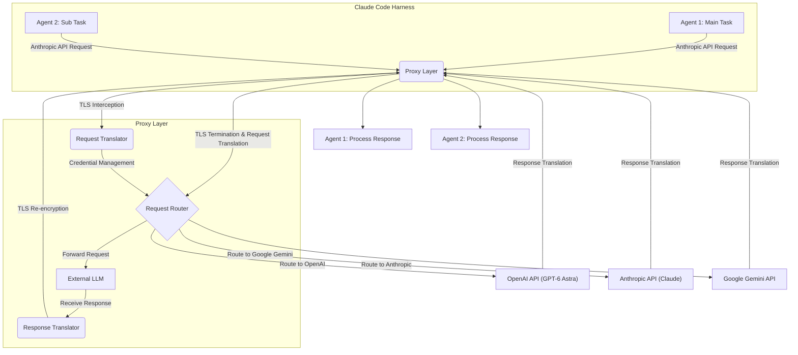

Modern AI agent harnesses, such as the Claude Code harness, increasingly demand flexibility beyond a single foundational LLM. Integrating multiple Large Language Models (LLMs) from various providers (e.g., OpenAI, Google Gemini) into a unified harness environment allows for optimal model selection based on task requirements, cost efficiency, and performance. This entry details a strategy to extend the Claude Code harness by implementing a multi-LLM integration layer, leveraging a proxy mechanism that transparently routes requests to different LLMs while maintaining compatibility with existing agent logic. The core idea is to intercept API calls targeting the Anthropic API endpoint and dynamically re-route them to alternative LLM providers based on configuration or runtime heuristics.

## Architectural Approach: API Proxy with TLS Termination
The proposed solution centers around an intelligent API proxy. This proxy acts as an intermediary, sitting between the Claude Code harness's internal agents and the external LLM providers. Critically, it terminates TLS (Transport Layer Security) at its front end, allowing it to inspect and modify incoming requests before forwarding them. By presenting itself as `api.anthropic.com` (via a custom Certificate Authority and DNS configuration), the proxy can transparently handle requests initially intended for Claude, then rewrite them for other LLM APIs.

### Components of the Multi-LLM Proxy

1.  **TLS Interception Layer**: Terminates TLS for incoming requests from the Claude Code harness, using a custom CA to issue certificates. This enables full inspection of HTTP/S traffic.
2.  **Request Router**: Analyzes incoming requests (e.g., headers, body, API path) to determine the target LLM (e.g., GPT-6 Astra, Claude, Gemini). This routing can be based on configured rules, agent metadata, or dynamic load-balancing strategies.
3.  **Request Translator**: Rewrites the request payload and headers from the Anthropic API format to the target LLM's API format. This includes adapting model names, message structures, and authentication tokens.
4.  **Credential Manager**: Securely retrieves and injects API keys for the respective LLM providers.
5.  **Response Translator**: Transforms the target LLM's response back into an Anthropic API-compatible format, ensuring seamless integration with the Claude Code harness's existing parsing logic.
6.  **Observability & Logging**: Captures detailed metrics, logs, and traces for debugging, cost tracking, and performance monitoring.

### Dynamic LLM Selection and Routing

The flexibility to use a "main model" (e.g., GPT-6 Astra) for primary tasks and "sub-agents" leveraging Claude for specific functions is a key advantage. This can be achieved through:

*   **Configuration-driven routing**: Agents or specific workflows are pre-configured to use a particular LLM via environment variables (e.g., `ANTHROPIC_BASE_URL` pointing to the proxy) and header overrides.
*   **Prompt-based routing**: The proxy can parse specific directives within the prompt itself to infer the desired LLM.
*   **Agent-metadata routing**: Custom headers or API parameters indicating the agent's identity or task type can trigger specific LLM routing rules.



### Proxy Implementation Example (Python Flask + httpx)

A simplified Python Flask application can demonstrate the proxy logic. This example focuses on rewriting a basic chat completion request. In a production environment, a more robust and performant solution like Nginx with Lua scripting or a dedicated Go service would be preferred.

```python
import os
import requests
from flask import Flask, request, jsonify, make_response
from functools import wraps

app = Flask(__name__)

# --- Configuration (Load from environment or secure store) ---
OPENAI_API_KEY = os.environ.get("OPENAI_API_KEY")
ANTHROPIC_API_KEY = os.environ.get("ANTHROPIC_API_KEY")
GOOGLE_API_KEY = os.environ.get("GOOGLE_API_KEY")

OPENAI_API_BASE = "https://api.openai.com/v1"
ANTHROPIC_API_BASE = "https://api.anthropic.com/v1"
GOOGLE_API_BASE = "https://generativelanguage.googleapis.com/v1beta"

# Default model mapping (can be dynamic)
DEFAULT_MAIN_MODEL = "gpt-4o" # Example for GPT-6 Astra equivalent
DEFAULT_SUB_MODEL = "claude-3-opus-20240229"

# Helper to determine target LLM
def get_target_llm(req_json):
    # Example logic: Check for a custom header or a specific model name in the payload
    # For simplicity, we'll use a hardcoded default or check a dummy header
    if request.headers.get("X-LLM-Target") == "openai":
        return "openai"
    elif request.headers.get("X-LLM-Target") == "gemini":
        return "gemini"
    # Default to Anthropic if not specified or for models not explicitly handled
    return "anthropic"

@app.route("/messages", methods=["POST"])
def proxy_anthropic_messages():
    try:
        anthropic_request_data = request.get_json()
        target_llm = get_target_llm(anthropic_request_data)

        if target_llm == "openai":
            # Translate Anthropic request to OpenAI format
            openai_messages = []
            for msg in anthropic_request_data["messages"]:
                openai_messages.append({"role": msg["role"], "content": msg["content"]})

            openai_payload = {
                "model": DEFAULT_MAIN_MODEL,
                "messages": openai_messages,
                "max_tokens": anthropic_request_data.get("max_tokens", 1024),
                "temperature": anthropic_request_data.get("temperature", 0.7),
            }
            
            headers = {
                "Authorization": f"Bearer {OPENAI_API_KEY}",
                "Content-Type": "application/json"
            }
            response = requests.post(f"{OPENAI_API_BASE}/chat/completions", headers=headers, json=openai_payload)
            openai_response_data = response.json()

            # Translate OpenAI response back to Anthropic format
            anthropic_response_data = {
                "id": openai_response_data["id"],
                "type": "message",
                "role": "assistant",
                "model": DEFAULT_MAIN_MODEL,
                "content": [{"type": "text", "text": openai_response_data["choices"][0]["message"]["content"]}],
                "stop_reason": openai_response_data["choices"][0]["finish_reason"]
            }
            return jsonify(anthropic_response_data), response.status_code

        elif target_llm == "gemini":
            # This translation would be more complex; simplified for example
            gemini_messages = []
            for msg in anthropic_request_data["messages"]:
                gemini_messages.append({"role": "user" if msg["role"] == "user" else "model", "parts": [{"text": msg["content"]}]})
            
            gemini_payload = {
                "contents": gemini_messages,
                "safetySettings": [], # Add appropriate safety settings
                "generationConfig": {
                    "maxOutputTokens": anthropic_request_data.get("max_tokens", 1024),
                    "temperature": anthropic_request_data.get("temperature", 0.7),
                }
            }
            
            headers = {
                "Content-Type": "application/json"
            }
            response = requests.post(f"{GOOGLE_API_BASE}/models/gemini-pro:generateContent?key={GOOGLE_API_KEY}", headers=headers, json=gemini_payload)
            gemini_response_data = response.json()

            # Translate Gemini response back to Anthropic format
            anthropic_response_data = {
                "id": "gemini-" + gemini_response_data.get("candidates", [{}])[0].get("tokenCount", "unknown"), # Dummy ID
                "type": "message",
                "role": "assistant",
                "model": "gemini-pro",
                "content": [{"type": "text", "text": gemini_response_data.get("candidates", [{}])[0].get("content", {}).get("parts", [{}])[0].get("text", "")]},
                "stop_reason": gemini_response_data.get("candidates", [{}])[0].get("finishReason", "stop")
            }
            return jsonify(anthropic_response_data), response.status_code

        else: # Default or explicit Anthropic
            anthropic_payload = anthropic_request_data
            anthropic_payload["model"] = DEFAULT_SUB_MODEL # Use Claude as sub-model
            
            headers = {
                "x-api-key": ANTHROPIC_API_KEY,
                "anthropic-version": "2023-06-01",
                "Content-Type": "application/json"
            }
            response = requests.post(f"{ANTHROPIC_API_BASE}/messages", headers=headers, json=anthropic_payload)
            return jsonify(response.json()), response.status_code

    except Exception as e:
        app.logger.error(f"Proxy error: {e}")
        return jsonify({"error": "Proxy internal error"}), 500

if __name__ == "__main__":
    # In a real scenario, use a proper WSGI server (Gunicorn, uWSGI)
    # and configure TLS termination with a custom CA.
    # For local testing: export ANTHROPIC_API_KEY=sk-abc... OPENAI_API_KEY=sk-xyz...
    app.run(port=8000, debug=True)

```

### Advanced Considerations (2026 Trends)

*   **Cost Optimization**: Dynamic routing can select the most cost-effective LLM for a given task, potentially falling back to cheaper models for less critical operations or higher-volume requests.
*   **Performance Tiers**: Route time-sensitive requests to faster models, even if slightly more expensive.
*   **Specialized Models**: Leverage domain-specific fine-tuned models from various providers for enhanced accuracy in niche tasks.
*   **Vendor Agnosticism**: Reduce reliance on a single LLM provider, providing greater resilience and negotiation power.
*   **A/B Testing**: Easily conduct A/B tests between different LLMs or model versions within the harness without modifying core agent logic.
*   **Local LLMs**: Integrate local, on-device or self-hosted open-source LLMs (e.g., Llama 3, Mistral) through the same proxy interface for privacy-sensitive or low-latency scenarios.

## 트레이드오프

*   **복잡성 증가 (Increased Complexity)**
    *   **언제 좋음**: LLM 선택 유연성, 비용 최적화, 특정 태스크에 최적화된 모델 활용, 단일 벤더 종속성 회피가 핵심 목표일 때. 장기적인 확장성과 유지보수 용이성을 확보할 수 있음.
    *   **언제 나쁨**: 프로젝트 초기 단계이거나, 단일 LLM으로 충분한 경우, 개발 및 운영팀의 리소스가 제한적일 때. 불필요한 복잡성으로 인해 개발 속도가 저하되고 장애 지점이 늘어날 수 있음.

*   **성능 오버헤드 (Performance Overhead)**
    *   **언제 좋음**: LLM API 호출 자체가 네트워크 지연이 크거나, 비용 절감 효과가 지연 시간 증가를 상쇄할 만큼 클 때. 캐싱 레이어를 추가하여 빈번한 요청의 지연을 줄일 수 있을 때.
    *   **언제 나쁨**: 실시간 응답 속도가 critical path에 있는 경우 (예: 실시간 사용자 인터랙션), 추가적인 지연 시간이 사용자 경험이나 시스템 안정성에 치명적인 영향을 줄 때. 프록시 자체가 병목이 될 위험이 있을 때.

*   **보안 및 신뢰 (Security and Trust)**
    *   **언제 좋음**: 내부망에서 LLM 호출에 대한 강력한 통제, 로깅, 감사 (audit) 기능이 필요할 때. 특정 민감 데이터를 마스킹하거나 보안 정책을 중앙에서 적용해야 할 때.
    *   **언제 나쁨**: TLS termination이 가져오는 추가적인 보안 위험 (private key 관리, Man-in-the-Middle 공격 가능성)을 감당할 수 없을 때. 모든 LLM 트래픽을 자체 인프라를 통해 라우팅해야 하는 규제 준수 부담이 클 때.

*   **API 호환성 유지보수 (API Compatibility Maintenance)**
    *   **언제 좋음**: 다양한 LLM API 간의 변경 사항을 중앙 집중식으로 관리하고, 에이전트 코드의 수정 없이 LLM을 교체할 수 있는 추상화 계층이 필요할 때.
    *   **언제 나쁨**: LLM 공급자 API의 빈번한 변경에 대한 대응 리소스가 부족할 때. 각 LLM의 고유한 기능을 완전히 활용하기 위해 복잡한 번역 로직을 유지보수해야 하는 부담이 클 때.

## 실전 체크리스트

- [ ] **LLM 라우팅 정책 정의**: 각 에이전트/태스크에 어떤 LLM을 기본으로 사용할지, 예외 상황에 어떤 LLM으로 폴백할지 명확한 규칙을 수립했는가? (예: 비용, 성능, 전문성 기준)
- [ ] **TLS 인증서 및 CA 관리**: 자체 CA를 통한 TLS termination을 위한 인증서 발급, 갱신, 보안 관리를 위한 프로세스를 수립하고 자동화했는가?
- [ ] **API 키 관리 및 보안**: 각 LLM 공급자의 API 키를 안전하게 저장하고, 프록시 레이어에서만 접근 가능하도록 IAM(Identity and Access Management) 정책을 설정했는가? (예: HashiCorp Vault, AWS Secrets Manager)
- [ ] **요청/응답 번역 로직 견고성 검증**: Anthropic API 규격과 타 LLM API 규격 간의 완벽한 번역이 가능한지, edge case (예: tool use, JSON 모드, streaming) 에 대한 처리 로직을 충분히 테스트했는가?
- [ ] **성능 및 지연 시간 측정**: 프록시 도입 후 LLM 호출의 평균 및 P99 지연 시간을 측정하고, 허용 가능한 성능 저하 범위 내에 있는지 검증했는가?
- [ ] **모니터링 및 로깅 시스템 구축**: 각 LLM 호출에 대한 성공/실패 여부, 응답 시간, 사용된 LLM, 토큰 사용량 등을 추적하고 알림을 설정하는 모니터링 시스템을 구축했는가?
- [ ] **장애 조치 (Failover) 전략 구현**: 특정 LLM 공급자 API 장애 시 자동으로 다른 LLM으로 전환되거나, 자체 폴백 로직이 동작하는지 테스트 및 검증했는가?