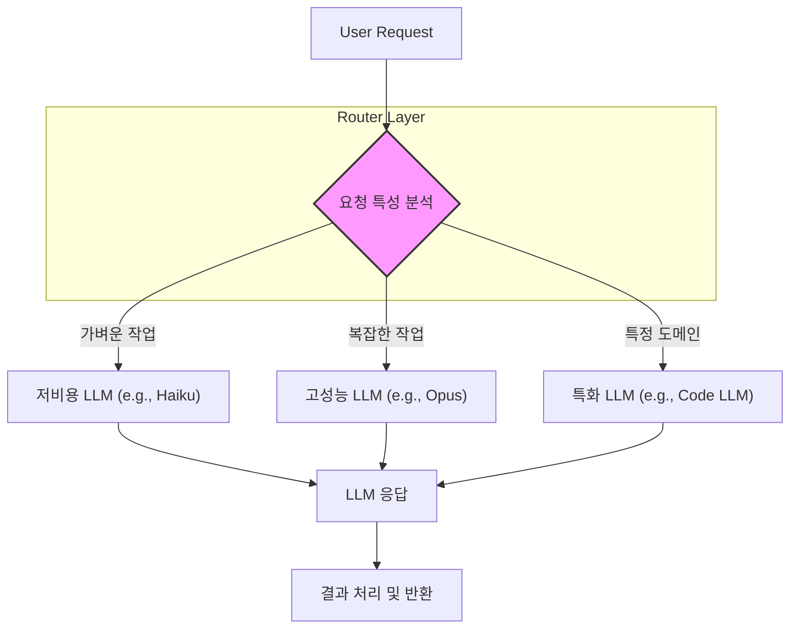

LLM(Large Language Model) 애플리케이션은 2026년에 접어들면서 단순한 단일 모델 호출을 넘어 복잡한 상호작용과 최적화된 자원 활용을 요구하고 있습니다. 다양한 LLM 모델들은 각기 다른 특성과 비용 구조, 성능 지표를 가집니다. 예를 들어, 특정 모델은 번역에 뛰어나고 다른 모델은 코딩 작업에 특화되어 있으며, 또 다른 모델은 저렴하지만 응답 속도가 느릴 수 있습니다. 이러한 상황에서 다중 LLM 라우팅(Multi-LLM Routing)은 비용 효율성(Cost-Effectiveness)과 성능(Performance)을 극대화하고, 특정 작업에 최적화된 모델을 동적으로 활용하는 핵심 기술입니다.

다중 LLM 라우팅은 들어오는 요청의 특성(예: 목적, 길이, 복잡성, 언어)을 분석하여 가장 적합한 LLM으로 요청을 보내는 메커니즘을 의미합니다. 이는 LLM 호출 비용 절감, Latency 감소, 특정 도메인에 대한 응답 품질 향상, 그리고 시스템의 전체적인 견고성(Robustness) 증진에 기여합니다.

## 다중 LLM 라우팅 핵심 패턴

LLM 애플리케이션에서 다중 LLM 라우팅을 설계할 때 고려할 수 있는 몇 가지 핵심 패턴이 있습니다.

### 1. 정적 규칙 기반 라우팅 (Static Rule-Based Routing)

가장 기본적인 형태로, 미리 정의된 조건(예: 입력 프롬프트의 키워드, 사용자 역할, 요청 유형)에 따라 특정 LLM으로 요청을 보냅니다. 이는 예측 가능성이 높고 구현이 간단하다는 장점이 있습니다.

*   **동작 방식**: 요청이 `Translate` 키워드를 포함하면 번역 전문 LLM으로, `Code Generation` 키워드를 포함하면 코딩 전문 LLM으로 라우팅합니다.
*   **장점**: 구현 용이성, 낮은 오버헤드, 예측 가능한 동작.
*   **단점**: 유연성이 낮아 새로운 유형의 요청이나 모델 변화에 대한 대응이 어렵습니다.

### 2. 동적 라우터 LLM (Dynamic Router LLM)

이 패턴은 작은 규모의 LLM(Router LLM 또는 Evaluator LLM)을 사용하여 들어오는 요청의 의도(Intent)나 복잡성을 분석하고, 어떤 메인 LLM으로 요청을 보낼지 결정합니다. Router LLM은 일반적으로 비용이 저렴하고 응답 속도가 빠르며, 메타 데이터 분석에 특화됩니다.

*   **동작 방식**: 사용자 요청을 먼저 Router LLM에 전달하여 요청의 본질을 파악합니다. 예를 들어, Router LLM이 '이 요청은 복잡한 데이터 분석이 필요하다'고 판단하면 고성능의 비싼 모델(예: GPT-4o)로, '간단한 질문이다'라고 판단하면 저렴한 모델(예: Claude 3 Haiku)로 라우팅합니다.
*   **장점**: 높은 유연성과 지능적인 라우팅, 메인 LLM 호출 비용 절감 효과.
*   **단점**: Router LLM 호출로 인한 추가 Latency 발생, Router LLM의 판단 오류 가능성.

### 3. 캐스케이드/폴백 라우팅 (Cascade/Fallback Routing)

여러 LLM을 순차적으로 시도하는 패턴입니다. 일반적으로 가장 비용 효율적인 모델부터 시작하여, 응답이 만족스럽지 않거나 특정 기준(예: Confidence Score, Latency Threshold)을 충족하지 못할 경우 다음 모델로 넘어갑니다.

*   **동작 방식**: 먼저 저렴한 모델 A에 요청을 보내고, A의 응답 품질이 낮으면 중간 모델 B에 요청을 보냅니다. B도 실패하면 최고 성능의 모델 C에 최종적으로 요청을 보냅니다.
*   **장점**: 시스템의 견고성 증진, 비용 최적화(대부분의 요청을 저렴한 모델로 처리), Latency 최적화(성공적인 응답을 빠르게 반환).
*   **단점**: 여러 번의 LLM 호출로 인해 전체 Latency가 증가할 수 있으며, Fallback 모델이 항상 최적의 품질을 보장하지 못할 수 있습니다.

### 4. 병렬 라우팅 및 앙상블 (Parallel Routing with Ensemble/Consensus)

동일한 요청을 여러 LLM에 동시에 보내고, 그 결과를 취합(Aggregate)하거나 비교하여 가장 좋은 응답을 선택하는 패턴입니다. 이는 고품질과 견고성이 매우 중요한 시나리오에 적합합니다.

*   **동작 방식**: 요청을 모델 A, B, C에 동시에 전송하고, 각 모델의 응답을 수집합니다. 이후 평가 로직(예: 투표, 점수 매기기, 특정 지표에 따른 순위 지정)을 통해 최종 응답을 결정합니다.
*   **장점**: 최고 수준의 응답 품질 및 견고성, Latency 숨기기(여러 모델 중 가장 빠른 응답을 대기), 할루시네이션(Hallucination) 감소.
*   **단점**: 가장 높은 비용 소모, 복잡한 응답 취합 및 평가 로직 필요.

## LLM 라우팅 아키텍처 다이어그램

아래 Mermaid 다이어그램은 동적 라우터 LLM 패턴을 적용한 아키텍처 흐름을 보여줍니다.



## 구현 예제 (Python)

아래 Python 코드는 간단한 동적 라우팅 패턴을 구현하는 `LLMRouter` 클래스를 보여줍니다. 실제 환경에서는 LLM API 호출, 캐싱, 에러 핸들링 등 더 많은 로직이 추가됩니다.

```python
import os
from typing import Dict, Any

# Hypothetical LLM Provider interfaces
class LLMProvider:
    def __init__(self, name: str, cost_per_token: float, max_tokens: int):
        self.name = name
        self.cost_per_token = cost_per_token
        self.max_tokens = max_tokens

    def generate(self, prompt: str, **kwargs) -> str:
        raise NotImplementedError

class LowCostLLM(LLMProvider):
    def __init__(self):
        super().__init__("low_cost_model", 0.000001, 4096)

    def generate(self, prompt: str, **kwargs) -> str:
        # Simulate a low-cost, decent performance model
        return f"[LowCostLLM - {self.name}] Response for: '{prompt[:30]}...'"

class HighPerformanceLLM(LLMProvider):
    def __init__(self):
        super().__init__("high_perf_model", 0.000015, 8192)

    def generate(self, prompt: str, **kwargs) -> str:
        # Simulate a high-cost, high-performance model
        return f"[HighPerformanceLLM - {self.name}] Advanced response for: '{prompt[:30]}...'"

class SpecializedLLM(LLMProvider):
    def __init__(self):
        super().__init__("specialized_code_model", 0.000010, 16384)

    def generate(self, prompt: str, **kwargs) -> str:
        # Simulate a model specialized in code generation
        if "code" in prompt.lower() or "program" in prompt.lower():
            return f"[SpecializedLLM - {self.name}] Code output for: '{prompt[:30]}...'"
        return f"[SpecializedLLM - {self.name}] General response for: '{prompt[:30]}...'"

class LLMRouter:
    def __init__(self, models: Dict[str, LLMProvider]):
        self.models = models
        # In a real scenario, this would be a small LLM or rule engine
        self.router_model = LowCostLLM() 

    def _determine_route(self, prompt: str) -> str:
        # Simulate intent detection by a router LLM or rule engine
        # For simplicity, using keyword detection here.
        if "complex data analysis" in prompt.lower():
            return "high_perf_model"
        elif "code generation" in prompt.lower() or "write a function" in prompt.lower():
            return "specialized_code_model"
        else:
            return "low_cost_model"

    def route_and_generate(self, prompt: str, **kwargs) -> str:
        chosen_model_name = self._determine_route(prompt)
        chosen_model = self.models.get(chosen_model_name)
        
        if not chosen_model:
            print(f"Warning: Model '{chosen_model_name}' not found. Falling back to low_cost_model.")
            chosen_model = self.models["low_cost_model"]
            
        print(f"Routing to: {chosen_model.name}")
        return chosen_model.generate(prompt, **kwargs)

# Initialize LLM providers
llm_providers = {
    "low_cost_model": LowCostLLM(),
    "high_perf_model": HighPerformanceLLM(),
    "specialized_code_model": SpecializedLLM()
}

# Initialize router
router = LLMRouter(llm_providers)

# Test cases
print(router.route_and_generate("Tell me a simple joke."))
print(router.route_and_generate("Perform complex data analysis on sales figures for Q4 2023."))
print(router.route_and_generate("Write a Python function to calculate Fibonacci sequence."))
print(router.route_and_generate("Explain quantum physics in simple terms."))
```

## 트레이드오프

다중 LLM 라우팅 패턴을 적용할 때는 항상 장점과 단점을 고려하여 현재 프로젝트의 요구사항에 맞는 최적의 균형점을 찾아야 합니다.

*   **비용(Cost) vs. 성능(Performance) 및 품질(Quality)**
    *   **언제 좋은가**: 비용이 민감한 애플리케이션에서 대부분의 요청을 저렴한 모델로 처리하고, 고품질이 필요한 경우에만 비싼 모델을 사용하는 패턴(예: 동적 라우터, 캐스케이드)은 비용 효율적입니다.
    *   **언제 나쁜가**: 모든 요청에 최고 성능/품질이 요구되는 경우, 저렴한 모델로의 라우팅은 사용자 경험을 저해할 수 있습니다. 이 경우 병렬 라우팅이 적합하지만 비용이 증가합니다.

*   **구현 복잡성(Complexity) vs. 유연성(Flexibility)**
    *   **언제 좋은가**: 비즈니스 로직이 자주 변경되거나 다양한 유형의 요청을 처리해야 할 때, 동적 라우터 LLM이나 병렬 앙상블 패턴은 높은 유연성을 제공합니다. 이는 새로운 모델 통합에도 용이합니다.
    *   **언제 나쁜가**: 애플리케이션의 요구사항이 명확하고 예측 가능한 경우, 정적 규칙 기반 라우팅이 복잡성 없이 충분한 성능을 제공합니다. 불필요한 복잡성은 유지보수 비용을 증가시킬 수 있습니다.

*   **응답 Latency vs. 견고성(Robustness)**
    *   **언제 좋은가**: LLM API의 일시적인 오류나 모델 성능 저하에 대한 대비가 필요할 때, 캐스케이드(Fallback) 또는 병렬 라우팅 패턴은 시스템의 견고성을 크게 높여줍니다.
    *   **언제 나쁜가**: 실시간에 가까운 초저지연(Ultra-low Latency) 응답이 필수적인 서비스에서는 여러 LLM 호출을 시도하거나 병렬로 실행하는 것이 전체 Latency를 증가시킬 수 있습니다. 이 경우, 가장 빠른 단일 모델 라우팅이 선호될 수 있습니다.

*   **모델 특화(Specialization) vs. 범용성(Generalization)**
    *   **언제 좋은가**: 특정 작업(예: 코딩, 번역, 요약)에 대해 높은 정확도와 성능이 요구될 때, 해당 작업에 특화된 모델로 라우팅하는 것은 응답 품질을 극대화합니다.
    *   **언제 나쁜가**: 광범위한 일반적인 질문에 대해 여러 특화 모델을 오가는 것은 라우팅 로직을 불필요하게 복잡하게 만들고, 때로는 범용 모델 하나가 더 효율적일 수 있습니다.

## 실전 체크리스트

LLM 애플리케이션에 다중 LLM 라우팅 패턴을 적용할 때 다음 체크리스트를 활용하여 성공적인 도입을 계획하고 검증하세요.

- [ ] **라우팅 기준 명확화**: 각 라우팅 전략이 어떤 기준으로 LLM을 선택하는지(예: 비용, Latency, 응답 품질, 특정 키워드, 사용자 권한) 구체적인 기준을 정의했는가?
- [ ] **성능 및 비용 모니터링 시스템 구축**: 각 LLM의 호출 횟수, Latency, 토큰 사용량, 비용 등을 실시간으로 모니터링하고 분석할 수 있는 대시보드를 구축했는가?
- [ ] **Fallback 및 에러 핸들링 전략 구현**: 주 라우팅 모델이 실패하거나 예상치 못한 응답을 반환할 경우, 어떤 Fallback 모델을 사용할지, 또는 어떻게 사용자에게 알릴 것인지에 대한 견고한 에러 핸들링 로직을 구현했는가?
- [ ] **A/B 테스트 환경 구축**: 다른 라우팅 전략이나 다른 LLM 조합의 성능을 비교하기 위한 A/B 테스트 환경을 구축하여 데이터 기반으로 최적의 전략을 찾아낼 수 있는가?
- [ ] **라우터 LLM (또는 규칙 엔진) 평가 지표 정의**: 동적 라우터 LLM을 사용하는 경우, 라우터 LLM의 결정 정확도(예: 올바른 LLM 선택 비율)를 평가하고 개선하기 위한 명확한 지표를 정의했는가?
- [ ] **모델 API 키 및 보안 관리**: 다수의 LLM API 키를 안전하게 저장하고 관리하며, 각 모델의 접근 권한을 최소한으로 유지하는 보안 정책을 수립했는가?
- [ ] **확장성 고려**: 새로운 LLM이 출시되거나 기존 LLM이 업데이트될 때, 라우팅 로직을 쉽게 수정하고 확장할 수 있도록 유연하게 설계되었는가?
