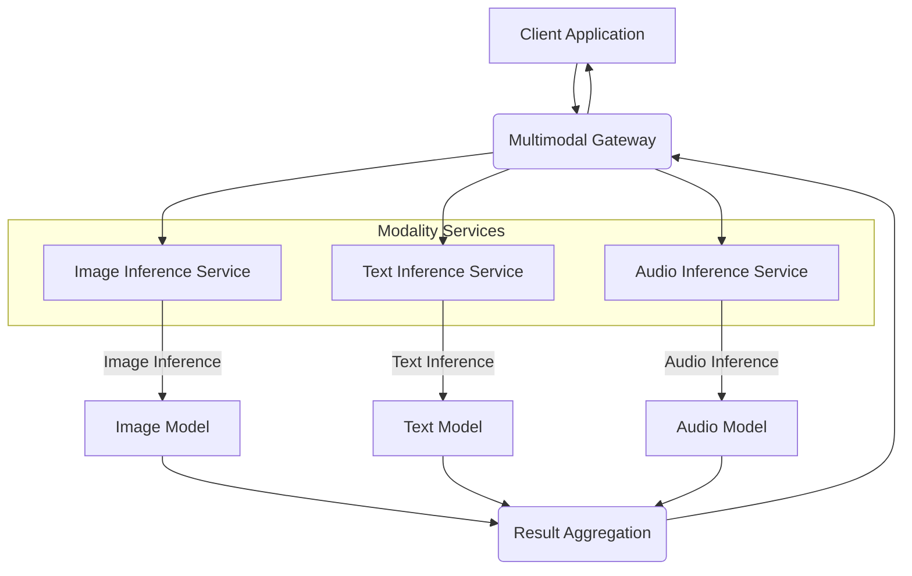

복잡한 멀티모달 AI (Multimodal AI) 모델은 텍스트, 이미지, 오디오, 비디오 등 다양한 데이터 유형을 통합 처리하여 실제 애플리케이션에 배포될 때 고유한 서빙(Serving) 아키텍처 과제를 제시합니다. 효율적인 배포, 낮은 지연 시간(Low Latency), 높은 처리량(High Throughput)은 사용자 경험과 시스템 안정성에 결정적인 요소입니다. 이 엔트리에서는 멀티모달 AI 모델을 위한 실용적인 서빙 아키텍처 디자인 패턴을 탐색합니다.2026년 기준, 멀티모달 AI는 다양한 산업 분야에서 핵심적인 기술로 자리 잡고 있으며, 이를 효과적으로 운영하기 위한 인프라 설계는 필수적입니다.

## 멀티모달 AI 서빙의 주요 과제

멀티모달 AI 모델을 배포하고 서빙하는 과정에는 여러 난관이 존재합니다. 이러한 과제를 이해하는 것은 견고한 아키텍처를 설계하는 데 중요합니다.

*   **이질적인 입력/출력 (Heterogeneous Inputs/Outputs)**: 각 모달리티별로 데이터 형식과 전처리 요구사항이 상이하며, 모델 출력 또한 다양합니다.
*   **다양한 모델 복잡도 (Varying Model Complexities)**: 대규모 파운데이션 모델(Foundation Models)과 특정 모달리티에 특화된 경량 모델들이 혼재되어 있어, 자원 관리 및 스케일링이 복잡합니다.
*   **높은 자원 요구량 (Resource Intensiveness)**: 특히 이미지 및 비디오 모달리티는 GPU, CPU, 메모리 자원 및 네트워크 대역폭을 많이 소모합니다.
*   **낮은 지연 시간 요구사항 (Low Latency Requirements)**: 실시간 대화형 AI나 자율 주행 시스템과 같이 즉각적인 반응이 필요한 경우, 추론(Inference) 지연 시간을 최소화해야 합니다.
*   **확장성 (Scalability)**: 다양한 모달리티에 걸쳐 예측 불가능한 사용자 부하에 효과적으로 대응할 수 있는 아키텍처가 필요합니다.
*   **데이터 동기화 (Data Synchronization)**: 여러 모달리티에서 수집된 데이터를 시간적으로 정렬하고 일관성을 유지하는 것은 복합적인 추론에서 필수적입니다.

## 핵심 서빙 아키텍처 패턴

### 1. 통합 추론 게이트웨이 (Unified Inference Gateway)

단일 진입점(Single Entry Point)을 통해 다양한 모달리티의 요청을 처리하는 패턴입니다. 이 게이트웨이는 요청을 수신하여 적절한 백엔드 모달리티별 모델로 라우팅하고, 필요한 전처리를 수행하며, 최종 결과를 통합하여 클라이언트에 반환합니다. 클라이언트 측 통합을 간소화하는 장점이 있습니다.

### 2. 모달리티별 마이크로서비스 (Modality-Specific Microservices)

각 모달리티(예: 텍스트, 이미지, 오디오)에 최적화된 독립적인 마이크로서비스를 구축하는 패턴입니다. 각 서비스는 해당 모달리티의 모델을 호스팅하며, 전처리 및 추론을 전담합니다. 중앙의 API 게이트웨이 또는 오케스트레이션 레이어가 이들 서비스로 요청을 분배하고 결과를 취합합니다. 높은 모듈성, 독립적인 스케일링, 그리고 모달리티별 자원 최적화가 가능합니다.

### 3. 하이브리드 엣지-클라우드 서빙 (Hybrid Edge-Cloud Serving)

추론 작업을 엣지 디바이스(Edge Device)와 클라우드 인프라 간에 지능적으로 분산하는 패턴입니다. 간단하고 지연 시간에 민감한 추론, 또는 프라이버시가 중요한 추론은 엣지에서 수행하고, 복잡하고 자원 집약적인 추론은 클라우드로 오프로드(Offload)합니다. 이는 지연 시간 감소, 클라우드 비용 절감, 그리고 개인 정보 보호 강화에 기여합니다.

## 코드 예제: 모달리티별 마이크로서비스를 위한 게이트웨이 (Python FastAPI)

다음은 `Modality-Specific Microservices` 패턴에서 중앙 게이트웨이가 어떻게 이종 모달리티 서비스를 오케스트레이션하는지 보여주는 개념적인 FastAPI 코드입니다. 실제 환경에서는 이미지 및 텍스트 서비스가 각각 별도의 서버에 배포됩니다.

```python
# multimodal_gateway.py
from fastapi import FastAPI, UploadFile, File, Form, HTTPException
import httpx
from typing import Dict, Any

app = FastAPI(title="Multimodal Inference Gateway")

# 각 모달리티 서비스의 내부 URL (실제 배포 환경에 따라 변경)
IMAGE_SERVICE_URL = "http://image-service.internal:8001"
TEXT_SERVICE_URL = "http://text-service.internal:8002"

@app.post("/infer/")
async def infer_multimodal(
    image: UploadFile = File(None),
    text: str = Form(None)
) -> Dict[str, Any]:
    results = {}
    async with httpx.AsyncClient() as client:
        if image:
            try:
                files = {"image": (image.filename, await image.read(), image.content_type)}
                image_response = await client.post(f"{IMAGE_SERVICE_URL}/predict", files=files)
                image_response.raise_for_status()
                results["image_inference"] = image_response.json()
            except httpx.HTTPStatusError as e:
                raise HTTPException(status_code=e.response.status_code, detail=f"Image service error: {e.response.text}")
        
        if text:
            try:
                text_response = await client.post(f"{TEXT_SERVICE_URL}/predict", json={"input_text": text})
                text_response.raise_for_status()
                results["text_inference"] = text_response.json()
            except httpx.HTTPStatusError as e:
                raise HTTPException(status_code=e.response.status_code, detail=f"Text service error: {e.response.text}")

    if not results:
        raise HTTPException(status_code=400, detail="No valid multimodal input provided.")

    # 여기서 여러 모달리티의 추론 결과를 융합하는 로직을 구현합니다.
    final_output = {"combined_result": "Fusion logic not implemented in this example."}
    if "image_inference" in results:
        final_output["combined_result"] = "Image processed." + final_output["combined_result"]
    if "text_inference" in results:
        final_output["combined_result"] = final_output["combined_result"] + " Text processed."
        
    return {"status": "success", "results": results, "final_output": final_output}
```

## Mermaid 다이어그램: 모달리티별 마이크로서비스 아키텍처



## 트레이드오프

멀티모달 AI 서빙 아키텍처를 설계할 때는 다양한 패턴 간의 장단점을 고려해야 합니다.

*   **단일 게이트웨이 패턴 vs. 분산 마이크로서비스 패턴**:
    *   **단일 게이트웨이 (Unified Gateway)**:
        *   **좋은 경우**: 개발 초기 단계, 모델 수가 적고 복잡도가 낮아 클라이언트 개발이 간소화될 때. 관리해야 할 배포 단위가 적습니다.
        *   **나쁜 경우**: 높은 트래픽, 모델 복잡도 증가, 독립적인 스케일링이 필요할 때. 게이트웨이가 병목 지점(Bottleneck)이 되기 쉽습니다.
    *   **분산 마이크로서비스 (Modality-Specific Microservices)**:
        *   **좋은 경우**: 다양한 모델 유형과 스케일링 요구사항, 고가용성(High Availability)이 필요할 때. 각 서비스의 독립적 배포 및 관리가 용이합니다.
        *   **나쁜 경우**: 초기 설정 및 운영 복잡도가 높고, 서비스 간 통신 오버헤드(Overhead) 및 데이터 동기화 문제가 발생할 수 있습니다.

*   **배치 처리 (Batch Processing) vs. 실시간 스트리밍 (Real-time Streaming)**:
    *   **배치 처리**: 
        *   **좋은 경우**: 높은 처리량(Throughput)이 중요하지만, 지연 시간(Latency)에 덜 민감한 경우 (예: 오프라인 데이터 분석, 비동기 보고서 생성).
        *   **나쁜 경우**: 즉각적인 사용자 피드백이나 실시간 반응이 필요한 애플리케이션 (예: 대화형 AI, 실시간 모니터링).
    *   **실시간 스트리밍**: 
        *   **좋은 경우**: 낮은 지연 시간과 즉각적인 반응이 필수적인 애플리케이션. 연속적인 데이터 흐름 처리에 적합합니다.
        *   **나쁜 경우**: 인프라 복잡도가 높고, 자원 소모가 크며, 데이터 일관성 및 순서 보장에 더 많은 노력이 필요합니다.

*   **클라우드 전용 (Cloud-only) vs. 하이브리드 엣지-클라우드 (Hybrid Edge-Cloud)**:
    *   **클라우드 전용**: 
        *   **좋은 경우**: 모든 자원 관리가 클라우드 공급자에게 위임되어 운영 부담이 적고, 높은 확장성(Scalability)과 유연성을 제공할 때.
        *   **나쁜 경우**: 네트워크 지연에 민감한 애플리케이션, 데이터 주권 및 규제 문제, 지속적인 클라우드 비용이 우려될 때.
    *   **하이브리드 엣지-클라우드**: 
        *   **좋은 경우**: 낮은 지연 시간이 중요하고, 오프라인 작동이 필요하며, 데이터 프라이버시가 중요한 경우. 클라우드 비용 절감 효과도 있습니다.
        *   **나쁜 경우**: 엣지 디바이스 관리 및 배포 복잡도 증가, 엣지 장치의 제한된 컴퓨팅 자원, 모델 동기화 문제 해결에 추가 노력이 필요합니다.

## 실전 체크리스트

멀티모달 AI 모델 서빙 아키텍처를 프로젝트에 적용할 때 검증해야 할 핵심 항목들입니다.

*   - [ ] 각 모달리티 모델의 최대 QPS (Query Per Second) 및 평균/99th percentile latency 목표를 명확히 정의하고 측정 메트릭을 설정했는가?
*   - [ ] 모델별 리소스 요구사항 (GPU, CPU, Memory)을 분석하고, 이를 기반으로 적절한 인스턴스 타입 및 오토스케일링(Autoscaling) 정책을 설계했는가?
*   - [ ] 이종 모달리티 데이터의 전처리 및 특징 추출 로직을 병렬화하고 최적화하여 엔드투엔드(End-to-End) 지연 시간을 최소화했는가?
*   - [ ] API Gateway 또는 오케스트레이션 레이어가 요청 라우팅, 로드 밸런싱, 인증/인가, 그리고 에러 처리 로직을 효율적으로 수행하도록 구현되었는가?
*   - [ ] 모델 버전 관리 및 A/B 테스트(A/B Testing), 카나리 배포(Canary Deployment)를 지원하는 CI/CD 파이프라인이 구축되어 있는가?
*   - [ ] 모달리티별 모델의 성능 지표 (예: 이미지 분류 정확도, 텍스트 생성 품질)와 시스템 지표 (예: GPU 활용률, 서비스 응답 시간)를 실시간으로 모니터링하는 대시보드가 마련되어 있는가?
*   - [ ] 장애 발생 시 자동으로 복구되거나, 신속하게 대응할 수 있는 고가용성(High Availability) 및 재해 복구(Disaster Recovery) 전략이 수립되어 있고 정기적으로 테스트되는가?