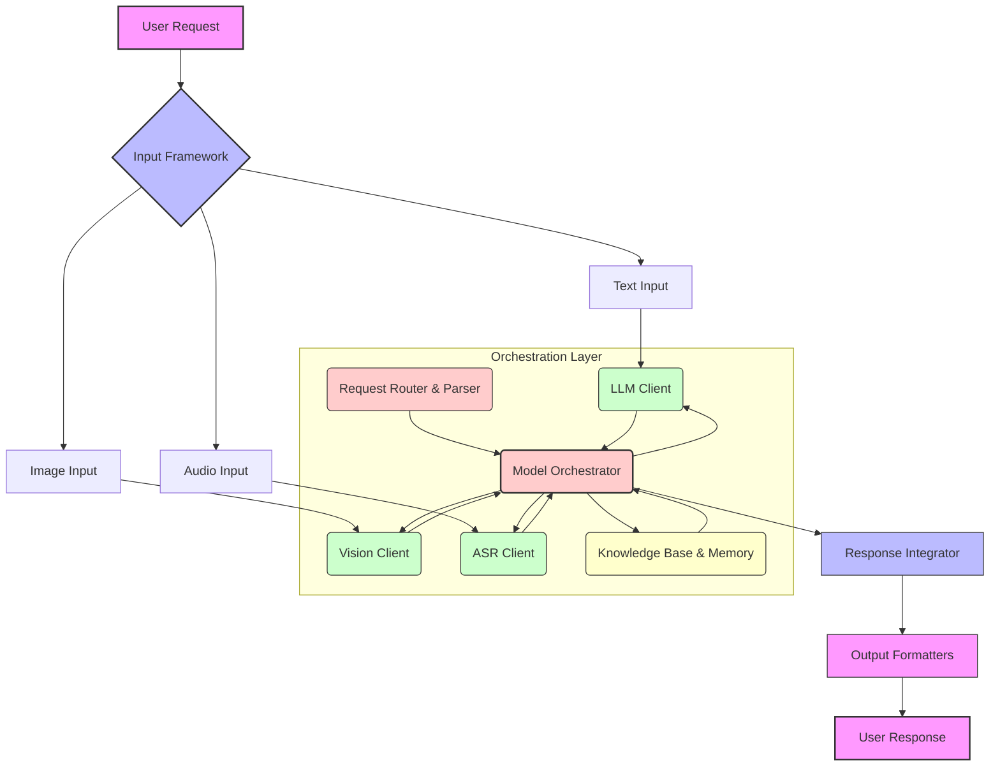

2026년에는 단일 AI 모델로는 처리하기 어려운 복합적인 사용자 시나리오가 더욱 중요해질 것이며, 이를 위해 텍스트, 이미지, 음성 등 다양한 모달리티(modality)를 이해하고 생성하는 여러 AI 모델을 체계적으로 통합하는 기법이 필수적입니다. 멀티모달 AI 오케스트레이션(Multimodal AI Orchestration)은 이러한 요구사항에 대응하기 위한 핵심적인 엔지니어링 접근 방식입니다. 이는 각 모달리티에 특화된 AI 모델들을 하나의 유기적인 시스템으로 엮어, 사용자의 다층적인 요청을 정확히 파악하고 종합적인 솔루션을 제공하는 것을 목표로 합니다.

## 핵심 개념: 멀티모달 AI 통합 아키텍처
멀티모달 AI 통합의 핵심은 특정 작업에 최적화된 개별 모델들의 강점을 활용하고, 이들을 조정하여 복잡한 문제를 해결하는 것입니다. 이를 위한 일반적인 아키텍처는 다음과 같은 주요 구성 요소를 포함합니다.

1.  **입력 프레임워크 (Input Framework)**: 다양한 모달리티의 사용자 입력을 수집하고 표준화된 형식으로 변환합니다. 이는 텍스트, 음성, 이미지, 비디오 등 모든 형태의 데이터를 포함할 수 있습니다.
2.  **모달리티별 전문 AI 모델**: Large Language Models (LLMs), Computer Vision (CV) 모델, Automatic Speech Recognition (ASR) 모델, Text-to-Speech (TTS) 모델 등이 이 계층에 속합니다. 각 모델은 특정 모달리티의 처리 및 이해에 특화되어 있습니다.
3.  **오케스트레이션 레이어 (Orchestration Layer)**: 시스템의 '두뇌' 역할을 합니다. 사용자 요청을 분석하여 필요한 모달리티를 식별하고, 적절한 전문 AI 모델을 호출하며, 이들 모델의 출력을 통합하고 조율하여 최종 응답을 생성합니다. LangChain이나 LlamaIndex와 같은 에이전트 프레임워크가 이 역할을 수행하는 데 유용합니다.
4.  **지식 저장소 (Knowledge Base)**: 벡터 데이터베이스(Vector Database), 그래프 데이터베이스(Graph Database) 등을 활용하여 장기 기억 및 맥락 정보를 저장하고 검색합니다. 이는 AI 모델이 더 풍부한 정보를 바탕으로 추론할 수 있도록 돕습니다.
5.  **응답 생성 및 출력 (Response Generation & Output)**: 오케스트레이션된 결과를 바탕으로 최종 응답을 생성하고 사용자에게 제공합니다. 이 또한 텍스트, 이미지, 음성 등 다양한 모달리티로 이루어질 수 있습니다.

이러한 구조를 통해 시스템은 "이 이미지에서 어떤 물체가 가장 큰가? 그리고 그 물체에 대해 설명해줘"와 같은 이미지(Vision)와 텍스트(LLM)가 결합된 요청을 처리할 수 있습니다.

### 통합 워크플로우 예시
사용자가 "이 비디오에서 사람이 넘어지는 장면을 찾아 캡처하고, 그 상황에 대해 요약해줘"라고 요청했을 때의 워크플로우를 가정해봅니다.

1.  **음성 인식 (ASR)**: 음성 요청을 텍스트로 변환합니다.
2.  **LLM (초기 분석)**: 텍스트 요청을 분석하여 주요 의도(비디오 분석, 특정 이벤트 감지, 요약)를 파악합니다.
3.  **오케스트레이터**: LLM의 분석을 바탕으로 Video Analysis 모델(넘어지는 장면 감지), Image Captioning 모델(캡처된 이미지 설명), 다시 LLM(상황 요약) 호출을 계획합니다.
4.  **비디오 분석 (Video Analysis)**: 비디오에서 넘어지는 장면의 타임스탬프와 이미지를 추출합니다.
5.  **이미지 캡셔닝 (Image Captioning)**: 추출된 이미지를 기반으로 텍스트 설명을 생성합니다.
6.  **LLM (최종 요약)**: 비디오 분석 결과와 이미지 캡셔닝 결과를 통합하여 상황을 최종적으로 요약합니다.
7.  **응답 생성**: 요약된 텍스트와 캡처된 이미지를 사용자에게 전달합니다.

```python
from typing import Dict, Any

# Dummy API clients for different AI models
class ASRClient:
    def transcribe(self, audio_data: bytes) -> str:
        print("ASR: Transcribing audio...")
        return "이 이미지에서 강아지가 무엇을 하고 있나요?"

class VisionClient:
    def analyze_image(self, image_data: bytes) -> Dict[str, Any]:
        print("Vision: Analyzing image...")
        return {"objects": [{"label": "dog", "activity": "running"}]}

class LLMClient:
    def generate_response(self, prompt: str) -> str:
        print(f"LLM: Generating response for prompt: {prompt[:50]}...")
        return f"강아지가 달리고 있는 것으로 보입니다. {prompt}"

class MultimodalOrchestrator:
    def __init__(self):
        self.asr_client = ASRClient()
        self.vision_client = VisionClient()
        self.llm_client = LLMClient()

    def process_complex_request(self, audio_input: bytes = None, image_input: bytes = None) -> str:
        text_query = ""
        vision_analysis = {}

        # Step 1: Process Audio if present
        if audio_input:
            text_query = self.asr_client.transcribe(audio_input)
            print(f"Transcribed Text: {text_query}")

        # Step 2: Process Image if present
        if image_input:
            vision_analysis = self.vision_client.analyze_image(image_input)
            print(f"Vision Analysis: {vision_analysis}")

        # Step 3: Orchestrate with LLM based on available modalities
        if text_query and vision_analysis:
            # Combine text query and vision analysis for LLM prompt
            prompt = f"사용자의 질문: '{text_query}'. 이미지 분석 결과: {vision_analysis}. 이 두 정보를 바탕으로 질문에 답해줘."
        elif text_query:
            prompt = f"사용자의 질문: '{text_query}'."
        elif vision_analysis:
            prompt = f"이미지 분석 결과: {vision_analysis}. 이 정보를 바탕으로 이미지에 대해 설명해줘."
        else:
            return "처리할 수 있는 입력이 없습니다."

        final_response = self.llm_client.generate_response(prompt)
        return final_response

# Example Usage:
orchestrator = MultimodalOrchestrator()

# Scenario 1: Audio + Image Input
audio_data_dummy = b"dummy_audio_data"
image_data_dummy = b"dummy_image_data"
response = orchestrator.process_complex_request(audio_input=audio_data_dummy, image_input=image_data_dummy)
print(f"\nFinal Response (Audio+Image): {response}")

# Scenario 2: Image Only Input
response_image_only = orchestrator.process_complex_request(image_input=image_data_dummy)
print(f"\nFinal Response (Image Only): {response_image_only}")
```

## 멀티모달 AI 오케스트레이션 아키텍처


## 트레이드오프

*   **복잡성 vs. 유연성**: 통합 시스템은 단일 모델보다 훨씬 복잡하며 설계, 구현, 유지보수에 더 많은 리소스가 필요합니다. 언제 좋냐면, 다양한 모달리티와 복잡한 비즈니스 로직이 필요한 경우 유연한 확장을 제공합니다. 언제 나쁘냐면, 단순한 작업이나 단일 모달리티만으로 충분한 경우 오버헤드가 커집니다.
*   **성능 vs. 범용성**: 여러 모델을 조합하기 때문에 개별 모델의 응답 시간과 네트워크 지연이 누적되어 전체 시스템의 응답 시간이 길어질 수 있습니다. 언제 좋냐면, 광범위한 시나리오에 대응하고 특정 모달리티에 대한 전문적인 처리가 필요할 때 범용성이 뛰어납니다. 언제 나쁘냐면, 실시간에 가까운 매우 낮은 지연 시간(low-latency)이 필수적인 서비스에는 적합하지 않을 수 있습니다.
*   **비용 vs. 정확도**: 다수의 고성능 AI 모델 API 호출은 운영 비용을 증가시킬 수 있습니다. 하지만 각 모델의 강점을 활용하여 단일 모델로는 달성하기 어려운 높은 정확도와 이해도를 제공할 수 있습니다. 언제 좋냐면, 사용자 만족도와 문제 해결 능력이 최우선이며, 비용이 그 다음 고려 사항일 때 효과적입니다. 언제 나쁘냐면, 엄격한 비용 제약이 있거나, 각 모달리티의 정보가 중복되거나 중요하지 않은 경우 비효율적입니다.
*   **데이터 의존성 vs. 모델 상호 운용성**: 각 모델이 요구하는 입력 데이터 형식과 출력 데이터 형식이 다를 수 있어 데이터 전처리 및 변환 로직이 복잡해질 수 있습니다. 언제 좋냐면, 다양한 소스의 이질적인 데이터를 처리하고 여러 AI 모델 간의 시너지를 극대화할 수 있습니다. 언제 나쁘냐면, 데이터 파이프라인의 표준화가 어렵고, 모델 간 데이터 불일치 문제가 발생할 위험이 있습니다.

## 실전 체크리스트

멀티모달 AI 모델을 통합하여 복합적인 사용자 요청을 처리하는 시스템을 구축할 때 다음 항목들을 검토해야 합니다.

- [ ] **입력 모달리티 및 시나리오 정의**: 처리하고자 하는 모든 입력 모달리티(텍스트, 이미지, 음성 등)와 핵심 사용자 시나리오(예: '이미지 기반 질문 + 추가 정보 요청')를 명확히 문서화했는가?
- [ ] **오케스트레이션 로직 설계**: 사용자 요청의 의도를 파악하고 적절한 AI 모델들을 순서대로 또는 병렬로 호출하는 오케스트레이션(orchestration) 로직을 구체적으로 설계했으며, 예외 처리 방안을 마련했는가?
- [ ] **API 통합 및 오류 처리**: 각 전문 AI 모델(LLM, Vision API 등)의 API 연동을 완료하고, 개별 모델의 응답 지연, 오류, 서비스 중단 등에 대비한 견고한 재시도(retry) 및 폴백(fallback) 전략을 구현했는가?
- [ ] **데이터 표준화 및 변환**: 서로 다른 모달리티의 데이터를 통합 시스템이 이해할 수 있는 공통 형식으로 변환하고, 모델 간 데이터 전달 시 필요한 전처리 및 후처리 파이프라인을 구축했는가?
- [ ] **종합적인 테스트 케이스 구축**: 실제 사용될 복합적인 멀티모달 시나리오에 대한 엔드-투-엔드(end-to-end) 테스트 케이스를 충분히 구축하고, 시스템의 정확성과 안정성을 검증했는가?
- [ ] **성능 모니터링 및 최적화**: 각 AI 모델 호출 단계별 Latency, Throughput, Error Rate를 측정하는 모니터링 시스템을 구축하고, 병목 현상 발생 시 시스템 성능을 최적화할 수 있는 계획을 수립했는가?
- [ ] **보안 및 데이터 프라이버시**: 사용자 입력 데이터(특히 민감 정보)의 전송, 저장, 처리 과정에서 보안 취약점을 검토하고, 관련 데이터 규정(GDPR, CCPA 등)을 준수하는 메커니즘을 적용했는가?
