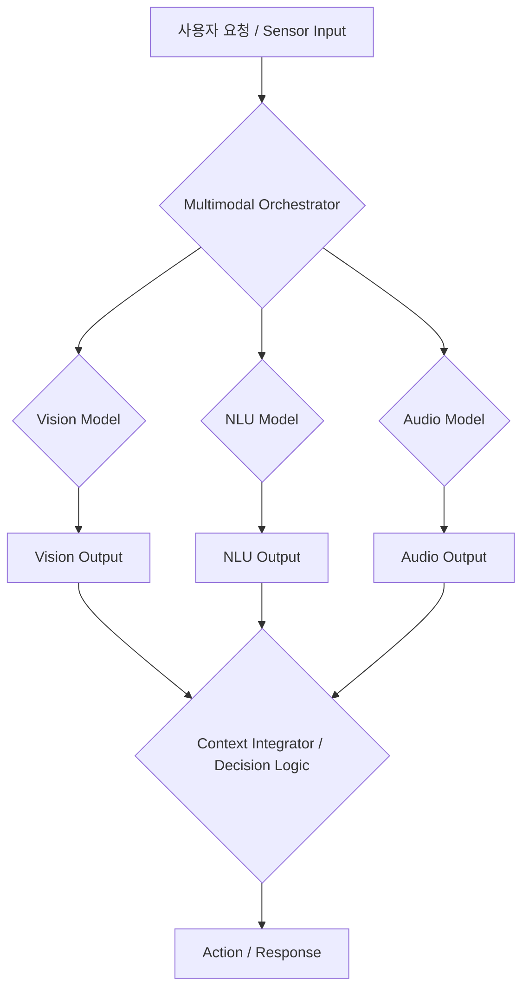

복잡한 멀티모달 AI 시스템을 구축하는 것은 단순한 모델 결합을 넘어선 체계적인 통합과 조율을 요구합니다. 텍스트, 이미지, 오디오, 비디오 등 다양한 양식(modality)의 데이터를 처리하는 AI 모델들을 하나의 통일된 시스템으로 엮어내기 위한 **오케스트레이션 디자인 패턴(Orchestration Design Patterns)**은 이러한 시스템의 효율성, 확장성, 그리고 신뢰성을 결정하는 핵심 요소입니다. 2026년 현재, 멀티모달 AI는 인간과 유사한 수준의 복합적인 인지 및 상호작용 능력을 구현하며 그 활용 범위가 빠르게 넓어지고 있으며, 이에 따라 각 컴포넌트 간의 원활한 정보 흐름과 의사 결정 메커니즘을 설계하는 것이 중요해지고 있습니다.

## 멀티모달 AI 오케스트레이션의 도전 과제

멀티모달 AI 시스템은 본질적으로 이질적인(heterogeneous) 모델들과 데이터 스트림의 집합체입니다. 각 모달리티 모델은 고유한 입력/출력 형식, 처리 시간, 컴퓨팅 요구 사항을 가집니다. 이러한 다양성은 다음과 같은 오케스트레이션 도전 과제를 야기합니다:

1.  **데이터 동기화 및 정합성**: 여러 모달리티에서 수집된 정보가 시간적으로나 의미론적으로 일관되게 처리되어야 합니다.
2.  **의존성 관리**: 특정 모달리티의 출력이 다른 모달리티의 입력이 되는 경우, 올바른 순서와 방식으로 데이터가 전달되어야 합니다.
3.  **리소스 최적화**: 다양한 모델들의 컴퓨팅 리소스(GPU, NPU 등)를 효율적으로 할당하고 관리해야 합니다.
4.  **오류 처리 및 복구**: 개별 모델의 실패가 전체 시스템에 미치는 영향을 최소화하고 신속하게 복구할 수 있는 메커니즘이 필요합니다.
5.  **확장성**: 새로운 모달리티나 모델이 추가될 때 시스템 전체의 아키텍처를 쉽게 확장할 수 있어야 합니다.

## 핵심 오케스트레이션 디자인 패턴

### 1. 미디에이터 패턴 (Mediator Pattern)

**미디에이터 패턴(Mediator Pattern)**은 중앙 집중식 오케스트레이터가 여러 멀티모달 컴포넌트 간의 상호작용을 관리하는 방식입니다. 각 컴포넌트는 미디에이터를 통해서만 소통하며, 직접적인 의존성을 줄여 결합도를 낮춥니다. 오케스트레이터는 입력 데이터의 종류에 따라 적절한 모델을 호출하고, 그 결과를 취합하여 다음 단계로 전달하는 역할을 수행합니다.

```python
from abc import ABC, abstractmethod

class MultimodalComponent(ABC):
    @abstractmethod
    def process(self, data: dict) -> dict:
        pass

class VisionProcessor(MultimodalComponent):
    def process(self, data: dict) -> dict:
        print(f"Vision processing: {data.get('image_data')}")
        return {"visual_features": "extracted_visual_data"}

class NLUProcessor(MultimodalComponent):
    def process(self, data: dict) -> dict:
        print(f"NLU processing: {data.get('text_data')}")
        return {"semantic_meaning": "extracted_text_meaning"}

class MultimodalOrchestrator:
    def __init__(self):
        self.components = {}

    def register_component(self, name: str, component: MultimodalComponent):
        self.components[name] = component

    def orchestrate(self, request: dict) -> dict:
        results = {}
        if 'image_data' in request:
            vision_result = self.components['vision'].process(request)
            results.update(vision_result)
        if 'text_data' in request:
            nlu_result = self.components['nlu'].process(request)
            results.update(nlu_result)
        
        # Integrate and make decisions based on combined results
        print("Integrating results...")
        combined_output = {"integrated_analysis": f"Visual: {results.get('visual_features')}, Text: {results.get('semantic_meaning')}"}
        return combined_output

# Usage
orchestrator = MultimodalOrchestrator()
orchestrator.register_component("vision", VisionProcessor())
orchestrator.register_component("nlu", NLUProcessor())

user_input = {"image_data": "base64_image_string", "text_data": "Describe the image"}
output = orchestrator.orchestrate(user_input)
print(output)
```

### 2. 코레오그래피 패턴 (Choreography Pattern)

**코레오그래피 패턴(Choreography Pattern)**은 중앙 오케스트레이터 없이 각 컴포넌트가 이벤트 기반으로 상호작용하는 분산형 접근 방식입니다. 각 모델은 특정 이벤트에 반응하고, 자신의 처리 결과를 이벤트로 발행하여 다른 모델들이 이를 구독하고 처리합니다. 이는 시스템의 유연성과 복원력을 높이지만, 전체 시스템의 흐름을 파악하기 어렵게 만들 수 있습니다.

### 3. 어댑터 패턴 (Adapter Pattern)

**어댑터 패턴(Adapter Pattern)**은 이질적인 인터페이스를 가진 멀티모달 모델들을 하나의 통일된 인터페이스로 래핑(wrap)하여 오케스트레이터가 쉽게 접근할 수 있도록 합니다. 예를 들어, 서로 다른 프레임워크(TensorFlow, PyTorch)로 학습된 모델이나 다양한 API 형식을 가진 외부 서비스들을 통합할 때 유용합니다. 어댑터는 데이터 변환 및 형식 일치화를 담당합니다.

### 4. 라우터/게이트웨이 패턴 (Router/Gateway Pattern)

**라우터/게이트웨이 패턴(Router/Gateway Pattern)**은 시스템의 진입점에서 들어오는 멀티모달 요청을 분석하여, 적절한 백엔드 모델 또는 모델 파이프라인으로 지능적으로 라우팅하는 역할을 합니다. 이는 요청의 복잡성, 사용 가능한 리소스, 또는 특정 비즈니스 로직에 따라 동적으로 이루어질 수 있습니다. 특히 2026년에는 최신 트렌드로 프롬프트의 의도(intent)를 기반으로 하는 지능형 라우팅이 중요해지고 있습니다.



### 5. 동적 워크플로우 오케스트레이션 (Dynamic Workflow Orchestration)

**동적 워크플로우 오케스트레이션(Dynamic Workflow Orchestration)**은 사전 정의된 고정된 파이프라인 대신, 실행 시점의 상황과 입력에 따라 모델 호출 순서 및 조합을 유연하게 변경하는 접근 방식입니다. 이는 에이전트 기반 시스템에서 특히 중요하며, 자체적인 계획(planning) 및 적응(adaptation) 능력을 가진 오케스트레이터가 필요합니다. 2026년에는 LLM 기반의 에이전트들이 이러한 동적 워크플로우를 직접 생성하고 관리하는 추세가 강화되고 있습니다.

## 트레이드오프

### 1. 중앙 집중식 오케스트레이션 (미디에이터/라우터) vs. 분산형 오케스트레이션 (코레오그래피)
*   **언제 좋은가 (중앙 집중식)**: 초기 개발이 빠르고, 전체 시스템 흐름을 파악하기 쉬우며, 디버깅이 용이합니다. 특히 복잡한 비즈니스 로직이나 엄격한 순서 제어가 필요한 경우에 유리합니다.
*   **언제 나쁜가 (중앙 집중식)**: 단일 실패 지점(Single Point of Failure)이 될 수 있으며, 오케스트레이터 자체가 병목 현상(bottleneck)이 될 수 있습니다. 시스템 규모가 매우 커지면 관리 복잡도가 증가합니다.

*   **언제 좋은가 (분산형)**: 높은 확장성과 복원력을 제공하며, 개별 컴포넌트의 독립성이 높습니다. 새로운 컴포넌트 추가 및 제거가 유연합니다. 이벤트 기반 시스템에 적합합니다.
*   **언제 나쁜가 (분산형)**: 시스템 전체의 흐름을 추적하기 어렵고, 분산 트랜잭션 관리가 복잡합니다. 디버깅이 어려울 수 있으며, 컴포넌트 간의 잠재적 불일치(inconsistency) 위험이 있습니다.

### 2. 정적 워크플로우 vs. 동적 워크플로우
*   **언제 좋은가 (정적)**: 예측 가능한 성능과 안정성을 제공하며, 테스트 및 검증이 용이합니다. 간단하고 반복적인 태스크에 적합합니다.
*   **언제 나쁜가 (정적)**: 예상치 못한 입력이나 상황 변화에 유연하게 대응하기 어렵습니다. 복잡하거나 적응성이 필요한 태스크에는 부적합합니다.

*   **언제 좋은가 (동적)**: 복잡하고 가변적인 상황에 최적으로 대응할 수 있습니다. 에이전트 기반 시스템이나 인간과 유사한 유연한 문제 해결이 필요한 경우에 강력합니다.
*   **언제 나쁜가 (동적)**: 예측 불가능성이 증가하고, 성능 최적화 및 안정성 보장이 어렵습니다. 개발 및 디버깅 복잡도가 높으며, 의도하지 않은 행동(emergent behavior) 발생 가능성이 있습니다.

### 3. 범용 어댑터/표준 인터페이스 vs. 맞춤형 어댑터
*   **언제 좋은가 (범용/표준)**: 컴포넌트 재사용성이 높고, 시스템 통합 비용을 줄일 수 있습니다. 생태계 확장이 용이합니다.
*   **언제 나쁜가 (범용/표준)**: 모든 이질성을 완벽하게 포괄하기 어려우며, 특정 모델의 특수 기능을 완전히 활용하지 못할 수 있습니다.

*   **언제 좋은가 (맞춤형)**: 특정 모델이나 서비스의 잠재력을 최대한 활용할 수 있으며, 최적화된 성능을 달성할 수 있습니다.
*   **언제 나쁜가 (맞춤형)**: 개발 비용과 시간이 많이 들고, 시스템의 결합도를 높일 수 있습니다. 유지보수 및 확장성이 저하됩니다.

## 실전 체크리스트

멀티모달 AI 시스템을 위한 오케스트레이션 패턴을 적용할 때 다음 항목들을 검증합니다:

- [ ]  모든 모달리티 입력 데이터가 통일된 형식으로 정규화(normalization)되어 오케스트레이터에 전달되는가?
- [ ]  각 모달리티 모델의 응답 시간(latency)을 고려하여 전체 워크플로우의 최적 지연 시간을 달성하도록 오케스트레이션 로직이 설계되었는가?
- [ ]  오케스트레이션 계층에서 발생할 수 있는 잠재적 병목 지점(bottleneck)을 식별하고, 이에 대한 확장(scaling) 전략(예: 비동기 처리, 로드 밸런싱)이 마련되었는가?
- [ ]  개별 모달리티 모델의 실패 시, 대체 경로(fallback path) 또는 재시도(retry) 메커니즘을 포함한 견고한 오류 처리 전략이 구현되었는가?
- [ ]  오케스트레이션 로직의 각 단계별 출력 및 중간 결과물을 로깅(logging)하고 모니터링하여 시스템 동작을 명확히 추적할 수 있는가?
- [ ]  새로운 모달리티 모델을 시스템에 쉽게 통합하고 기존 워크플로우를 최소한의 수정으로 확장할 수 있는 아키텍처 유연성을 확보했는가?
- [ ]  다양한 모달리티의 정보를 통합하는 의사 결정 로직이 명확하고 설명 가능하며(explainable), 비즈니스 목표와 일치하는가?