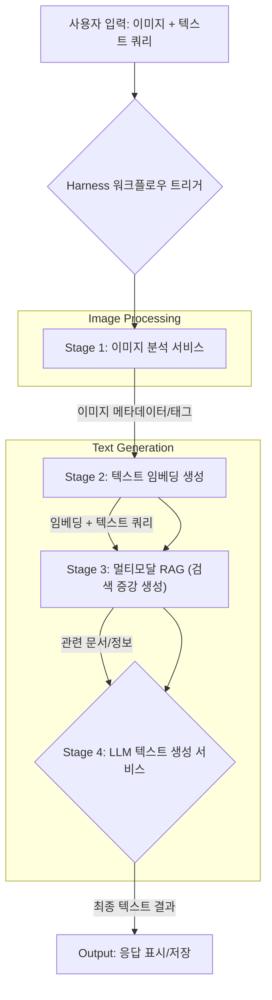

멀티모달 AI 시스템은 텍스트, 이미지, 음성, 비디오 등 다양한 형태의 데이터를 동시에 이해하고 생성하는 능력을 통해 새로운 가능성을 열고 있습니다. 그러나 이러한 복합적인 AI 시스템을 효율적으로 구축하고 배포하며 관리하는 것은 데이터의 이질성, 복잡한 워크플로우 종속성, 실시간 처리 요구사항 등으로 인해 상당한 도전 과제를 안고 있습니다. Harness는 이러한 멀티모달 AI 워크플로우의 통합 및 오케스트레이션을 위한 강력한 플랫폼을 제공하며, 시스템의 안정성, 확장성, 효율성을 극대화하는 데 기여합니다. 특히 2026년 현재, 에이전트 기반 AI와 결합된 멀티모달 시스템은 더욱 복잡해지고 있으며, 이를 위한 견고한 오케스트레이션 전략은 필수적입니다.

## 핵심 통합 디자인 패턴

멀티모달 AI 워크플로우를 Harness에 통합하기 위한 몇 가지 핵심 디자인 패턴은 다음과 같습니다.

### 1. 센서-액추에이터(Sensor-Actuator) 패턴

이 패턴은 실시간 멀티모달 입력(센서)을 받아 처리하고, 그 결과를 다시 시스템이나 사용자에게 전달(액추에이터)하는 구조에 적합합니다. 예를 들어, 사용자의 음성 명령(오디오 센서)을 텍스트로 변환하고(STT AI), 이 텍스트와 현재 화면의 이미지(시각 센서)를 종합하여 상황을 판단한 후(멀티모달 LLM), 적절한 UI 액션(액추에이터)을 실행하는 워크플로우에 적용할 수 있습니다. Harness는 각 센서 및 액추에이터 모듈을 별도의 파이프라인 스텝(Pipeline Step) 또는 서비스(Service)로 관리하여 모듈화된 개발 및 배포를 지원합니다.

### 2. 이벤트 기반 오케스트레이션(Event-Driven Orchestration)

멀티모달 워크플로우의 각 단계는 종종 비동기적으로 동작하며 서로 다른 처리 시간과 자원 요구사항을 가집니다. 이벤트 기반 아키텍처는 이러한 구성 요소 간의 느슨한 결합(Loose Coupling)을 가능하게 하여 시스템의 유연성과 확장성을 높입니다. Harness는 이벤트 브로커(예: Kafka, AWS SQS)와의 연동을 통해 한 AI 모듈의 처리 결과 이벤트를 다음 모듈의 트리거로 활용할 수 있습니다. 예를 들어, 이미지 분석 AI가 객체 감지 결과를 게시하면, 이 이벤트를 구독하는 텍스트 생성 AI가 관련 텍스트 설명을 만들어내는 식입니다.

### 3. 상태 저장 워크플로우 관리(Stateful Workflow Management)

복잡한 멀티모달 상호작용은 여러 단계에 걸쳐 상태(State)를 유지하고 관리해야 하는 경우가 많습니다. Harness 파이프라인은 각 스텝 간의 변수 전달, 아티팩트 저장, 그리고 실패 시 재시도 로직 등을 내장하여 복잡한 상태를 자동으로 관리합니다. 이는 특히 인간의 개입(Human-in-the-Loop)이 필요한 검토 또는 승인 단계가 포함된 워크플로우에서 빛을 발합니다. Harness는 장기 실행(Long-running) 워크플로우의 진행 상황을 시각적으로 추적하고, 필요한 경우 수동으로 개입할 수 있는 기능을 제공합니다.

### 4. 적응형 라우팅(Adaptive Routing)

멀티모달 입력의 특성(예: 이미지의 품질, 텍스트의 길이, 음성의 언어)에 따라 최적의 AI 모델이나 툴을 동적으로 선택해야 할 때 적응형 라우팅 패턴을 사용합니다. Harness는 조건부 스텝(Conditional Steps) 또는 스텝 그룹(Step Groups)을 통해 입력 데이터의 메타데이터나 이전 스텝의 AI 모델 출력 결과에 기반하여 다음 실행 경로를 결정할 수 있습니다. 이를 통해 비용 효율성을 높이고 성능을 최적화할 수 있습니다.

## Harness를 활용한 멀티모달 워크플로우 예시

다음은 Harness 파이프라인을 사용하여 이미지 분석 및 텍스트 생성을 통합하는 간단한 YAML 예시입니다. 이 예시는 이미지에서 정보를 추출하고(ImageAnalysisStage), 그 정보를 기반으로 설명을 생성하는(TextGenerationStage) 두 단계의 멀티모달 워크플로우를 보여줍니다. 각 단계는 컨테이너화된 AI 모델을 실행합니다.

```yaml
pipeline:
  name: Multimodal AI Workflow for Content Generation
  identifier: multimodal_content_gen
  projectIdentifier: my_ai_project
  orgIdentifier: my_org
  tags: [multimodal, ai, workflow, harness]

  stages:
    - stage:
        name: ImageAnalysisStage
        identifier: image_analysis
        type: Custom
        spec:
          # 'service' 및 'environment'는 Harness의 서비스/환경 관리 기능을 활용할 수 있습니다.
          execution:
            steps:
              - step:
                  name: RunImageAnalysis
                  identifier: run_image_analysis
                  type: Run
                  spec:
                    connectorRef: my_docker_connector # Docker 허브 연결 설정
                    image: my-image-analyzer:latest   # 이미지 분석 AI 컨테이너
                    command: [ "python", "analyze_image.py" ]
                    args: [ "--input_image_path", "<+input.image_url>", "--output_json_path", "image_analysis_result.json" ]
                    outputVariables:
                      - name: image_tags
                        value: "jq -r '.tags' image_analysis_result.json" # JSON 파일에서 태그 추출
                      - name: image_description
                        value: "jq -r '.description' image_analysis_result.json" # JSON 파일에서 설명 추출
                    onDelegate: true # Harness Delegate에서 실행
                    # 'artifact-storage'를 사용하여 'image_analysis_result.json'을 저장하고 후속 스텝에서 접근 가능하도록 설정할 수 있습니다.

    - stage:
        name: TextGenerationStage
        identifier: text_generation
        type: Custom
        spec:
          execution:
            steps:
              - step:
                  name: GenerateContent
                  identifier: generate_content
                  type: Run
                  spec:
                    connectorRef: my_llm_connector # LLM API 연결 설정
                    image: my-llm-agent:latest      # 텍스트 생성 AI 컨테이너
                    command: [ "python", "generate_text.py" ]
                    args: [
                      "--prompt", "Create a blog post section based on these tags and description:",
                      "--image_tags", "<+pipeline.stages.image_analysis.image_tags>", # 이전 스텝의 출력 변수 참조
                      "--image_description", "<+pipeline.stages.image_analysis.image_description>"
                    ]
                    outputVariables:
                      - name: generated_text
                        value: "cat generated_text.md" # 생성된 텍스트 출력
                    onDelegate: true
```

### 멀티모달 AI 워크플로우 시각화



## 트레이드오프

멀티모달 AI 워크플로우에 Harness를 통합할 때는 다음과 같은 트레이드오프를 고려해야 합니다.

*   **복잡성 vs. 유연성**: Harness는 고도로 유연한 파이프라인 정의를 가능하게 하지만, 초기 설정 및 복잡한 워크플로우 설계에 추가적인 학습 곡선과 구성 오버헤드를 발생시킬 수 있습니다. 이는 단순한 단일 모달 작업에는 과할 수 있지만, 다양한 모달리티와 AI 모델이 상호작용하는 복잡한 시스템에서는 장기적으로 유지보수성과 확장성을 높이는 데 유리합니다.
*   **비용 vs. 성능 최적화**: Harness를 통한 오케스트레이션은 각 AI 모듈의 자원 할당 및 실행 관리를 최적화하여 비용 효율성을 높일 수 있습니다. 그러나 잘못된 파이프라인 설계나 과도한 병렬 처리(Parallel Processing)는 예상치 못한 클라우드 비용을 발생시킬 수 있습니다. 특히 GPU 리소스가 많이 필요한 이미지/비디오 처리 단계에서는 세밀한 자원 관리가 필요합니다.
*   **통합 노력 vs. 표준화**: Harness는 다양한 클라우드 서비스, CI/CD 툴, 아티팩트 리포지토리 등과의 광범위한 통합 기능을 제공합니다. 이는 통합 초기에는 노력이 필요하지만, 일단 구축되면 워크플로우를 표준화하고 재사용성을 높이는 데 큰 이점을 제공합니다. 특히 엔터프라이즈 환경에서 여러 팀이 공통의 AI 인프라를 사용하는 경우 이점이 큽니다.
*   **실시간 처리 vs. 배치 처리**: 멀티모달 AI 워크플로우는 실시간 응답이 필요한 애플리케이션(예: 대화형 AI)과 배치성 처리가 가능한 애플리케이션(예: 대규모 데이터 분석)으로 나뉩니다. Harness는 두 가지 시나리오 모두를 지원하지만, 실시간 워크플로우의 경우 지연 시간(Latency)을 최소화하기 위한 파이프라인 최적화(예: 경량 스텝, 효율적인 리소스 프로비저닝)에 더 많은 설계 노력이 필요합니다.

## 실전 체크리스트

멀티모달 AI 워크플로우를 Harness에 성공적으로 통합하기 위한 체크리스트입니다.

*   [ ] **데이터 입출력 표준화**: 각 모달리티별 데이터(예: 이미지 포맷, 텍스트 인코딩, 음성 샘플링 레이트)의 입출력 형식을 표준화하고, Harness 파이프라인 내에서 데이터 변환 스텝을 명확히 정의했는가?
*   [ ] **종속성 관리**: 각 AI 모듈 및 파이프라인 스텝 간의 명확한 종속성을 식별하고, Harness의 스텝 순서, 조건부 실행, 그리고 병렬 실행 기능을 활용하여 워크플로우를 최적화했는가?
*   [ ] **오류 처리 및 재시도**: 개별 AI 모듈 또는 통합 스텝에서 발생할 수 있는 오류 시나리오를 예측하고, Harness의 재시도(Retry) 전략, 타임아웃(Timeout) 설정, 알림(Notification) 기능을 통해 견고한 오류 처리 메커니즘을 구현했는가?
*   [ ] **확장성 설계**: 예상되는 최대 트래픽 및 데이터 볼륨에 대비하여 Harness Delegate의 리소스(CPU, 메모리, GPU)와 AI 서비스의 확장성(Auto-scaling)을 계획하고 테스트했는가?
*   [ ] **모니터링 및 로깅**: Harness 파이프라인 실행 상태, AI 모델의 성능 지표, 그리고 각 스텝의 로그를 중앙 집중식으로 수집하고 모니터링하기 위한 대시보드 및 알림 시스템을 구축했는가?
*   [ ] **보안 및 접근 제어**: 멀티모달 데이터와 AI 모델에 대한 접근 권한(Access Control)을 최소 권한 원칙(Principle of Least Privilege)에 따라 설정하고, Harness의 시크릿 관리(Secret Management) 기능을 활용하여 민감 정보를 안전하게 보호하고 있는가?
*   [ ] **비용 최적화 전략**: AI 모델 호출 비용, 컴퓨팅 리소스 사용량 등을 모니터링하고, Harness의 조건부 실행, 캐싱(Caching) 스텝 등을 활용하여 불필요한 비용 발생을 방지하는 전략을 수립했는가?