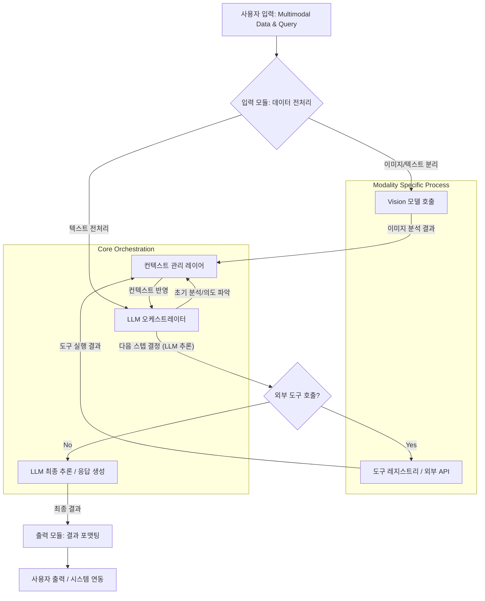

복잡한 AI 시스템 구축은 단순한 LLM 호출을 넘어 다양한 모델과 도구의 유기적인 연동을 요구한다. 특히 멀티모달 데이터를 처리하고 복합적인 추론 과정을 수행하는 워크플로우에서는 체계적인 통합 프레임워크, 즉 Harness의 설계가 필수적이다. 멀티모달 Harness 디자인 패턴은 LLM, Vision 모델, Audio 모델 등 다양한 인공지능 컴포넌트와 외부 도구를 통합하여 복잡한 비즈니스 로직을 안정적이고 효율적으로 처리하는 방법론을 제공한다. 이 패턴은 2026년 AI 트렌드에서 강조되는 복합적인 지능형 시스템 구축의 핵심 동력으로 작용한다.

## 멀티모달 Harness의 필요성

단일 LLM만으로는 해결하기 어려운 문제들이 증가함에 따라, 여러 전문화된 AI 모델과 외부 시스템의 협업이 중요해지고 있다. 예를 들어, 사용자의 음성 명령과 이미지를 해석하여 데이터베이스를 검색하고, 그 결과를 요약하여 시각화된 보고서를 생성하는 워크플로우를 상상해보자. 이 과정은 음성 인식, 이미지 분석, 자연어 처리, 데이터 검색, 시각화 생성 등 다양한 AI 모듈과 도구가 순차적 또는 병렬적으로 상호작용해야 한다. 멀티모달 Harness는 이러한 복잡한 상호작용을 오케스트레이션하고, 각 컴포넌트 간의 데이터 흐름을 관리하며, 시스템 전체의 견고성과 확장성을 보장하는 구조를 제공한다.

### 핵심 구성 요소

1.  **입력 모듈 (Input Adapters)**: 텍스트, 이미지, 음성, 비디오 등 다양한 형태의 입력 데이터를 표준화된 내부 표현으로 변환한다. 각 모달리티별로 전처리 로직이 포함될 수 있다.
2.  **워커 오케스트레이터 (Worker Orchestrator)**: 워크플로우의 전체 흐름을 관리하며, 현재 상태와 입력에 따라 다음으로 호출할 AI 모델 또는 도구를 동적으로 결정한다. 이는 LLM의 추론 능력이나 사전 정의된 규칙 기반으로 작동할 수 있다.
3.  **모델 및 도구 레지스트리 (Model & Tool Registry)**: 시스템에 통합된 모든 LLM, 전문 모델 (e.g., OCR, STT, CV), 외부 API, 데이터베이스 커넥터 등을 등록하고 관리한다. 각 컴포넌트의 기능, 입출력 스키마, 호출 방법 등이 정의된다.
4.  **컨텍스트 관리 레이어 (Context Management Layer)**: 워크플로우 전반에 걸쳐 상태, 중간 결과, 과거 상호작용 이력 등을 유지하고 관리한다. 이는 RAG (Retrieval Augmented Generation) 패턴과 결합하여 외부 지식 주입에도 활용될 수 있다.
5.  **출력 모듈 (Output Adapters)**: 워크플로우의 최종 결과를 사용자나 외부 시스템이 이해할 수 있는 형태로 변환하여 제공한다. 시각화, 요약, 알림 등이 이에 해당한다.

## 멀티모달 Harness의 작동 방식

멀티모달 Harness는 Agentic Workflow와 유사하게 작동하지만, 더욱 강력한 모델 간 통합 및 데이터 흐름 제어에 중점을 둔다. 초기 입력이 들어오면, 입력 모듈이 데이터를 정규화하고, 워커 오케스트레이터는 이 데이터를 분석하여 어떤 AI 모델(LLM 또는 다른 전문 모델)이 가장 적합한지 판단한다. 예를 들어, "이 이미지에서 텍스트를 추출하고, 그 내용을 요약하여 보고서 초안을 작성해줘"라는 요청이 들어오면, Harness는 다음과 같이 작동할 수 있다.

1.  **입력 모듈**: 이미지와 텍스트 요청을 분리하여 처리한다.
2.  **오케스트레이터 결정**: 이미지에서 텍스트를 추출하기 위해 OCR 모델을 호출하도록 결정한다.
3.  **OCR 모델 호출**: 모델 레지스트리에서 OCR 모델을 찾아 이미지를 전달하고 텍스트를 추출한다.
4.  **컨텍스트 업데이트**: 추출된 텍스트를 컨텍스트 관리 레이어에 저장한다.
5.  **오케스트레이터 재결정**: 추출된 텍스트와 원래 요청을 기반으로 LLM을 호출하여 요약 및 보고서 초안 작성을 지시한다.
6.  **LLM 호출**: 컨텍스트의 텍스트를 포함하여 LLM에 프롬프트를 전달하고 초안을 받는다.
7.  **출력 모듈**: 생성된 보고서 초안을 사용자에게 전달한다.

### 코드 예제: Multimodal Harness 기본 구조 (Python)

```python
from typing import Any, Dict, List, Optional
import json

class Tool:
    def __init__(self, name: str, description: str, func):
        self.name = name
        self.description = description
        self.func = func

    def execute(self, **kwargs) -> Any:
        return self.func(**kwargs)

class MultimodalHarness:
    def __init__(self, llm_client, vision_client, tools: List[Tool]):
        self.llm = llm_client
        self.vision = vision_client
        self.tools = {tool.name: tool for tool in tools}
        self.context: Dict[str, Any] = {} # 워크플로우 상태 관리

    def _call_llm(self, prompt: str, **kwargs) -> str:
        # 실제 LLM API 호출 로직 (예: Claude, GPT)
        print(f"Calling LLM with: {prompt[:100]}...")
        # 이 부분은 실제 LLM 클라이언트의 호출 메서드로 대체됩니다.
        # return self.llm.generate(prompt=prompt, **kwargs)
        return f"LLM_RESPONSE: {prompt} processed."

    def _call_vision_model(self, image_data: bytes, instruction: str) -> str:
        # 실제 Vision Model API 호출 로직 (예: Gemini Vision, LLaVA)
        print(f"Calling Vision Model with instruction: {instruction}")
        # return self.vision.analyze(image_data=image_data, instruction=instruction)
        return "VISION_ANALYSIS: Extracted text and identified objects."

    def _dispatch_tool(self, tool_name: str, **kwargs) -> Any:
        if tool_name in self.tools:
            print(f"Dispatching tool: {tool_name} with args: {kwargs}")
            return self.tools[tool_name].execute(**kwargs)
        raise ValueError(f"Tool {tool_name} not found.")

    def run_workflow(self, initial_input: Dict[str, Any]) -> Dict[str, Any]:
        self.context.clear()
        self.context.update(initial_input)
        
        # 1. 초기 입력 분석 및 모달리티 감지
        if "image_data" in initial_input and "text_query" in initial_input:
            image_analysis_instruction = "Describe the image and extract any text."
            vision_result = self._call_vision_model(
                image_data=initial_input["image_data"],
                instruction=image_analysis_instruction
            )
            self.context["vision_analysis"] = vision_result
            
            # 2. LLM을 사용하여 전체 워크플로우 조정
            orchestration_prompt = (
                f"User query: {initial_input['text_query']}\n"
                f"Image analysis: {vision_result}\n"
                "Based on this, outline the next steps or generate a response."
                " If a specific tool is needed, indicate it using 'CALL_TOOL:<tool_name>:<args_json>' format."
            )
            llm_decision = self._call_llm(orchestration_prompt, max_tokens=200)
            self.context["llm_decision_raw"] = llm_decision

            # 3. LLM 결정 파싱 및 실행
            if llm_decision.startswith("CALL_TOOL:"):
                parts = llm_decision.split(':', 2) # Use 2 to split only into 3 parts
                if len(parts) == 3:
                    tool_name = parts[1]
                    try:
                        tool_args = json.loads(parts[2])
                        tool_output = self._dispatch_tool(tool_name, **tool_args)
                        self.context["tool_output"] = tool_output
                        # 도구 실행 후, 결과를 다시 LLM에 전달하여 최종 응답 생성
                        final_prompt = (
                            f"Previous LLM decision: {llm_decision}\n"
                            f"Tool '{tool_name}' output: {tool_output}\n"
                            "Generate the final response based on all context."
                        )
                        final_response = self._call_llm(final_prompt)
                        self.context["final_response"] = final_response
                    except json.JSONDecodeError:
                        self.context["error"] = "Invalid JSON for tool arguments."
                else:
                    self.context["error"] = "Invalid CALL_TOOL format."
            else:
                self.context["final_response"] = llm_decision # LLM이 직접 최종 응답 생성

        elif "text_query" in initial_input:
            # 텍스트 전용 워크플로우 처리 (예시)
            text_response = self._call_llm(initial_input["text_query"])
            self.context["final_response"] = text_response
        else:
            self.context["error"] = "No supported input modality detected."
        
        return self.context

# --- 실제 사용 예시 ---
# Mock LLM and Vision clients
class MockLLM:
    def generate(self, prompt: str, **kwargs):
        if "outline the next steps" in prompt:
            return "CALL_TOOL:search_database:{\"query\": \"sales data 2023\"}"
        if "final response" in prompt:
            return "Here is your summary based on the search results."
        return f"Mock LLM processed: {prompt}"

class MockVision:
    def analyze(self, image_data: bytes, instruction: str):
        return "Detected a graph showing increasing sales."

def search_db(query: str):
    print(f"Searching database for: {query}")
    return {"result": f"Data for '{query}' found: [100, 120, 150]"}

# 도구 정의
search_tool = Tool("search_database", "Searches the internal database for information.", search_db)

# Harness 초기화
harness = MultimodalHarness(
    llm_client=MockLLM(),
    vision_client=MockVision(),
    tools=[search_tool]
)

# 워크플로우 실행
# 이미지 데이터는 가상의 바이트 배열로 표현
dummy_image_data = b"image_bytes_here" 

# Scenario 1: Multimodal input
print("--- Running Multimodal Scenario ---")
multimodal_input = {
    "image_data": dummy_image_data,
    "text_query": "Explain this chart and find related sales data from 2023."
}
result_multimodal = harness.run_workflow(multimodal_input)
print(f"Multimodal Result: {result_multimodal.get('final_response', result_multimodal.get('error'))}")
print("-" * 30)

# Scenario 2: Text-only input
print("--- Running Text-only Scenario ---")
text_input = {
    "text_query": "Summarize the latest AI research trends."
}
result_text = harness.run_workflow(text_input)
print(f"Text-only Result: {result_text.get('final_response', result_text.get('error'))}")
print("-" * 30)

```

### Mermaid 다이어그램: 멀티모달 Harness 워크플로우



## 트레이드오프

멀티모달 Harness 디자인 패턴은 강력한 기능을 제공하지만, 몇 가지 트레이드오프를 수반한다.

*   **복잡성 vs. 기능성**:
    *   **언제 좋은가**: 여러 모달리티와 도구를 유기적으로 통합하여 복잡하고 고도화된 AI 애플리케이션을 구축할 때 강력한 기능성과 유연성을 제공한다. 다양한 전문 모델의 강점을 최대한 활용할 수 있다.
    *   **언제 나쁜가**: 단순한 텍스트 기반 LLM 애플리케이션이나 제한된 기능만을 필요로 하는 경우, 오버헤드가 크고 개발 및 유지보수 비용이 과도하게 발생할 수 있다. 초기 설계와 구현이 복잡하다.

*   **성능 vs. 범용성**:
    *   **언제 좋은가**: 다양한 유형의 입력과 비즈니스 로직에 대응할 수 있는 범용적인 아키텍처를 구축할 때 유리하다. 미래의 새로운 모달리티나 모델 추가에 유연하게 대응할 수 있다.
    *   **언제 나쁜가**: 실시간 처리 속도나 매우 낮은 지연 시간이 핵심 요구사항인 경우, 여러 모델과 컴포넌트 간의 통신 오버헤드 때문에 성능 병목 현상이 발생할 수 있다. 각 스텝의 지연 시간 합산이 길어질 수 있다.

*   **자원 활용 효율성 vs. 모듈성**:
    *   **언제 좋은가**: 각 모듈(LLM, Vision 모델, Tool 등)을 독립적으로 개발하고 관리하여 재사용성과 확장성을 높일 수 있다. 특정 모듈의 업데이트나 교체가 전체 시스템에 미치는 영향을 최소화한다.
    *   **언제 나쁜가**: 각 모듈이 별도의 환경에서 실행되거나 많은 API 호출을 필요로 할 경우, 컴퓨팅 자원 및 네트워크 트래픽 사용량이 증가하여 비용 효율성이 저하될 수 있다.

*   **초기 개발 속도 vs. 견고성**:
    *   **언제 좋은가**: 장기적으로 안정적이고 오류에 강하며, 예측 불가능한 상황에서도 복구 가능한 시스템을 구축하고자 할 때, 초기 설계 단계에서 발생할 수 있는 잠재적 문제를 체계적으로 해결할 수 있다.
    *   **언제 나쁜가**: 빠른 프로토타이핑이나 MVP(Minimum Viable Product) 개발이 필요한 경우, Harness 패턴의 엄격한 구조와 설계 요구사항이 초기 개발 속도를 늦출 수 있다.

## 실전 체크리스트

멀티모달 Harness 패턴을 프로젝트에 적용할 때 다음 항목들을 검토하여 시스템의 안정성과 효율성을 확보해야 한다.

*   [ ] **입력 데이터 표준화**: 다양한 모달리티(텍스트, 이미지, 음성 등)의 입력 데이터를 공통 형식으로 변환하는 명확한 스키마 및 전처리 파이프라인이 정의되었는가?
*   [ ] **동적 라우팅 로직 검증**: 워커 오케스트레이터가 현재 컨텍스트와 목표에 따라 가장 적절한 모델(LLM, Vision 모델, 도구)을 동적으로 선택하는 로직이 정확하게 작동하는가?
*   [ ] **오류 처리 및 복구 전략**: 각 AI 컴포넌트 호출 실패 시 재시도, 대체 경로, 사용자 알림 등 견고한 오류 처리 및 복구 메커니즘이 구현되었는가?
*   [ ] **성능 벤치마킹 및 최적화**: 멀티모달 워크플로우의 종단 간(end-to-end) 지연 시간과 처리량에 대한 벤치마킹이 수행되었으며, 병목 현상에 대한 최적화 방안이 마련되었는가?
*   [ ] **컨텍스트 일관성 관리**: 워크플로우 진행 중 생성되는 모든 중간 결과 및 상태가 컨텍스트 관리 레이어에서 일관되고 안전하게 유지 및 전달되는가?
*   [ ] **보안 및 접근 제어**: 외부 도구 및 API 호출 시 인증, 권한 부여, 데이터 암호화 등 보안 고려사항이 충분히 반영되었는가?
*   [ ] **모니터링 및 로깅**: 각 워크플로우 스텝, 모델 호출, 도구 실행에 대한 상세한 모니터링 및 로깅 시스템이 구축되어 문제 진단 및 성능 분석이 용이한가?