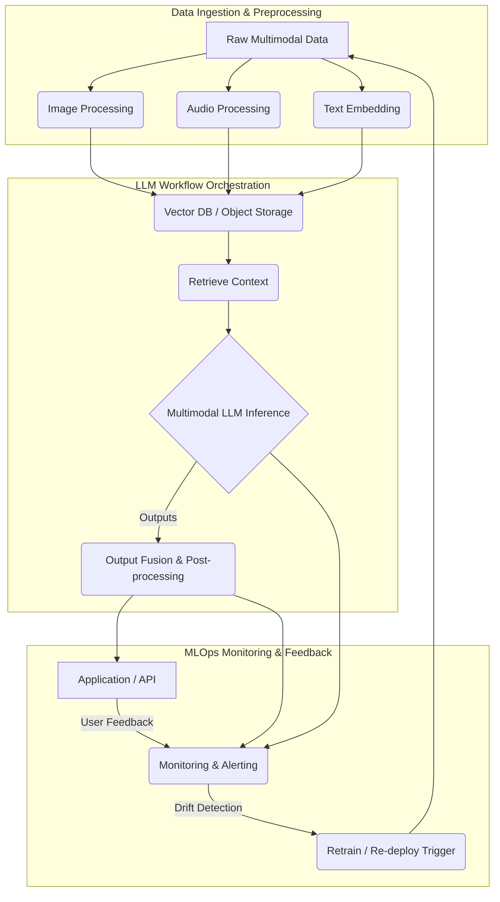

2026년, 멀티모달 LLM (Multimodal Large Language Models)은 텍스트, 이미지, 오디오 등 다양한 모달리티를 통합하는 AI 혁신의 핵심입니다. 하지만 이러한 복잡한 시스템의 배포와 관리는 큰 도전 과제를 안고 있습니다. 효율적이고 확장 가능하며 신뢰할 수 있는 MLOps 워크플로우를 위해서는 표준화된 통합 패턴이 필수적입니다. Harness는 CI/CD, GitOps, 실시간 모니터링을 통해 멀티모달 LLM 시스템을 원활하게 오케스트레이션하는 강력한 플랫폼을 제공합니다.

## 멀티모달 LLM 워크플로우의 복잡성
멀티모달 LLM의 개발 및 배포는 다양한 데이터 유형, 여러 전문 모델, 그리고 복잡한 오케스트레이션 로직을 관리해야 합니다. 일반적인 워크플로우는 데이터 수집, 모달리티별 전처리 (임베딩), 여러 LLM 구성 요소의 추론 (순차적 또는 병렬), 결과 융합 및 후처리, 그리고 최종 배포 및 모니터링 단계를 포함합니다. 통합된 오케스트레이션 계층 없이는 이러한 단계를 관리하는 것이 파편화되고 오류가 발생하기 쉬워 운영 비효율을 초래합니다.

## Harness를 통한 멀티모달 LLM 오케스트레이션
Harness는 MLOps에 대한 선언적이고 GitOps 기반 접근 방식을 제공하여 이러한 복잡성을 해결합니다. 코드형 파이프라인(pipeline-as-code) 기능을 통해 개발부터 프로덕션까지 모든 환경에서 멀티모달 LLM 워크플로우를 정의, 관리, 자동화할 수 있습니다. 주요 이점은 다음과 같습니다:
*   **통합 파이프라인 관리**: 다양한 전처리, 모델 훈련 및 추론 단계를 단일 파이프라인으로 통합하여 가시성을 높입니다.
*   **환경 독립성**: 클라우드, 온프레미스, 엣지 등 모든 인프라에 멀티모달 LLM을 일관되게 배포합니다.
*   **고급 배포 전략**: 카나리, 블루/그린 배포를 자동 롤백과 함께 구현하여 새로운 모델 버전의 안전한 배포를 보장합니다.
*   **통합 모니터링 및 거버넌스**: 성능 추적, 드리프트 감지, 규정 준수를 위한 내장 대시보드 및 경고를 활용합니다.

## 핵심 통합 패턴 (Core Integration Patterns)

### 1. 데이터 수집 및 전처리 파이프라인
Harness는 멀티모달 입력 준비를 위한 전용 데이터 파이프라인을 오케스트레이션할 수 있습니다. 예를 들어, 이미지 및 비디오 데이터는 비전 특화 파이프라인을 통해 크기 조정, 특징 추출 및 임베딩 생성을 거치며, 오디오 데이터는 전사(transcription) 및 음향 특징 추출 과정을 거칩니다. 이러한 출력은 벡터 데이터베이스나 오브젝트 스토리지에 저장되어 LLM에서 사용됩니다.

```yaml
pipeline:
  name: Multimodal Data Preprocessing
  identifier: multimodal_data_preprocess
  projectIdentifier: harness_mlops
  orgIdentifier: default
  tags: [llm, multimodal, data]
  stages:
    - stage:
        name: Image Preprocessing
        identifier: image_preprocess
        type: Custom
        spec:
          skipCondition: <+input.skipImagePreprocessing>
          container:
            image: preprocess-images:1.0
            command: ["python"]
            args: ["preprocess_images.py", "--inputDir=$(INPUT_S3_BUCKET)", "--outputDir=$(OUTPUT_S3_BUCKET)"]
            envVariables:
              INPUT_S3_BUCKET: image-raw-data
              OUTPUT_S3_BUCKET: image-processed-embeddings
    - stage:
        name: Audio Transcription & Embedding
        identifier: audio_transcription
        type: Custom
        spec:
          container:
            image: speech-to-text-embed:2.0
            command: ["python"]
            args: ["process_audio.py", "--inputPath=$(INPUT_PATH)", "--outputPath=$(OUTPUT_PATH)"]
            envVariables:
              INPUT_PATH: audio-raw-data
              OUTPUT_PATH: audio-processed-embeddings
```

### 2. 모델 오케스트레이션 및 추론
데이터가 준비되면, Harness는 멀티모달 LLM의 호출을 오케스트레이션합니다. 이는 순차적 호출 (예: 이미지 캡셔닝 후 텍스트 생성) 또는 병렬 실행 경로를 포함할 수 있으며, 이들의 출력은 나중에 융합됩니다. Harness는 GPU 자원 활용 및 인스턴스 간 로드 밸런싱을 통해 모델이 효율적으로 서비스되도록 보장합니다.

### 3. GitOps 기반 배포 및 모니터링
Harness는 멀티모달 LLM에 GitOps 원칙을 적용합니다. 모델 아티팩트, 파이프라인 구성, 환경 정의가 모두 Git에 버전 관리됩니다. 모든 변경 사항은 자동화된 파이프라인을 트리거하여 추적 가능성 및 감사 기능을 보장합니다. 실시간 모니터링 (예: Prometheus, Grafana 또는 Harness의 자체 CD 기능)은 복잡한 멀티모달 시나리오에서 모델 성능, 지연 시간, 자원 활용도를 추적하여 모델 드리프트나 성능 저하를 감지합니다.



### 2026 트렌드 (2026 Trends)
*   **실시간 처리 (Real-time Processing)**: 저지연 멀티모달 추론 파이프라인 구축. Harness는 이벤트 기반 트리거와 고성능 컴퓨팅 통합으로 지원.
*   **엣지 배포 (Edge Deployment)**: 경량화된 멀티모달 LLM을 엣지에서 배포하여 지연 시간 감소, 개인 정보 보호 강화. Harness는 엣지 최적화 배포 전략 제공.
*   **강화된 MLOps 자동화 (Enhanced MLOps Automation)**: 모델 학습부터 배포, 모니터링, 재학습까지 전 과정 완전 자동화. 멀티모달 데이터 복잡성 관리 및 모델 상호작용 검증 자동화 테스트 필수.
*   **합성 데이터 및 증강 (Synthetic Data & Augmentation)**: 희소 데이터 보완을 위한 합성 데이터 생성 및 증강 기술 보편화.

## 트레이드오프 (Trade-offs)

### 1. 표준화 vs. 유연성 (Standardization vs. Flexibility)
*   **언제 좋음**: 대규모 팀, 복잡한 시스템, 규정 준수 환경에서 일관된 프로세스 보장. 오류 감소.
*   **언제 나쁨**: 초기 실험적 프로젝트나 빠르게 변화하는 R&D 환경에서 민첩성 저해, 오버헤드 발생.

### 2. 복잡성 추상화 vs. 심층 제어 (Complexity Abstraction vs. Deep Control)
*   **언제 좋음**: 복잡한 인프라 및 MLOps 세부 사항 추상화로 모델 개발 집중, 생산성 향상.
*   **언제 나쁨**: 특정 고급 최적화, 커스텀 하드웨어 통합, 낮은 레벨 튜닝 시 제약, 디버깅 난이도 증가.

### 3. 통합 모니터링 vs. 오버헤드 (Integrated Monitoring vs. Overhead)
*   **언제 좋음**: 멀티모달 LLM 성능, 비용, 안정성 한눈에 파악, 신속 대응. 시스템 가시성 향상.
*   **언제 나쁨**: 모니터링 및 로깅 시스템 자체의 컴퓨팅/스토리지 오버헤드, 대규모 분산 시스템에서 비용 증가.

### 4. 비용 최적화 vs. 초기 투자 (Cost Optimization vs. Initial Investment)
*   **언제 좋음**: Harness CI/CD, CD, FF 기능을 통해 자원 활용 최적화, 장기적 운영 비용 절감.
*   **언제 나쁨**: 엔터프라이즈 솔루션 도입 및 초기 설정에 상당한 시간/비용 투자 필요. 소규모 프로젝트에 부담.

## 실전 체크리스트 (Practical Checklist)

멀티모달 LLM 워크플로우에 Harness를 통합할 때 다음 항목들을 검증해야 합니다.

- [ ] **데이터 전처리 파이프라인 유효성 검사**: 각 모달리티의 전처리 파이프라인이 출력 형식과 품질 표준을 준수하는가?
- [ ] **멀티모달 모델 버전 관리 및 계보 추적**: 모든 LLM 구성 요소의 버전이 관리되고, 추론 결과의 모델 계보가 추적 가능한가?
- [ ] **배포 전략 최적화 및 자동 롤백**: 카나리/블루그린 배포가 구현되었고, 문제 발생 시 자동 롤백이 가능한가?
- [ ] **실시간 모니터링 및 경고 구성**: 모델 지연 시간, 처리량, 자원 사용량, 출력 품질 지표에 대한 모니터링 및 경고 시스템이 설정되었는가?
- [ ] **보안 및 접근 제어 적용**: 멀티모달 데이터, 모델 아티팩트 및 파이프라인 접근에 최소 권한 원칙이 적용되고 감사 가능한가?
- [ ] **자동화된 재학습 및 모델 드리프트 감지**: 데이터/모델 드리프트 감지 시 자동 재학습 파이프라인이 트리거되고 새 모델이 배포되는가?
- [ ] **비용 최적화 메커니즘 활성화**: GPU 사용량 최적화, 불필요 자원 종료 등 비용 관리 도구가 설정되어 TCO를 최소화하는가?