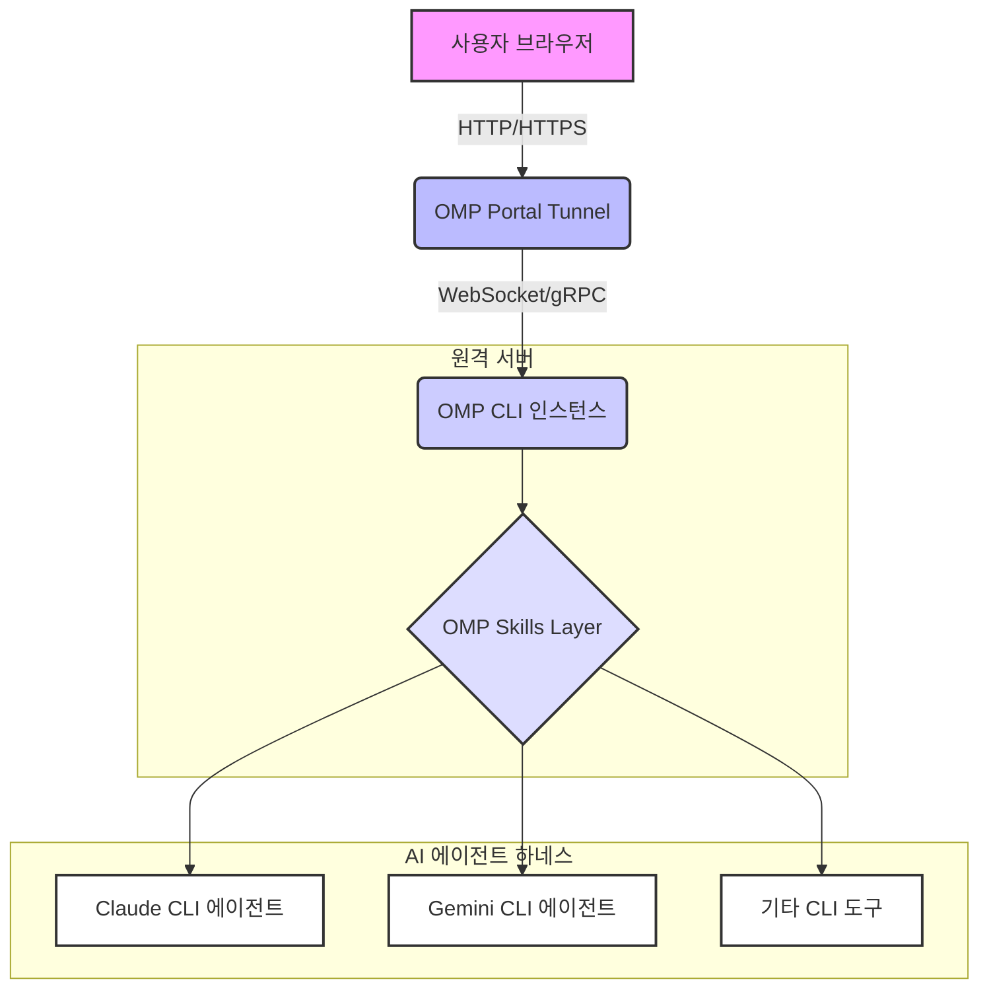

Oh My Portal(OMP)은 CLI(명령줄 인터페이스) 기반의 AI 에이전트를 웹 브라우저 환경에서 원격으로 제어하고 상호작용할 수 있게 해주는 혁신적인 도구입니다. 이 기술은 특히 Claude Code harness 및 다양한 AI 에이전트(Claude CLI, Gemini CLI 등)와 연동하여 AI 워커의 관제 및 에이전트 디스패치(Agent Dispatch) UX를 획기적으로 개선하는 데 중점을 둡니다. OMP는 브라우저를 통해 CLI 환경에 대한 안전하고 기능이 풍부한 접근을 제공하여, 에이전트 개발 및 운영 워크플로우를 단순화하고 효율성을 높입니다.

### Oh My Portal의 핵심 기능 및 아키텍처

OMP의 핵심은 CLI 에이전트의 기능을 "스킬(Skills)"이라는 모듈 형태로 추상화하고, 이를 웹 UI를 통해 호출할 수 있도록 하는 것입니다. `OMP Portal Tunnel`은 로컬 또는 원격 환경에서 실행되는 OMP 인스턴스에 대한 안전한 웹 기반 터널을 생성하여, 어디서든 브라우저를 통해 CLI 에이전트에 접근할 수 있는 URL을 제공합니다. 이는 특히 다음과 같은 시나리오에서 강력한 이점을 제공합니다.

*   **원격 워커 관제**: 분산된 AI 워커 또는 에이전트 인스턴스에 대한 중앙 집중식 웹 기반 모니터링 및 제어.
*   **에이전트 디스패치 UX 개선**: 복잡한 CLI 명령을 추상화하여, 직관적인 웹 인터페이스를 통해 에이전트에게 작업을 할당하고 결과를 확인.
*   **협업 환경**: 여러 개발자나 운영자가 동일한 에이전트 인스턴스에 안전하게 접근하고 작업 상태를 공유.

OMP는 Claude code Codex CLI, Gemini CLI, OpenCode 등 다양한 CLI 에이전트를 지원하며, 각 에이전트의 고유한 기능을 웹 UI 컴포넌트 또는 REST API 엔드포인트로 노출할 수 있습니다.

### AI 에이전트 하네스와의 연동 전략

Oh My Portal은 기존 AI 에이전트 하네스(harness)와 통합될 때 진정한 가치를 발휘합니다. 예를 들어, Claude Code 하네스를 사용하는 경우, OMP는 다음과 같은 방식으로 연동될 수 있습니다.

1.  **스킬 모듈화**: Claude CLI 또는 Gemini CLI의 특정 기능(예: 코드 생성, 디버깅, 문서화)을 OMP 스킬로 정의합니다.
2.  **Portal Tunnel 구성**: OMP Portal Tunnel을 통해 에이전트가 실행되는 서버에 대한 보안 터널을 설정하고 웹 접근 URL을 생성합니다.
3.  **대시보드 구축**: OMP가 제공하는 웹 UI 프레임워크를 활용하여, 각 스킬을 호출하고 결과를 시각화하는 커스텀 대시보드를 구축합니다. 이를 통해 에이전트의 작업 진행 상황, 리소스 사용량, 생성된 코드 스니펫 등을 실시간으로 확인할 수 있습니다.



위 다이어그램은 사용자의 브라우저에서 OMP Portal Tunnel을 통해 OMP CLI 인스턴스에 접근하고, OMP CLI 인스턴스가 OMP Skills Layer를 통해 다양한 CLI 에이전트와 상호작용하는 흐름을 보여줍니다. Portal Tunnel은 원격 환경에서도 안전한 연결을 보장하며, Skills Layer는 에이전트의 기능을 웹 인터페이스로 추상화하는 역할을 합니다.

### Oh My Portal 설정 예제

다음은 간단한 Python 스킬을 OMP에 등록하고 Portal Tunnel을 통해 접근하는 예제입니다.

**1. `my_agent_skill.py` (Python OMP Skill)**

```python
# Save as my_agent_skill.py
import os
import subprocess

class MyAgentSkill:
    def __init__(self):
        pass

    def run_claude_cli_command(self, prompt: str) -> str:
        """
        Claude CLI를 사용하여 코드를 생성하거나 질문에 답변합니다.
        """
        command = ["claude", "chat", "--prompt", prompt]
        try:
            result = subprocess.run(
                command, capture_output=True, text=True, check=True
            )
            return result.stdout.strip()
        except subprocess.CalledProcessError as e:
            return f"Error executing Claude CLI: {e.stderr}"

    def get_gemini_info(self) -> str:
        """
        Gemini CLI의 상태 또는 정보를 가져옵니다.
        """
        command = ["gemini", "status"] # 예시 명령어
        try:
            result = subprocess.run(
                command, capture_output=True, text=True, check=True
            )
            return result.stdout.strip()
        except subprocess.CalledProcessError as e:
            return f"Error executing Gemini CLI: {e.stderr}"

if __name__ == "__main__":
    print("MyAgentSkill loaded.")
```

**2. OMP 실행 (터미널)**

OMP CLI를 사용하여 위 스킬을 로드하고 Portal Tunnel을 생성합니다.

```bash
oh-my-portal start --skills-dir ./ --portal-tunnel
# 명령 실행 후, 콘솔에 브라우저에서 접근할 수 있는 URL이 출력됩니다.
# 예: "Portal Tunnel is active. Access your OMP at: https://your-unique-id.tunnel.ohmyportal.dev"
```

위 명령을 실행하면 OMP는 `my_agent_skill.py`에 정의된 `run_claude_cli_command` 및 `get_gemini_info` 메서드를 웹 인터페이스를 통해 호출할 수 있는 API로 자동 변환합니다. 브라우저에서 제공된 URL에 접속하면, 해당 스킬들을 테스트하고 실행할 수 있는 웹 기반 UI를 만나게 됩니다. 2026년에는 이러한 원격 제어 인터페이스가 AI 에이전트의 Dev/Ops 워크플로우에 필수적인 요소로 자리매김할 것입니다. 특히 멀티 에이전트 시스템에서 각 에이전트의 상태를 한눈에 파악하고, 특정 에이전트에 작업을 할당하며, 그 결과를 취합하는 데 OMP와 같은 도구가 중요하게 활용됩니다.

### ## 트레이드오프

Oh My Portal을 활용한 브라우저 기반 AI 에이전트 원격 제어 인터페이스 구축은 여러 장점과 함께 고려해야 할 트레이드오프를 가집니다.

*   **편의성 vs. 보안 복잡성**:
    *   **좋은 점**: 브라우저를 통한 원격 접근은 언제 어디서든 에이전트를 제어할 수 있는 높은 편의성을 제공합니다.
    *   **나쁜 점**: 공용 인터넷에 노출되는 Portal Tunnel은 추가적인 보안 계층(예: OAuth, IP 화이트리스트)을 요구하며, 부적절한 보안 조치는 무단 접근 위험을 증가시킵니다.

*   **UX 개선 vs. 초기 설정 및 유지보수 비용**:
    *   **좋은 점**: CLI 기반 에이전트의 복잡한 명령어를 웹 UI로 추상화하여, 비전문가도 쉽게 에이전트를 활용하고 관제할 수 있습니다.
    *   **나쁜 점**: OMP 스킬 개발, 웹 UI 커스터마이징, Portal Tunnel 운영을 위한 초기 설정 및 지속적인 유지보수 작업이 필요하며, 관리 오버헤드가 발생할 수 있습니다.

*   **실시간 관제 vs. 성능 오버헤드**:
    *   **좋은 점**: 에이전트의 실행 상태, 출력, 리소스 사용량 등을 브라우저에서 실시간으로 모니터링하여 즉각적인 대응이 가능합니다.
    *   **나쁜 점**: 브라우저와 OMP 인스턴스 간의 지속적인 통신은 네트워크 대역폭과 서버 자원을 소모할 수 있으며, 대량 데이터 전송 시 성능 최적화가 중요합니다.

*   **확장성 vs. OMP 생태계 의존성**:
    *   **좋은 점**: OMP는 다양한 CLI 도구를 스킬 형태로 통합하고 커스텀 스킬 개발을 통해 기능을 쉽게 확장할 수 있습니다.
    *   **나쁜 점**: OMP 프레임워크와 스킬 개발 방식에 대한 이해가 필요하며, OMP 생태계의 지원과 기능 업데이트에 의존하게 됩니다.

### ## 실전 체크리스트

Oh My Portal을 활용한 브라우저 기반 AI 에이전트 원격 제어 인터페이스를 구축할 때 다음 체크리스트를 활용하여 성공적인 도입을 계획하십시오.

*   [ ] **보안 강화 계획 수립**: OMP Portal Tunnel 접근을 위한 OAuth2, SSO 또는 IP 화이트리스트 등의 강력한 인증 및 권한 부여 메커니즘을 정의하고 구현했는가?
*   [ ] **에이전트 스킬 정의 및 모듈화**: 제어하고자 하는 각 AI 에이전트의 핵심 기능을 식별하고, OMP 스킬로 명확하게 모듈화했는가? 각 스킬은 단일 책임을 가지는가?
*   [ ] **웹 UI 커스터마이징 전략**: OMP 기본 UI를 넘어, 특정 워커 관제 및 에이전트 디스패치 요구사항에 맞는 커스텀 대시보드 및 컨트롤 패널을 디자인하고 개발했는가?
*   [ ] **로깅 및 모니터링 시스템 연동**: OMP 인스턴스와 에이전트 실행 로그를 중앙 집중식 로깅 시스템에 통합하고, 실시간 모니터링 및 알림 체계를 구축했는가?
*   [ ] **성능 및 확장성 테스트**: 다수의 동시 사용자 또는 에이전트 작업 부하 상황에서 OMP 인터페이스의 반응성 및 안정성을 검증하기 위한 부하 테스트를 수행했는가?
*   [ ] **에러 핸들링 및 복구 메커니즘**: OMP 스킬 실행 중 발생하는 에러, 네트워크 단절 등에 대한 견고한 에러 핸들링 로직과 자동 복구 메커니즘을 구현했는가?
*   [ ] **버전 관리 및 CI/CD 파이프라인 구축**: OMP 스킬, 설정, 커스텀 UI 코드에 대한 버전 관리를 적용하고, 변경 사항 배포를 자동화하는 CI/CD 파이프라인을 구축했는가?