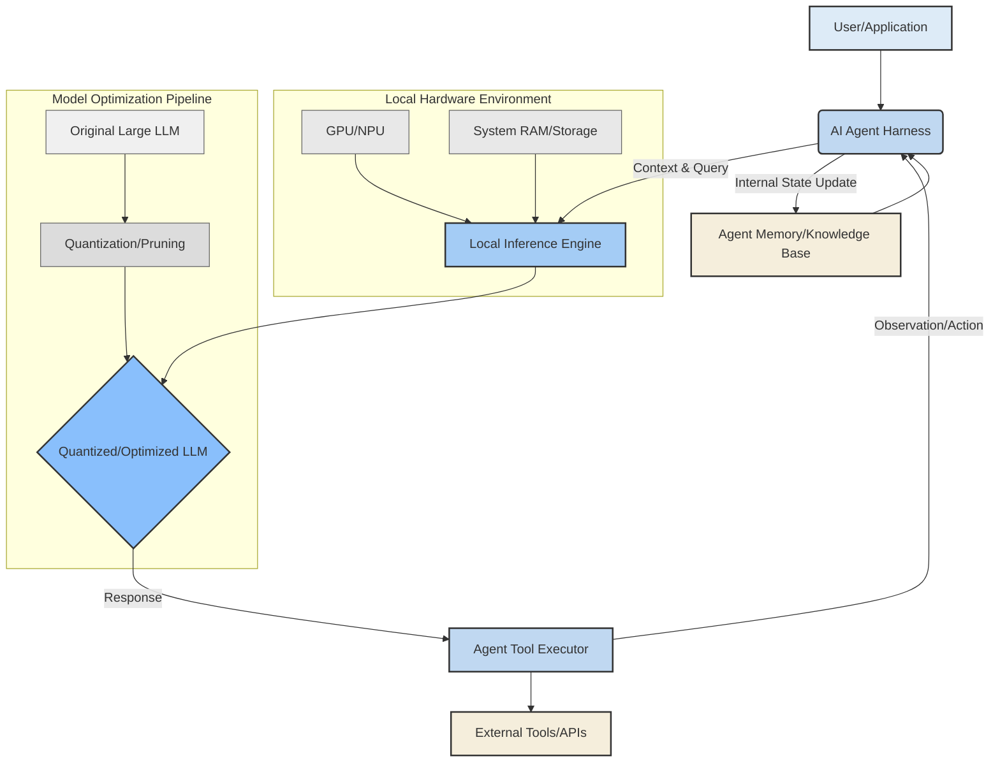

로컬 AI 추론은 클라우드 기반 LLM 의존성을 줄이고, 데이터 프라이버시를 강화하며, 비용 효율적인 에이전트 시스템을 구축하는 핵심 전략입니다. 특히, 최첨단 대규모 모델(예: 125B 파라미터 모델)을 단일 GPU와 같은 제한된 로컬 환경에서 실행하는 능력은 AI 연구 및 상업적 응용 분야에 혁신적인 가능성을 제공합니다. 이 접근 방식은 소수의 연구자와 GPU만으로도 최첨단 연구소와 경쟁할 수 있는 자율 연구 시스템 및 에이전트 하네스를 구축하는 데 필수적입니다. 본 문서에서는 로컬 AI 추론의 효율성을 극대화하고 이를 에이전트 하네스에 효과적으로 적용하는 방안을 모색합니다.

## 로컬 AI 추론 효율성 극대화 핵심 기술

로컬 환경에서 대규모 LLM을 효율적으로 실행하기 위해서는 모델 크기, 메모리 사용량, 연산 속도를 최적화하는 다양한 기술이 요구됩니다.

### 1. On-Device LLM 양자화 (Quantization)
양자화는 모델의 가중치와 활성화 함수를 더 낮은 비트 정밀도(예: FP32에서 INT8, INT4 심지어 INT2)로 변환하여 모델 크기를 줄이고 추론 속도를 높이는 핵심 기술입니다. 양자화는 크게 두 가지 방식으로 나뉩니다.

*   **Post-Training Quantization (PTQ)**: 학습이 완료된 모델에 적용. 구현이 간단하지만, 정확도 손실이 발생할 수 있습니다.
*   **Quantization-Aware Training (QAT)**: 학습 과정 중에 양자화를 고려. 정확도 손실을 최소화하면서도 높은 압축률을 달성하지만, 학습 과정이 더 복잡합니다.

최근에는 4-bit 또는 2-bit 양자화를 통해 단일 24GB GPU에서도 100B 이상의 모델을 실행하는 기술이 발전하고 있습니다.

### 2. 효율적인 아키텍처 및 모델 압축

*   **경량 모델 아키텍처**: 매개변수 수가 적으면서도 특정 태스크에 최적화된 모델(예: MobileNet, EfficientNet)을 활용합니다. LLM의 경우, Small LLM 또는 Specialized LLM을 활용하여 특정 도메인에 특화된 기능을 제공합니다.
*   **지식 증류 (Knowledge Distillation)**: 대규모 '교사' 모델의 지식을 소규모 '학생' 모델로 전이하여 학생 모델이 교사 모델의 성능을 유지하면서도 더 작고 빠르게 동작하도록 합니다.
*   **프루닝 (Pruning)**: 모델의 중요하지 않은 가중치나 뉴런을 제거하여 모델을 희소하게 만들고 크기를 줄입니다.

### 3. 최적화된 추론 엔진 및 런타임

ONNX Runtime, TFLite, Core ML, WebNN 등은 다양한 하드웨어 백엔드에서 AI 모델을 효율적으로 실행하기 위한 최적화된 런타임을 제공합니다. 이들은 그래프 최적화, 커널 퓨전, 메모리 관리 등을 통해 추론 성능을 향상시킵니다.

### 4. 하드웨어 가속 활용

GPU(NVIDIA, AMD), NPU(Neural Processing Unit), Apple Neural Engine 등 전용 AI 가속 하드웨어를 최대한 활용하여 연산 병목 현상을 줄이고 추론 속도를 높입니다. GPU 메모리 한계를 극복하기 위해 CPU 메모리 오프로딩(offloading) 또는 스와핑(swapping) 기술도 중요합니다.

## AI 에이전트 하네스에 로컬 추론 적용

로컬에서 최적화된 LLM 추론은 AI 에이전트 하네스의 핵심 구성 요소로 통합될 때 강력한 시너지를 발휘합니다. 에이전트 하네스는 LLM의 추론 결과를 기반으로 도구를 사용하고, 계획을 수립하며, 환경과 상호작용하는 프레임워크입니다. 로컬 추론은 다음과 같은 방식으로 에이전트 하네스 효율성을 극대화합니다.

*   **빠른 의사 결정 및 반응 속도**: 클라우드 API 호출 없이 로컬에서 즉시 추론을 수행하므로 에이전트의 응답 지연(latency)을 획기적으로 줄여 실시간 상호작용이 가능합니다.
*   **비용 절감**: LLM API 사용료를 절감하여 장기적으로 에이전트 운영 비용을 크게 낮출 수 있습니다.
*   **데이터 프라이버시 및 보안 강화**: 민감한 데이터가 외부 서버로 전송되지 않고 로컬에서 처리되므로 데이터 유출 위험을 줄이고 규제 준수에 유리합니다.
*   **오프라인 작동 및 제어**: 인터넷 연결 없이도 에이전트가 동작할 수 있도록 하여 다양한 환경에서의 활용 가능성을 높입니다.

### 에이전트 하네스 통합 아키텍처



### Python 예제: Hugging Face TFLite 양자화 (개념)

이 예제는 Pytorch 모델을 TFLite로 변환하고 양자화하는 개념을 보여줍니다. 실제 프로덕션 환경에서는 더 복잡한 파이프라인과 벤치마킹이 필요합니다.

```python
import torch
from transformers import AutoModelForSequenceClassification, AutoTokenizer
import tensorflow as tf

# 1. Pretrained PyTorch 모델 로드
model_name = "distilbert-base-uncased"
tokenizer = AutoTokenizer.from_pretrained(model_name)
model = AutoModelForSequenceClassification.from_pretrained(model_name)
model.eval() # 추론 모드로 설정

# 2. PyTorch 모델을 ONNX 형식으로 내보내기 (TensorFlow Lite를 위한 중간 단계)
# 실제로는 ONNX -> TensorFlow SavedModel -> TFLite 순서가 일반적입니다.
# 여기서는 간략화를 위해 개념만 제시합니다.

dummy_input = tokenizer("hello world", return_tensors="pt")['input_ids']

# PyTorch to ONNX export (실제 사용 시 정적 그래프를 위해 trace 필요)
# torch.onnx.export(model, dummy_input, "model.onnx", 
#                   input_names=["input_ids"], output_names=["logits"],
#                   dynamic_axes={
#                       "input_ids": {0: "batch_size"},
#                       "logits": {0: "batch_size"}
#                   })

print("PyTorch model loaded.")

# 3. TensorFlow Lite Converter를 사용한 양자화 (의사 코드)
# 실제로는 ONNX를 TensorFlow SavedModel로 변환 후 TFLite Converter 사용

# 가상의 TensorFlow 모델 (실제 변환 과정 필요)
class SimpleTFModel(tf.Module):
    def __init__(self, pt_model):
        super().__init__()
        # PyTorch 모델의 레이어를 TensorFlow 레이어로 매핑하는 복잡한 과정
        # 여기서는 간략화를 위해 더미 구현
        self.dense = tf.keras.layers.Dense(2, activation='softmax')

    @tf.function(input_signature=[tf.TensorSpec(shape=[None, None], dtype=tf.int32)])
    def __call__(self, input_ids):
        # PyTorch 모델의 forward 로직을 TF로 변환
        return self.dense(tf.random.normal(shape=(input_ids.shape[0], 768)))

tf_model = SimpleTFModel(model)

converter = tf.lite.TFLiteConverter.from_concrete_functions(
    [tf_model.__call__.get_concrete_function()],
    tf_model
)

# 동적 범위 양자화 (Dynamic Range Quantization)
converter.optimizations = [tf.lite.Optimize.DEFAULT]

tflite_model = converter.convert()

with open('optimized_model.tflite', 'wb') as f:
    f.write(tflite_model)

print("Model quantized to TFLite format.")

# 4. TFLite 모델 로드 및 추론 (예시)
interpreter = tf.lite.Interpreter(model_content=tflite_model)
interpreter.allocate_tensors()

input_details = interpreter.get_input_details()
output_details = interpreter.get_output_details()

# 더미 입력 데이터
input_shape = input_details[0]['shape']
dummy_tf_input = tf.constant(dummy_input.numpy(), dtype=tf.int32)

interpreter.set_tensor(input_details[0]['index'], dummy_tf_input)
interpreter.invoke()
output_data = interpreter.get_tensor(output_details[0]['index'])

print(f"TFLite inference output shape: {output_data.shape}")
```

## 트레이드오프

로컬 AI 추론 및 에이전트 하네스 효율성 극대화 전략은 여러 트레이드오프를 고려해야 합니다.

*   **정확도 감소 vs. 성능 향상 (Accuracy Degradation vs. Performance Gain)**
    *   **언제 좋은가**: LLM 추론 속도와 메모리 사용량이 중요하며, 약간의 정확도 감소가 허용 가능한 경우 (예: 초안 생성, 빠른 상황 인식).
    *   **언제 나쁜가**: 높은 정확도가 필수적인 태스크 (예: 법률 문서 검토, 의료 진단)나 미묘한 뉘앙스를 처리해야 하는 경우, 양자화로 인한 정확도 손실이 치명적일 수 있습니다.

*   **초기 설정 복잡성 vs. 장기적 운영 비용 절감 (Initial Setup Complexity vs. Long-term Cost Savings)**
    *   **언제 좋은가**: 지속적인 LLM 사용과 비용 관리가 중요한 장기 프로젝트나 대규모 에이전트 시스템 배포 시, 초기 투자 대비 큰 비용 절감 효과를 볼 수 있습니다.
    *   **언제 나쁜가**: PoC(Proof of Concept) 단계, 일회성 태스크, 또는 개발 리소스가 제한적인 소규모 프로젝트의 경우, 초기 설정 및 유지보수 비용이 클라우드 API 사용보다 비효율적일 수 있습니다.

*   **하드웨어 의존성 vs. 클라우드 유연성 (Hardware Dependency vs. Cloud Agility)**
    *   **언제 좋은가**: 특정 하드웨어(고성능 GPU)를 이미 확보했거나 강력한 데이터 프라이버시 요구 사항이 있는 온프레미스 환경에 적합합니다. 하드웨어 리소스에 대한 완전한 제어가 가능합니다.
    *   **언제 나쁜가**: 다양한 하드웨어 환경을 지원해야 하거나, 급변하는 워크로드에 대한 탄력적 확장 및 유연한 리소스 관리가 필요한 경우 클라우드 환경이 더 유리합니다. 하드웨어 조달 및 유지보수 부담이 커질 수 있습니다.

*   **모델 기능 범위 vs. 리소스 제약 (Model Capability Scope vs. Resource Constraints)**
    *   **언제 좋은가**: 로컬에서 실행하기 위해 모델 크기를 줄이거나 특정 태스크에 특화된 모델을 사용할 때, 해당 태스크에 대한 최적의 성능과 효율성을 달성할 수 있습니다.
    *   **언제 나쁜가**: 광범위한 일반 지식이나 복잡한 추론 능력이 필요한 경우, 로컬에서 실행 가능한 제약된 크기의 모델로는 태스크를 만족스럽게 수행하기 어려울 수 있습니다.

## 실전 체크리스트

프로젝트에 로컬 AI 추론 및 에이전트 하네스 효율성 극대화 방안을 적용하기 위한 실전 체크리스트입니다.

- [ ] **성능 목표 정의**: 로컬 LLM 추론의 최소 허용 응답 시간(latency)과 최대 허용 메모리 사용량을 명확히 정의했는가?
- [ ] **정확도 허용 범위 설정**: 양자화 또는 모델 압축으로 인한 LLM의 정확도 감소가 에이전트 태스크 성공률에 미치는 영향을 평가하고, 허용 가능한 정확도 손실 범위를 설정했는가?
- [ ] **하드웨어 프로파일링**: 대상 로컬 환경의 GPU, CPU, RAM 사양을 정확히 파악하고, 이에 맞는 최적화 전략(예: 4-bit, 2-bit 양자화, CPU 오프로딩)을 수립했는가?
- [ ] **양자화 파이프라인 구축**: PyTorch, TensorFlow 등 학습 프레임워크에서 ONNX 또는 TFLite/TensorRT와 같은 효율적인 추론 형식으로 변환하고 양자화하는 자동화된 파이프라인을 구축했는가?
- [ ] **에이전트 하네스 통합 지점 식별**: 로컬 LLM을 에이전트의 Reasoning, Planning, Tool Use 등 어떤 단계에 통합할지 명확히 정의하고, 폴백(fallback) 메커니즘을 고려했는가?
- [ ] **로컬 모델 보안 및 데이터 격리**: 로컬에 저장된 모델 파일 및 에이전트의 민감 데이터에 대한 접근 제어, 암호화 등 보안 메커니즘을 구현했는가?
- [ ] **모델 라이프사이클 관리**: 로컬 LLM 모델의 업데이트, 버전 관리, 재양자화 및 배포 전략을 수립하여 에이전트의 지속적인 성능 유지 및 개선 계획을 마련했는가?