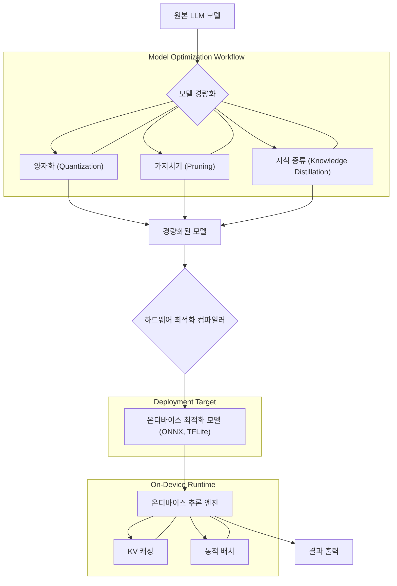

2026년, 온디바이스 인공지능 (On-device AI)은 스마트폰, IoT 장치, 엣지 서버 등 다양한 폼팩터에서 사용자 경험을 혁신하는 핵심 기술로 부상하고 있습니다. 특히, 경량화된 대규모 언어 모델 (Lightweight Large Language Models, LLM)의 온디바이스 추론 효율성은 개인 정보 보호, 낮은 지연 시간, 오프라인 작동 가능성 측면에서 필수적입니다. 이 엔트리에서는 제한된 리소스 환경에서 LLM의 추론 성능을 극대화하기 위한 디자인 패턴과 최적화 전략을 심층적으로 다룹니다.

## 온디바이스 LLM 추론의 중요성 및 도전 과제

온디바이스 LLM은 클라우드 기반 LLM의 한계점을 극복합니다. 데이터 전송 없이 로컬에서 추론이 이루어지므로, 사용자의 민감한 데이터가 외부로 유출될 위험이 줄어들고, 네트워크 지연 없이 즉각적인 응답이 가능합니다. 또한, 네트워크 연결이 불안정한 환경에서도 AI 기능을 사용할 수 있게 합니다.

그러나 모바일 및 엣지 디바이스는 클라우드 서버와 비교할 때 연산 능력, 메모리, 배터리 소모 측면에서 제약이 큽니다. 수십억 개 이상의 파라미터를 가진 LLM을 이러한 환경에서 효율적으로 구동하는 것은 상당한 도전 과제입니다. 모델 크기 축소, 추론 속도 향상, 전력 소모 최소화가 핵심 목표입니다.

## 경량화된 LLM 모델 디자인 패턴

온디바이스 환경에 적합한 LLM을 만들기 위한 대표적인 모델 경량화 기법은 다음과 같습니다.

### 1. 양자화 (Quantization)

양자화는 모델의 가중치와 활성화 함수 값을 32비트 부동 소수점 (FP32)에서 8비트 정수 (INT8)나 4비트 정수 (INT4) 등으로 표현하여 모델 크기를 줄이고 연산 속도를 높이는 기법입니다. 추론 시 발생하는 연산량이 크게 감소하며, 메모리 대역폭 요구량도 줄어듭니다.

*   **Post-Training Quantization (PTQ):** 모델 학습 완료 후 양자화를 적용합니다. 구현이 간단하지만, 정확도 손실이 발생할 수 있습니다.
*   **Quantization-Aware Training (QAT):** 학습 과정에서 양자화 효과를 시뮬레이션하여 모델이 양자화에 강인하도록 만듭니다. PTQ보다 높은 정확도를 유지하지만, 구현 복잡도가 높습니다.

```python
import torch
import torch.nn as nn
from transformers import AutoModelForCausalLM, AutoTokenizer

# 예시: Hugging Face 모델 양자화 (bitsandbytes 라이브러리 활용)
# 이 예제는 런타임에 GPU가 필요하지만, 개념적으로 온디바이스 배포 전 양자화를 보여줍니다.

model_name = "facebook/opt-125m" # 경량 모델 예시
tokenizer = AutoTokenizer.from_pretrained(model_name)
model = AutoModelForCausalLM.from_pretrained(model_name,
                                            load_in_8bit=True, # 8비트 양자화 적용
                                            device_map="auto")

# 양자화된 모델로 추론
prompt = "Hello, I am an AI assistant and I want to"
input_ids = tokenizer(prompt, return_tensors="pt").input_ids.to(model.device)

with torch.no_grad():
    output = model.generate(input_ids, max_new_tokens=50)

print("Quantized Model Output:")
print(tokenizer.decode(output[0], skip_special_tokens=True))

# ONNX Runtime을 이용한 추론 최적화 예시 (실제 온디바이스 배포 시 더 흔하게 사용)
# PyTorch 모델을 ONNX 형식으로 변환 후 ONNX Runtime으로 로드

# from transformers import AutoModelForSequenceClassification
# from optimum.onnxruntime import ORTModelForSequenceClassification

# # 먼저 PyTorch 모델을 ONNX로 익스포트해야 합니다.
# # 다음은 가상의 예시 코드입니다. 실제로는 `optimum` 라이브러리를 사용합니다.
# # model = AutoModelForSequenceClassification.from_pretrained("distilbert-base-uncased")
# # tokenizer = AutoTokenizer.from_pretrained("distilbert-base-uncased")
# # ort_model = ORTModelForSequenceClassification.from_pretrained("path/to/onnx/model")

print("ONNX Runtime은 온디바이스 추론을 위한 강력한 엔진입니다.")
```

### 2. 가지치기 (Pruning)

가지치기는 모델의 중요도가 낮은 가중치를 제거하여 파라미터 수를 줄이는 기법입니다. 모델의 희소성 (Sparsity)을 증가시켜 압축률을 높이고 연산량을 줄일 수 있습니다.

### 3. 지식 증류 (Knowledge Distillation)

지식 증류는 크고 성능 좋은 '교사 (Teacher)' 모델의 지식을 작고 효율적인 '학생 (Student)' 모델에게 전달하여, 학생 모델이 교사 모델에 근접하는 성능을 내도록 학습시키는 기법입니다. 온디바이스 환경에서 배포될 경량 모델 학습에 매우 효과적입니다.

### 4. 모델 컴파일 및 런타임 최적화

양자화된 모델을 효율적으로 실행하기 위해 특정 하드웨어에 최적화된 런타임 엔진을 활용합니다.

*   **ONNX Runtime:** 다양한 하드웨어 백엔드 (CPU, GPU, NPU 등)에서 높은 성능을 제공하는 교차 플랫폼 추론 엔진입니다.
*   **TensorFlow Lite (TFLite):** 모바일 및 엣지 디바이스를 위해 설계된 TensorFlow의 경량 버전입니다.
*   **Core ML (Apple):** Apple 기기 전용으로, Metal을 활용하여 신경망 추론을 가속화합니다.

## 온디바이스 추론 효율화 패턴

경량 모델 자체의 최적화 외에도, 추론 과정에서 효율성을 높이는 디자인 패턴이 중요합니다.

### 1. 배치 추론 및 동적 배치 (Batching & Dynamic Batching)

여러 개의 입력 프롬프트를 한 번에 처리하여 하드웨어 가속기 (GPU, NPU)의 활용률을 극대화합니다. 동적 배치는 실시간으로 들어오는 요청의 개수에 따라 배치 크기를 조절하여 유연성을 제공합니다. 온디바이스 환경에서는 리소스 제약으로 배치 크기 조절이 더욱 중요합니다.

### 2. KV 캐싱 (Key-Value Caching)

LLM의 자기 회귀 (Auto-regressive) 특성상, 이전 토큰에서 계산된 Key와 Value 벡터는 다음 토큰 생성에 재사용될 수 있습니다. KV 캐싱은 이 벡터들을 메모리에 저장하여 중복 계산을 피하고 추론 속도를 크게 향상시킵니다. 온디바이스의 제한된 메모리에서 캐시 효율 관리는 핵심입니다.

### 3. 모델 분할 및 오프로딩 (Model Partitioning & Offloading)

매우 큰 모델의 경우, 전체 모델을 온디바이스에 로드하는 것이 불가능할 수 있습니다. 이때 모델을 여러 부분으로 분할하여 일부는 온디바이스에서, 나머지는 클라우드 서버에서 처리하는 하이브리드 접근 방식 (예: 엣지-클라우드 협업)을 사용할 수 있습니다. 이를 통해 온디바이스의 연산 부담을 줄입니다.

## 온디바이스 LLM 추론 파이프라인 (2026 트렌드)

2026년에는 LLM의 온디바이스 배포가 더욱 보편화될 것이며, 아래와 같은 통합된 파이프라인이 중요해질 것입니다.


설명: 원본 LLM 모델은 양자화, 가지치기, 지식 증류를 통해 경량화됩니다. 경량화된 모델은 하드웨어 최적화 컴파일러를 거쳐 ONNX 또는 TFLite와 같은 온디바이스 최적화 모델로 변환됩니다. 이 모델은 KV 캐싱과 동적 배치 기능을 갖춘 온디바이스 추론 엔진을 통해 효율적으로 실행됩니다.

## 트레이드오프

### 1. 모델 크기 vs. 정확도 (Model Size vs. Accuracy)
*   **언제 좋고:** 제한된 메모리와 연산 자원을 가진 디바이스에서 실행해야 할 때, 네트워크 전송 비용을 줄여야 할 때.
*   **언제 나쁜지:** 미세한 정확도 손실도 용납할 수 없는 고정밀 작업 (예: 의료 진단)의 경우. 경량화 기법 적용 시 항상 정확도 저하 가능성을 고려해야 합니다.

### 2. 추론 속도 vs. 전력 소모 (Inference Speed vs. Power Consumption)
*   **언제 좋고:** 실시간 응답이 필수적인 애플리케이션 (예: 음성 비서)에서 사용자 경험을 최적화할 때.
*   **언제 나쁜지:** 배터리 수명이 매우 중요한 초저전력 IoT 장치에서는 최대 추론 속도보다는 전력 효율이 우선시될 수 있습니다. 과도한 연산은 배터리 소모를 가속화합니다.

### 3. 개발 복잡도 vs. 최적화 수준 (Development Complexity vs. Optimization Level)
*   **언제 좋고:** 특정 하드웨어에 대한 심층적인 최적화를 통해 최고 수준의 성능을 달성해야 할 때.
*   **언제 나쁜지:** 개발 기간이 짧거나 범용적인 배포가 필요한 경우, 낮은 복잡도의 범용 최적화 기법이 더 효율적일 수 있습니다. 예를 들어, QAT는 PTQ보다 복잡합니다.

### 4. 온디바이스 vs. 클라우드 하이브리드 (On-device vs. Cloud Hybrid)
*   **언제 좋고:** 디바이스 리소스가 충분하지 않지만, 일부 데이터는 온디바이스에서 처리해야 하는 경우 (예: 민감 데이터), 또는 응답 지연에 대한 유연성이 있는 경우.
*   **언제 나쁜지:** 모든 데이터가 로컬에서만 처리되어야 하거나, 항상 즉각적인 응답이 필요한 경우, 네트워크 의존도가 문제가 됩니다.

## 실전 체크리스트

온디바이스 LLM 추론 효율화 패턴을 프로젝트에 적용할 때 다음 항목들을 검토하십시오.

- [ ] **모델 선택 및 경량화 전략:** 대상 디바이스의 하드웨어 스펙과 요구되는 LLM 성능 (정확도, 지연 시간)을 고려하여 적절한 경량 모델 (예: Phi-3-mini, Gemma 2B)을 선택하고, 양자화 (INT8/INT4), 가지치기, 지식 증류 중 최적의 조합을 적용했는가?
- [ ] **런타임 엔진 호환성 및 최적화:** 대상 디바이스의 OS 및 하드웨어 가속기 (NPU, GPU)를 지원하는 추론 엔진 (ONNX Runtime, TFLite, Core ML)을 선택하고, 해당 엔진의 최적화 옵션 (예: 그래프 최적화, 커스텀 커널)을 최대한 활용했는가?
- [ ] **KV 캐싱 구현 및 메모리 관리:** LLM의 토큰 생성 과정에서 KV 캐시를 효율적으로 사용하여 추론 속도를 높이고, 디바이스의 제한된 메모리 내에서 캐시 크기를 동적으로 관리하는 전략을 수립했는가?
- [ ] **동적 배치 처리 구현:** 동시에 들어오는 여러 추론 요청을 효율적으로 처리하기 위해 동적 배치 (Dynamic Batching) 기능을 구현하고, 배치 크기 변화에 따른 성능 변화를 측정했는가?
- [ ] **벤치마킹 및 성능 측정:** 다양한 실제 사용 시나리오에서 모델 크기, 추론 지연 시간, 메모리 사용량, 전력 소모량을 정량적으로 측정하고 목표 성능 지표를 충족하는지 확인했는가?
- [ ] **모델 버전 관리 및 CI/CD 파이프라인:** 경량화된 모델의 여러 버전과 관련 스크립트 (양자화, 컴파일)를 체계적으로 관리하고, 온디바이스 배포를 위한 CI/CD (Continuous Integration/Continuous Deployment) 파이프라인을 구축하여 자동화했는가?
- [ ] **폴백 (Fallback) 전략:** 온디바이스 추론이 실패하거나 성능 저하가 발생할 경우, 클라우드 기반 LLM으로 전환하는 폴백 메커니즘을 설계하고 테스트했는가?