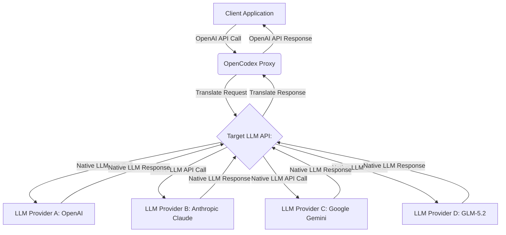

The reliance on specific LLM providers and their proprietary APIs can introduce significant vendor lock-in, hindering innovation and increasing operational rigidity. Platforms like OpenAI's Codex, while powerful, often restrict users to a narrow ecosystem of models. This limitation becomes pronounced when teams aim to leverage the unique strengths or cost efficiencies of other advanced LLMs such as Claude, Gemini, or GLM-5.2 for specific tasks. Waiting for native support for every new model within a single API ecosystem is not a sustainable strategy for agile development.

## OpenCodex의 역할: LLM 하네스 유연성 확보

`opencodex`는 이러한 문제를 해결하기 위해 설계된 로컬 프록시 솔루션이다. `opencodex`는 기존 Codex-compatible 애플리케이션과 다양한 LLM 프로바이더 사이에 위치하여 실시간으로 프로토콜을 번역한다. 이를 통해 개발자는 백엔드 LLM에 관계없이 표준화된 OpenAI API 인터페이스를 통해 상호작용할 수 있다. 스트리밍 응답, 도구 호출(Tool Calling), 추론 토큰, 이미지 처리 등 복합적인 기능들이 양방향으로 번역되어 매끄러운 통합 경험을 제공한다.

### 핵심 기능과 이점

*   **API 호환성**: OpenAI API 프로토콜을 다른 LLM의 네이티브 API로 번역하여, 기존 OpenAI 기반 코드베이스를 최소한의 수정으로 재활용할 수 있다.
*   **다중 LLM 지원**: Anthropic Claude, Google Gemini, GLM 등 다양한 LLM을 플러그인 방식으로 연결하고 전환할 수 있다.
*   **프로토콜 번역**: 스트리밍, 함수 호출(Function Calling), 토큰 사용량 보고 등 복잡한 상호작용 모델을 지원하여 기능 손실 없이 다양한 LLM을 활용한다.
*   **개발 및 테스트 효율성**: 로컬 환경에서 다양한 LLM을 빠르게 교체하며 개발 및 테스트를 수행할 수 있어 모델 탐색 및 검증에 드는 시간과 비용을 절감한다.

## OpenCodex 아키텍처 및 동작 원리

`opencodex`는 클라이언트 요청을 가로채어 대상 LLM의 API 사양에 맞게 변환한 후, 응답을 다시 OpenAI API 형식으로 역변환한다. 이 과정은 애플리케이션 레벨에서 투명하게 이루어진다.



### 실제 통합 시나리오: Claude Code 하네스 확장

`opencodex`는 특히 `playbook`의 Claude Code 하네스와 LLM 출력 검증 파이프라인에 OpenAI API 호환 LLM (예: GLM-5.2)을 통합하는 데 매우 유용하다. 기존 Claude 중심의 하네스는 Anthropic 고유의 API를 사용하지만, `opencodex`를 통해 GLM-5.2와 같은 모델을 OpenAI API 인터페이스로 감싸서 seamless하게 연결할 수 있다.

```python
import os
import openai # Using OpenAI SDK, but targetting opencodex

# OpenCodex 프록시 URL 설정 (로컬 실행 시)
openai.api_base = os.getenv("OPENCODEX_API_BASE", "http://localhost:8000/v1")
openai.api_key = "sk-dummy" # opencodex는 실제 API 키 대신 더미 키를 사용 가능

def generate_code_with_llm(prompt_text: str, model_name: str = "glm-5.2"):
    try:
        response = openai.chat.completions.create(
            model=model_name, # opencodex가 해당 모델로 라우팅
            messages=[
                {"role": "system", "content": "You are a helpful coding assistant."},
                {"role": "user", "content": prompt_text}
            ],
            stream=True # 스트리밍 지원
        )
        full_response_content = ""
        for chunk in response:
            if chunk.choices[0].delta.content:
                full_response_content += chunk.choices[0].delta.content
        return full_response_content
    except Exception as e:
        print(f"Error calling LLM via OpenCodex: {e}")
        return None

if __name__ == "__main__":
    code_prompt = "Write a Python function to calculate the factorial of a number recursively."
    print(f"Generating code using {os.getenv('OPENCODEX_API_BASE', 'http://localhost:8000/v1')} with model glm-5.2:")
    generated_code = generate_code_with_llm(code_prompt, model_name="glm-5.2")
    if generated_code:
        print("Generated Code:")
        print(generated_code)
    else:
        print("Failed to generate code.")

    # 다른 모델로 쉽게 전환 (예: claude-3-opus-20240229)
    # generated_code_claude = generate_code_with_llm(code_prompt, model_name="claude-3-opus-20240229")
    # if generated_code_claude:
    #     print("\nGenerated Code (Claude):")
    #     print(generated_code_claude)
```

이 접근 방식은 LLM 모델 전환에 따른 코드 변경 비용을 최소화하며, LLM 출력 검증 파이프라인의 강건함을 다양한 모델에 걸쳐 실험할 수 있는 유연성을 제공한다. 예를 들어, `playbook`의 `evaluation/llm-output-validation-quality-metrics-design`에서 정의된 지표들을 GLM-5.2와 Claude 3 Opus 같은 이종 모델에서 동일한 방식으로 측정하고 비교할 수 있게 된다.

## 트레이드오프

`opencodex`의 도입은 LLM 하네스의 유연성을 크게 향상시키지만, 동시에 고려해야 할 몇 가지 트레이드오프가 존재한다.

*   **모델 유연성 vs. 시스템 복잡성 증가**:
    *   **언제 좋음**: 다양한 LLM을 통합하고 싶을 때, 특정 벤더에 대한 의존도를 줄이고 싶을 때, 비용 효율적인 모델을 동적으로 선택해야 할 때 매우 유리하다. 신규 LLM의 빠른 통합 및 A/B 테스트가 용이해진다.
    *   **언제 나쁨**: 단일 LLM만 사용하며 시스템 단순성이 최우선인 경우, `opencodex`는 추가적인 관리 및 모니터링 부담을 야기할 수 있다. 프록시 계층의 추가는 잠재적인 장애 지점을 늘린다.

*   **API 호환성 vs. 완전한 기능 패리티**:
    *   **언제 좋음**: 기존 OpenAI API 기반 코드베이스를 활용하여 빠르게 다른 LLM으로 마이그레이션하거나 확장해야 할 때 강력한 이점을 제공한다. 기본적인 채팅, 스트리밍, 도구 호출 기능은 대부분 호환된다.
    *   **언제 나쁨**: 특정 LLM 프로바이더의 고유한 최신 기능(예: 특정 모달리티, 복잡한 인풋 구조)이 OpenAI API 표준에 포함되지 않은 경우, `opencodex`의 번역 계층이 해당 기능을 완전히 지원하지 못할 수 있다. 이 경우 추가적인 커스터마이징이 필요할 수 있다.

*   **개발 및 테스트 속도 vs. 운영 오버헤드**:
    *   **언제 좋음**: 개발 및 R&D 단계에서 다양한 모델을 신속하게 실험하고 프로토타이핑하는 데 탁월하다. 모델 교체에 드는 시간과 노력을 크게 줄여준다.
    *   **언제 나쁨**: 프로덕션 환경에서 `opencodex`는 추가적인 Latency를 발생시킬 수 있으며, 프록시 자체의 안정성, 확장성, 보안 관리가 중요한 고려 사항이 된다. 특히 고성능이 요구되는 실시간 추론 시나리오에서는 Latency 증가가 문제가 될 수 있다.

*   **비용 최적화 가능성 vs. 초기 설정 및 유지보수 비용**:
    *   **언제 좋음**: 다양한 LLM 간의 가격 비교를 통해 가장 비용 효율적인 모델을 동적으로 선택하거나, 특정 작업에 특화된 저렴한 모델을 활용하여 전체 LLM 운영 비용을 절감할 수 있다.
    *   **언제 나쁨**: `opencodex` 프록시의 설정, 배포, 그리고 지속적인 유지보수(예: 새로운 LLM API 변경에 대한 프록시 업데이트)에는 초기 투자와 지속적인 엔지니어링 리소스가 필요하다. 소규모 프로젝트에서는 이러한 오버헤드가 비용 절감 효과를 상회할 수 있다.

## 실전 체크리스트

`opencodex`를 LLM 하네스에 성공적으로 통합하고 활용하기 위한 실전 체크리스트는 다음과 같다.

*   [ ] **OpenCodex 프록시 설치 및 기본 동작 확인**: 로컬 환경 또는 개발/테스트 서버에 `opencodex`를 설치하고, 최소한 하나의 OpenAI API 호환 LLM (예: `gpt-3.5-turbo` 또는 `glm-5.2`)으로 기본 추론 요청이 성공적으로 이루어지는지 확인한다.
*   [ ] **기존 LLM 하네스 (예: Claude Code 하네스)와의 연동 테스트**: 현재 `playbook`의 Claude Code 하네스에서 `OPENCODEX_API_BASE`를 설정하여 OpenAI SDK를 통해 `claude-3-opus-20240229` 모델로 요청을 보내고 정상 동작하는지 검증한다.
*   [ ] **OpenAI API 호환 LLM (예: GLM-5.2) 연동 및 추론 성공률 측정**: `opencodex`를 통해 GLM-5.2 모델로 코드 생성, 요약 등 핵심 작업들을 수행하고, `evaluation/llm-output-validation-quality-metrics-design`에 정의된 성공률 및 품질 지표를 측정하여 기준치를 충족하는지 확인한다.
*   [ ] **스트리밍, 툴 호출 등 고급 기능의 양방향 프로토콜 번역 검증**: `opencodex`를 거쳐 스트리밍 응답이 실시간으로 처리되는지, 그리고 도구 호출(Tool Calling) 또는 함수 호출(Function Calling)이 대상 LLM의 네이티브 기능으로 정확히 번역되어 실행되는지 엔드-투-엔드 테스트를 수행한다.
*   [ ] **다중 LLM 환경에서의 LLM 출력 검증 파이프라인 강건함 테스트**: `opencodex`를 통해 여러 LLM (예: Claude, GLM-5.2)을 번갈아 사용하며 `evaluation/llm-output-validation-prompt-constraints-robustness`에서 정의된 검증 파이프라인이 일관성 있게 작동하고, 모델별 특성에 따른 검증 결과 차이를 분석한다.
*   [ ] **OpenCodex 도입으로 인한 Latency 증가 및 자원 사용량 모니터링**: `opencodex` 프록시를 통과할 때 발생하는 평균 및 최대 Latency를 측정하고, 프록시 자체의 CPU, 메모리 사용량을 모니터링하여 프로덕션 환경 배포 시 성능 병목 지점을 사전에 파악한다.
*   [ ] **신규 LLM 통합 시 예상되는 전환 비용 절감 효과 분석**: 새로운 LLM을 `opencodex` 없이 직접 통합하는 시나리오와 `opencodex`를 통해 통합하는 시나리오를 비교하여, 개발 공수, 테스트 시간, 코드 변경량 등에서 발생하는 전환 비용 절감 효과를 정량적으로 분석한다.