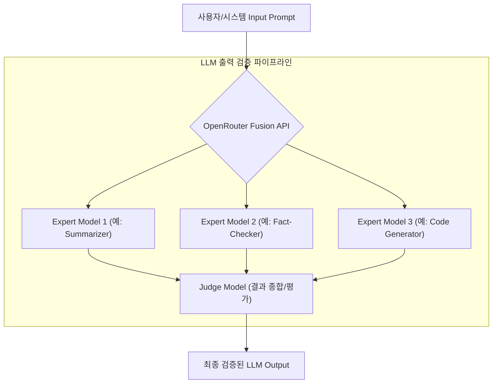

LLM(Large Language Model) 기반 시스템, 특히 복잡한 에이전트(Agent) 로직을 활용하는 자동화 환경에서는 LLM 출력의 신뢰성 확보가 핵심 과제입니다. 단일 LLM의 추론은 필연적으로 환각(Hallucination), 편향(Bias), 불일치(Inconsistency)와 같은 문제를 내포하며, 이는 허브-워커(Hub-Worker) 복리 자동화와 같은 미션 크리티컬한 워크플로우의 전체 신뢰성을 저해할 수 있습니다. 이러한 문제를 해결하기 위해 OpenRouter Fusion API는 여러 전문가 모델의 출력을 병렬로 분석하고, 심판 모델(Judge Model)이 이를 종합하여 최종 답변을 생성하는 혁신적인 접근 방식을 제공합니다.

## OpenRouter Fusion API 핵심 개념

OpenRouter Fusion API는 단일 LLM에 의존하지 않고, 특정 태스크에 특화된 여러 '전문가 모델(Expert Models)'의 강점을 활용합니다. 각 전문가 모델은 동일한 프롬프트 또는 부분적으로 가공된 프롬프트를 바탕으로 독립적인 추론을 수행합니다. 이후 '심판 모델(Judge Model)'은 이들의 다양한 결과물을 취합하고, 교차 검증하며, 모순을 해결하고, 최종적으로 가장 정확하고 일관된 답변을 합성합니다. 이러한 다중 모델 협업 방식은 마치 여러 분야의 전문가들이 한 가지 문제에 대해 논의하고, 최종적으로는 경험 많은 판사가 합의된 결론을 내리는 과정과 유사합니다.

이는 개별 모델이 가진 한계를 보완하고, 전반적인 시스템의 견고함과 출력 품질을 비약적으로 향상시키는 데 기여합니다. 특히, 2026년에는 LLM의 활용 범위가 더욱 넓어지면서, 단순히 '답변을 생성하는' 것을 넘어 '신뢰할 수 있고 검증된 답변을 생성하는' 것이 핵심 경쟁력이 될 것입니다. Fusion API는 이러한 신뢰성 요구사항을 충족하는 데 필수적인 패턴을 제공합니다.

### Harness 엔지니어링 파이프라인에 OpenRouter Fusion API 통합

플레이북의 LLM 출력 검증 파이프라인에 OpenRouter Fusion API를 통합함으로써, 우리는 다음과 같은 이점을 얻을 수 있습니다:

1.  **다양한 관점의 교차 검증**: 각 전문가 모델이 다른 관점과 학습 데이터를 기반으로 추론하므로, 단일 모델의 편향이나 지식 부족으로 인한 오류를 상호 보완할 수 있습니다.
2.  **심판 모델을 통한 일관성 확보**: 심판 모델은 단순한 평균치를 내는 것이 아니라, 각 전문가 모델의 응답 품질과 신뢰도를 평가하여 최적의 답변을 종합합니다. 이를 통해 일관되고 신뢰할 수 있는 최종 출력을 보장합니다.
3.  **환각 현상 및 오류율 감소**: 여러 모델의 검증을 거치므로 환각 현상의 발생 가능성을 현저히 낮추고, 전체적인 오류율을 줄여 자동화된 워크플로우의 신뢰성을 높입니다.
4.  **유연한 모델 조합**: 특정 도메인이나 태스크에 따라 최적의 성능을 내는 모델들을 조합하여 사용할 수 있어, 성능과 비용 효율성을 동시에 최적화할 수 있습니다.

이러한 통합은 특히 에이전트가 외부 도구를 사용하거나, 복잡한 의사 결정을 내려야 하는 시나리오에서 그 진가를 발휘합니다. 검증된 LLM 출력은 에이전트의 다음 행동에 대한 신뢰할 수 있는 근거를 제공하여, 에이전트의 자율성과 정확성을 크게 향상시킵니다.



## 코드 예제: OpenRouter Fusion API 호출 (개념적)

아래는 OpenRouter Fusion API를 호출하여 LLM 출력을 검증하고 종합하는 개념적인 Python 코드 예제입니다. 실제 API는 OpenRouter의 공식 SDK 및 API 스펙에 따라 다를 수 있으며, `model` 파라미터에 'fusion' 엔드포인트를 지정하고 추가 `expert_models` 및 `judge_model` 구성을 포함할 수 있습니다.

```python
import os
from openrouter import OpenRouter

def get_validated_llm_output_with_fusion(prompt: str, context: str) -> str:
    """
    OpenRouter Fusion API를 사용하여 LLM 출력을 검증하고 종합합니다.
    (Conceptual example; actual API might vary based on OpenRouter's specifications)
    """
    client = OpenRouter(api_key=os.environ.get("OPENROUTER_API_KEY"))

    try:
        # 'openrouter/fusion' 모델을 통해 다중 모델 종합 기능을 활용합니다.
        # 실제 Fusion API는 expert_models 및 judge_model 구성 파라미터를 가질 수 있습니다.
        response = client.chat.completions.create(
            model="openrouter/fusion", # Fusion API 엔드포인트
            messages=[
                {"role": "system", "content": "You are a meticulous assistant who cross-validates information from multiple sources."},
                {"role": "user", "content": f"Context: {context}\nTask: {prompt}\nBased on the context, provide a thoroughly validated and synthesized answer."},
            ],
            # Hypothetical parameters for Fusion API configuration:
            # expert_models=[
            #     {"model": "gpt-4o-mini", "role": "Summarizer"},
            #     {"model": "claude-3-haiku", "role": "FactChecker"},
            #     {"model": "llama-3-8b-instruct", "role": "DetailExtractor"},
            # ],
            # judge_model={"model": "gpt-4o", "role": "SynthesizerAndFinalReviewer"},
        )
        return response.choices[0].message.content
    except Exception as e:
        print(f"Error calling OpenRouter Fusion API: {e}")
        # Fallback mechanism for robustness
        return "An error occurred during multi-model LLM output validation."

# Example Usage
if __name__ == "__main__":
    os.environ["OPENROUTER_API_KEY"] = "YOUR_OPENROUTER_API_KEY"

    test_prompt = "인공지능 에이전트의 장기 기억 관리가 왜 중요한가요?"
    test_context = "인공지능 에이전트가 복잡하고 연속적인 작업을 수행하려면 이전 대화, 학습 경험, 환경 상태를 기억하고 활용할 수 있는 장기 기억 시스템이 필수적입니다. 이는 컨텍스트 윈도우 한계를 극복하고, 지속적인 학습 및 적응을 가능하게 합니다."

    validated_answer = get_validated_llm_output_with_fusion(test_prompt, test_context)
    print(f"\nValidated LLM Answer: {validated_answer}")

```

## 트레이드오프

OpenRouter Fusion API를 활용한 LLM 출력 검증 방식은 강력하지만, 모든 시나리오에 최적화된 것은 아닙니다. 도입을 고려할 때 다음 트레이드오프를 고려해야 합니다.

*   **신뢰성 및 정확도 향상**: 여러 전문가 모델의 교차 검증을 통해 단일 LLM의 한계를 보완하고, 환각 및 편향을 줄여 출력의 신뢰성과 정확도를 크게 높일 수 있습니다. 언제 좋고/언제 나쁜지: 미션 크리티컬한 시스템, 법률/의료/금융 등 고도로 정확한 정보가 요구되는 분야, 또는 오류 비용이 매우 높은 자동화 워크플로우에 적합합니다. 반면, 간단한 챗봇 응답이나 내부 테스트 환경에서는 오버킬(overkill)일 수 있습니다.
*   **모델 유연성 및 최적화**: 특정 태스크에 최적화된 다양한 LLM(예: 요약 전문, 코드 생성 전문, 사실 확인 전문)을 조합하여 활용할 수 있습니다. 이를 통해 전반적인 성능을 향상시키면서도 비용을 최적화할 기회를 얻을 수 있습니다. 언제 좋고/언제 나쁜지: 다양한 유형의 태스크를 처리해야 하며, 각 태스크의 특성에 맞춰 최적의 모델을 동적으로 선택해야 하는 복합 에이전트 시스템에 유리합니다. 단일 목적의 단순한 LLM 호출만 필요한 경우에는 구성 및 관리 오버헤드가 단점으로 작용합니다.
*   **추가 Latency 발생**: 여러 LLM API를 병렬로 호출하고, 심판 모델이 이들을 종합하는 과정에서 필연적으로 단일 LLM 호출 대비 추가적인 응답 지연(Latency)이 발생합니다. 언제 좋고/언제 나쁜지: 사용자에게 실시간 응답이 필수적인 대화형 서비스나 낮은 Latency를 요구하는 시스템에는 부적합할 수 있습니다. 비동기 처리나 배치 작업, 또는 Latency 허용 범위가 넓은 백그라운드 자동화 작업에 더 적합합니다.
*   **복잡성 증가 및 관리 오버헤드**: 여러 LLM과 심판 모델의 프롬프트 엔지니어링, 각 모델의 API 키 관리, 결과 종합 로직 구현 등 시스템의 복잡성이 증가합니다. 언제 좋고/언제 나쁜지: 대규모 엔터프라이즈 환경이나 고도의 신뢰성을 추구하는 팀은 이러한 복잡성을 감당할 리소스와 이점을 가집니다. 소규모 프로젝트나 리소스가 제한된 팀에게는 학습 곡선과 관리 부담이 클 수 있습니다.
*   **API 비용 증가**: 여러 LLM에 대한 API 호출이 이루어지므로, 단일 LLM을 사용하는 경우보다 총 API 비용이 증가할 가능성이 높습니다. 언제 좋고/언제 나쁜지: 출력 품질과 신뢰성 향상이 비용 증가를 상회하는 비즈니스 가치를 제공할 때 합리적입니다. 예산 제약이 크거나, 저렴한 단일 모델로 충분한 성능을 낼 수 있는 경우에는 비효율적일 수 있습니다.

## 실전 체크리스트

OpenRouter Fusion API를 활용하여 LLM 출력 검증 및 에이전트 로직을 강화할 때 다음 항목들을 점검해야 합니다.

- [ ] **응답 지연 시간(Latency) 측정 및 최적화**: Fusion API 통합 후, 최종 LLM 응답 지연 시간이 기존 허용 범위 내에 있는지 정량적으로 측정하고, 필요한 경우 비동기 처리 또는 캐싱 전략을 적용하여 최적화했는지 확인합니다.
- [ ] **전문가 모델(Expert Model) 구성 및 평가**: 적용하려는 태스크에 맞춰 적절한 도메인 지식과 특성을 가진 전문가 모델들을 선별하고, 각 모델의 성능 기여도를 A/B 테스트 또는 벤치마킹을 통해 정량적으로 평가했는지 확인합니다.
- [ ] **심판 모델(Judge Model) 프롬프트 및 로직 정제**: 심판 모델이 전문가 모델들의 출력을 효과적으로 종합하고, 일관성 및 정확성 기준에 따라 최종 답변을 생성하는지, 그리고 편향 없이 작동하는지 주기적인 테스트와 모니터링을 통해 검증합니다.
- [ ] **환각(Hallucination) 및 정확도 지표 개선 확인**: Fusion API 적용 전후로 LLM 출력의 환각 감소율 및 정보 정확도 지표(예: ROUGE, F1-score)를 기존 Baseline과 비교하여 유의미한 개선이 있었는지 측정하고 문서화합니다.
- [ ] **API 비용 모니터링 및 제어**: 다중 LLM 호출로 인한 API 비용 증가가 예산 범위 내에 있는지 실시간으로 모니터링하고, 비용 최적화 전략(예: 조건부 모델 호출, 모델 가중치 조정)이 효과적으로 적용되었는지 점검합니다.
- [ ] **종합적인 에이전트 워크플로우 E2E 테스트**: Fusion API를 통해 검증된 LLM 출력이 기존 허브-워커 복리 자동화 워크플로우의 후속 단계에 예상치 못한 부작용을 일으키지 않는지, 전체 에이전트 시스템의 E2E(End-to-End) 테스트를 수행합니다.
- [ ] **실패 처리(Failure Handling) 및 폴백(Fallback) 전략 구현**: OpenRouter 또는 개별 전문가 모델 API의 호출 실패, 응답 불량 등 예외 상황 발생 시 안정적인 대체 폴백 전략(예: 단일 모델 재시도, 캐시된 응답 반환) 및 에러 핸들링 로직이 견고하게 구현되어 있는지 검토합니다.