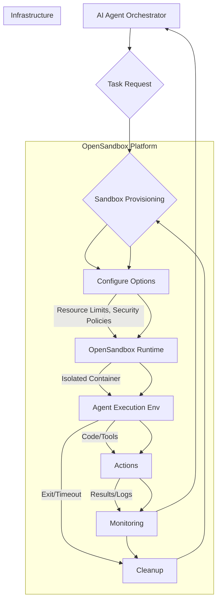

## OpenSandbox: AI Agent 런타임 보안 및 격리 강화 전략

AI 에이전트의 활용이 증대됨에 따라, 예측 불가능한 LLM 출력과 자율적인 도구 사용은 심각한 보안 및 안정성 문제를 야기할 수 있다. OpenSandbox는 이러한 문제에 대응하기 위한 AI 앱 전용 샌드박스 런타임으로, 안전하고 확장 가능한 실행 환경을 제공한다. 본 엔트리에서는 OpenSandbox의 주요 특징과 AI 에이전트 워크로드에 대한 도입 방안을 간략히 분석한다.

### AI 에이전트 런타임 보안 과제

자율 에이전트는 외부 도구(API, 코드 인터프리터, 파일 시스템)와 상호작용하며 복잡한 작업을 수행한다. 이 과정에서 **Prompt Injection 및 권한 상승**, **코드 실행 취약점**, **자원 고갈 공격**, **환경 오염** 같은 보안 및 안정성 위험이 발생할 수 있다. 강력한 격리 메커니즘을 갖춘 런타임 환경이 필수적이다.

### OpenSandbox 아키텍처 및 핵심 기능

OpenSandbox는 AI 에이전트를 위한 범용 샌드박스 플랫폼으로, Docker 및 Kubernetes 기반의 컨테이너화된 런타임을 제공한다. 주요 기능은 다음과 같다.

*   **강력한 격리**: 각 에이전트 세션을 독립적인 샌드박스에서 실행, 상호 간섭 및 호스트 시스템 위협을 차단한다.
*   **확장성**: 로컬부터 대규모 분산 스케줄링(Kubernetes)까지 지원, 워크로드 증가에 유연하게 대응한다.
*   **다중 언어 SDK**: Python, Java, Kotlin 등 다양한 언어 SDK를 제공하여 에이전트 통합을 용이하게 한다.
*   **자원 제어**: CPU, 메모리, 네트워크 등 자원 할당을 세밀하게 제어, 자원 고갈 공격을 방지한다.
*   **자동 환경 초기화**: 실행 전 환경을 설정하고, 실행 후 깨끗한 상태로 되돌린다.
*   **명령어 및 도구 접근 제어**: 샌드박스 내 실행 가능한 명령어와 외부 도구 접근을 화이트리스트 기반으로 제어한다.

### AI 에이전트 워커에 OpenSandbox 적용 시나리오

OpenSandbox는 특히 코드 생성, 스크립트 실행 등 잠재적으로 위험한 작업을 수행하는 AI 에이전트에 유용하다.

1.  **LLM 출력 검증 파이프라인**: LLM이 생성한 코드를 실제 배포 전 OpenSandbox 내에서 실행하여 기능 및 보안 취약점을 검증한다.
2.  **자율 코딩 에이전트**: 코드 탐색, 수정, 테스트를 수행하는 에이전트에 격리된 개발 환경을 제공하여 프로덕션 시스템 영향을 방지한다.

```python
# OpenSandbox Python SDK 예제 (개념적 코드)
from opensandbox import SandboxClient, SandboxOptions

client = SandboxClient(host="http://localhost:8080")
options = SandboxOptions(
    memory_limit="256MB",
    cpu_limit="0.5",
    network_enabled=False,
    allowed_commands=["python"],
    mount_volumes={".agent_code": "/app/code"},
    timeout_seconds=60
)

try:
    with client.run_sandbox(options) as sandbox:
        result = sandbox.execute_command(
            command=["python", "/app/code/my_agent.py"]
        )
        # print(f"Stdout: {result.stdout}")
        if result.exit_code != 0:
            raise Exception(f"Agent execution failed: {result.stderr}")
except Exception as e:
    # print(f"Error during sandbox execution: {e}")
    pass # 실제 사용 시 에러 처리 로직 추가
finally:
    pass # 샌드박스는 `with` 블록 종료 시 자동 정리.
```

### AI 에이전트 샌드박스 런타임 워크플로우



### 2026년 AI 에이전트 런타임 트렌드 반영

2026년에는 AI 에이전트의 역할 증대와 함께 런타임 환경 요구사항이 증가한다. OpenSandbox 같은 샌드박스 런타임은 필수적이다. **규제 준수**, **Multi-agent Collaboration**, **Edge AI Deployments**, **Zero-Trust Architecture** 구현에 핵심 역할을 수행한다.

### ## 트레이드오프

1.  **보안 강화 vs. 성능 오버헤드**:
    *   **언제 좋고**: 높은 수준의 보안(prompt injection 방어, 시스템 격리)이 필수적인 프로덕션 환경에 적합하다.
    *   **언제 나쁘고**: 극도의 저지연이 요구되거나 매우 단순한 작업에서 샌드박싱 오버헤드는 비효율적이다.
2.  **격리 수준 vs. 개발 및 디버깅 용이성**:
    *   **언제 좋고**: 외부 시스템 영향 최소화 및 독립적 테스트 환경 제공에 유용하다.
    *   **언제 나쁘고**: 호스트 자원 직접 접근 필요, 실시간 디버깅 시 격리 환경이 복잡성을 유발할 수 있다.

### ## 실전 체크리스트

AI 에이전트 런타임에 OpenSandbox를 도입할 때 다음 항목들을 검토하고 준비해야 한다.

- [ ] **샌드박스 이미지 최적화**: 에이전트 실행에 필요한 최소 종속성만 포함된 경량 이미지를 구성했는가?
- [ ] **자원 할당 정책 수립**: 에이전트 유형별 적절한 자원 제한을 설정, 이탈 에이전트의 자원 고갈을 방지하는가?
- [ ] **네트워크 및 파일 시스템 격리 검증**: 에이전트가 필요한 리소스에만 접근하도록 엄격한 정책을 적용, 불필요한 접근이 차단되는지 주기적으로 테스트하는가?
- [ ] **허용 명령어(Allowed Commands) 화이트리스트 구성**: 샌드박스 내 실행 가능한 외부 명령어를 명시적으로 등록, 임의 시스템 명령어 실행을 제어하는가?
- [ ] **로그 및 모니터링 통합**: 샌드박스 내부 에이전트 실행 로그, 자원 사용량을 중앙 로깅/모니터링 시스템과 통합하여 실시간 감시 및 이상 징후를 탐지하는가?