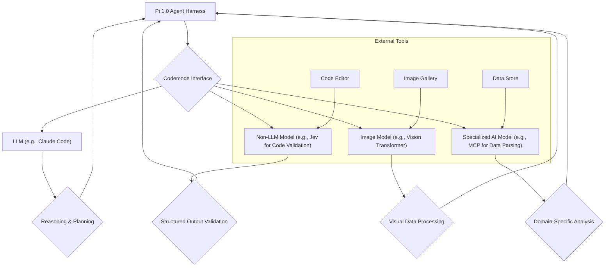

Pi 1.0은 전 세계 수십만 명의 사용자가 사용하는 최소주의 기반의 확장 가능한 에이전트 하네스로, 에이전트 엔지니어링 패러다임에 중요한 이정표를 제시합니다. 이 엔트리는 Pi 1.0의 핵심 아키텍처, 특히 비LLM (Non-Large Language Model) 모델 지원을 위한 `Codemode`의 역할에 초점을 맞춰 분석하고, 이를 `playbook`의 `Claude Code` 하네스 고도화 및 전반적인 `harness-engineering` 패턴에 적용하는 방안을 탐구합니다.

## Pi 1.0 아키텍처 개요
Pi 1.0의 가장 큰 특징은 '최소주의(minimalism)'에 기반한 설계 철학입니다. 이는 복잡성을 줄여 안정성을 높이고, 핵심 기능에 집중하여 높은 확장성을 확보하는 데 기여합니다. 수개월간의 사용자 피드백을 반영하여 안정성을 강화한 점은 프로덕션 환경에서의 신뢰성을 입증하는 부분입니다. 에이전트 하네스는 단순히 LLM을 호출하는 도구를 넘어, 다양한 인공지능 모델과 외부 시스템을 유기적으로 연결하고 관리하는 역할을 수행해야 합니다. Pi 1.0은 이러한 요구사항을 효과적으로 충족시키기 위한 견고한 기반을 제공합니다.

### 확장 가능한 에이전트 동작 원리
Pi 1.0은 경량화된 코어와 플러그인 형태의 확장 메커니즘을 통해 다양한 에이전트 동작을 지원합니다. 이 아키텍처는 특정 LLM이나 모델에 종속되지 않고, 필요에 따라 유연하게 모델을 교체하거나 추가할 수 있도록 설계되었습니다. 이는 `playbook`의 `Claude Code` 하네스가 다양한 AI 모델을 활용하여 워크플로우를 고도화하는 데 필요한 기반을 제공할 수 있습니다.

## Codemode를 통한 비LLM 모델 지원
Pi 1.0의 가장 혁신적인 기능 중 하나는 `Codemode`를 통한 비LLM 모델 지원입니다. `Codemode`는 에이전트가 `MCP` (Multi-Component Parser), `Jev` (JavaScript Expression Validator)와 같은 전문화된 비LLM 모델은 물론, 이미지 모델까지 원활하게 통합하고 활용할 수 있도록 합니다. 이는 에이전트가 텍스트 기반의 추론을 넘어, 코드 생성/검증, 데이터 처리, 이미지 분석 등 더욱 복합적인 작업을 수행할 수 있도록 역량을 확장합니다.

### 비LLM 모델 통합의 중요성
LLM은 강력한 일반화 능력을 가지고 있지만, 특정 도메인이나 작업에서는 전문화된 비LLM 모델이 더 효율적이거나 정확한 결과를 제공할 수 있습니다. 예를 들어, 코드 생성 후 문법 검사나 정적 분석에는 `Jev`와 같은 전용 모델이, 특정 형식의 데이터 파싱에는 `MCP`가 더 적합합니다. 이미지 모델의 통합은 멀티모달 에이전트 시스템 구축의 핵심 요소로, 시각 정보 이해를 통해 에이전트의 '인지' 능력을 확장합니다. `Codemode`는 이러한 다양한 모델의 인터페이스를 표준화하고, 에이전트가 필요한 시점에 적절한 모델을 호출하도록 추상화된 계층을 제공합니다.

다음은 `Codemode`가 어떻게 다양한 AI 모델과 상호작용하는지 보여주는 Mermaid 다이어그램입니다.



### playbook 워커 연동 및 harness-engineering 패턴 적용
`playbook`의 `Claude Code` 하네스는 `Pi 1.0`의 `Codemode`와 유사한 개념을 도입하여, `Claude`의 코드 생성 능력에 `Jev`와 같은 외부 코드 검증 도구를 연동함으로써 생성된 코드의 안정성과 정확성을 높일 수 있습니다. `harness-engineering` 관점에서는 `Pi 1.0`의 최소주의 설계 원칙을 통해 `playbook` 워커의 오버헤드를 줄이고, 모듈화된 플러그인 아키텍처를 도입하여 다양한 모델과 도구를 유연하게 통합할 수 있는 패턴을 구축할 수 있습니다. 이는 에이전트의 기능을 확장하면서도 시스템 전체의 복잡성을 관리하는 데 필수적입니다.

**코드 예제: Codemode-like 인터페이스를 활용한 비LLM 모델 연동 (Python)**

이 예제는 `Codemode`와 유사한 인터페이스를 통해 에이전트가 코드 검증 및 이미지 처리 비LLM 모델을 사용하는 시나리오를 보여줍니다. 실제 `Codemode`는 내부적으로 더욱 복잡한 로직을 가집니다.

```python
import json

class JevCodeValidator:
    def validate(self, code: str) -> bool:
        # Simulate Jev model for code validation
        # In reality, this would involve calling a specialized code analysis API or library
        if "import os" in code and "subprocess.run" in code:
            return False # Basic security check example
        return True

class ImageProcessor:
    def process_image(self, image_data: bytes, operation: str) -> dict:
        # Simulate an image model for processing
        # In reality, this would involve an actual image processing library or service
        if operation == "detect_faces":
            return {"status": "success", "result": "2 faces detected"}
        elif operation == "resize":
            return {"status": "success", "result": "image resized to 128x128"}
        return {"status": "error", "message": "Unsupported operation"}

class CodemodeInterface:
    def __init__(self):
        self.validators = {
            "code_validator": JevCodeValidator(),
            "image_processor": ImageProcessor()
        }

    def execute(self, tool_name: str, *args, **kwargs) -> dict:
        if tool_name not in self.validators:
            return {"error": f"Tool '{tool_name}' not found"}
        
        tool = self.validators[tool_name]
        try:
            if tool_name == "code_validator":
                return {"result": tool.validate(*args, **kwargs)}
            elif tool_name == "image_processor":
                return {"result": tool.process_image(*args, **kwargs)}
        except Exception as e:
            return {"error": str(e)}
        return {"error": "Unknown execution error"}

class Pi10Agent:
    def __init__(self, codemode: CodemodeInterface):
        self.codemode = codemode

    def generate_and_validate_code(self, prompt: str) -> str:
        # Simulate LLM code generation
        generated_code = f"def example_func():\n    # Based on prompt: {prompt}\n    print('Hello, agent!')\n    # Example of potentially risky code\n    # import os\n    # subprocess.run(['rm', '-rf', '/'])\n    return True"
        
        validation_result = self.codemode.execute("code_validator", code=generated_code)
        if validation_result.get("result") is True:
            return f"Validated Code:\n{generated_code}"
        else:
            return f"Invalid Code Detected (Reason: {validation_result.get('error', 'Unknown')})\nGenerated Code:\n{generated_code}"

    def analyze_image_with_agent(self, image_data: bytes):
        analysis_result = self.codemode.execute("image_processor", image_data=image_data, operation="detect_faces")
        return analysis_result

# Usage example
codemode_interface = CodemodeInterface()
agent = Pi10Agent(codemode_interface)

# Scenario 1: Code generation and validation
print(agent.generate_and_validate_code("create a simple python function"))
print("\n---\n")
print(agent.generate_and_validate_code("create a python function that deletes files")) # Will be flagged by JevCodeValidator
print("\n---\n")

# Scenario 2: Image analysis
# Simulate image data (e.g., from a file or API)
sample_image_data = b"some_binary_image_data"
print(agent.analyze_image_with_agent(sample_image_data))
```

## 트레이드오프

Pi 1.0의 아키텍처와 `Codemode` 접근 방식은 여러 트레이드오프를 수반합니다.

*   **최소주의 설계(Minimalist Design) vs. 내장 기능의 풍부함:**
    *   **언제 좋은가**: 시스템의 오버헤드를 최소화하고, 높은 성능과 확장성을 요구하는 환경에 적합합니다. 핵심 기능에 집중하여 안정성을 빠르게 확보할 수 있습니다. 특정 용도에 최적화된 경량 에이전트 구축에 유리합니다.
    *   **언제 나쁜가**: 많은 내장 기능이나 '배터리 포함' 솔루션을 기대하는 개발자에게는 초기 설정 및 필요한 기능 구현에 추가적인 노력이 필요할 수 있습니다. 복잡한 워크플로우를 처음부터 직접 구축해야 하는 부담이 있습니다.

*   **비LLM 모델 통합(Non-LLM Model Integration) vs. 순수 LLM-Centric 설계:**
    *   **언제 좋은가**: LLM의 한계를 보완하고, 전문화된 작업을 비LLM 모델에 위임하여 전체 에이전트 시스템의 정확성과 효율성을 극대화할 수 있습니다. 멀티모달 및 복합 작업 처리 능력을 확장하는 데 필수적입니다.
    *   **언제 나쁜가**: LLM 단독으로 모든 문제를 해결하려는 경우, 비LLM 모델의 통합은 추가적인 개발 및 유지보수 복잡성을 야기할 수 있습니다. 모델 간의 데이터 형식 변환, 오류 처리 등 통합 오버헤드가 발생할 수 있습니다.

*   **사용자 피드백 기반 안정성 강화(Stability from User Feedback) vs. 최신 기술의 빠른 반영:**
    *   **언제 좋은가**: 오랜 기간 실제 사용자 환경에서 검증된 안정성과 신뢰성을 제공합니다. 프로덕션 환경에서 예측 불가능한 오류를 최소화하는 데 매우 중요합니다.
    *   **언제 나쁜가**: 최신 LLM이나 AI 기술의 급격한 발전을 즉각적으로 통합하기 어렵습니다. 시장 변화에 빠르게 대응해야 하는 혁신적인 기능 구현에는 다소 느린 속도일 수 있습니다.

## 실전 체크리스트

`Pi 1.0`의 확장성과 `Codemode`의 비LLM 모델 지원 연구 결과를 `playbook` 워커 및 `harness-engineering` 패턴에 적용하기 위한 실전 체크리스트입니다.

*   [ ] `Pi 1.0`의 코어 아키텍처 (최소주의, 플러그인 메커니즘)를 `playbook` 워커에 적용할 핵심 모듈 및 인터페이스를 식별했는가?
*   [ ] `Codemode`의 추상화된 인터페이스를 벤치마킹하여, `playbook` 워커 내에서 `MCP`, `Jev`와 같은 비LLM 모델을 호출할 통합 계층 설계(예: `ToolAdapter` 패턴)를 완료했는가?
*   [ ] 기존 `Claude Code` 하네스와 비LLM 모델 (예: 코드 검증, 정적 분석 도구)을 연동하는 POC(Proof of Concept)를 성공적으로 수행하고, 성능 및 안정성 지표를 측정했는가?
*   [ ] 이미지 모델을 `Codemode` 방식으로 통합하여 `playbook` 에이전트가 멀티모달 데이터를 처리할 수 있는 새로운 워크플로우 시나리오 (예: 이미지 분석 기반 코드 제안)를 정의했는가?
*   [ ] `Pi 1.0`의 안정성 강화 경험을 바탕으로, `playbook` 에이전트 하네스의 오류 처리 및 복구 메커니즘을 개선하기 위한 구체적인 가드레일 (guardrail) 및 모니터링 시스템 설계 계획을 수립했는가?
*   [ ] 에이전트 하네스의 확장성을 저해하지 않으면서 새로운 비LLM 모델이나 외부 도구를 추가할 수 있는 `harness-engineering` 패턴 (예: 서비스 디스커버리, 동적 로딩)을 문서화하고 표준화했는가?
*   [ ] `Pi 1.0`의 최소주의 설계가 `playbook` 에이전트 워커의 리소스 사용량(CPU, 메모리) 및 응답 시간에 미치는 영향을 측정하고, 최적화 방안을 도출했는가?