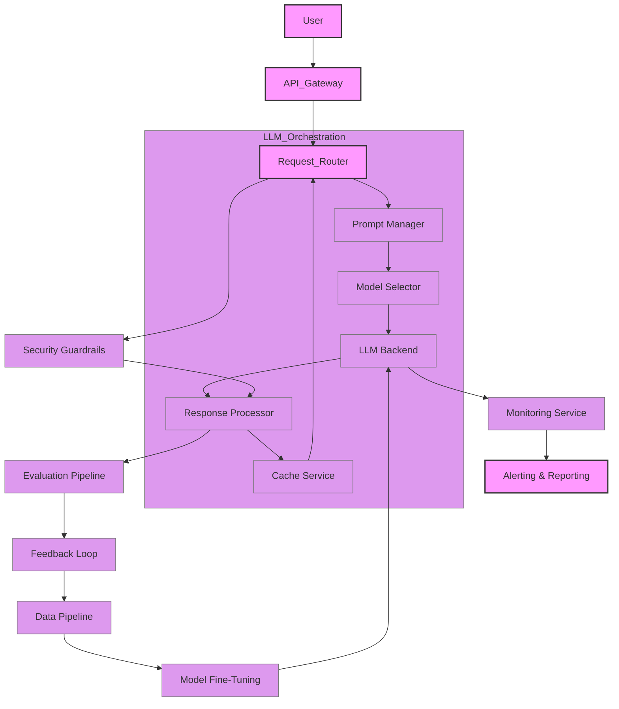

LLM(Large Language Model) 서비스의 프로덕션 배포는 단순한 모델 서빙을 넘어섭니다. 모델의 비결정성, 높은 컴퓨팅 리소스 요구사항, 지속적인 성능 모니터링 및 개선 필요성 등으로 인해 복잡성과 도전 과제가 증폭됩니다. 안정적이고 확장 가능하며 비용 효율적인 LLM 서비스를 제공하기 위해서는 잘 설계된 Harness 시스템이 필수적입니다. Harness 시스템은 LLM의 생명주기 전반에 걸쳐 배포, 모니터링, 평가, 최적화를 자동화하고 관리하는 인프라 및 도구의 집합입니다. 이는 LLM 애플리케이션의 신뢰성과 운영 효율성을 극대화하는 핵심 요소입니다.

## Harness 시스템의 핵심 구성 요소

프로덕션 LLM Harness 시스템은 다음 핵심 구성 요소들을 포함해야 합니다.

### 1. 요청 라우팅 및 오케스트레이션 (Request Routing & Orchestration)

다양한 LLM 모델(예: Claude, GPT, Gemini)과 버전을 효율적으로 관리하고, 사용자 요청에 따라 최적의 모델로 라우팅하는 기능입니다. 이를 통해 비용, 성능, 기능 요구사항에 맞춰 유연하게 대응할 수 있습니다. 프롬프트 버전 관리와 A/B 테스트를 위한 동적 라우팅도 여기에 포함됩니다.

### 2. 모니터링 및 관측 가능성 (Monitoring & Observability)

LLM 서비스의 성능, 안정성, 비용을 실시간으로 추적하는 시스템입니다. API 호출 성공률, 지연 시간, 처리량, 토큰 사용량, 에러율 등 핵심 지표를 수집하고 시각화합니다. 특히, 2026년 트렌드에서는 LLM 응답의 비결정성으로 인한 '모델 드리프트(model drift)'와 '성능 저하(performance degradation)'를 조기에 감지하는 능동적인 모니터링이 강조됩니다. 트레이싱(tracing)을 통해 복잡한 프롬프트 체인 내에서 각 단계의 동작과 병목 현상을 파악하는 것도 중요합니다.

### 3. 자동화된 평가 및 피드백 루프 (Automated Evaluation & Feedback Loops)

LLM 응답의 품질을 정량적으로 평가하고, 사용자 피드백을 수집하여 모델 개선에 활용하는 메커니즘입니다. 환각(hallucination) 감지, 관련성, 유용성, 안전성 등 다양한 측면에서 LLM 출력을 평가하는 자동화된 파이프라인을 구축해야 합니다. 인간 전문가의 개입(Human-in-the-Loop)을 통해 미묘한 오류나 개선점을 식별하고, 이를 데이터셋으로 피드백하여 모델을 재학습하는 지속적인 개선 주기를 확립합니다.

### 4. 데이터 관리 및 전처리 (Data Management & Preprocessing)

LLM 입력과 출력 데이터를 효율적으로 관리하고, 필요한 경우 전처리(sanitization, PII redaction)를 수행합니다. 캐싱 전략을 통해 반복적인 프롬프트에 대한 LLM 호출을 줄여 비용과 지연 시간을 최적화합니다. RAG(Retrieval Augmented Generation) 패턴을 사용하는 경우, 검색 관련성 및 지연 시간 관리가 중요합니다.

### 5. 보안 및 규정 준수 (Security & Compliance)

민감 정보(PII) 유출 방지, API 키 관리, 출력 내용에 대한 안전성 가드레일(guardrails)을 구현합니다. 프롬프트 인젝션(prompt injection)과 같은 보안 위협에 대응하고, 규정 준수 요구사항을 충족하기 위한 데이터 보존 및 감사 로깅을 제공합니다.

## LLM Harness 시스템 아키텍처 예시

다음은 LLM Harness 시스템의 일반적인 아키텍처를 보여주는 Mermaid 다이어그램입니다.



## 코드 예시: Harness Wrapper (Python)

아래 Python 코드는 LLM API 호출을 감싸는 간단한 Harness Wrapper를 보여줍니다. 이 Wrapper는 로깅, 지연 시간 측정, 재시도 로직을 포함하여 프로덕션 환경에서 LLM 호출의 안정성을 높입니다.

```python
import time
import logging
from tenacity import retry, wait_exponential, stop_after_attempt, RetriableError

# Configure logging
logging.basicConfig(level=logging.INFO, format='%(asctime)s - %(levelname)s - %(message)s')

class LLMHarness:
    def __init__(self, llm_client, model_name="gpt-4o-2024-05-13", max_retries=3):
        self.llm_client = llm_client
        self.model_name = model_name
        self.max_retries = max_retries

    @retry(
        wait=wait_exponential(multiplier=1, min=4, max=10),
        stop=stop_after_attempt(3),
        reraise=True # Re-raise the last exception after all retries fail
    )
    def _call_llm_with_retry(self, prompt, **kwargs):
        try:
            start_time = time.time()
            logging.info(f"Calling LLM: {self.model_name} with prompt hash: {hash(prompt)}")
            # Simulate LLM API call
            # In a real scenario, this would be self.llm_client.chat.completions.create(...)
            response = self.llm_client.generate(model=self.model_name, prompt=prompt, **kwargs)
            end_time = time.time()
            duration = (end_time - start_time) * 1000 # milliseconds
            logging.info(f"LLM call successful. Duration: {duration:.2f}ms")
            return response
        except Exception as e:
            logging.error(f"LLM call failed: {e}")
            raise RetriableError(f"LLM API error: {e}") # Raise RetriableError for tenacity

    def generate_response(self, prompt, temperature=0.7, max_tokens=150, **kwargs):
        try:
            # Add context for prompt versioning or A/B testing here if needed
            # For example, dynamically select a model or apply a prompt template
            response_data = self._call_llm_with_retry(
                prompt,
                temperature=temperature,
                max_tokens=max_tokens,
                **kwargs
            )
            # Post-process response, e.g., apply safety filters
            processed_response = self._post_process_response(response_data.text)
            return processed_response
        except RetriableError as e:
            logging.critical(f"All LLM retries failed after {self.max_retries} attempts: {e}")
            # Implement fallback logic, e.g., default response, human handoff
            return "An error occurred, please try again later."

    def _post_process_response(self, text_response):
        # Implement output sanitization, PII redaction, guardrails here
        if "unsafe_keyword" in text_response.lower():
            logging.warning("Unsafe keyword detected in LLM response.")
            return "I cannot provide a response containing that information."
        return text_response

# Example Usage (Mock LLM Client)
class MockLLMClient:
    def generate(self, model, prompt, **kwargs):
        if "fail" in prompt:
            raise ValueError("Simulated LLM failure")
        return type('obj', (object,), {'text': f"Response for '{prompt[:30]}...' from {model}"})()

mock_client = MockLLMClient()
llm_harness = LLMHarness(mock_client, model_name="my-custom-gpt-model")

# Successful call
print(llm_harness.generate_response("What is the capital of France?"))

# Failing call (will retry)
print(llm_harness.generate_response("Simulate a fail here."))

```

## 트레이드오프

LLM Harness 시스템 설계 시 고려해야 할 주요 트레이드오프는 다음과 같습니다.

*   **복잡성 vs. 안정성**: 견고한 Harness 시스템은 초기 개발 및 유지보수 복잡성을 증가시킵니다. 시스템이 복잡해질수록 개발 리소스는 더 많이 요구되지만, 장기적으로는 서비스의 안정성과 신뢰성을 크게 향상시켜 운영 비용을 절감합니다. 소규모 또는 실험적인 프로젝트에서는 최소한의 Harness로 시작하고, 프로덕션 스케일로 확장될 때 점진적으로 고도화하는 것이 효율적입니다.
*   **유연성 vs. 성능 최적화**: 다양한 LLM 모델과 API를 지원하는 유연한 Harness는 비즈니스 요구 변화에 빠르게 대응할 수 있도록 합니다. 하지만 특정 모델이나 API에 고도로 최적화된 시스템은 더 나은 성능과 비용 효율을 제공할 수 있습니다. 예를 들어, 한 가지 LLM만 사용하는 경우에는 해당 LLM에 특화된 최적화가 유리하며, 여러 LLM을 사용하는 경우에는 동적 라우팅 및 표준화된 인터페이스가 더 중요합니다.
*   **실시간 모니터링 vs. 컴퓨팅 오버헤드**: 상세한 모니터링 및 로깅은 문제 진단과 성능 최적화에 필수적입니다. 그러나 모든 LLM 호출 및 응답에 대한 과도한 데이터 수집은 추가적인 컴퓨팅 리소스와 저장 공간을 요구하며, LLM 추론 지연 시간을 증가시킬 수 있습니다. 따라서 핵심 지표를 중심으로 모니터링 수준을 조절하고, 샘플링(sampling) 기법을 활용하여 오버헤드를 최소화하는 전략이 필요합니다.
*   **자동화된 평가 vs. 인간 개입의 정확성**: LLM 응답에 대한 자동화된 평가는 빠른 피드백과 대규모 분석을 가능하게 합니다. 하지만 미묘한 의미 차이, 주관적인 품질 판단, 또는 복잡한 안전성 기준에 대해서는 인간의 개입(Human-in-the-Loop)이 더 정확하고 필수적일 수 있습니다. 자동화된 평가와 전문가 검토의 균형을 찾아 효율성과 정확성을 동시에 확보하는 것이 중요합니다.

## 실전 체크리스트

LLM Harness 시스템을 프로젝트에 적용할 때 다음 항목들을 검증하여 성공적인 배포를 위한 기반을 다집니다.

*   [ ] 모든 LLM API 호출에 대해 성공/실패, 지연 시간, 사용된 토큰 수(입력/출력) 등 핵심 메트릭이 수집되고 대시보드에서 시각화되는가?
*   [ ] LLM API 오류 발생 시, 지수 백오프(exponential backoff)를 포함한 재시도 로직이 구현되었으며, 특정 횟수 실패 시 대체 LLM으로 자동 전환되는가?
*   [ ] LLM 응답에서 PII(개인 식별 정보)가 감지될 경우, 자동 마스킹 또는 로그 기록 방지 메커니즘이 작동하는가?
*   [ ] 프롬프트 템플릿의 버전 관리가 이루어지고 있으며, 이전 버전으로의 롤백이 가능하고, 각 프롬프트 버전별 성능 메트릭이 추적되는가?
*   [ ] LLM 출력의 환각(hallucination)을 탐지하기 위한 자동화된 평가 스크립트가 주기적으로 실행되며, 특정 임계치 초과 시 알림이 발생하는가?
*   [ ] 피크 트래픽 상황에서 LLM 서비스의 지연 시간 및 처리량이 정의된 SLA(Service Level Agreement)를 충족하는지 부하 테스트를 통해 검증되었는가?
*   [ ] 새로운 LLM 모델 버전 또는 프롬프트 변경이 배포될 때, canary 배포 또는 A/B 테스트를 통해 기존 성능에 미치는 영향이 최소화되는지 확인하는 프로세스가 있는가?