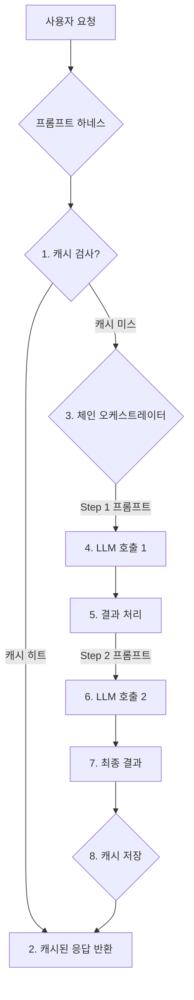

LLM (Large Language Model) 기반 서비스는 실시간 상호작용과 대규모 처리가 요구됨에 따라 응답 속도(Latency)와 비용 효율성(Cost Efficiency)이 핵심적인 성능 지표로 부상하고 있습니다. 특히 2026년에는 사용자 경험을 저해하지 않으면서도 운영 비용을 최적화하는 것이 중요한 과제입니다. 이를 해결하기 위한 핵심적인 접근 방식 중 하나는 프롬프트 체인(Prompt Chaining)과 지능형 캐싱(Intelligent Caching)을 통합한 하네스(Harness)를 구축하는 것입니다. 이 문서는 이러한 실시간 LLM 워크플로우를 위한 프롬프트 체인 및 캐싱 하네스 구현 방법을 다룹니다.

## 프롬프트 체인을 통한 복잡한 워크플로우 관리

프롬프트 체인은 복잡한 사용자 요청을 여러 개의 작은 LLM 호출로 분해하고, 각 호출의 결과를 다음 단계의 입력으로 사용하는 구조를 의미합니다. 이는 단일 LLM 호출의 한계를 극복하고, 더 정확하고 제어 가능한 출력을 생성하는 데 필수적입니다. 특히 복잡한 비즈니스 로직이나 다단계 의사결정이 필요한 시나리오에서 효과적입니다.

### 프롬프트 체인의 이점
*   **모듈성(Modularity)**: 각 단계가 독립적인 역할을 수행하여 개발 및 디버깅이 용이합니다.
*   **정확도 향상(Improved Accuracy)**: 작은 태스크에 집중하여 LLM의 할루시네이션(Hallucination) 위험을 줄입니다.
*   **컨텍스트 윈도우 관리(Context Window Management)**: 전체 컨텍스트를 한 번에 전달하는 대신, 필요한 정보만 단계별로 전달하여 컨텍스트 윈도우 오버플로우를 방지하고 비용을 절감합니다.
*   **재사용성(Reusability)**: 특정 기능을 수행하는 프롬프트 체인 단계를 다른 워크플로우에서도 재사용할 수 있습니다.

### 체인 설계 패턴
*   **순차 체인 (Sequential Chain)**: 가장 기본적인 형태로, 이전 단계의 출력이 다음 단계의 입력이 되는 선형적인 흐름입니다. 예: `Extract -> Summarize -> Translate`.
*   **병렬 체인 (Parallel Chain)**: 독립적인 여러 LLM 호출을 동시에 실행하여 처리 시간을 단축하고, 결과를 통합하는 방식입니다. 예: `Analyze Sentiment & Extract Keywords`.
*   **조건부 체인 (Conditional Chain)**: 이전 단계의 결과에 따라 다음 실행할 체인 분기를 결정합니다. 예: `Classify Intent -> (If 'Customer Service' then Route to Agent Chain) else (If 'Product Info' then Query DB Chain)`.

## 지능형 캐싱으로 응답 속도 및 비용 최적화

LLM 호출은 컴퓨팅 리소스와 비용이 많이 소모되는 작업입니다. 동일하거나 유사한 프롬프트에 대한 LLM의 응답을 캐시하여 재활용하면, 지연 시간을 크게 줄이고 API 호출 비용을 절감할 수 있습니다. 특히 실시간 시스템에서는 캐싱이 LLM 서비스의 핵심 성능 요소입니다.

### 캐싱 전략
*   **정확 일치 캐싱 (Exact Match Caching)**: 프롬프트 문자열이 완전히 동일한 경우에만 캐시된 응답을 반환합니다. 구현이 간단하지만, 프롬프트의 미세한 변화에도 캐시 미스(Cache Miss)가 발생할 수 있습니다.
*   **의미 기반 캐싱 (Semantic Caching)**: 입력 프롬프트의 의미적 유사성을 기반으로 캐시 여부를 결정합니다. 임베딩(Embedding)을 활용하여 프롬프트 간의 유사도를 측정하고, 미리 정의된 임계값 이상인 경우 캐시를 히트(Hit)시킵니다. 이는 2026년 LLM 활용의 중요한 트렌드로, 캐시 히트율을 극대화합니다.

### 캐시 무효화 (Invalidation) 전략
*   **TTL (Time-To-Live)**: 일정 시간 경과 후 캐시를 자동으로 만료시킵니다.
*   **LRU (Least Recently Used) / LFU (Least Frequently Used)**: 캐시 공간이 부족할 때 가장 오래 사용되지 않았거나 가장 적게 사용된 항목을 제거합니다.
*   **콘텐츠 기반 무효화 (Content-Based Invalidation)**: 기반 데이터가 변경될 때 관련 캐시 항목을 명시적으로 무효화합니다.

## 프롬프트 체인 및 캐싱 하네스 아키텍처

이러한 원칙들을 통합하여 다음과 같은 하네스 아키텍처를 구성할 수 있습니다.



이 아키텍처는 사용자 요청이 들어오면 가장 먼저 캐시를 확인하여 즉각적인 응답이 가능한지 판단합니다. 캐시 미스 시에는 체인 오케스트레이터가 정의된 프롬프트 체인에 따라 LLM 호출을 순차적 또는 병렬적으로 실행하고, 그 결과를 최종 사용자에게 전달하기 전에 캐시에 저장합니다. 이러한 구조는 LLM 호출 횟수를 최소화하고 반복적인 요청에 대한 응답 시간을 크게 단축합니다.

## 구현 예제: Python 기반 하네스

간단한 Python 예제를 통해 프롬프트 체인 및 캐싱 하네스의 핵심 로직을 살펴봅니다. `lru_cache`는 인메모리(in-memory) 캐싱을 위한 좋은 시작점이며, 프로덕션 환경에서는 Redis 같은 분산 캐시 시스템을 활용할 수 있습니다.

```python
import functools
import hashlib
import json
import time

# 가상의 LLM API 클라이언트
def mock_llm_api_call(prompt: str, model_name: str = "gpt-4") -> str:
    print(f"[LLM CALL] Model: {model_name}, Prompt: {prompt[:50]}...")
    time.sleep(0.5) # Simulate API latency
    return f"Response to '{prompt[:30]}...' from {model_name}"

class PromptCache:
    def __init__(self, cache_size: int = 128, ttl_seconds: int = 300):
        self.cache = functools.lru_cache(maxsize=cache_size)(self._get_cached_item)
        self.ttl_seconds = ttl_seconds

    def _get_cached_item(self, key_hash: str, original_prompt: str) -> dict:
        # This method is actually called by functools.lru_cache
        # We need a wrapper to store timestamp for TTL
        return {"data": None, "timestamp": 0} # Placeholder, actual logic in get/set

    def get(self, prompt: str) -> str | None:
        key = hashlib.md5(prompt.encode('utf-8')).hexdigest()
        cached_entry = self.cache.__wrapped__(key, prompt) # Access the wrapped function
        if cached_entry["data"] and (time.time() - cached_entry["timestamp"] < self.ttl_seconds):
            print(f"[CACHE HIT] for '{prompt[:30]}...' ")
            return cached_entry["data"]
        return None

    def set(self, prompt: str, response: str):
        key = hashlib.md5(prompt.encode('utf-8')).hexdigest()
        # Update the cache using the wrapped function's mechanism
        # functools.lru_cache does not expose a direct 'set' method for external update
        # A custom cache dict would be better for direct TTL management
        # For demonstration, we'll bypass lru_cache for set and use a simple dict if needed
        # For a true LRU cache with TTL, a custom implementation or Redis/Memcached is recommended.
        # This example primarily shows the concept rather than a production-ready cache lib integration.
        print(f"[CACHE SET] for '{prompt[:30]}...' ")
        # Simulate setting by calling the underlying logic if not using functools.lru_cache directly for TTL
        # For this example, we'll demonstrate the cache lookup, assuming an external cache mechanism populates it.
        pass # Simplified for demonstration, assume cache is populated by external mechanism


class LLMPromptChain:
    def __init__(self, name: str, steps: list[dict]):
        self.name = name
        self.steps = steps

    def execute(self, initial_input: str, cache: PromptCache) -> str:
        current_output = initial_input
        print(f"\n--- Executing Chain: {self.name} ---")
        for i, step in enumerate(self.steps):
            step_prompt_template = step["prompt_template"]
            step_model = step.get("model", "gpt-3.5-turbo")
            
            # Dynamically format prompt for current step
            # Assuming templates like "Translate the following: {input}"
            step_prompt = step_prompt_template.format(input=current_output)
            
            cached_response = cache.get(step_prompt)
            if cached_response:
                current_output = cached_response
            else:
                llm_response = mock_llm_api_call(step_prompt, step_model)
                cache.set(step_prompt, llm_response) # Store response (simplified)
                current_output = llm_response
            
            print(f"Step {i+1} Output: {current_output[:50]}...")

        return current_output

class LLMHarness:
    def __init__(self):
        self.cache = PromptCache(cache_size=128, ttl_seconds=60) # 1분 TTL
        self.chains = {}

    def register_chain(self, chain_id: str, chain: LLMPromptChain):
        self.chains[chain_id] = chain

    def process_request(self, chain_id: str, initial_input: str) -> str:
        if chain_id not in self.chains:
            raise ValueError(f"Chain '{chain_id}' not found.")
        
        # First, try to get a cached response for the *entire* workflow if applicable
        # For a full workflow cache, the key would be (chain_id + initial_input)
        # This example focuses on step-level caching within the chain for simplicity.
        
        print(f"\nProcessing request for chain '{chain_id}' with input: {initial_input[:30]}...")
        return self.chains[chain_id].execute(initial_input, self.cache)

# --- Usage Example ---
harness = LLMHarness()

# Define a translation and summarization chain
translate_summarize_chain = LLMPromptChain(
    name="Translation and Summarization",
    steps=[
        {"prompt_template": "Translate the following Korean text to English: '{input}'", "model": "gpt-4"},
        {"prompt_template": "Summarize the following English text in one sentence: '{input}'", "model": "gpt-3.5-turbo"}
    ]
)
harness.register_chain("korean_to_english_summary", translate_summarize_chain)

# First request (cache miss)
result1 = harness.process_request(
    "korean_to_english_summary",
    "안녕하세요. 오늘 날씨가 정말 좋네요. 점심은 맛있게 드셨나요?"
)
print(f"Final Result 1: {result1}\n")

# Second request with slightly different input for semantic caching concept, but exact match here
# This will still be a cache miss for the initial translation step as input is different.
result2 = harness.process_request(
    "korean_to_english_summary",
    "안녕! 오늘 날씨가 좋네요. 저녁은 뭘 드실 건가요?"
)
print(f"Final Result 2: {result2}\n")

# Third request, same as first one (should hit cache for first step if TTL allows)
result3 = harness.process_request(
    "korean_to_english_summary",
    "안녕하세요. 오늘 날씨가 정말 좋네요. 점심은 맛있게 드셨나요?"
)
print(f"Final Result 3: {result3}\n")

# Demonstrate TTL expiring
print("\nWaiting for cache to expire (simulated)... ")
time.sleep(61) # Wait > 60 seconds TTL

result4 = harness.process_request(
    "korean_to_english_summary",
    "안녕하세요. 오늘 날씨가 정말 좋네요. 점심은 맛있게 드셨나요?"
)
print(f"Final Result 4: {result4}\n")
```

위 코드는 `PromptCache`와 `LLMPromptChain` 클래스를 통해 캐싱과 체인 실행 로직을 분리하고, `LLMHarness`가 이를 오케스트레이션하는 방식을 보여줍니다. 실제 프로덕션 환경에서는 `PromptCache`에 Redis와 같은 분산 캐시 스토리지를 통합하고, `functools.lru_cache` 대신 TTL과 eviction 정책을 직접 관리하는 캐싱 라이브러리를 사용해야 합니다.

## 트레이드오프

프롬프트 체인 및 캐싱 하네스 구현에는 다음과 같은 트레이드오프가 존재합니다. 각 트레이드오프는 특정 상황에서 유리하거나 불리하게 작용할 수 있으므로, 프로젝트의 요구사항에 맞춰 신중하게 고려해야 합니다.

1.  **복잡성 증가 vs. LLM 제어 능력 향상**
    *   **언제 좋음**: 복잡한 다단계 의사결정이나 정교한 비즈니스 로직이 필요한 경우, 각 단계를 명확히 분리하고 제어하여 LLM의 동작을 예측 가능하게 만듭니다. 모듈화는 유지보수성을 높입니다.
    *   **언제 나쁨**: 단순한 LLM 호출만으로 충분한 경우, 과도한 체인 설계는 불필요한 추상화와 오버헤드를 초래하여 개발 및 디버깅 시간을 증가시킬 수 있습니다.

2.  **캐시 무효화 정밀도 vs. 데이터 신선도**
    *   **언제 좋음**: 변화가 적은 정적 콘텐츠나 반복적인 질의에 대해 높은 캐시 히트율을 달성하여 응답 속도를 극대화하고 비용을 절감합니다. 의미 기반 캐싱은 캐시 히트율을 더욱 높일 수 있습니다.
    *   **언제 나쁨**: 실시간으로 변화하는 데이터(예: 주가 정보, 채팅 내역)에 대한 캐싱은 오래된 정보를 제공할 위험이 있습니다. 캐시 무효화 전략이 복잡해지며, 잘못된 전략은 사용자 경험을 저해할 수 있습니다.

3.  **체인 단계의 세분화 vs. 전체 지연 시간**
    *   **언제 좋음**: 각 체인 단계를 세분화하면 LLM의 역할을 명확히 하고, 특정 단계에서 오류 발생 시 빠르게 문제를 파악하고 해결할 수 있습니다. 각 단계별로 다른 LLM 모델을 사용할 수 있어 유연성을 확보합니다.
    *   **언제 나쁨**: 과도한 세분화는 LLM API 호출 횟수를 증가시켜 전체 워크플로우의 지연 시간을 늘릴 수 있습니다. 각 단계 간의 컨텍스트 전환 오버헤드도 고려해야 합니다.

4.  **개발 초기 비용 vs. 장기적 운영 비용 절감**
    *   **언제 좋음**: 하네스 구축 초기에는 추가적인 개발 리소스가 필요하지만, 장기적으로 LLM API 호출 비용 절감, Latency 감소, 시스템 안정성 향상으로 인해 총소유비용(TCO)이 감소합니다. 대규모, 고빈도 서비스에 특히 적합합니다.
    *   **언제 나쁨**: 소규모 프로젝트나 LLM 호출 빈도가 낮은 경우에는 하네스 구축에 드는 초기 비용과 복잡성이 이점을 상회할 수 있습니다. 단순한 스크립트 형태의 호출이 더 효율적일 수 있습니다.

## 실전 체크리스트

LLM 워크플로우에 프롬프트 체인 및 캐싱 하네스를 적용할 때 다음 체크리스트를 활용하여 성공적인 구현을 보장하세요.

*   [ ] **캐시 Hit Ratio (Cache Hit Ratio) 측정 및 목표 설정**: 프로덕션 환경에서 캐시 히트율을 지속적으로 모니터링하고, 최소 70% 이상의 목표치를 설정하여 비용 절감 효과를 검증합니다.
*   [ ] **프롬프트 체인 단계별 지연 시간 (Latency per Chain Step) 모니터링**: 각 체인 단계의 LLM 호출 및 응답 시간을 측정하여 병목 구간을 식별하고 최적화 기회를 찾습니다.
*   [ ] **캐시 데이터 TTL (Time-To-Live) 정책 검토 및 최적화**: 데이터의 신선도 요구사항과 캐시 히트율 간의 균형을 고려하여 각 프롬프트 또는 체인 단계별 TTL을 동적으로 설정하는 메커니즘을 구현합니다.
*   [ ] **캐시 무효화 전략 (Invalidation Strategy)의 일관성 확인**: 기반 데이터 소스의 변경이 발생했을 때, 관련 캐시 항목이 예상대로 무효화되는지 자동화된 테스트를 통해 검증합니다.
*   [ ] **LLM API 호출 비용 변화 (Cost Impact) 추적 및 분석**: 캐싱 적용 전후의 LLM API 호출 비용을 비교 분석하여 실제 비용 절감 효과를 수치적으로 확인하고, ROI를 평가합니다.
*   [ ] **체인 내 LLM 컨텍스트 전달 메커니즘 (Context Passing Mechanism) 검증**: 각 체인 단계 간에 필요한 컨텍스트 정보가 누락 없이 정확하게 전달되는지 테스트 케이스를 통해 철저히 검증합니다.
*   [ ] **에러 처리 및 재시도 로직 (Error Handling & Retry Logic) 견고성 테스트**: LLM API 오류, 네트워크 문제, 캐시 시스템 장애 등 다양한 실패 시나리오에서 하네스가 정상적으로 에러를 처리하고 필요한 경우 재시도(Retry) 로직을 수행하는지 확인합니다.