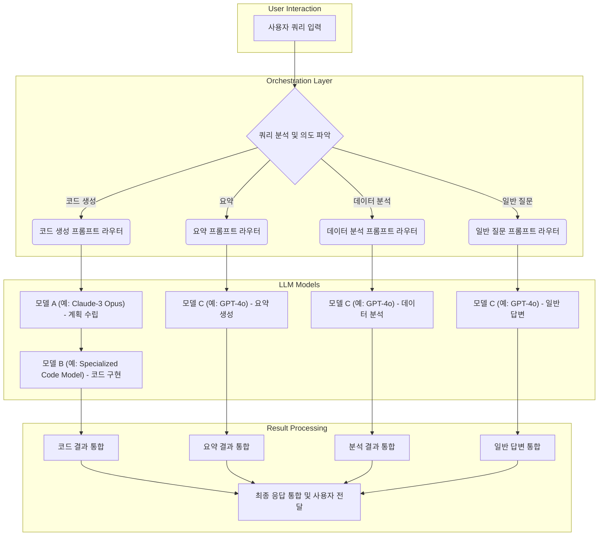

## 프롬프트 오케스트레이션의 필요성: 대규모 AI 시스템의 복잡성 관리

대규모 AI 시스템, 특히 다수의 LLM (Large Language Model) 또는 AI 에이전트가 상호작용하는 환경에서는 단순한 단일 프롬프트로는 복잡한 태스크를 효과적으로 처리하기 어렵습니다. 이러한 시스템은 여러 단계의 추론, 다양한 도구 사용, 그리고 동적인 의사결정을 필요로 하며, 이때 프롬프트 오케스트레이션(Prompt Orchestration)은 모델 간의 효율적인 상호작용과 전체 워크플로우를 관리하는 핵심적인 역할을 수행합니다. 프롬프트 오케스트레이션은 개별 프롬프트의 최적화를 넘어, 일련의 프롬프트 호출을 구조화하고 조정하여 시스템의 전반적인 성능, 신뢰성, 비용 효율성을 극대화합니다.

### 핵심 오케스트레이션 구성 요소

효과적인 프롬프트 오케스트레이션 시스템은 다음의 핵심 구성 요소를 포함합니다.

*   **프롬프트 라우터 (Prompt Router)**: 입력 쿼리(Query)의 의도를 분석하여 가장 적절한 모델, 툴, 또는 다음 오케스트레이션 스텝을 결정하고 라우팅합니다. 이는 동적인 모델 선택이나 전문화된 서브-AI 시스템으로의 위임을 가능하게 합니다.
*   **프롬프트 시퀀서 (Prompt Sequencer)**: 복잡한 태스크를 작은 하위 태스크(Sub-tasks)로 분해하고, 각 하위 태스크에 필요한 프롬프트를 순차적으로 또는 조건부로 실행합니다. 이전 단계의 출력을 다음 프롬프트의 입력으로 활용하여 CoT(Chain-of-Thought) 추론과 같은 복잡한 로직을 구현합니다.
*   **컨텍스트 관리자 (Context Manager)**: 각 프롬프트 호출에 필요한 관련 정보를 효율적으로 관리하고 제공합니다. 이는 RAG(Retrieval Augmented Generation) 시스템과의 통합을 통해 외부 지식(External Knowledge)을 주입하거나, 에이전트의 장기 기억(Long-term Memory)에서 관련 컨텍스트를 검색하여 할루시네이션(Hallucination)을 줄이고 응답의 정확성을 높입니다.
*   **응답 통합 및 평가기 (Response Integrator & Evaluator)**: 여러 모델 또는 단계에서 생성된 부분 응답들을 취합하고, 최종 사용자에게 전달하기 전에 일관성, 정확성, 안전성(Safety) 측면에서 평가하고 정제합니다. 자동화된 평가 메트릭(Automated Evaluation Metrics)과 휴먼-인-더-루프(Human-in-the-Loop) 피드백 메커니즘을 결합할 수 있습니다.

### 주요 프롬프트 오케스트레이션 패턴

다양한 워크로드와 요구사항에 맞춰 여러 오케스트레이션 패턴이 존재합니다.

#### 1. 순차적 체인 (Sequential Chain)
가장 기본적인 패턴으로, 프롬프트들이 미리 정의된 순서대로 실행됩니다. 이전 단계의 출력이 다음 단계의 입력으로 사용되어 복잡한 추론 과정을 단계별로 진행합니다.

#### 2. 조건부 분기 (Conditional Branching)
이전 프롬프트의 결과에 따라 다음 실행 경로가 동적으로 결정됩니다. 예를 들어, 사용자의 요청이 특정 조건을 만족할 경우 다른 전문 모델을 호출하거나, 특정 오류가 발생할 경우 대체 워크플로우로 전환하는 데 사용됩니다.

#### 3. 병렬 처리 (Parallel Processing)
독립적인 여러 하위 태스크를 동시에 실행하고, 그 결과들을 최종적으로 통합하여 응답을 생성합니다. 이는 응답 시간을 단축하고, 다양한 관점의 정보를 동시에 탐색할 때 유용합니다.

#### 4. 동적 라우팅 (Dynamic Routing)
입력 쿼리 또는 현재 상태(Current State)에 따라 가장 적합한 모델(LLM, 이미지 생성 모델 등), 도구(Tool), 또는 서브-오케스트레이션 플로우로 프롬프트를 라우팅합니다. 이를 통해 비용을 최적화하고, 특정 태스크에 특화된 모델의 강점을 활용할 수 있습니다. 2026년에는 이 패턴이 더욱 정교해져 A/B 테스트(A/B Testing)와 실시간 성능 모니터링(Real-time Performance Monitoring)을 기반으로 자동화된 라우팅 전략이 보편화될 것입니다.

#### 5. 계층적 오케스트레이션 (Hierarchical Orchestration)
감독자 에이전트(Supervisor Agent)가 전체 목표를 설정하고, 이를 달성하기 위한 하위 태스크를 여러 작업자 에이전트(Worker Agents)에게 위임합니다. 각 작업자 에이전트는 자체적인 오케스트레이션 로직을 가질 수 있으며, 결과를 감독자에게 보고합니다. 이는 복잡한 다단계 문제 해결에 적합하며, AI 에이전트 시스템에서 널리 활용됩니다.

### 코드 예시: 동적 라우팅을 포함한 단순 오케스트레이션

다음은 입력에 따라 다른 프롬프트와 모델을 호출하는 간단한 Python 유사 코드입니다.

```python
import os
from openai import OpenAI # Or Anthropic, etc.

class PromptOrchestrator:
    def __init__(self, api_keys):
        self.clients = {
            "gpt-4o": OpenAI(api_key=api_keys.get("openai")),
            "claude-3-opus": OpenAI(api_key=api_keys.get("anthropic_opus")), # Example with common API wrapper
            "specialized-model": OpenAI(api_key=api_keys.get("specialized_ai"))
        }

    def _call_llm(self, model_name, prompt_content):
        client = self.clients.get(model_name)
        if not client:
            raise ValueError(f"Model {model_name} not configured.")
        try:
            # Assuming a chat completion interface
            response = client.chat.completions.create(
                model=model_name,
                messages=[{"role": "user", "content": prompt_content}]
            )
            return response.choices[0].message.content
        except Exception as e:
            print(f"Error calling {model_name}: {e}")
            return None

    def orchestrate_query(self, query):
        if "코드 생성" in query or "programming" in query:
            print("Routing to specialized code generation flow...")
            # Simulate a more complex flow for code generation
            initial_response = self._call_llm("claude-3-opus", f"Generate a detailed plan for: {query}")
            if initial_response:
                final_code = self._call_llm("specialized-model", f"Implement code based on this plan: {initial_response}. Query was: {query}")
                return f"코드 생성 플랜: {initial_response}\n최종 코드: {final_code}"
            return "코드 생성 플랜 생성 실패."
        elif "요약" in query or "summarize" in query:
            print("Routing to summarization model...")
            summary_prompt = f"다음 텍스트를 핵심만 요약해주세요: {query}"
            return self._call_llm("gpt-4o", summary_prompt)
        elif "데이터 분석" in query or "analyze data" in query:
            print("Routing to data analysis model...")
            analysis_prompt = f"주어진 데이터에 대해 분석하고 통찰을 제공해주세요: {query}"
            return self._call_llm("gpt-4o", analysis_prompt) # Using GPT-4o for general analysis
        else:
            print("Routing to general purpose model...")
            general_prompt = f"요청에 답변해주세요: {query}"
            return self._call_llm("gpt-4o", general_prompt)

# Example Usage:
# api_keys = {
#     "openai": os.getenv("OPENAI_API_KEY"),
#     "anthropic_opus": os.getenv("ANTHROPIC_OPUS_API_KEY"),
#     "specialized_ai": os.getenv("SPECIALIZED_AI_API_KEY")
# }
# orchestrator = PromptOrchestrator(api_keys)

# print(orchestrator.orchestrate_query("다음은 '대규모 AI 시스템을 위한 프롬프트 오케스트레이션'에 대한 문서입니다. 이 문서를 3줄로 요약해주세요."))
# print(orchestrator.orchestrate_query("파이썬으로 간단한 웹 서버 코드를 생성해줘."))
# print(orchestrator.orchestrate_query("2026년 AI 트렌드에 대해 설명해줘."))

```

### Mermaid 다이어그램: 동적 프롬프트 오케스트레이션 워크플로우



## 트레이드오프

프롬프트 오케스트레이션 패턴을 설계할 때는 다양한 요소들을 고려해야 합니다. 각 패턴의 장단점을 이해하고 프로젝트의 특정 요구사항에 맞춰 균형을 잡는 것이 중요합니다.

*   **복잡성 vs. 유연성 (Complexity vs. Flexibility)**
    *   **언제 좋음**: 계층적/동적 라우팅과 같은 복잡한 오케스트레이션은 다양한 시나리오와 변화하는 요구사항에 매우 유연하게 대응할 수 있습니다. 예를 들어, 새로운 모델이 출시되거나 특정 태스크에 대한 성능 개선이 필요할 때, 라우팅 로직만 수정하여 쉽게 적용 가능합니다.
    *   **언제 나쁨**: 초기 설정 및 유지보수 비용이 높고, 디버깅이 어렵습니다. 시스템이 과도하게 복잡해지면 성능 저하로 이어질 수 있으며, 작은 변경에도 예상치 못한 부작용이 발생할 수 있습니다. 단순한 워크플로우에는 과도한 엔지니어링이 될 수 있습니다.

*   **성능(Latency) vs. 정확성 (Accuracy)**
    *   **언제 좋음**: 병렬 처리 패턴은 여러 모델이나 프롬프트를 동시에 실행하여 전체 응답 시간을 단축시킬 수 있습니다. 또한, 여러 소스에서 정보를 취합하여 더 정확하고 풍부한 응답을 생성할 수 있습니다.
    *   **언제 나쁨**: 병렬 처리 시 각 태스크의 결과 통합 및 충돌 해결에 추가적인 오버헤드가 발생할 수 있습니다. 또한, 여러 모델을 호출하는 것은 비용 증가로 이어질 수 있으며, 한쪽의 지연이 전체 시스템의 지연을 유발할 수 있습니다. 높은 일관성과 단일 정보 소스가 중요한 경우에는 오히려 정확성 관리에 어려움이 있을 수 있습니다.

*   **비용 효율성 vs. 강력한 기능 (Cost Efficiency vs. Robust Functionality)**
    *   **언제 좋음**: 동적 라우팅을 통해 특정 태스크에는 저렴하고 빠른 모델을, 복잡한 태스크에는 고성능 모델을 사용하는 전략은 전반적인 운영 비용을 절감할 수 있습니다. 예를 들어, 단순 요약에는 GPT-3.5 Turbo를, 복잡한 추론에는 GPT-4o 또는 Claude-3 Opus를 사용하는 방식입니다.
    *   **언제 나쁨**: 최적의 라우팅 로직을 구축하고 유지하는 데 상당한 개발 노력이 필요합니다. 또한, 모델 간의 성능 차이를 정확히 평가하고 적절한 스위칭 임계값(Switching Threshold)을 설정하지 못하면, 특정 경우에 기능이 저하되거나 불필요하게 고비용 모델이 호출될 수 있습니다.

*   **개발 속도 vs. 유지보수성 (Development Speed vs. Maintainability)**
    *   **언제 좋음**: 간단한 순차적 체인이나 조건부 분기 패턴은 빠르게 구현하고 배포할 수 있습니다. 초기 프로토타입 개발이나 제한된 범위의 태스크에는 효율적입니다.
    *   **언제 나쁨**: 시스템이 성장하고 복잡해질수록, 특히 프롬프트의 수가 많아지면 의존성(Dependencies) 관리, 버전 관리(Versioning), 디버깅이 어려워집니다. 유지보수 비용이 기하급수적으로 증가하며, 새로운 기능을 추가하기가 힘들어질 수 있습니다. 특히 LLM의 행동이 미묘하게 변하는 'Silent Drift' 현상에 대응하기 어렵습니다.

## 실전 체크리스트

대규모 AI 시스템을 위한 프롬프트 오케스트레이션 패턴을 프로젝트에 적용하기 위한 실전 체크리스트입니다.

- [ ] **명확한 목표 및 KPI 정의**: 오케스트레이션 도입을 통해 달성하고자 하는 구체적인 목표(예: 응답 시간 (< 3s), 비용 (< $X/월), 정확도 (> 90%))를 정의했는가? 각 목표에 대한 측정 가능한 핵심 성과 지표(KPI)를 설정했는가?
- [ ] **컨텍스트 관리 전략 수립**: 각 오케스트레이션 단계에서 필요한 컨텍스트(사용자 이력, 외부 데이터, 이전 모델 출력 등)를 어떻게 수집, 저장, 전달할 것인지 명확한 전략을 수립했는가? (예: `context-engineering/ai-agent-context-window-optimization-session-longevity` 참조)
- [ ] **에러 처리 및 복구 메커니즘 설계**: 모델 호출 실패, 응답 형식 오류, 타임아웃(Timeout) 등 예상치 못한 상황에 대한 견고한 에러 처리(Error Handling) 및 복구(Recovery) 메커니즘(재시도, 폴백 모델 사용, 사용자 알림 등)을 설계했는가? (예: `harness-engineering/llm-api-retry-logic-design-patterns-resilience` 참조)
- [ ] **동적 라우팅 및 모델 선택 기준 명확화**: 동적 라우팅을 사용할 경우, 어떤 기준으로 모델을 선택하거나 전환할 것인지(예: 비용, 성능, 태스크 유형, 사용자 선호도) 구체적인 로직과 임계값(Threshold)을 정의했는가? 지속적인 A/B 테스트 및 성능 모니터링 계획이 있는가?
- [ ] **프롬프트 버전 관리 및 테스트 자동화**: 사용되는 모든 프롬프트에 대한 버전 관리 시스템을 구축하고, 변경 사항에 대한 자동화된 회귀 테스트(Regression Testing) 파이프라인을 운영하고 있는가? (예: `prompt-engineering/prompt-versioning-and-testing` 참조)
- [ ] **보안 및 규제 준수 검토**: 민감 데이터(Sensitive Data) 처리, 입력 프롬프트 주입 공격(Prompt Injection Attack) 방어, 모델 출력의 안전성 검사 등 보안 및 규제 준수(Compliance) 요건을 충족하는지 검토하고 필요한 제어 장치를 마련했는가? (예: `prompt-engineering/llm-prompt-injection-defense-rules-implementation` 참조)
- [ ] **지속적인 모니터링 및 최적화**: 오케스트레이션 워크플로우의 실행 상태, 성능(Latency), 비용, 에러율, 모델 응답 품질 등을 실시간으로 모니터링하고, 이를 기반으로 지속적인 개선 및 최적화 프로세스를 수립했는가? (예: `harness-engineering/llm-agent-observability-spanlens-trace-monitoring` 참조)
